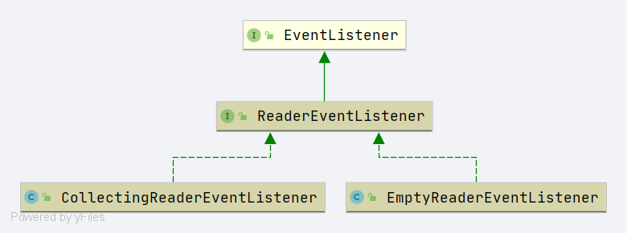

# Spring BeanDefinitionDocumentReader
- Author: [HuiFer](https://github.com/huifer)
- 源码阅读仓库: [SourceHot-spring](https://github.com/SourceHot/spring-framework-read)

- 全路径: `org.springframework.beans.factory.xml.BeanDefinitionDocumentReader`

```java
/**
 * SPI for parsing an XML document that contains Spring bean definitions.
 * Used by {@link XmlBeanDefinitionReader} for actually parsing a DOM document.
 *
 * <p>Instantiated per document to parse: implementations can hold
 * state in instance variables during the execution of the
 * {@code registerBeanDefinitions} method &mdash; for example, global
 * settings that are defined for all bean definitions in the document.
 *
 *
 * <p>bean定义文档读取</p>
 * @author Juergen Hoeller
 * @author Rob Harrop
 * @since 18.12.2003
 * @see XmlBeanDefinitionReader#setDocumentReaderClass
 */
public interface BeanDefinitionDocumentReader {

   /**
    * Read bean definitions from the given DOM document and
    * register them with the registry in the given reader context.
    * 注册 bean 定义
    * @param doc the DOM document
    * @param readerContext the current context of the reader
    * (includes the target registry and the resource being parsed)
    * @throws BeanDefinitionStoreException in case of parsing errors
    */
   void registerBeanDefinitions(Document doc, XmlReaderContext readerContext)
         throws BeanDefinitionStoreException;

}
```

- 通过注释我们可以知道这个接口定义的行为如下
    1. 读取xml配置文件, 转换成 Spring bean definition
    2. 将 Spring bean definition 放入内存中
    - 方法作用
        1. 读取给定文档, 转换成 Spring bean definition 放入内存


## registerBeanDefinitions

- 接口定义的方法

```java
@Override
public void registerBeanDefinitions(Document doc, XmlReaderContext readerContext) {
   this.readerContext = readerContext;
   doRegisterBeanDefinitions(doc.getDocumentElement());
}
```

- 最终会交给`doRegisterBeanDefinitions`执行


### doRegisterBeanDefinitions


```java
	@SuppressWarnings("deprecation")  // for Environment.acceptsProfiles(String...)
	protected void doRegisterBeanDefinitions(Element root) {
		// Any nested <beans> elements will cause recursion in this method. In
		// order to propagate and preserve <beans> default-* attributes correctly,
		// keep track of the current (parent) delegate, which may be null. Create
		// the new (child) delegate with a reference to the parent for fallback purposes,
		// then ultimately reset this.delegate back to its original (parent) reference.
		// this behavior emulates a stack of delegates without actually necessitating one.
		BeanDefinitionParserDelegate parent = this.delegate;
		// 创建 BeanDefinitionParserDelegate
		this.delegate = createDelegate(getReaderContext(), root, parent);

		if (this.delegate.isDefaultNamespace(root)) {
			// profile 属性获取
			String profileSpec = root.getAttribute(PROFILE_ATTRIBUTE);
			// 是否存在 profile
			if (StringUtils.hasText(profileSpec)) {
				// profile 切分后的数据
				String[] specifiedProfiles = StringUtils.tokenizeToStringArray(
						profileSpec, BeanDefinitionParserDelegate.MULTI_VALUE_ATTRIBUTE_DELIMITERS);
				// We cannot use Profiles.of(...) since profile expressions are not supported
				// in XML config. See SPR-12458 for details.
				if (!getReaderContext().getEnvironment().acceptsProfiles(specifiedProfiles)) {
					if (logger.isDebugEnabled()) {
						logger.debug("Skipped XML bean definition file due to specified profiles [" + profileSpec +
								"] not matching: " + getReaderContext().getResource());
					}
					return;
				}
			}
		}

		// 前置处理
		preProcessXml(root);
		// bean definition 处理
		parseBeanDefinitions(root, this.delegate);
		// 后置 xml 处理
		postProcessXml(root);

		this.delegate = parent;
	}

```

#### createDelegate

```java
this.delegate = createDelegate(getReaderContext(), root, parent)
```

- 参数说明
  1. xml 解析器
  2. element xml节点
  3. 父`BeanDefinitionParserDelegate`

```java
protected final XmlReaderContext getReaderContext() {
   Assert.state(this.readerContext != null, "No XmlReaderContext available");
   return this.readerContext;
}
```


#### preProcessXml

- 前置处理方法为空

#### parseBeanDefinitions

- 解析标签
  1. 标签 import
  2. 标签 alias
  3. 标签 bean


```java
protected void parseBeanDefinitions(Element root, BeanDefinitionParserDelegate delegate) {
   if (delegate.isDefaultNamespace(root)) {
      // 子节点列表
      NodeList nl = root.getChildNodes();
      for (int i = 0; i < nl.getLength(); i++) {
         Node node = nl.item(i);
         if (node instanceof Element) {
            Element ele = (Element) node;
            if (delegate.isDefaultNamespace(ele)) {
               // 处理标签的方法
               parseDefaultElement(ele, delegate);
            }
            else {
               // 处理自定义标签
               delegate.parseCustomElement(ele);
            }
         }
      }
   }
   else {
      // 处理自定义标签
      delegate.parseCustomElement(root);
   }
}
```


#### postProcessXml

- 后置处理方法为空


## parseDefaultElement

- 将`parseDefaultElement`提出完整的解析


```java
private void parseDefaultElement(Element ele, BeanDefinitionParserDelegate delegate) {
   // 解析 import 标签
   if (delegate.nodeNameEquals(ele, IMPORT_ELEMENT)) {
      importBeanDefinitionResource(ele);
   }
   // 解析 alias 标签
   else if (delegate.nodeNameEquals(ele, ALIAS_ELEMENT)) {
      processAliasRegistration(ele);
   }
   // 解析 bean 标签
   else if (delegate.nodeNameEquals(ele, BEAN_ELEMENT)) {
      processBeanDefinition(ele, delegate);
   }
   // 解析 beans 标签
   // 嵌套的 beans
   else if (delegate.nodeNameEquals(ele, NESTED_BEANS_ELEMENT)) {
      // recurse
      doRegisterBeanDefinitions(ele);
   }
}
```


### importBeanDefinitionResource

```java
protected void importBeanDefinitionResource(Element ele) {
   // 获取 resource 属性
   String location = ele.getAttribute(RESOURCE_ATTRIBUTE);
   if (!StringUtils.hasText(location)) {
      getReaderContext().error("Resource location must not be empty", ele);
      return;
   }

   // Resolve system properties: e.g. "${user.dir}"
   // 处理配置文件占位符
   location = getReaderContext().getEnvironment().resolveRequiredPlaceholders(location);

   // 资源集合
   Set<Resource> actualResources = new LinkedHashSet<>(4);

   // Discover whether the location is an absolute or relative URI
   // 是不是绝对地址
   boolean absoluteLocation = false;
   try {
      // 1. 判断是否为 url
      // 2. 通过转换成URI判断是否是绝对地址
      absoluteLocation = ResourcePatternUtils.isUrl(location) || ResourceUtils.toURI(location).isAbsolute();
   }
   catch (URISyntaxException ex) {
      // cannot convert to an URI, considering the location relative
      // unless it is the well-known Spring prefix "classpath*:"
   }

   // Absolute or relative?
   if (absoluteLocation) {
      try {
         // 获取 import 的数量
         int importCount = getReaderContext().getReader().loadBeanDefinitions(location, actualResources);
         if (logger.isTraceEnabled()) {
            logger.trace("Imported " + importCount + " bean definitions from URL location [" + location + "]");
         }
      }
      catch (BeanDefinitionStoreException ex) {
         getReaderContext().error(
               "Failed to import bean definitions from URL location [" + location + "]", ele, ex);
      }
   }
   else {
      // No URL -> considering resource location as relative to the current file.
      try {
         // import 的数量
         int importCount;
         // 资源信息
         Resource relativeResource = getReaderContext().getResource().createRelative(location);
         // 资源是否存在
         if (relativeResource.exists()) {
            // 确定加载的bean定义数量
            importCount = getReaderContext().getReader().loadBeanDefinitions(relativeResource);
            // 加入资源集合
            actualResources.add(relativeResource);
         }
         // 资源不存在处理方案
         else {
            // 获取资源URL的数据
            String baseLocation = getReaderContext().getResource().getURL().toString();
            // 获取import数量
            importCount = getReaderContext().getReader().loadBeanDefinitions(
                  StringUtils.applyRelativePath(baseLocation, location), actualResources);
         }
         if (logger.isTraceEnabled()) {
            logger.trace("Imported " + importCount + " bean definitions from relative location [" + location + "]");
         }
      }
      catch (IOException ex) {
         getReaderContext().error("Failed to resolve current resource location", ele, ex);
      }
      catch (BeanDefinitionStoreException ex) {
         getReaderContext().error(
               "Failed to import bean definitions from relative location [" + location + "]", ele, ex);
      }
   }
   Resource[] actResArray = actualResources.toArray(new Resource[0]);
   // 唤醒 import 处理事件
   getReaderContext().fireImportProcessed(location, actResArray, extractSource(ele));
}
```


###  processAliasRegistration

- `org.springframework.beans.factory.xml.DefaultBeanDefinitionDocumentReader#processAliasRegistration`
- alias 标签解析

```JAVA
protected void processAliasRegistration(Element ele) {
   // 获取 name 属性
   String name = ele.getAttribute(NAME_ATTRIBUTE);
   // 获取 alias 属性
   String alias = ele.getAttribute(ALIAS_ATTRIBUTE);
   boolean valid = true;
   // name 属性验证
   if (!StringUtils.hasText(name)) {
      getReaderContext().error("Name must not be empty", ele);
      valid = false;
   }
   // alias 属性验证
   if (!StringUtils.hasText(alias)) {
      getReaderContext().error("Alias must not be empty", ele);
      valid = false;
   }
   if (valid) {
      try {
         getReaderContext().getRegistry().registerAlias(name, alias);
      }
      catch (Exception ex) {
         getReaderContext().error("Failed to register alias '" + alias +
               "' for bean with name '" + name + "'", ele, ex);
      }
      // 事件触发
      getReaderContext().fireAliasRegistered(name, alias, extractSource(ele));
   }
}
```


- 别名注册

  [别名注册相关源码分析](/doc/bean/register/Spring-AliasRegistry.md)


### processBeanDefinition

- `org.springframework.beans.factory.xml.DefaultBeanDefinitionDocumentReader#processBeanDefinition`


```java
protected void processBeanDefinition(Element ele, BeanDefinitionParserDelegate delegate) {
   BeanDefinitionHolder bdHolder = delegate.parseBeanDefinitionElement(ele);
   if (bdHolder != null) {
      // bean definition 装饰
      bdHolder = delegate.decorateBeanDefinitionIfRequired(ele, bdHolder);
      try {
         // Register the final decorated instance.
         // 注册beanDefinition
         BeanDefinitionReaderUtils.registerBeanDefinition(bdHolder, getReaderContext().getRegistry());
      }
      catch (BeanDefinitionStoreException ex) {
         getReaderContext().error("Failed to register bean definition with name '" +
               bdHolder.getBeanName() + "'", ele, ex);
      }
      // Send registration event.
      // component注册事件触发
      getReaderContext().fireComponentRegistered(new BeanComponentDefinition(bdHolder));
   }
}
```


- [BeanDefinitionParserDelegate](Spring-BeanDefinitionParserDelegate.md)

- [Bean Definition 注册](/doc/bean/register/Spring-BeanDefinitionRegistry.md)

## ClassPathContextResource


- 创建出资源接口

```java
protected static class ClassPathContextResource extends ClassPathResource implements ContextResource {

   public ClassPathContextResource(String path, @Nullable ClassLoader classLoader) {
      super(path, classLoader);
   }

   @Override
   public String getPathWithinContext() {
      return getPath();
   }

   @Override
   public Resource createRelative(String relativePath) {
      String pathToUse = StringUtils.applyRelativePath(getPath(), relativePath);
      return new ClassPathContextResource(pathToUse, getClassLoader());
   }
}
```


## fireImportProcessed

```java
/**
 * Fire an import-processed event.
 *
 * 执行 import 事件
 * @param importedResource 导入的文件
 * @param actualResources 资源路径
 * @param source source
 */
public void fireImportProcessed(String importedResource, Resource[] actualResources, @Nullable Object source) {
   this.eventListener.importProcessed(new ImportDefinition(importedResource, actualResources, source));
}
```


## ReaderEventListener

事件监听




关注的方法

```java
void importProcessed(ImportDefinition importDefinition);
```


实现

- `org.springframework.beans.testfixture.beans.CollectingReaderEventListener#importProcessed`

```java
@Override
public void importProcessed(ImportDefinition importDefinition) {
   this.imports.add(importDefinition);
}
```


放入 `imports` 列表中


关注方法

```
	void aliasRegistered(AliasDefinition aliasDefinition);
```

实现

- `org.springframework.beans.testfixture.beans.CollectingReaderEventListener#aliasRegistered`

```java
@Override
public void aliasRegistered(AliasDefinition aliasDefinition) {
   // 获取已经注册过的beanName对应的别名
   List<AliasDefinition> aliases = this.aliasMap.get(aliasDefinition.getBeanName());
   if (aliases == null) {
      aliases = new ArrayList<>();
      // beanName 和 别名对应关系设置
      this.aliasMap.put(aliasDefinition.getBeanName(), aliases);
   }
   // 别名列表添加
   aliases.add(aliasDefinition);
}
```


关注方法

```java
void componentRegistered(ComponentDefinition componentDefinition);
```


实现

- `org.springframework.beans.testfixture.beans.CollectingReaderEventListener#componentRegistered`

```java
@Override
public void componentRegistered(ComponentDefinition componentDefinition) {
   this.componentDefinitions.put(componentDefinition.getName(), componentDefinition);
}
```