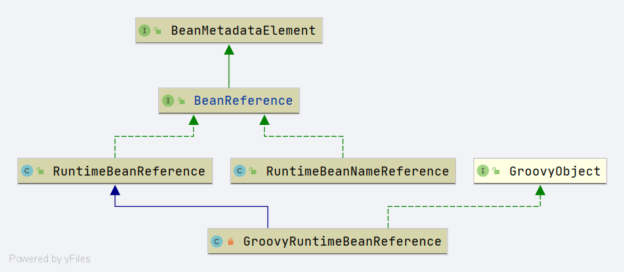

# Spring BeanReference

- `org.springframework.beans.factory.config.BeanReference`
- Bean 引用接口

## BeanReference

```java
public interface BeanReference extends BeanMetadataElement {

   /**
    * Return the target bean name that this reference points to (never {@code null}).
    * 返回引用的beanName
    */
   String getBeanName();

}
```

类图




## RuntimeBeanReference

- `org.springframework.beans.factory.config.RuntimeBeanReference`

```java
public class RuntimeBeanReference implements BeanReference {

   /**
    * beanName
    */
   private final String beanName;

   /**
    * bean 类型
    */
   @Nullable
   private final Class<?> beanType;

   /**
    * 是否走向父类
    */
   private final boolean toParent;

   /**
    * 源
    */
   @Nullable
   private Object source;
}
```


## RuntimeBeanNameReference

- `org.springframework.beans.factory.config.RuntimeBeanNameReference`

```java
public class RuntimeBeanNameReference implements BeanReference {

   /**
    * bean name 
    */
   private final String beanName;

   /**
    * 源
    */
   @Nullable
   private Object source;
}
```