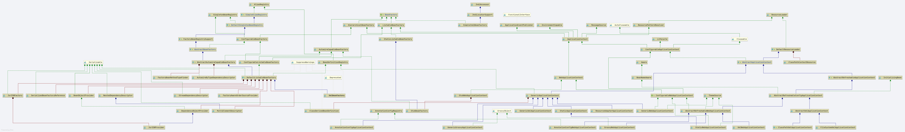
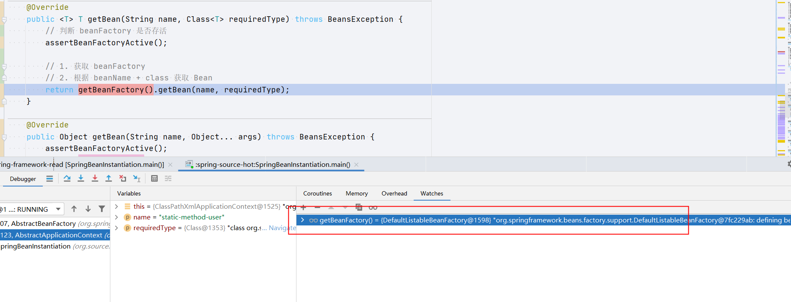
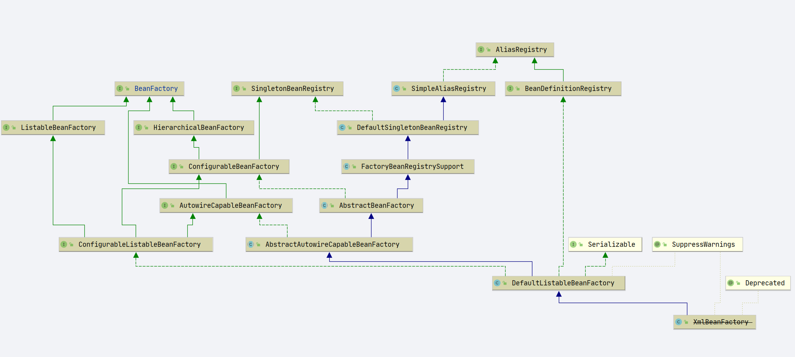
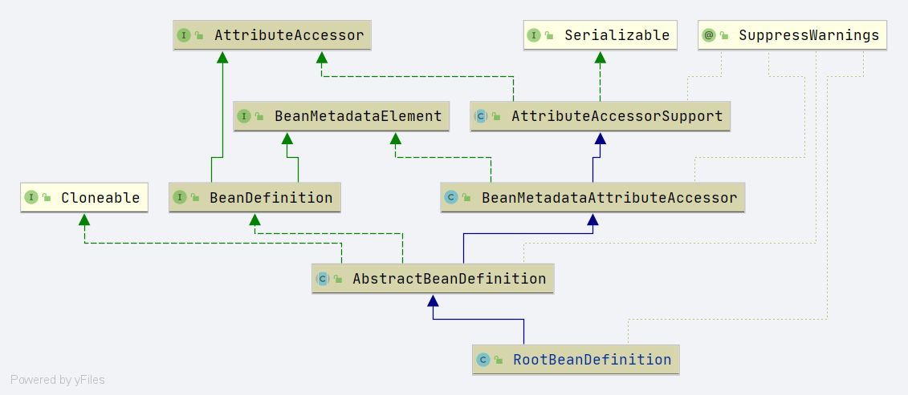
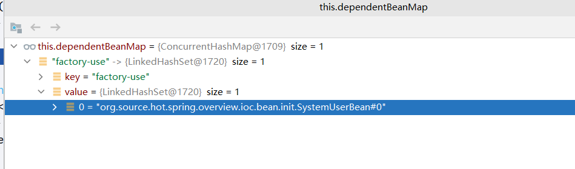
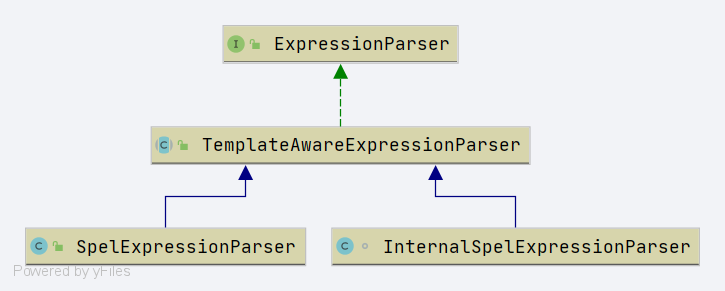
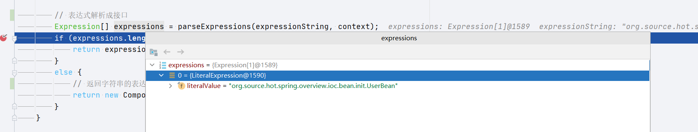

# Spring BeanFactory 
- Author: [HuiFer](https://github.com/huifer)
- 源码阅读仓库: [SourceHot-spring](https://github.com/SourceHot/spring-framework-read)

## BeanFactory 概述
- `org.springframework.beans.factory.BeanFactory`

### 类图




### 方法列表
- 贴出部分代码. 仅表示方法作用
```java
public interface BeanFactory {
    // 从容器中根据beanname获取
	Object getBean(String name) throws BeansException;
    // 延迟加载对象
	<T> ObjectProvider<T> getBeanProvider(Class<T> requiredType);
    // 是否存在beanName
	boolean containsBean(String name);
    // 这个 beanName 是否是单例的. 映射成 bean
	boolean isSingleton(String name) throws NoSuchBeanDefinitionException;
    // 是否多例.
	boolean isPrototype(String name) throws NoSuchBeanDefinitionException;
    // 类型是否匹配
	boolean isTypeMatch(String name, ResolvableType typeToMatch) throws NoSuchBeanDefinitionException;
    // 获取bean的类型
	Class<?> getType(String name) throws NoSuchBeanDefinitionException;
    // 获取别名
	String[] getAliases(String name);
}
```


## 解析

### 用例

bean 的实例化有如下几种方法 

1. 静态方法
2. 工厂方法创建
3. FactoryBean 接口创建


### 代码部分

```java
public class UserBean {

  private String name;
  private Integer age;

  public static UserBean createInstance() {
    UserBean userBean = new UserBean();
    userBean.setAge(18);
    userBean.setName("zhangsan");

    return userBean;
  }
    // get set 忽略
}
```


```java
public interface UserBeanFactory {
  UserBean factory();
}

public class UserBeanFactoryImpl implements
        UserBeanFactory {


    @Override
    public UserBean factory() {
        return UserBean.createInstance();
    }
}

```


```java
public class UserFactoryBean implements FactoryBean<UserBean> {

  @Override
  public boolean isSingleton() {
    return true;
  }

  @Override
  public UserBean getObject() throws Exception {
    return UserBean.createInstance();
  }

  @Override
  public Class<?> getObjectType() {
    return UserBean.class;
  }
}
```

```xml
<?xml version="1.0" encoding="UTF-8"?>
<beans xmlns="http://www.springframework.org/schema/beans"
      xmlns:xsi="http://www.w3.org/2001/XMLSchema-instance"
      xsi:schemaLocation="http://www.springframework.org/schema/beans http://www.springframework.org/schema/beans/spring-beans.xsd">


   <!--  静态方法-->
   <bean id="static-method-user"
        class="org.source.hot.spring.overview.ioc.bean.init.UserBean"
        factory-method="createInstance"/>

   <!--  工厂方法创建-->
   <bean id="factory-use" class="org.source.hot.spring.overview.ioc.bean.init.UserBean"
        factory-bean="userFactory" factory-method="factory"></bean>
   <!--user 工厂bean-->
   <bean id="userFactory"
        class="org.source.hot.spring.overview.ioc.bean.init.UserBeanFactoryImpl"/>
   <!--factory bean-->
   <bean id="factory-bean-user"
        class="org.source.hot.spring.overview.ioc.bean.init.UserFactoryBean"/>

</beans>
```


```java
public class SpringBeanInstantiation {

  public static void main(String[] args) {
    BeanFactory context = new ClassPathXmlApplicationContext(
        "META-INF/beans/spring-bean-instantiation.xml");

    UserBean staticMethodBean = context.getBean("static-method-user", UserBean.class);
    UserBean factoryUser = context.getBean("factory-use", UserBean.class);
    UserBean factoryBean = context.getBean("factory-bean-user", UserBean.class);
    System.out.println();

  }
}
```


### 分析

- 对下面代码进行分析

```java
 UserBean staticMethodBean = context.getBean("static-method-user", UserBean.class);
```


- `org.springframework.context.support.AbstractApplicationContext#getBean(java.lang.String, java.lang.Class<T>)`

```java
@Override
	public <T> T getBean(String name, Class<T> requiredType) throws BeansException {
	    // 判断 beanFactory 是否存活
		assertBeanFactoryActive();
		
		// 1. 获取 beanFactory
        // 2. 根据 beanName + class 获取 Bean
		return getBeanFactory().getBean(name, requiredType);
	}
```

- 从方法参数
  - name: beanName
  - requiredType: 唯一的类型. 对象类型


### assertBeanFactoryActive

- beanFactory 是否存活判断

```java
protected void assertBeanFactoryActive() {
        // 是否存活
        if (!this.active.get()) {
            // 是否关闭
            if (this.closed.get()) {
                throw new IllegalStateException(getDisplayName() + " has been closed already");
            }
            else {
                throw new IllegalStateException(getDisplayName() + " has not been refreshed yet");
            }
        }
    }
```


### getBeanFactory

- 获取beanFactory

  - 获取方法是一个抽象方法

    ```java
    public abstract ConfigurableListableBeanFactory getBeanFactory() throws IllegalStateException;
    ```

    - 子类实现

      `org.springframework.context.support.AbstractRefreshableApplicationContext#getBeanFactory`

      ```java
      @Override
      public final ConfigurableListableBeanFactory getBeanFactory() {
         synchronized (this.beanFactoryMonitor) {
            if (this.beanFactory == null) {
               throw new IllegalStateException("BeanFactory not initialized or already closed - " +
                     "call 'refresh' before accessing beans via the ApplicationContext");
            }
            return this.beanFactory;
         }
      }
      ```

      - `org.springframework.context.support.GenericApplicationContext#getBeanFactory`

      ```java
      @Override
      public final ConfigurableListableBeanFactory getBeanFactory() {
         return this.beanFactory;
      }
      ```


- 获取到的对象是`org.springframework.beans.factory.support.DefaultListableBeanFactory`

  



- 整体类图




### doGetBean

- `org.springframework.beans.factory.support.AbstractBeanFactory#doGetBean`

  获取 bean 的核心

  


#### transformedBeanName

```java
protected String transformedBeanName(String name) {
    // 转换 beanName .
    // 1. 通过·BeanFactoryUtils.transformedBeanName· 求beanName
    // 2. 如果是有别名的(方法参数是别名) . 会从别名列表中获取对应的 beanName
    return canonicalName(BeanFactoryUtils.transformedBeanName(name));
}
```


```java
public static String transformedBeanName(String name) {
       Assert.notNull(name, "'name' must not be null");
       // 名字不是 & 开头直接返回
   if (!name.startsWith(BeanFactory.FACTORY_BEAN_PREFIX)) {
      return name;
   }
   // 截取字符串 在返回
   return transformedBeanNameCache.computeIfAbsent(name, beanName -> {
      do {
         beanName = beanName.substring(BeanFactory.FACTORY_BEAN_PREFIX.length());
      }
      while (beanName.startsWith(BeanFactory.FACTORY_BEAN_PREFIX));
      return beanName;
   });
}
```

```java
public String canonicalName(String name) {
    String canonicalName = name;
    // Handle aliasing...
    String resolvedName;
    do {
        // 别名的获取
        resolvedName = this.aliasMap.get(canonicalName);
        if (resolvedName != null) {
            canonicalName = resolvedName;
        }
    }
    while (resolvedName != null);
    return canonicalName;
}
```

别名对象

```java
private final Map<String, String> aliasMap = new ConcurrentHashMap<>(16);
```

```java
<bean id="factory-bean-user"
     class="org.source.hot.spring.overview.ioc.bean.init.UserFactoryBean"/>

<alias name="factory-bean-user" alias="userFactoryBean"/>
```

aliasMap 和 别名标签的对应关系


alias标签的alias值作为别名的key ， alias 标签的 name 值作为 value


#### getSingleton

- `org.springframework.beans.factory.support.DefaultSingletonBeanRegistry#getSingleton(java.lang.String)`


```java
@Override
@Nullable
public Object getSingleton(String beanName) {
   return getSingleton(beanName, true);
}
```


- `org.springframework.beans.factory.support.DefaultSingletonBeanRegistry#getSingleton(java.lang.String, boolean)`


```java
@Nullable
protected Object getSingleton(String beanName, boolean allowEarlyReference) {
    // 尝试从单例缓存中获取
    Object singletonObject = this.singletonObjects.get(beanName);
    // 单例对象是否null
    // 这个 beanName 是否正在创建
    if (singletonObject == null && isSingletonCurrentlyInCreation(beanName)) {
        // 锁
        synchronized (this.singletonObjects) {
            // 从延迟加载的map中获取
            singletonObject = this.earlySingletonObjects.get(beanName);
            // 对象是否空 ， 是否允许提前应用
            if (singletonObject == null && allowEarlyReference) {
                // 从对象工厂map中获取对象工厂
                ObjectFactory<?> singletonFactory = this.singletonFactories.get(beanName);
                if (singletonFactory != null) {
                    // 对象获取后设置
                    singletonObject = singletonFactory.getObject();
                    this.earlySingletonObjects.put(beanName, singletonObject);
                    this.singletonFactories.remove(beanName);
                }
            }
        }
    }
    return singletonObject;
}
```

- 相关属性值


```java
/**
 *  Cache of singleton objects: bean name to bean instance.
 *
 * 单例对象容器, key: beanName , value: bean实例
 * */
private final Map<String, Object> singletonObjects = new ConcurrentHashMap<>(256);


    /**
     *  Cache of singleton factories: bean name to ObjectFactory.
     * key: beanName
     * value: 对象工厂
     * */
    private final Map<String, ObjectFactory<?>> singletonFactories = new HashMap<>(16);


    /**
     *  Names of beans that are currently in creation.
     *
     * 当前正在实例化的beanName
     *
     * */
    private final Set<String> singletonsCurrentlyInCreation =
            Collections.newSetFromMap(new ConcurrentHashMap<>(16));
```


#### getObjectForBeanInstance

- `org.springframework.beans.factory.support.AbstractBeanFactory#getObjectForBeanInstance`


```java
protected Object getObjectForBeanInstance(
			Object beanInstance, String name, String beanName, @Nullable RootBeanDefinition mbd) {

		// Don't let calling code try to dereference the factory if the bean isn't a factory.
		// 判断 beanName 是不是 bean 工厂
		if (BeanFactoryUtils.isFactoryDereference(name)) {
			// 类型判断
			if (beanInstance instanceof NullBean) {
				return beanInstance;
			}
			if (!(beanInstance instanceof FactoryBean)) {
				throw new BeanIsNotAFactoryException(beanName, beanInstance.getClass());
			}
			if (mbd != null) {
				mbd.isFactoryBean = true;
			}
			// 返回实例
			return beanInstance;
		}

		// Now we have the bean instance, which may be a normal bean or a FactoryBean.
		// If it's a FactoryBean, we use it to create a bean instance, unless the
		// caller actually wants a reference to the factory.
		// 判断是否是 factoryBean
		if (!(beanInstance instanceof FactoryBean)) {
			return beanInstance;
		}

		Object object = null;
		if (mbd != null) {
			mbd.isFactoryBean = true;
		}
		else {
			// 缓存中获取
			object = getCachedObjectForFactoryBean(beanName);
		}
		if (object == null) {
			// Return bean instance from factory.
			// 如果还是 null 从 factory bean 中创建
			FactoryBean<?> factory = (FactoryBean<?>) beanInstance;
			// Caches object obtained from FactoryBean if it is a singleton.
			if (mbd == null && containsBeanDefinition(beanName)) {
				mbd = getMergedLocalBeanDefinition(beanName);
			}
			boolean synthetic = (mbd != null && mbd.isSynthetic());
			// 从 FactoryBean 中获取bean实例
			object = getObjectFromFactoryBean(factory, beanName, !synthetic);
		}
		return object;
	}
```


#### getObjectFromFactoryBean

- `org.springframework.beans.factory.support.FactoryBeanRegistrySupport#getObjectFromFactoryBean`

- 从 FactoryBean 中获取对象

```java
	protected Object getObjectFromFactoryBean(FactoryBean<?> factory, String beanName, boolean shouldPostProcess) {
		// 是否单例 是否已经包含
		if (factory.isSingleton() && containsSingleton(beanName)) {
			synchronized (getSingletonMutex()) {
				// 从工厂bean的缓存中获取
				Object object = this.factoryBeanObjectCache.get(beanName);
				if (object == null) {

					// 从 factoryBean 接口中获取
					object = doGetObjectFromFactoryBean(factory, beanName);
					// Only post-process and store if not put there already during getObject() call above
					// (e.g. because of circular reference processing triggered by custom getBean calls)
					// 从缓存map中获取
					Object alreadyThere = this.factoryBeanObjectCache.get(beanName);
					if (alreadyThere != null) {
						// 如果缓存中获取有值
						// object 覆盖
						object = alreadyThere;
					}
					else {
						if (shouldPostProcess) {
							if (isSingletonCurrentlyInCreation(beanName)) {
								// Temporarily return non-post-processed object, not storing it yet..
								return object;
							}
							// 单例创建前的验证
							beforeSingletonCreation(beanName);
							try {
								// 从 FactoryBean 接口创建的 后置处理
								object = postProcessObjectFromFactoryBean(object, beanName);
							}
							catch (Throwable ex) {
								throw new BeanCreationException(beanName,
										"Post-processing of FactoryBean's singleton object failed", ex);
							}
							finally {
								// 单例bean创建之后
								afterSingletonCreation(beanName);
							}
						}
						// 是否包含bean name
						if (containsSingleton(beanName)) {
							// 插入缓存
							// 后续使用的时候可以直接获取
							this.factoryBeanObjectCache.put(beanName, object);
						}
					}
				}
				return object;
			}
		}
		else {
			Object object = doGetObjectFromFactoryBean(factory, beanName);
			if (shouldPostProcess) {
				try {
					object = postProcessObjectFromFactoryBean(object, beanName);
				}
				catch (Throwable ex) {
					throw new BeanCreationException(beanName, "Post-processing of FactoryBean's object failed", ex);
				}
			}
			return object;
		}
	}

```


#### beforeSingletonCreation

- `org.springframework.beans.factory.support.DefaultSingletonBeanRegistry#beforeSingletonCreation`

- 单例创建前的验证

```java
protected void beforeSingletonCreation(String beanName) {
   // 排除的单例beanName 是否包含当前beanName
   // 添加当前正在初始化的beanName 是否正确
   if (!this.inCreationCheckExclusions.contains(beanName) && !this.singletonsCurrentlyInCreation.add(beanName)) {
      throw new BeanCurrentlyInCreationException(beanName);
   }
}
```


#### postProcessObjectFromFactoryBean

- 两种实现

  - `org.springframework.beans.factory.support.FactoryBeanRegistrySupport#postProcessObjectFromFactoryBean`

    ```JAVA
    protected Object postProcessObjectFromFactoryBean(Object object, String beanName) throws BeansException {
       return object;
    }
    ```

    直接返回 object

  - `org.springframework.beans.factory.support.AbstractAutowireCapableBeanFactory#postProcessObjectFromFactoryBean` 调用 `BeanPostProcessor`

    ```java
    	@Override
    	protected Object postProcessObjectFromFactoryBean(Object object, String beanName) {
    		return applyBeanPostProcessorsAfterInitialization(object, beanName);
    	}
    
    
    	@Override
    	public Object applyBeanPostProcessorsAfterInitialization(Object existingBean, String beanName)
    			throws BeansException {
    
    		Object result = existingBean;
    		for (BeanPostProcessor processor : getBeanPostProcessors()) {
    			Object current = processor.postProcessAfterInitialization(result, beanName);
    			if (current == null) {
    				return result;
    			}
    			result = current;
    		}
    		return result;
    	}
    
    ```

- 两个方法军返回 `Bean` 对象 . 一种是直接返回 。 另一种是执行接口 `BeanPostProcessor` 接口返回


#### afterSingletonCreation

- `org.springframework.beans.factory.support.DefaultSingletonBeanRegistry#afterSingletonCreation`

```java
protected void afterSingletonCreation(String beanName) {
   // 排除的单例beanName 是否包含当前beanName
   // 移除当前正在初始化的beanName 是否正确
   if (!this.inCreationCheckExclusions.contains(beanName) && !this.singletonsCurrentlyInCreation.remove(beanName)) {
      throw new IllegalStateException("Singleton '" + beanName + "' isn't currently in creation");
   }
}
```


- 代码现在进入的很深了，回到 doGetBean
- `org.springframework.beans.factory.support.AbstractBeanFactory#doGetBean`

```JAVA
	protected <T> T doGetBean(final String name, @Nullable final Class<T> requiredType,
			@Nullable final Object[] args, boolean typeCheckOnly) throws BeansException {
		// 转换beanName
		final String beanName = transformedBeanName(name);
		Object bean;

		// Eagerly check singleton cache for manually registered singletons.
		// 获取单例对象
		Object sharedInstance = getSingleton(beanName);
		// 单例对象是否存在 参数是否为空
		if (sharedInstance != null && args == null) {
			if (logger.isTraceEnabled()) {
				if (isSingletonCurrentlyInCreation(beanName)) {
					logger.trace("Returning eagerly cached instance of singleton bean '" + beanName +
							"' that is not fully initialized yet - a consequence of a circular reference");
				}
				else {
					logger.trace("Returning cached instance of singleton bean '" + beanName + "'");
				}
			}
			// 实例化bean
			bean = getObjectForBeanInstance(sharedInstance, name, beanName, null);
		}
     
        // 省略后续内容
    }
```


- 目前未知`doGetBean`的第一个`if`分支已经分析完毕. 接下来看下面的代码


- 下面这段代码就简单说一下就跳过了。
  - 从 容器中获取，最后还是回到doGetBean方法中. 来进行bean创建 这里不进行展开。

```java
else {
   // Fail if we're already creating this bean instance:
   // We're assumably within a circular reference.
   // 循环依赖的问题
   if (isPrototypeCurrentlyInCreation(beanName)) {
      throw new BeanCurrentlyInCreationException(beanName);
   }

   // Check if bean definition exists in this factory.
   BeanFactory parentBeanFactory = getParentBeanFactory();
   if (parentBeanFactory != null && !containsBeanDefinition(beanName)) {
      // Not found -> check parent.
      String nameToLookup = originalBeanName(name);
      if (parentBeanFactory instanceof AbstractBeanFactory) {
         return ((AbstractBeanFactory) parentBeanFactory).doGetBean(
               nameToLookup, requiredType, args, typeCheckOnly);
      }
      else if (args != null) {
         // Delegation to parent with explicit args.
         return (T) parentBeanFactory.getBean(nameToLookup, args);
      }
      else if (requiredType != null) {
         // No args -> delegate to standard getBean method.
         return parentBeanFactory.getBean(nameToLookup, requiredType);
      }
      else {
         return (T) parentBeanFactory.getBean(nameToLookup);
      }
   }
```


#### markBeanAsCreated

- `org.springframework.beans.factory.support.AbstractBeanFactory#markBeanAsCreated`

- 方法作用将bean标记为已创建


```
protected void markBeanAsCreated(String beanName) {
   // 已创建的beanName 是否包含当前beanName
   if (!this.alreadyCreated.contains(beanName)) {
      synchronized (this.mergedBeanDefinitions) {
         if (!this.alreadyCreated.contains(beanName)) {
            // Let the bean definition get re-merged now that we're actually creating
            // the bean... just in case some of its metadata changed in the meantime.
            // 将属性stale设置true
            clearMergedBeanDefinition(beanName);
            // 放入已创建集合中
            this.alreadyCreated.add(beanName);
         }
      }
   }
}
```


```java
protected void clearMergedBeanDefinition(String beanName) {
   RootBeanDefinition bd = this.mergedBeanDefinitions.get(beanName);
   if (bd != null) {
      bd.stale = true;
   }
}
```


- stale 的解释

  ```java
  /**
   *  Determines if the definition needs to be re-merged.
   * 是否需要重新合并定义
   * */
  volatile boolean stale;
  ```

- 属性值 已创建的beanName

  ```java
  private final Set<String> alreadyCreated = Collections.newSetFromMap(new ConcurrentHashMap<>(256));
  ```


#### getMergedLocalBeanDefinition

- `org.springframework.beans.factory.support.AbstractBeanFactory#getMergedLocalBeanDefinition`

- 这个方法获取一个`RootBeanDefinition`对象 ， 这个对象也是bean的一种定义。
- 从目前的几个方法名称来看，暂且认为这是一个合并了多个 `BeanDefinition`的对象吧




```java
protected RootBeanDefinition getMergedLocalBeanDefinition(String beanName) throws BeansException {
   // Quick check on the concurrent map first, with minimal locking.
   // 缓存中获取
   RootBeanDefinition mbd = this.mergedBeanDefinitions.get(beanName);
   if (mbd != null && !mbd.stale) {
      return mbd;
   }
   // 合并的 bean 定义
   return getMergedBeanDefinition(beanName, getBeanDefinition(beanName));
}


	protected RootBeanDefinition getMergedBeanDefinition(String beanName, BeanDefinition bd)
			throws BeanDefinitionStoreException {

		return getMergedBeanDefinition(beanName, bd, null);
	}

```


#### getBeanDefinition

- 获取 `beanDefinition `
- `org.springframework.beans.factory.support.DefaultListableBeanFactory#getBeanDefinition`

```java
@Override
public BeanDefinition getBeanDefinition(String beanName) throws NoSuchBeanDefinitionException {
   BeanDefinition bd = this.beanDefinitionMap.get(beanName);
   if (bd == null) {
      if (logger.isTraceEnabled()) {
         logger.trace("No bean named '" + beanName + "' found in " + this);
      }
      throw new NoSuchBeanDefinitionException(beanName);
   }
   return bd;
}
```

- 从 beanDefinition map 中获取

- 相关属性

  ```java
  	/**
  	 * Map of bean definition objects, keyed by bean name.
  	 *
  	 * key: beanName
  	 * value: BeanDefinition
  	 *
  	 *  */
  	private final Map<String, BeanDefinition> beanDefinitionMap = new ConcurrentHashMap<>(256);
  ```


#### getMergedBeanDefinition

- 获取`RootBeanDefinition`

- `org.springframework.beans.factory.support.AbstractBeanFactory#getMergedBeanDefinition(java.lang.String, org.springframework.beans.factory.config.BeanDefinition, org.springframework.beans.factory.config.BeanDefinition)`

- 第一部分代码
  - map 中获取 RootBeanDefinition 
  - 是否存在父名称
  - 类型是否是 `RootBeanDefinition` 
    - 是: 拷贝
    - 否: 将 `BeanDefinition` 转换成 `RootBeanDefinition`

```java
protected RootBeanDefinition getMergedBeanDefinition(
      String beanName, BeanDefinition bd, @Nullable BeanDefinition containingBd)
      throws BeanDefinitionStoreException {

   synchronized (this.mergedBeanDefinitions) {
      RootBeanDefinition mbd = null;
      RootBeanDefinition previous = null;

      // Check with full lock now in order to enforce the same merged instance.
      if (containingBd == null) {
         // 从缓存中获取
         mbd = this.mergedBeanDefinitions.get(beanName);
      }

      if (mbd == null || mbd.stale) {
         previous = mbd;
         // 是否存在父名称
         if (bd.getParentName() == null) {
            // Use copy of given root bean definition.
            // 类型是否等于RootBeanDefinition
            if (bd instanceof RootBeanDefinition) {
               // 做一次对象拷贝
               mbd = ((RootBeanDefinition) bd).cloneBeanDefinition();
            }
            else {
               // 将 beanDefinition 创建成 RootBeanDefinition
               mbd = new RootBeanDefinition(bd);
            }
         }
       
          // 省略其他
      }
```

- 相关属性

  ```java
  /**
   * Map from bean name to merged RootBeanDefinition.
   * key: beanName
   * value: RootBeanDefinition
   *  */
  private final Map<String, RootBeanDefinition> mergedBeanDefinitions = new ConcurrentHashMap<>(256);
  ```

- 克隆 方法

  ```java
  /**
   * 克隆 BeanDefinition
   * @return
   */
  @Override
  public RootBeanDefinition cloneBeanDefinition() {
     return new RootBeanDefinition(this);
  }
  ```


- 第二部分代码


```java
{
					// Child bean definition: needs to be merged with parent.
					// 父BeanDefinition
					BeanDefinition pbd;
					try {
						// 父类beanName
						String parentBeanName = transformedBeanName(bd.getParentName());
						// 当前beanName是否等于父的beanName
						if (!beanName.equals(parentBeanName)) {
							// 存在父 beanName
							// 父 beanDefinition
							// 递归调用
							pbd = getMergedBeanDefinition(parentBeanName);
						}
						else {
							// 获取父 beanFactory
							BeanFactory parent = getParentBeanFactory();
							// beanFactory 类型判断
							if (parent instanceof ConfigurableBeanFactory) {
								// ConfigurableBeanFactory 的获取方式
								pbd = ((ConfigurableBeanFactory) parent).getMergedBeanDefinition(parentBeanName);
							}
							else {
								throw new NoSuchBeanDefinitionException(parentBeanName,
										"Parent name '" + parentBeanName + "' is equal to bean name '" + beanName +
												"': cannot be resolved without an AbstractBeanFactory parent");
							}
						}
					}
					catch (NoSuchBeanDefinitionException ex) {
						throw new BeanDefinitionStoreException(bd.getResourceDescription(), beanName,
								"Could not resolve parent bean definition '" + bd.getParentName() + "'", ex);
					}
					// Deep copy with overridden values.
					// 将 父 BeanDefinition 对象拷贝
					mbd = new RootBeanDefinition(pbd);
					// 覆盖 beanDefinition
					mbd.overrideFrom(bd);
				}
```


#### overrideFrom

- 覆盖方法

- `org.springframework.beans.factory.support.AbstractBeanDefinition#overrideFrom`


- 最后一段


```java
   // Set default singleton scope, if not configured before.
   // 作用域设置
   if (!StringUtils.hasLength(mbd.getScope())) {
      // 没有设置作用域直接给单例类型
      mbd.setScope(SCOPE_SINGLETON);
   }

   // A bean contained in a non-singleton bean cannot be a singleton itself.
   // Let's correct this on the fly here, since this might be the result of
   // parent-child merging for the outer bean, in which case the original inner bean
   // definition will not have inherited the merged outer bean's singleton status.
   // 修正 作用域
   if (containingBd != null && !containingBd.isSingleton() && mbd.isSingleton()) {
      mbd.setScope(containingBd.getScope());
   }

   // Cache the merged bean definition for the time being
   // (it might still get re-merged later on in order to pick up metadata changes)
   if (containingBd == null && isCacheBeanMetadata()) {
      // 放入缓存
      this.mergedBeanDefinitions.put(beanName, mbd);
   }
}
if (previous != null) {
   copyRelevantMergedBeanDefinitionCaches(previous, mbd);
}
return mbd;
```


#### checkMergedBeanDefinition

- `org.springframework.beans.factory.support.AbstractBeanFactory#checkMergedBeanDefinition`

  ```java
  protected void checkMergedBeanDefinition(RootBeanDefinition mbd, String beanName, @Nullable Object[] args)
        throws BeanDefinitionStoreException {
  
     if (mbd.isAbstract()) {
        throw new BeanIsAbstractException(beanName);
     }
  }
  ```

  - 判断是否 abstract 标记的情况


- 继续回到 `doGetBean` 方法

```java
// 需要依赖的bean
String[] dependsOn = mbd.getDependsOn();
if (dependsOn != null) {
   for (String dep : dependsOn) {
      if (isDependent(beanName, dep)) {
         throw new BeanCreationException(mbd.getResourceDescription(), beanName,
               "Circular depends-on relationship between '" + beanName + "' and '" + dep + "'");
      }
      // 注册依赖bean
      registerDependentBean(dep, beanName);
      try {
         getBean(dep);
      }
      catch (NoSuchBeanDefinitionException ex) {
         throw new BeanCreationException(mbd.getResourceDescription(), beanName,
               "'" + beanName + "' depends on missing bean '" + dep + "'", ex);
      }
   }
}
```


#### isDependent

- 是否存在依赖关系

- `org.springframework.beans.factory.support.DefaultSingletonBeanRegistry#isDependent(java.lang.String, java.lang.String, java.util.Set<java.lang.String>)`

```java
private boolean isDependent(String beanName, String dependentBeanName, @Nullable Set<String> alreadySeen) {
   if (alreadySeen != null && alreadySeen.contains(beanName)) {
      return false;
   }
   // 别名
   String canonicalName = canonicalName(beanName);
   // 依赖列表中获取
   Set<String> dependentBeans = this.dependentBeanMap.get(canonicalName);
   if (dependentBeans == null) {
      return false;
   }
   if (dependentBeans.contains(dependentBeanName)) {
      return true;
   }
   for (String transitiveDependency : dependentBeans) {
      if (alreadySeen == null) {
         alreadySeen = new HashSet<>();
      }
      alreadySeen.add(beanName);
      if (isDependent(transitiveDependency, dependentBeanName, alreadySeen)) {
         return true;
      }
   }
   return false;
}
```


- 相关属性

  ```java
  /**
   * Map between dependent bean names: bean name to Set of dependent bean names.
   *
   * key: bean
   * value: 依赖列表
   * */
  private final Map<String, Set<String>> dependentBeanMap = new ConcurrentHashMap<>(64);
  ```


- 一个用例

```xml
<bean class="org.source.hot.spring.overview.ioc.bean.init.SystemUserBean" >
   <property name="userBean" ref="factory-use"/>
</bean>
```





#### registerDependentBean

- 注册依赖关系
- `org.springframework.beans.factory.support.DefaultSingletonBeanRegistry#registerDependentBean`
  - 在前文调用 `isDependent` 方法的的时候我们找到了一个依赖映射`dependentBeanMap` ，在这个方法中会将依赖关系放入`dependentBeanMap`


```java
public void registerDependentBean(String beanName, String dependentBeanName) {
   // 别名
   String canonicalName = canonicalName(beanName);

   synchronized (this.dependentBeanMap) {
      // 向依赖关系中放入数据
      Set<String> dependentBeans =
            this.dependentBeanMap.computeIfAbsent(canonicalName, k -> new LinkedHashSet<>(8));
      if (!dependentBeans.add(dependentBeanName)) {
         return;
      }
   }

   synchronized (this.dependenciesForBeanMap) {
      Set<String> dependenciesForBean =
            this.dependenciesForBeanMap.computeIfAbsent(dependentBeanName, k -> new LinkedHashSet<>(8));
      dependenciesForBean.add(canonicalName);
   }
}
```


- 再回到 `doGetBean` 

- 接下来就是实例化的过程了. 

```java
if (mbd.isSingleton()) {
   sharedInstance = getSingleton(beanName, () -> {
      try {
         return createBean(beanName, mbd, args);
      }
      catch (BeansException ex) {
         // Explicitly remove instance from singleton cache: It might have been put there
         // eagerly by the creation process, to allow for circular reference resolution.
         // Also remove any beans that received a temporary reference to the bean.
         destroySingleton(beanName);
         throw ex;
      }
   });
   bean = getObjectForBeanInstance(sharedInstance, name, beanName, mbd);
}
```


#### getSingleton

- `org.springframework.beans.factory.support.DefaultSingletonBeanRegistry#getSingleton(java.lang.String, org.springframework.beans.factory.ObjectFactory<?>)`
- 获取单例对象
  1. 从单例对象的map缓存中获取
  2. 从 ObjectFactory 中获取

- 周边方法

  - `beforeSingletonCreation`

  - `afterSingletonCreation`
  - `addSingleton`

```java
public Object getSingleton(String beanName, ObjectFactory<?> singletonFactory) {
   Assert.notNull(beanName, "Bean name must not be null");
   synchronized (this.singletonObjects) {
      // 从单例对象缓存中获取
      Object singletonObject = this.singletonObjects.get(beanName);
      if (singletonObject == null) {
         if (this.singletonsCurrentlyInDestruction) {
            throw new BeanCreationNotAllowedException(beanName,
                  "Singleton bean creation not allowed while singletons of this factory are in destruction " +
                        "(Do not request a bean from a BeanFactory in a destroy method implementation!)");
         }
         if (logger.isDebugEnabled()) {
            logger.debug("Creating shared instance of singleton bean '" + beanName + "'");
         }
         // 单例创建前的验证
         beforeSingletonCreation(beanName);
         boolean newSingleton = false;
         boolean recordSuppressedExceptions = (this.suppressedExceptions == null);
         if (recordSuppressedExceptions) {
            this.suppressedExceptions = new LinkedHashSet<>();
         }
         try {
            // 从 ObjectFactory 中获取
            singletonObject = singletonFactory.getObject();
            newSingleton = true;
         }
         catch (IllegalStateException ex) {
            // Has the singleton object implicitly appeared in the meantime ->
            // if yes, proceed with it since the exception indicates that state.
            singletonObject = this.singletonObjects.get(beanName);
            if (singletonObject == null) {
               throw ex;
            }
         }
         catch (BeanCreationException ex) {
            if (recordSuppressedExceptions) {
               for (Exception suppressedException : this.suppressedExceptions) {
                  ex.addRelatedCause(suppressedException);
               }
            }
            throw ex;
         }
         finally {
            if (recordSuppressedExceptions) {
               this.suppressedExceptions = null;
            }
            // 创建单例对象后的验证
            afterSingletonCreation(beanName);
         }
         if (newSingleton) {
            // 添加到 单例容器中
            addSingleton(beanName, singletonObject);
         }
      }
      return singletonObject;
   }
}
```


- 回到 doGetBean 方法中

  ```java
  if (mbd.isSingleton()) {
     // 判断是否是单例
     sharedInstance = getSingleton(beanName, () -> {
        try {
           return createBean(beanName, mbd, args);
        }
        catch (BeansException ex) {
           // Explicitly remove instance from singleton cache: It might have been put there
           // eagerly by the creation process, to allow for circular reference resolution.
           // Also remove any beans that received a temporary reference to the bean.
           destroySingleton(beanName);
           throw ex;
        }
     });
     bean = getObjectForBeanInstance(sharedInstance, name, beanName, mbd);
  }
  ```

  这里又要给 `createBean`方法， 从 `getSingleton` 的参数看可以知道 ，第二个匿名函数是`ObjectFactory`接口实现. 

  ```java
  @FunctionalInterface
  public interface ObjectFactory<T> {
  
     /**
      * Return an instance (possibly shared or independent)
      * of the object managed by this factory.
      * 获取对象
      * @return the resulting instance
      * @throws BeansException in case of creation errors
      */
     T getObject() throws BeansException;
  
  }
  ```

  - createBean 返回的就是单例bean对象的实例


##### createBean

- `org.springframework.beans.factory.support.AbstractAutowireCapableBeanFactory#createBean(java.lang.String, org.springframework.beans.factory.support.RootBeanDefinition, java.lang.Object[])`


- 两个核心方法

```JAVA
// Give BeanPostProcessors a chance to return a proxy instead of the target bean instance.
Object bean = resolveBeforeInstantiation(beanName, mbdToUse);
Object beanInstance = doCreateBean(beanName, mbdToUse, args);
```


###### resolveBeforeInstantiation

- `org.springframework.beans.factory.support.AbstractAutowireCapableBeanFactory#resolveBeforeInstantiation`

- 方法概述:

  获取`BeanPostProcessor`接口的实现列表

  - `applyBeanPostProcessorsBeforeInstantiation` 前置方法执行
  - `applyBeanPostProcessorsAfterInitialization`后置方法执行

```java
@Nullable
protected Object resolveBeforeInstantiation(String beanName, RootBeanDefinition mbd) {
   Object bean = null;
   if (!Boolean.FALSE.equals(mbd.beforeInstantiationResolved)) {
      // Make sure bean class is actually resolved at this point.
      if (!mbd.isSynthetic() && hasInstantiationAwareBeanPostProcessors()) {
         Class<?> targetType = determineTargetType(beanName, mbd);
         if (targetType != null) {
            /**
             * 主要实现{@link org.springframework.beans.factory.config.InstantiationAwareBeanPostProcessor#postProcessBeforeInstantiation(java.lang.Class, java.lang.String)}
             */
            bean = applyBeanPostProcessorsBeforeInstantiation(targetType, beanName);
            if (bean != null) {
               bean = applyBeanPostProcessorsAfterInitialization(bean, beanName);
            }
         }
      }
      mbd.beforeInstantiationResolved = (bean != null);
   }
   return bean;
}
```


###### doCreateBean

- 创建 bean 
- `org.springframework.beans.factory.support.AbstractAutowireCapableBeanFactory#doCreateBean`


```java
		// Instantiate the bean.
		BeanWrapper instanceWrapper = null;
		if (mbd.isSingleton()) {
			// beanFactory 移除当前创建的beanName
			instanceWrapper = this.factoryBeanInstanceCache.remove(beanName);
		}
		// beanWrapper 是否存在
		if (instanceWrapper == null) {
			// 创建 bean 实例
			instanceWrapper = createBeanInstance(beanName, mbd, args);
		}
```


###### createBeanInstance

- `org.springframework.beans.factory.support.AbstractAutowireCapableBeanFactory#createBeanInstance`
- 创建 bean 实例

```java
protected BeanWrapper createBeanInstance(String beanName, RootBeanDefinition mbd, @Nullable Object[] args) {
   // Make sure bean class is actually resolved at this point.
   // 获取 bean class
   Class<?> beanClass = resolveBeanClass(mbd, beanName);

   if (beanClass != null && !Modifier.isPublic(beanClass.getModifiers()) && !mbd.isNonPublicAccessAllowed()) {
      throw new BeanCreationException(mbd.getResourceDescription(), beanName,
            "Bean class isn't public, and non-public access not allowed: " + beanClass.getName()
      );
   }

   // 返回一个用来创建bean实例的回调接口
   // Supplier get 直接获取bean对象
   Supplier<?> instanceSupplier = mbd.getInstanceSupplier();
   if (instanceSupplier != null) {
      return obtainFromSupplier(instanceSupplier, beanName);
   }

   if (mbd.getFactoryMethodName() != null) {
      // 通过工厂方法创建
      return instantiateUsingFactoryMethod(beanName, mbd, args);
   }

   // Shortcut when re-creating the same bean...
   boolean resolved = false;
   boolean autowireNecessary = false;
   if (args == null) {
      synchronized (mbd.constructorArgumentLock) {
         if (mbd.resolvedConstructorOrFactoryMethod != null) {
            resolved = true;
            autowireNecessary = mbd.constructorArgumentsResolved;
         }
      }
   }
   if (resolved) {
      if (autowireNecessary) {
         // 自动构造 bean
         return autowireConstructor(beanName, mbd, null, null);
      }
      else {
         // 实例化bean
         return instantiateBean(beanName, mbd);
      }
   }

   // Candidate constructors for autowiring?
   Constructor<?>[] ctors = determineConstructorsFromBeanPostProcessors(beanClass, beanName);
   if (ctors != null || mbd.getResolvedAutowireMode() == AUTOWIRE_CONSTRUCTOR ||
         mbd.hasConstructorArgumentValues() || !ObjectUtils.isEmpty(args)) {
      return autowireConstructor(beanName, mbd, ctors, args);
   }

   // Preferred constructors for default construction?
   ctors = mbd.getPreferredConstructors();
   if (ctors != null) {
      return autowireConstructor(beanName, mbd, ctors, null);
   }

   // No special handling: simply use no-arg constructor.
   return instantiateBean(beanName, mbd);
}
```


###### resolveBeanClass

- `org.springframework.beans.factory.support.AbstractBeanFactory#resolveBeanClass`
- 获取bean 的class


```java
@Nullable
protected Class<?> resolveBeanClass(final RootBeanDefinition mbd, String beanName, final Class<?>... typesToMatch)
      throws CannotLoadBeanClassException {

   try {
      // 是否包含 bean 类型
      if (mbd.hasBeanClass()) {
         // 直接返回
         return mbd.getBeanClass();
      }
      if (System.getSecurityManager() != null) {
         return AccessController.doPrivileged((PrivilegedExceptionAction<Class<?>>) () ->
               doResolveBeanClass(mbd, typesToMatch), getAccessControlContext());
      }
      else {
         // 从 bean definition 中获取
         return doResolveBeanClass(mbd, typesToMatch);
      }
   }
   catch (PrivilegedActionException pae) {
      ClassNotFoundException ex = (ClassNotFoundException) pae.getException();
      throw new CannotLoadBeanClassException(mbd.getResourceDescription(), beanName, mbd.getBeanClassName(), ex);
   }
   catch (ClassNotFoundException ex) {
      throw new CannotLoadBeanClassException(mbd.getResourceDescription(), beanName, mbd.getBeanClassName(), ex);
   }
   catch (LinkageError err) {
      throw new CannotLoadBeanClassException(mbd.getResourceDescription(), beanName, mbd.getBeanClassName(), err);
   }
}
```


###### doResolveBeanClass

- `org.springframework.beans.factory.support.AbstractBeanFactory#doResolveBeanClass`

- 第一段

  ```java
  ClassLoader beanClassLoader = getBeanClassLoader();
  ClassLoader dynamicLoader = beanClassLoader;
  boolean freshResolve = false;
  
  // 判断 typesToMatch 是否为空
  if (!ObjectUtils.isEmpty(typesToMatch)) {
     // When just doing type checks (i.e. not creating an actual instance yet),
     // use the specified temporary class loader (e.g. in a weaving scenario).
     // 获取临时类加载器
     ClassLoader tempClassLoader = getTempClassLoader();
     if (tempClassLoader != null) {
        dynamicLoader = tempClassLoader;
        freshResolve = true;
        // 类型比较
        if (tempClassLoader instanceof DecoratingClassLoader) {
           DecoratingClassLoader dcl = (DecoratingClassLoader) tempClassLoader;
           for (Class<?> typeToMatch : typesToMatch) {
              // 添加排除的类
              dcl.excludeClass(typeToMatch.getName());
           }
        }
     }
  }
  ```

- 第二段

  ```java
  if (className != null) {
     // bean 属性值
     Object evaluated = evaluateBeanDefinitionString(className, mbd);
     if (!className.equals(evaluated)) {
        // A dynamically resolved expression, supported as of 4.2...
        if (evaluated instanceof Class) {
           return (Class<?>) evaluated;
        }
        else if (evaluated instanceof String) {
           className = (String) evaluated;
           freshResolve = true;
        }
        else {
           throw new IllegalStateException("Invalid class name expression result: " + evaluated);
        }
     }
  ```


###### evaluateBeanDefinitionString


```java
@Nullable
protected Object evaluateBeanDefinitionString(@Nullable String value, @Nullable BeanDefinition beanDefinition) {
   // 占位符解析
   if (this.beanExpressionResolver == null) {
      return value;
   }

   Scope scope = null;
   if (beanDefinition != null) {
      // 获取 scope
      String scopeName = beanDefinition.getScope();
      if (scopeName != null) {
         // scope 转换成 接口值
         scope = getRegisteredScope(scopeName);
      }
   }
   // 返回对象
   return this.beanExpressionResolver.evaluate(value, new BeanExpressionContext(this, scope));
}
```


###### evaluate


- `org.springframework.context.expression.StandardBeanExpressionResolver#evaluate`


```java
	@Override
	@Nullable
	public Object evaluate(@Nullable String value, BeanExpressionContext evalContext) throws BeansException {
		if (!StringUtils.hasLength(value)) {
			return value;
		}
		try {
			Expression expr = this.expressionCache.get(value);
			if (expr == null) {
				// el表达式解析
				expr = this.expressionParser.parseExpression(value, this.beanExpressionParserContext);
				// 解析结果放入缓存
				this.expressionCache.put(value, expr);
			}
			// spring 中默认的表达式上下文
			StandardEvaluationContext sec = this.evaluationCache.get(evalContext);
			if (sec == null) {
				// 设置属性
				sec = new StandardEvaluationContext(evalContext);
				sec.addPropertyAccessor(new BeanExpressionContextAccessor());
				sec.addPropertyAccessor(new BeanFactoryAccessor());
				sec.addPropertyAccessor(new MapAccessor());
				sec.addPropertyAccessor(new EnvironmentAccessor());
				sec.setBeanResolver(new BeanFactoryResolver(evalContext.getBeanFactory()));
				sec.setTypeLocator(new StandardTypeLocator(evalContext.getBeanFactory().getBeanClassLoader()));
				ConversionService conversionService = evalContext.getBeanFactory().getConversionService();
				if (conversionService != null) {
					sec.setTypeConverter(new StandardTypeConverter(conversionService));
				}
				customizeEvaluationContext(sec);
				this.evaluationCache.put(evalContext, sec);
			}
			// 把值获取
			return expr.getValue(sec);
		}
		catch (Throwable ex) {
			throw new BeanExpressionException("Expression parsing failed", ex);
		}
	}

```

- 类图




###### BeanExpressionContext

- 两个属性


```java
private final ConfigurableBeanFactory beanFactory;

@Nullable
private final Scope scope;
```


- 几个方法


```java
public boolean containsObject(String key) {
   return (this.beanFactory.containsBean(key) ||
         (this.scope != null && this.scope.resolveContextualObject(key) != null));
}

@Nullable
public Object getObject(String key) {
   if (this.beanFactory.containsBean(key)) {
      return this.beanFactory.getBean(key);
   }
   else if (this.scope != null) {
      return this.scope.resolveContextualObject(key);
   }
   else {
      return null;
   }
}
```

beanName 是否存在

根据 beanName 获取 bean 实例


- 回到解析方法


###### parseExpression

```java
@Override
public Expression parseExpression(String expressionString, @Nullable ParserContext context) throws ParseException {
   if (context != null && context.isTemplate()) {
      // 是否使用 template 解析
      return parseTemplate(expressionString, context);
   }
   else {
      // 自定义的解析规则
      return doParseExpression(expressionString, context);
   }
}
```


- doParseExpression
  - spring 中的两种解析方式
    - `org.springframework.expression.spel.standard.InternalSpelExpressionParser#doParseExpression	`
    - `org.springframework.expression.spel.standard.SpelExpressionParser#doParseExpression`


- parseTemplate 方法
  - `org.springframework.expression.common.TemplateAwareExpressionParser#parseTemplate`


```java
private Expression parseTemplate(String expressionString, ParserContext context) throws ParseException {
   // 表达式为空
   if (expressionString.isEmpty()) {
      // 创建空的 LiteralExpression
      return new LiteralExpression("");
   }

   // 表达式解析成接口
   Expression[] expressions = parseExpressions(expressionString, context);
   if (expressions.length == 1) {
      return expressions[0];
   }
   else {
      // 返回字符串的表达式
      return new CompositeStringExpression(expressionString, expressions);
   }
}
```





- `parseExpressions` 
  - `org.springframework.expression.common.TemplateAwareExpressionParser#parseExpressions`
  - 说简单一些这个地方就是拿出表达式的值


- 回到 `evaluate` 方法


```java
StandardEvaluationContext sec = this.evaluationCache.get(evalContext);
if (sec == null) {
   // 设置属性
   sec = new StandardEvaluationContext(evalContext);
   sec.addPropertyAccessor(new BeanExpressionContextAccessor());
   sec.addPropertyAccessor(new BeanFactoryAccessor());
   sec.addPropertyAccessor(new MapAccessor());
   sec.addPropertyAccessor(new EnvironmentAccessor());
   sec.setBeanResolver(new BeanFactoryResolver(evalContext.getBeanFactory()));
   sec.setTypeLocator(new StandardTypeLocator(evalContext.getBeanFactory().getBeanClassLoader()));
   ConversionService conversionService = evalContext.getBeanFactory().getConversionService();
   if (conversionService != null) {
      sec.setTypeConverter(new StandardTypeConverter(conversionService));
   }
   customizeEvaluationContext(sec);
   this.evaluationCache.put(evalContext, sec);
}
// 把值获取
return expr.getValue(sec);
```


- 最后一句 `getValue`

  - `org.springframework.expression.common.LiteralExpression#getValue(org.springframework.expression.EvaluationContext)`

    刚才流程中我们可以看到 `expr` 是`LiteralExpression`  

    ```java
    @Override
    public String getValue(EvaluationContext context) {
       return this.literalValue;
    }
    ```

    直接返回字符串. 这个字符串就是刚才放进去的 el表达式


往外跳 找到方法 `doResolveBeanClass`


```java
if (className != null) {
    // bean 属性值
    Object evaluated = evaluateBeanDefinitionString(className, mbd);
    if (!className.equals(evaluated)) {
        // A dynamically resolved expression, supported as of 4.2...
        if (evaluated instanceof Class) {
            return (Class<?>) evaluated;
        }
        else if (evaluated instanceof String) {
            className = (String) evaluated;
            freshResolve = true;
        }
        else {
            throw new IllegalStateException("Invalid class name expression result: " + evaluated);
        }
    }
    if (freshResolve) {
        // When resolving against a temporary class loader, exit early in order
        // to avoid storing the resolved Class in the bean definition.
        if (dynamicLoader != null) {
            try {
                return dynamicLoader.loadClass(className);
            }
            catch (ClassNotFoundException ex) {
                if (logger.isTraceEnabled()) {
                    logger.trace("Could not load class [" + className + "] from " + dynamicLoader + ": " + ex);
                }
            }
        }
        return ClassUtils.forName(className, dynamicLoader);
    }
}

```

- 目前为止我们解析了 第一句话 `Object evaluated = evaluateBeanDefinitionString(className, mbd);` 接下来往下走看一下具体的 class 返回对象