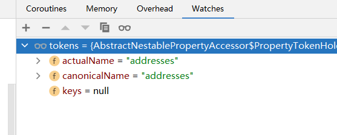
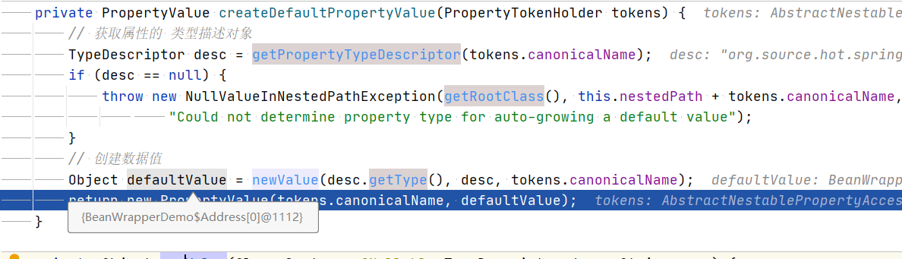
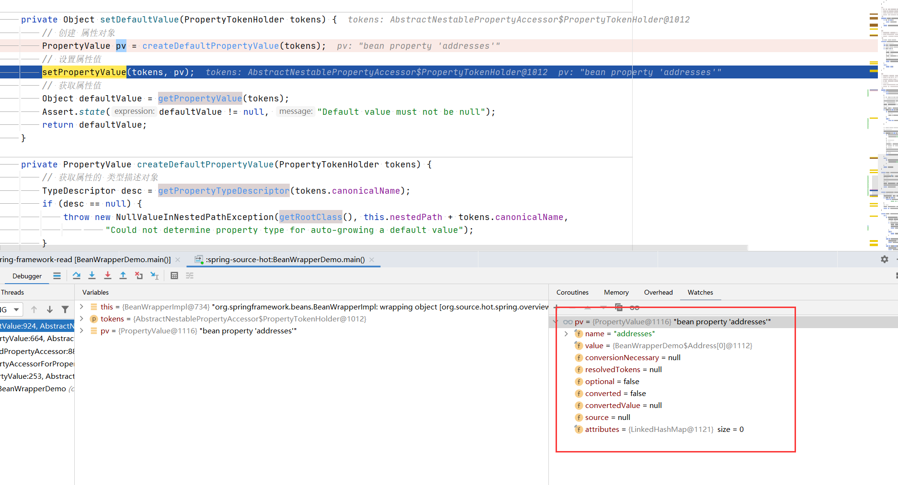
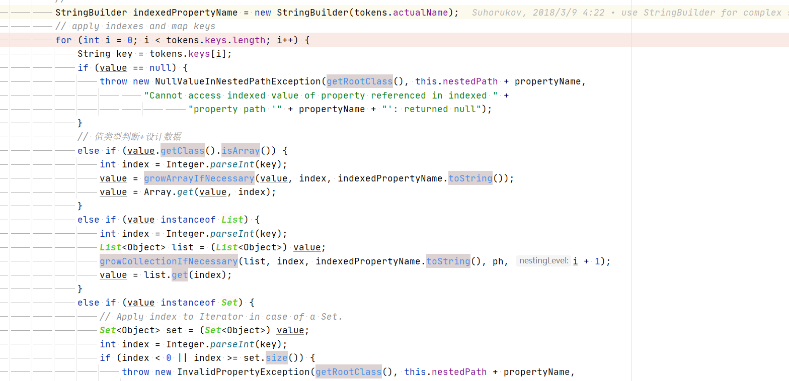
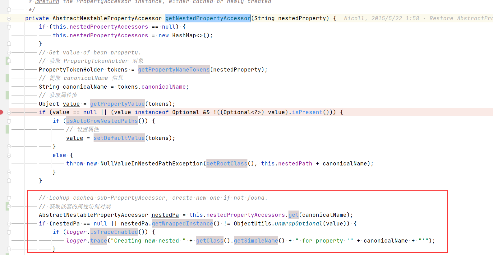

# Spring AbstractNestablePropertyAccessor
- 类全路径: `org.springframework.beans.AbstractNestablePropertyAccessor`
- 嵌套属性访问器. 

## 属性嵌套

在开始分析之前我们需要先了解属性嵌套的含义. 嵌套简要概述即: 属性中含有属性对象(list,map)

下面来一个例子描述Java中的嵌套对象

```java
private static class People {
    public Address[] addresses;

    public Address address;

    private Map<String, Address> map;

    private String name;
}
```

在上述代码中 People 的嵌套属性有 `addresses` 、`address` 、 `map` 
嵌套属性的描述, 这里和 Json 的表达比较相似

- addresses[0] 表示第零个 Address
- addresses[0].name 表示 第零个 Address 的 name 属性
- address 表示一个 Address 
- map['t1'] 表示获取 map 中 key 为 t1 的 Address

在了解上述表达式后我们再来看 `AbstractNestablePropertyAccessor`

## 内部属性
- 首先我们来了解 `AbstractNestablePropertyAccessor` 的内部属性(成员变量), 下面是内部属性列表及代码
    1. wrappedObject: 包装对象
    2. rootObject: 根对象
    3. nestedPath: 嵌套地址,属性地址
    4. nestedPropertyAccessors: 嵌套地址的属性map
        key: 嵌套的属性地址
        value: BeanWrapper

```java
public abstract class AbstractNestablePropertyAccessor extends AbstractPropertyAccessor {

	/**
	 * 包装对象 ，BeanWrapper
	 */
	@Nullable
	Object wrappedObject;

	/**
	 * 根对象
	 */
	@Nullable
	Object rootObject;

	private int autoGrowCollectionLimit = Integer.MAX_VALUE;

	/**
	 * 当前 包装对象对应的属性名
	 */
	private String nestedPath = "";

	/**
	 * Map with cached nested Accessors: nested path -> Accessor instance.
	 *
	 * key: 嵌套的属性地址
	 * value: BeanWrapper
	 * */
	@Nullable
	private Map<String, AbstractNestablePropertyAccessor> nestedPropertyAccessors;
}
```

在 `AbstractNestablePropertyAccessor` 中有一个内部类 `PropertyTokenHolder` , 它对于属性设置也有着一定的作用, 相关代码如下

```java
	protected static class PropertyTokenHolder {
		/**
		 * 属性名称
		 */
		public String actualName;

		/**
		 * 属性规则名称
		 */
		public String canonicalName;

		/**
		 * 属性key
		 */
		@Nullable
		public String[] keys;

		public PropertyTokenHolder(String name) {
			this.actualName = name;
			this.canonicalName = name;
		}
	}

```

在看了上面 `PropertyTokenHolder` 的描述代码后可能存在疑惑, 每个值都存储了什么. 
这个问题的答案在方法 `getPropertyNameTokens` 中有所提及. 

## 方法分析

### getPropertyNameTokens
- 获取 `PropertyTokenHolder` 
- 方法大致逻辑是将 `[]` 这个前面的数据和 `[]` 中的数据获取. 这两个数据分别对应方法中的两个变量
    1. actualName
    2. key
- 例子, `addresses[1].name` 这样一个描述字符串会通过 `getPropertyNameTokens` 前半部分代码得到
    actualName => addresses
    key => 1


上述逻辑的代码如下

```java
// [ 前的字符串
String actualName = null;
List<String> keys = new ArrayList<>(2);
int searchIndex = 0;
while (searchIndex != -1) {
   int keyStart = propertyName.indexOf(PROPERTY_KEY_PREFIX, searchIndex);
   searchIndex = -1;
   if (keyStart != -1) {
      int keyEnd = getPropertyNameKeyEnd(propertyName, keyStart + PROPERTY_KEY_PREFIX.length());
      if (keyEnd != -1) {
         if (actualName == null) {
            actualName = propertyName.substring(0, keyStart);
         }
         // []中的字符串
         String key = propertyName.substring(keyStart + PROPERTY_KEY_PREFIX.length(), keyEnd);
         if (key.length() > 1 && (key.startsWith("'") && key.endsWith("'")) ||
               (key.startsWith("\"") && key.endsWith("\""))) {
            key = key.substring(1, key.length() - 1);
         }
         keys.add(key);
         searchIndex = keyEnd + PROPERTY_KEY_SUFFIX.length();
      }
   }
}
PropertyTokenHolder tokens = new PropertyTokenHolder(actualName != null ? actualName : propertyName);
```


- 在通过上述代码的操作后会得到 `PropertyTokenHolder` 对象 ,其中一开始设置的`PropertyTokenHolder#actualName` 和 `PropertyTokenHolder#canonicalName` 都是属性名(**actualName** )

  ```java
  public PropertyTokenHolder(String name) {
     this.actualName = name;
     this.canonicalName = name;
  }
  ```


- 继续阅读该方法的后半段

```java
if (!keys.isEmpty()) {
   tokens.canonicalName += PROPERTY_KEY_PREFIX +
         StringUtils.collectionToDelimitedString(keys, PROPERTY_KEY_SUFFIX + PROPERTY_KEY_PREFIX) +
         PROPERTY_KEY_SUFFIX;
   tokens.keys = StringUtils.toStringArray(keys);
}
return tokens;
```

- 在方法后半段会进行二次处理, 将`PropertyTokenHolder`中的`canonicalName` 补充完整
    还是上述例子. 经过补充后会得到
    canonicalName => addresses[1]


此时我们的例子中


`PropertyTokenHolder` 
    => actualName: `addresses`
    => canonicalName: `addresses[1]`
    => keys: `1`
    
- 这样我们就了解了方法 `getPropertyNameTokens` 和 类 `PropertyTokenHolder`


### setPropertyValue
- 接下来我们将目光转移到 `setPropertyValue` , 该方法主要承担**属性设置**
- 方法签名: `org.springframework.beans.AbstractNestablePropertyAccessor.setPropertyValue(java.lang.String, java.lang.Object)`

```java
	@Override
	public void setPropertyValue(String propertyName, @Nullable Object value) throws BeansException {
		AbstractNestablePropertyAccessor nestedPa;
		try {
			// 计算嵌套地址属性对象
			nestedPa = getPropertyAccessorForPropertyPath(propertyName);
		}
		catch (NotReadablePropertyException ex) {
			throw new NotWritablePropertyException(getRootClass(), this.nestedPath + propertyName,
					"Nested property in path '" + propertyName + "' does not exist", ex);
		}
		// 获取 PropertyTokenHolder
		PropertyTokenHolder tokens = getPropertyNameTokens(
				// 确定最终地址
				getFinalPath(nestedPa, propertyName)
		);
		nestedPa.setPropertyValue(tokens, new PropertyValue(propertyName, value));
	}

```

在 `setPropertyValue` 调用了多个方法我们需要对其每个方法进行分析, 其中 `getPropertyNameTokens` 在前面分析过了, 下面对
    1. getPropertyAccessorForPropertyPath
    1. getFinalPath
    1. setPropertyValue
    进行分析

### getPropertyAccessorForPropertyPath
- 方法签名: `org.springframework.beans.AbstractNestablePropertyAccessor.getPropertyAccessorForPropertyPath`
方法代码如下
```java
	@SuppressWarnings("unchecked")  // avoid nested generic
	protected AbstractNestablePropertyAccessor getPropertyAccessorForPropertyPath(String propertyPath) {
		// 获取属性嵌套符号的第一个位置
		int pos = PropertyAccessorUtils.getFirstNestedPropertySeparatorIndex(propertyPath);
		// Handle nested properties recursively.
		if (pos > -1) {
			// 切出第一个属性值名称
			String nestedProperty = propertyPath.substring(0, pos);
			// 切除嵌套的属性路径
			String nestedPath = propertyPath.substring(pos + 1);
			// 创建对象
			AbstractNestablePropertyAccessor nestedPa = getNestedPropertyAccessor(nestedProperty);
			return nestedPa.getPropertyAccessorForPropertyPath(nestedPath);
		}
		else {
			return this;
		}
	}

```


对几个方法进行说明

### getFirstNestedPropertySeparatorIndex

获取属性嵌套符号的第一个位置. 解决一个问题: 属性嵌套符号的定义

1. `'['`
2. `']'`
3. `'.'`


详细方法各位可以查看下面代码

```java
private static int getNestedPropertySeparatorIndex(String propertyPath, boolean last) {
   boolean inKey = false;
   int length = propertyPath.length();
   int i = (last ? length - 1 : 0);
   while (last ? i >= 0 : i < length) {
      switch (propertyPath.charAt(i)) {
         case PropertyAccessor.PROPERTY_KEY_PREFIX_CHAR:
         case PropertyAccessor.PROPERTY_KEY_SUFFIX_CHAR:
            inKey = !inKey;
            break;
         case PropertyAccessor.NESTED_PROPERTY_SEPARATOR_CHAR:
            if (!inKey) {
               return i;
            }
      }
      if (last) {
         i--;
      }
      else {
         i++;
      }
   }
   return -1;
}
```


继续回到`getPropertyAccessorForPropertyPath`方法. 通过上面的分析我们了解了`pos`的含义 接下来需要对`nestedProperty`和`nestedPath`进行含义分析


```java
String nestedProperty = propertyPath.substring(0, pos);
// 切除嵌套的属性路径
String nestedPath = propertyPath.substring(pos + 1);
```


例子: 延续我们开始的例子 `addresses[1].name` 在这里经过计算后 `pos` = 12 , 

nestedProperty => addresses[1]
nestedPath => name


继续向下分析到了

```java
AbstractNestablePropertyAccessor nestedPa = getNestedPropertyAccessor(nestedProperty);
```


### 	getNestedPropertyAccessor

- 获取嵌套属性访问器

- 方法签名: `org.springframework.beans.AbstractNestablePropertyAccessor#getNestedPropertyAccessor`


在方法一开始就做了一个我们已经了解的行为 **将属性值嵌套转换成PropertyTokenHolder对象**

```java
PropertyTokenHolder tokens = getPropertyNameTokens(nestedProperty);
```


延续我们的例子 现在处理的是`addresses[1]` 

根据前面的分析可以知道下面这个结果
	actualName => `addresses`
	canonicalName => ``addresses[1]`
	keys => `1`

到这里第一部分代码逻辑分析完毕, 完整代码如下

```java
if (this.nestedPropertyAccessors == null) {
   this.nestedPropertyAccessors = new HashMap<>();
}
// Get value of bean property.
// 获取 PropertyTokenHolder 对象
PropertyTokenHolder tokens = getPropertyNameTokens(nestedProperty);
// 提取 canonicalName 信息
String canonicalName = tokens.canonicalName;
```


在完成`PropertyTokenHolder` 对象提取后紧接着就是值的操作，获取属性对应的值


### getPropertyValue

- 方法作用: 获取属性值
- 方法签名: `org.springframework.beans.AbstractNestablePropertyAccessor#getPropertyValue(org.springframework.beans.AbstractNestablePropertyAccessor.PropertyTokenHolder)`


- 方法逻辑

  获取`PropertyHandler` 对象

  通过`PropertyHandler` 提取值

  根据值类型将数据设置. 


查看下面代码. 


```java
@SuppressWarnings("unchecked")
@Nullable
protected Object getPropertyValue(PropertyTokenHolder tokens) throws BeansException {
   String propertyName = tokens.canonicalName;
   String actualName = tokens.actualName;
   // 子类得到属性处理器
   PropertyHandler ph = getLocalPropertyHandler(actualName);
   if (ph == null || !ph.isReadable()) {
      throw new NotReadablePropertyException(getRootClass(), this.nestedPath + propertyName);
   }
   try {
      // 属性执行器中获取值
      Object value = ph.getValue();
      if (tokens.keys != null) {
         if (value == null) {
            // 判断是否需要设置属性
            if (isAutoGrowNestedPaths()) {
               // 设置属性
               value = setDefaultValue(new PropertyTokenHolder(tokens.actualName));
            }
            else {
               throw new NullValueInNestedPathException(getRootClass(), this.nestedPath + propertyName,
                     "Cannot access indexed value of property referenced in indexed " +
                           "property path '" + propertyName + "': returned null");
            }
         }
         //
         StringBuilder indexedPropertyName = new StringBuilder(tokens.actualName);
         // apply indexes and map keys
         for (int i = 0; i < tokens.keys.length; i++) {
            String key = tokens.keys[i];
            if (value == null) {
               throw new NullValueInNestedPathException(getRootClass(), this.nestedPath + propertyName,
                     "Cannot access indexed value of property referenced in indexed " +
                           "property path '" + propertyName + "': returned null");
            }
            // 值类型判断+设计数据
            else if (value.getClass().isArray()) {
               int index = Integer.parseInt(key);
               value = growArrayIfNecessary(value, index, indexedPropertyName.toString());
               value = Array.get(value, index);
            }
            else if (value instanceof List) {
               int index = Integer.parseInt(key);
               List<Object> list = (List<Object>) value;
               growCollectionIfNecessary(list, index, indexedPropertyName.toString(), ph, i + 1);
               value = list.get(index);
            }
            else if (value instanceof Set) {
               // Apply index to Iterator in case of a Set.
               Set<Object> set = (Set<Object>) value;
               int index = Integer.parseInt(key);
               if (index < 0 || index >= set.size()) {
                  throw new InvalidPropertyException(getRootClass(), this.nestedPath + propertyName,
                        "Cannot get element with index " + index + " from Set of size " +
                              set.size() + ", accessed using property path '" + propertyName + "'");
               }
               Iterator<Object> it = set.iterator();
               for (int j = 0; it.hasNext(); j++) {
                  Object elem = it.next();
                  if (j == index) {
                     value = elem;
                     break;
                  }
               }
            }
            else if (value instanceof Map) {
               Map<Object, Object> map = (Map<Object, Object>) value;
               Class<?> mapKeyType = ph.getResolvableType().getNested(i + 1).asMap().resolveGeneric(0);
               // IMPORTANT: Do not pass full property name in here - property editors
               // must not kick in for map keys but rather only for map values.
               TypeDescriptor typeDescriptor = TypeDescriptor.valueOf(mapKeyType);
               Object convertedMapKey = convertIfNecessary(null, null, key, mapKeyType, typeDescriptor);
               value = map.get(convertedMapKey);
            }
            else {
               throw new InvalidPropertyException(getRootClass(), this.nestedPath + propertyName,
                     "Property referenced in indexed property path '" + propertyName +
                           "' is neither an array nor a List nor a Set nor a Map; returned value was [" + value + "]");
            }
            indexedPropertyName.append(PROPERTY_KEY_PREFIX).append(key).append(PROPERTY_KEY_SUFFIX);
         }
      }
      return value;
   }
   catch (IndexOutOfBoundsException ex) {
      throw new InvalidPropertyException(getRootClass(), this.nestedPath + propertyName,
            "Index of out of bounds in property path '" + propertyName + "'", ex);
   }
   catch (NumberFormatException | TypeMismatchException ex) {
      throw new InvalidPropertyException(getRootClass(), this.nestedPath + propertyName,
            "Invalid index in property path '" + propertyName + "'", ex);
   }
   catch (InvocationTargetException ex) {
      throw new InvalidPropertyException(getRootClass(), this.nestedPath + propertyName,
            "Getter for property '" + actualName + "' threw exception", ex);
   }
   catch (Exception ex) {
      throw new InvalidPropertyException(getRootClass(), this.nestedPath + propertyName,
            "Illegal attempt to get property '" + actualName + "' threw exception", ex);
   }
}
```


### PropertyHandler

- 属性处理类.
- 包含三个属性及几个抽象方法

- 属性
  1. 属性的类型
  2. 是否可读
  3. 是否可写

详细代码如下

```java
protected abstract static class PropertyHandler {
		/**
		 * 属性类型
		 */
		private final Class<?> propertyType;

		/**
		 * 是否可读
		 */
		private final boolean readable;

		/**
		 * 是否可写
		 */
		private final boolean writable;

		public PropertyHandler(Class<?> propertyType, boolean readable, boolean writable) {
			this.propertyType = propertyType;
			this.readable = readable;
			this.writable = writable;
		}

		public abstract TypeDescriptor toTypeDescriptor();

		public abstract ResolvableType getResolvableType();


		@Nullable
		public abstract TypeDescriptor nested(int level);

		@Nullable
		public abstract Object getValue() throws Exception;

		public abstract void setValue(@Nullable Object value) throws Exception;
	}
```


有关`PropertyHandler`的分析这里不展开. 回到我们的`getNestedPropertyAccessor`方法主线上通过上面的分析我们对下面代码有了了解. 知道其通过`PropertyHandler`获取了一个值

```java
Object value = getPropertyValue(tokens);
```


在获取完成属性值后接下来就是属性设置了, 相关代码如下

```JAVA
if (value == null || (value instanceof Optional && !((Optional<?>) value).isPresent())) {
   if (isAutoGrowNestedPaths()) {
      // 设置属性
      value = setDefaultValue(tokens);
   }
   else {
      throw new NullValueInNestedPathException(getRootClass(), this.nestedPath + canonicalName);
   }
}
```

对上述代码主要关注的是 `setDefaultValue` 方法, 接下来就开始对其进行分析


### setDefaultValue

- 在`getPropertyValue`方法中还有`setDefaultValue`的调用逻辑

- 方法签名: `org.springframework.beans.AbstractNestablePropertyAccessor#setDefaultValue`

```java
private Object setDefaultValue(PropertyTokenHolder tokens) {
   // 创建 属性对象
   PropertyValue pv = createDefaultPropertyValue(tokens);
   // 设置属性值
   setPropertyValue(tokens, pv);
   // 获取属性值
   Object defaultValue = getPropertyValue(tokens);
   Assert.state(defaultValue != null, "Default value must not be null");
   return defaultValue;
}
```


- `setDefaultValue` 方法是多个方法的调用. 方法本身没有什么特别. 主要对调用方法进行分析


### createDefaultPropertyValue

- `createDefaultPropertyValue` 创建一个 `PropertyValue`

- 方法签名: `org.springframework.beans.AbstractNestablePropertyAccessor#createDefaultPropertyValue`

```java
private PropertyValue createDefaultPropertyValue(PropertyTokenHolder tokens) {
   // 获取属性的 类型描述对象
   TypeDescriptor desc = getPropertyTypeDescriptor(tokens.canonicalName);
   if (desc == null) {
      throw new NullValueInNestedPathException(getRootClass(), this.nestedPath + tokens.canonicalName,
            "Could not determine property type for auto-growing a default value");
   }
   // 创建数据值
   Object defaultValue = newValue(desc.getType(), desc, tokens.canonicalName);
   return new PropertyValue(tokens.canonicalName, defaultValue);
}
```


- 在`createDefaultPropertyValue`又是多个方法的调用


### getPropertyTypeDescriptor

- 方法作用: 获取属性描述对象

- 方法签名: `org.springframework.beans.AbstractNestablePropertyAccessor#getPropertyTypeDescriptor`

```java
@Override
@Nullable
public TypeDescriptor getPropertyTypeDescriptor(String propertyName) throws BeansException {
   try {
      // 嵌套属性访问器
      AbstractNestablePropertyAccessor nestedPa = getPropertyAccessorForPropertyPath(propertyName);
      // 寻找属性地址
      String finalPath = getFinalPath(nestedPa, propertyName);
      // 获取 PropertyTokenHolder
      PropertyTokenHolder tokens = getPropertyNameTokens(finalPath);
      // 获取 PropertyHandler
      PropertyHandler ph = nestedPa.getLocalPropertyHandler(tokens.actualName);
      if (ph != null) {
         if (tokens.keys != null) {
            if (ph.isReadable() || ph.isWritable()) {
               // 计算类型描述符
               return ph.nested(tokens.keys.length);
            }
         }
         else {
            if (ph.isReadable() || ph.isWritable()) {
               // 计算类型描述符
               return ph.toTypeDescriptor();
            }
         }
      }
   }
   catch (InvalidPropertyException ex) {
      // Consider as not determinable.
   }
   return null;
}
```


这段代码的讲述依旧延续我们的 `addresses[1].name`进行分析

经过上述代码一步步现在的参数是 `addresses` 


此时对象 `tokens` 是这样的一个数据状态




通过 ph 直接将类型描述对象返回. (BeanWrapperImpl中实现)


类型描述符有了. 就可以进行数据设置了


### newValue

- 创建对象, 值得注意的是这里的创建对象的属性还是没有的. 仅仅是一个构造函数的执行. 即**执行一个空参构造, 且构造函数没有代码块**

- 方法签名: `org.springframework.beans.AbstractNestablePropertyAccessor#newValue`





继续往下执行, 创建出 `PropertyValue`

此时的`pv`对象




### setPropertyValue

前文我们依旧活到了`pv`对象， 接下来是对属性的赋值操作. 

- 方法签名: `org.springframework.beans.AbstractNestablePropertyAccessor#setPropertyValue(org.springframework.beans.AbstractNestablePropertyAccessor.PropertyTokenHolder, org.springframework.beans.PropertyValue)`
- 方法作用: 属性赋值


属性赋值存在两种赋值方式


```java
protected void setPropertyValue(PropertyTokenHolder tokens, PropertyValue pv) throws BeansException {
   if (tokens.keys != null) {
      processKeyedProperty(tokens, pv);
   }
   else {
      processLocalProperty(tokens, pv);
   }
}
```

### processKeyedProperty

- 方法签名: `org.springframework.beans.AbstractNestablePropertyAccessor#processKeyedProperty`

这个方法主要对 **array**、**List**、**Map** 进行默认值设置

通过`getPropertyHoldingValue`方法获取属性值, 通过属性值判断类型, 从 `PropertyHandler` 中获取值设置


详细代码如下

```java
@SuppressWarnings("unchecked")
private void processKeyedProperty(PropertyTokenHolder tokens, PropertyValue pv) {
   // 属性值
   Object propValue = getPropertyHoldingValue(tokens);
   //  PropertyHandler 对象
   PropertyHandler ph = getLocalPropertyHandler(tokens.actualName);
   if (ph == null) {
      throw new InvalidPropertyException(
            getRootClass(), this.nestedPath + tokens.actualName, "No property handler found");
   }
   Assert.state(tokens.keys != null, "No token keys");
   // 获取最后一个 key
   String lastKey = tokens.keys[tokens.keys.length - 1];

   if (propValue.getClass().isArray()) {
      // 类型
      Class<?> requiredType = propValue.getClass().getComponentType();
      // 获取索引
      int arrayIndex = Integer.parseInt(lastKey);
      Object oldValue = null;
      try {
         if (isExtractOldValueForEditor() && arrayIndex < Array.getLength(propValue)) {
            oldValue = Array.get(propValue, arrayIndex);
         }
         Object convertedValue = convertIfNecessary(tokens.canonicalName, oldValue, pv.getValue(),
               requiredType, ph.nested(tokens.keys.length));
         int length = Array.getLength(propValue);
         if (arrayIndex >= length && arrayIndex < this.autoGrowCollectionLimit) {
            Class<?> componentType = propValue.getClass().getComponentType();
            Object newArray = Array.newInstance(componentType, arrayIndex + 1);
            System.arraycopy(propValue, 0, newArray, 0, length);
            setPropertyValue(tokens.actualName, newArray);
            propValue = getPropertyValue(tokens.actualName);
         }
         Array.set(propValue, arrayIndex, convertedValue);
      }
      catch (IndexOutOfBoundsException ex) {
         throw new InvalidPropertyException(getRootClass(), this.nestedPath + tokens.canonicalName,
               "Invalid array index in property path '" + tokens.canonicalName + "'", ex);
      }
   }

   else if (propValue instanceof List) {
      Class<?> requiredType = ph.getCollectionType(tokens.keys.length);
      List<Object> list = (List<Object>) propValue;
      int index = Integer.parseInt(lastKey);
      Object oldValue = null;
      if (isExtractOldValueForEditor() && index < list.size()) {
         oldValue = list.get(index);
      }
      Object convertedValue = convertIfNecessary(tokens.canonicalName, oldValue, pv.getValue(),
            requiredType, ph.nested(tokens.keys.length));
      int size = list.size();
      if (index >= size && index < this.autoGrowCollectionLimit) {
         for (int i = size; i < index; i++) {
            try {
               list.add(null);
            }
            catch (NullPointerException ex) {
               throw new InvalidPropertyException(getRootClass(), this.nestedPath + tokens.canonicalName,
                     "Cannot set element with index " + index + " in List of size " +
                           size + ", accessed using property path '" + tokens.canonicalName +
                           "': List does not support filling up gaps with null elements");
            }
         }
         list.add(convertedValue);
      }
      else {
         try {
            list.set(index, convertedValue);
         }
         catch (IndexOutOfBoundsException ex) {
            throw new InvalidPropertyException(getRootClass(), this.nestedPath + tokens.canonicalName,
                  "Invalid list index in property path '" + tokens.canonicalName + "'", ex);
         }
      }
   }

   else if (propValue instanceof Map) {
      Class<?> mapKeyType = ph.getMapKeyType(tokens.keys.length);
      Class<?> mapValueType = ph.getMapValueType(tokens.keys.length);
      Map<Object, Object> map = (Map<Object, Object>) propValue;
      // IMPORTANT: Do not pass full property name in here - property editors
      // must not kick in for map keys but rather only for map values.
      TypeDescriptor typeDescriptor = TypeDescriptor.valueOf(mapKeyType);
      Object convertedMapKey = convertIfNecessary(null, null, lastKey, mapKeyType, typeDescriptor);
      Object oldValue = null;
      if (isExtractOldValueForEditor()) {
         oldValue = map.get(convertedMapKey);
      }
      // Pass full property name and old value in here, since we want full
      // conversion ability for map values.
      Object convertedMapValue = convertIfNecessary(tokens.canonicalName, oldValue, pv.getValue(),
            mapValueType, ph.nested(tokens.keys.length));
      map.put(convertedMapKey, convertedMapValue);
   }

   else {
      throw new InvalidPropertyException(getRootClass(), this.nestedPath + tokens.canonicalName,
            "Property referenced in indexed property path '" + tokens.canonicalName +
                  "' is neither an array nor a List nor a Map; returned value was [" + propValue + "]");
   }
}
```


### processLocalProperty

- 方法签名: 
  `org.springframework.beans.AbstractNestablePropertyAccessor#processLocalProperty`

该方法主要围绕着`PropertyValue` 对象进行属性设置

核心方法如下(做过代码删除)

```java
// 获取 PV 的属性值
Object originalValue = pv.getValue();
Object valueToApply = originalValue;

// 是否需要
if (!Boolean.FALSE.equals(pv.conversionNecessary)) {
   // 是否能够转换
   if (pv.isConverted()) {
      valueToApply = pv.getConvertedValue();
   }
   // 不能转换换
   else {
      if (isExtractOldValueForEditor() && ph.isReadable()) {
         try {
            oldValue = ph.getValue();
         }
         catch (Exception ex) {
            if (ex instanceof PrivilegedActionException) {
               ex = ((PrivilegedActionException) ex).getException();
            }
            if (logger.isDebugEnabled()) {
               logger.debug("Could not read previous value of property '" +
                     this.nestedPath + tokens.canonicalName + "'", ex);
            }
         }
      }
      valueToApply = convertForProperty(
            tokens.canonicalName, oldValue, originalValue, ph.toTypeDescriptor());
   }
   pv.getOriginalPropertyValue().conversionNecessary = (valueToApply != originalValue);
}
ph.setValue(valueToApply);
```


方法整体上就描述一件事, 是否需要转换, 如果需要则转换, 转换后将数据让如 ph


到这里 `setDefaultValue` 方法也就结束了. 接下来回归主线`getPropertyValue`




主线上的代码后续就是设置数据了. 这里就不具体展开. 


继续往下看到下面代码




这些后半段代码主要都是由子类在提供实现方式，后半段代码处理的是存在**下级嵌套属性访问器的情况**

简单说就是构造方法的重写. 创建对象. 

在创建对象后会做两个属性编辑器的拷贝

```java
copyDefaultEditorsTo
copyCustomEditorsTo
```

完成拷贝后将数据放入容器


```java
// Lookup cached sub-PropertyAccessor, create new one if not found.
// 获取嵌套的属性访问对戏
AbstractNestablePropertyAccessor nestedPa = this.nestedPropertyAccessors.get(canonicalName);
if (nestedPa == null || nestedPa.getWrappedInstance() != ObjectUtils.unwrapOptional(value)) {
   if (logger.isTraceEnabled()) {
      logger.trace("Creating new nested " + getClass().getSimpleName() + " for property '" + canonicalName + "'");
   }
   // 获取嵌套的属性访问对象
   // 子类实现
   nestedPa = newNestedPropertyAccessor(value, this.nestedPath + canonicalName + NESTED_PROPERTY_SEPARATOR);
   // Inherit all type-specific PropertyEditors.
   // 属性编辑器拷贝
   copyDefaultEditorsTo(nestedPa);
   copyCustomEditorsTo(nestedPa, canonicalName);
   // 设置到容器
   this.nestedPropertyAccessors.put(canonicalName, nestedPa);
}
else {
   if (logger.isTraceEnabled()) {
      logger.trace("Using cached nested property accessor for property '" + canonicalName + "'");
   }
}
return nestedPa;
```