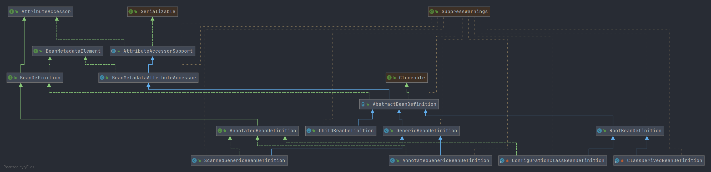

# Spring BeanDefinition 阅读方向
- 本节主要围绕`BeanDefinition`接口进行展开,介绍接口方法和实现类. 
    `BeanDefinition` 接口主要定义 Spring 中 Bean 的一些基本信息的 get 和 set 方法. 
    详细内容请查阅下面文档.
    
    详细阅读流程围绕类图
    
    
    
- [BeanDefinition](Spring-BeanDefinition.md)
    - [AbstractBeanDefinition](Spring-AbstractBeanDefinition.md)