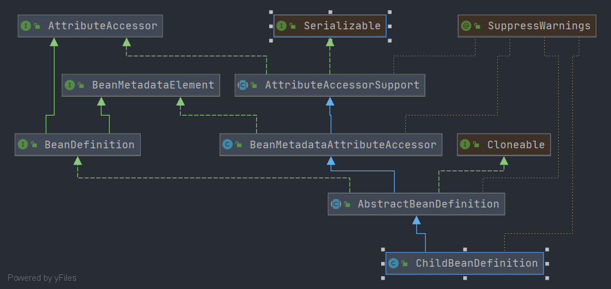

# Spring ChildBeanDefinition
- 类全路径: `org.springframework.beans.factory.support.ChildBeanDefinition`
- 类图
    
    
- `ChildBeanDefinition` 继承 `AbstractBeanDefinition` , 关于 `AbstractBeanDefinition` 分析请查看: [这篇文章](./Spring-AbstractBeanDefinition.md)


`ChildBeanDefinition` 作为`AbstractBeanDefinition` 的子类, 和父类的差异仅有一个属性字段的差异. 
通过这个差异字段来标识父 `BeanDefinition` 的名称


```java
public class ChildBeanDefinition extends AbstractBeanDefinition {

	@Nullable
	private String parentName;
    //... 其他省略

}
```