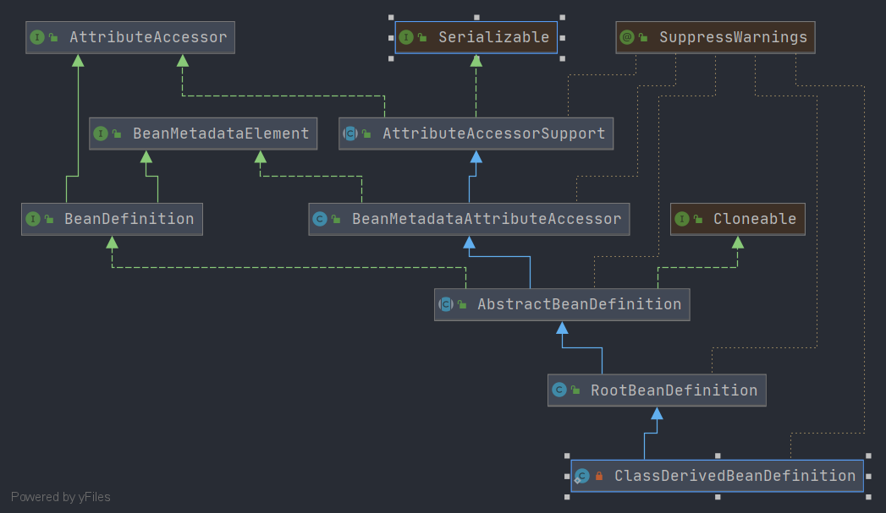

# Spring ClassDerivedBeanDefinition
- 类全路径: `org.springframework.context.support.GenericApplicationContext.ClassDerivedBeanDefinition`
- 类图:
    
    
- 从类图上看, `ClassDerivedBeanDefinition` 继承 `RootBeanDefinition` 有关 `RootBeanDefinition`的分析请查看: [这篇文章](./Spring-RootBeanDefinition.md)


- `ClassDerivedBeanDefinition` 没有添加新的属性. 重写了父类的两个方法
    1. getPreferredConstructors: 获取构造函数列表
    2. cloneBeanDefinition: 克隆beanDefinition
    
    
## 方法分析

### getPreferredConstructors
- 获取构造函数列表
    1. 判断是不是 Kotlin 类. 如果是就获取
    2. 直接从 class 中获取
```java
    @Override
    @Nullable
    public Constructor<?>[] getPreferredConstructors() {
        Class<?> clazz = getBeanClass();
        // 方法内是 Kotlin 的一个检索构造函数的过程
        Constructor<?> primaryCtor = BeanUtils.findPrimaryConstructor(clazz);
        if (primaryCtor != null) {
            return new Constructor<?>[] {primaryCtor};
        }
        // 通过 class 直接获取构造函数列表
        Constructor<?>[] publicCtors = clazz.getConstructors();
        if (publicCtors.length > 0) {
            return publicCtors;
        }
        return null;
    }

```

- 关于 Kotlin 的获取方式

```java
	@SuppressWarnings("unchecked")
	@Nullable
	public static <T> Constructor<T> findPrimaryConstructor(Class<T> clazz) {
		Assert.notNull(clazz, "Class must not be null");
		if (KotlinDetector.isKotlinReflectPresent() && KotlinDetector.isKotlinType(clazz)) {
			Constructor<T> kotlinPrimaryConstructor = KotlinDelegate.findPrimaryConstructor(clazz);
			return kotlinPrimaryConstructor;
		}
		return null;
	}

```

### cloneBeanDefinition
- 克隆方法比较简单, 直接是对象创建的形式进行克隆

```java
		@Override
		public RootBeanDefinition cloneBeanDefinition() {
			return new ClassDerivedBeanDefinition(this);
		}

```