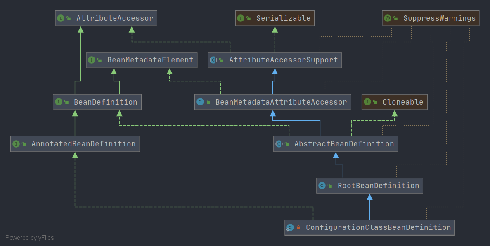

# Spring ConfigurationClassBeanDefinition
- 类全路径: `org.springframework.context.annotation.ConfigurationClassBeanDefinitionReader.ConfigurationClassBeanDefinition`
- 类图


- `ConfigurationClassBeanDefinition` 在 `RootBeanDefinition` 类的基础上增加了2个新的成员变量 
    1. AnnotationMetadata: 注解元信息
    2. MethodMetadata: 方法元信息
    
    
```java

    /**
     * 注解元信息
     */
    private final AnnotationMetadata annotationMetadata;

    /**
     * 方法元信息
     */
    private final MethodMetadata factoryMethodMetadata;
```