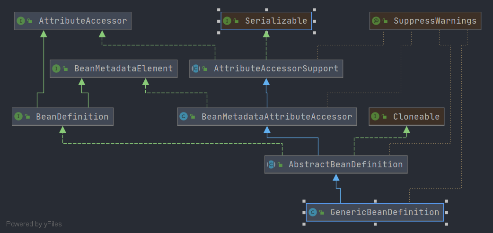

# Spring GenericBeanDefinition
- 类全路径: `org.springframework.beans.factory.support.GenericBeanDefinition`
- 类图
    
    
    
- 对比 `AbstractBeanDefinition` 类 , `GenericBeanDefinition` 增加了一个新的成员变量 `parentName`

- 有关 `AbstractBeanDefinition` 的分析请查看: [这片文章](./Spring-AbstractBeanDefinition.md)

