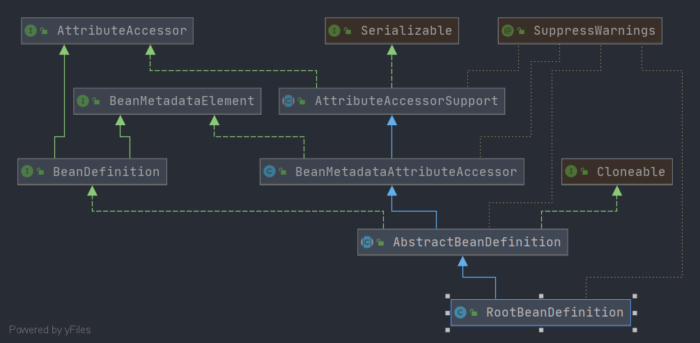

# Spring RootBeanDefinition
- 类全路径: `org.springframework.beans.factory.support.RootBeanDefinition`
- 类图
    
    
- `RootBeanDefinition` 继承 `AbstractBeanDefinition` , 关于 `AbstractBeanDefinition` 分析请查看: [这篇文章](./Spring-AbstractBeanDefinition.md)

## 成员变量
```java
public class RootBeanDefinition extends AbstractBeanDefinition {
/**
	 * Common lock for the four constructor fields below.
	 * 构造函数的锁
	 * */
	final Object constructorArgumentLock = new Object();

	/**
	 * Common lock for the two post-processing fields below.
	 * 后置锁
	 * */
	final Object postProcessingLock = new Object();

	/**
	 *  Determines if the definition needs to be re-merged.
	 * 是否需要重新合并定义
	 * */
	volatile boolean stale;

	/**
	 * 是否缓存
	 */
	boolean allowCaching = true;

	/**
	 * 工厂方法是否唯一
	 */
	boolean isFactoryMethodUnique = false;

	/**
	 * 目标对象类型
	 */
	@Nullable
	volatile ResolvableType targetType;

	/**
	 *
	 * Package-visible field for caching the determined Class of a given bean definition.
	 * 目标类型, bean 的类型
	 * */
	@Nullable
	volatile Class<?> resolvedTargetType;

	/**
	 * Package-visible field for caching if the bean is a factory bean.
	 *
	 * 是否使用给 工厂bean
	 * */
	@Nullable
	volatile Boolean isFactoryBean;

	/**
	 * Package-visible field for caching the return type of a generically typed factory method.
	 *
	 * 工厂方法返回的类型
	 * */
	@Nullable
	volatile ResolvableType factoryMethodReturnType;

	/**
	 * Package-visible field for caching a unique factory method candidate for introspection.
	 * 工厂方法
	 * */
	@Nullable
	volatile Method factoryMethodToIntrospect;

	/**
	 * Package-visible field for caching the resolved constructor or factory method.
	 *
	 * 构造函数或者工厂方法
	 * */
	@Nullable
	Executable resolvedConstructorOrFactoryMethod;

	/**
	 * Package-visible field that marks the constructor arguments as resolved.
	 * 构造函数的参数是否解析
	 * */
	boolean constructorArgumentsResolved = false;

	/**
	 * Package-visible field for caching fully resolved constructor arguments.
	 * 构造函数参数列表,以解析过的
	 * */
	@Nullable
	Object[] resolvedConstructorArguments;

	/**
	 *  Package-visible field for caching partly prepared constructor arguments.
	 *  构造函数参数列表,未解析的
	 * */
	@Nullable
	Object[] preparedConstructorArguments;

	/**
	 * Package-visible field that indicates MergedBeanDefinitionPostProcessor having been applied.
	 * 是否后处理 {@link MergedBeanDefinitionPostProcessor}
	 * */
	boolean postProcessed = false;

	/**
	 *  Package-visible field that indicates a before-instantiation post-processor having kicked in.
	 * 是否已经生成代理
	 * */
	@Nullable
	volatile Boolean beforeInstantiationResolved;

	/**
	 * bean 定义持有工具
	 */
	@Nullable
	private BeanDefinitionHolder decoratedDefinition;

	/**
	 * 注解元素
	 */
	@Nullable
	private AnnotatedElement qualifiedElement;

	/**
	 * 外部的配置成员
	 */
	@Nullable
	private Set<Member> externallyManagedConfigMembers;

	/**
	 * 外部的初始化方法列表
	 */
	@Nullable
	private Set<String> externallyManagedInitMethods;

	/**
	 * 外部的摧毁方法列表
	 */
	@Nullable
	private Set<String> externallyManagedDestroyMethods;

}
```

- `RootBeanDefinition` 主要定义上述内部属性, 方法都是 `get` & `set` 方法不在此进行分析