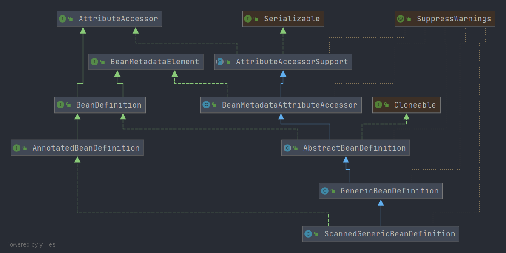

# Spring ScannedGenericBeanDefinition
- 类全路径: `org.springframework.context.annotation.ScannedGenericBeanDefinition`
- 类图: 
    
    
- 从类图上看, `ScannedGenericBeanDefinition` 继承 `GenericBeanDefinition` 有关 `GenericBeanDefinition`的分析请查看: [这篇文章](./Spring-GenericBeanDefinition.md)

    
- `ScannedGenericBeanDefinition` 在 `GenericBeanDefinition` 的基础上增加了下面一个属性. 

```java
	/**
	 * 注解元信息
	 */
	private final AnnotationMetadata metadata;

```