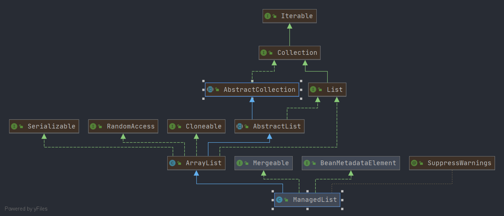

# Spring ManagedList

- 类全路径: `org.springframework.beans.factory.support.ManagedList`
- 类图: 
    


- 对应标签 `<list>`

  ```xml
    <property name="someList">
        <list>
            <value>a list element followed by a reference</value>
        </list>
    </property>
  ```

  - 解析xml的处理方法: `org.springframework.beans.factory.xml.BeanDefinitionParserDelegate.parseListElement` 这里不做具体展开


##  方法列表


### merge

- `ManagedList` 作为`Mergeable`的实现类, 其操作的对象为`ArrayList`, 想到合并可以联想到 `ArrayList#addAll` =>`java.util.List#addAll(java.util.Collection<? extends E>)` Spring 中也正是如此进行操作的. 详细代码如下


```java
@Override
@SuppressWarnings("unchecked")
public List<E> merge(@Nullable Object parent) {
   if (!this.mergeEnabled) {
      throw new IllegalStateException("Not allowed to merge when the 'mergeEnabled' property is set to 'false'");
   }
   if (parent == null) {
      return this;
   }
   if (!(parent instanceof List)) {
      throw new IllegalArgumentException("Cannot merge with object of type [" + parent.getClass() + "]");
   }
   // 创建对象
   List<E> merged = new ManagedList<>();
   // 放入 集合列表中
   merged.addAll((List<E>) parent);
   merged.addAll(this);
   return merged;
}
```