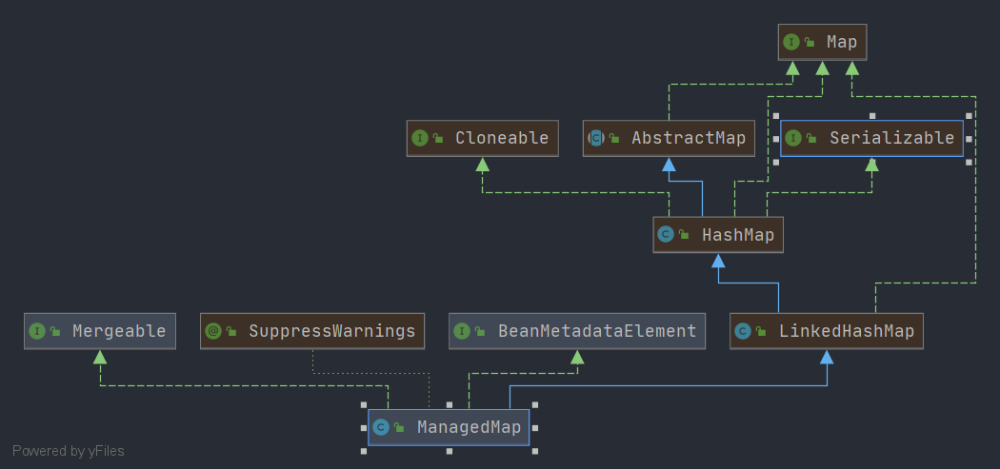

# Spring ManagedMap

- 类全路径: `org.springframework.beans.factory.support.ManagedMap`
- 类图: 
    


- 对应标签 `<map>`

  ```xml
    <property name="someMap">
        <map>
            <entry key="an entry" value="just some string"/>
            <entry key ="a ref" value-ref="myDataSource"/>
        </map>
    </property>
  ```

  - 解析xml的处理方法: `org.springframework.beans.factory.xml.BeanDefinitionParserDelegate.parseMapElement` 这里不做具体展开


##  方法列表


### merge

- `ManagedMap` 作为`Mergeable`的实现类, 其操作的对象为`LinkedHashMap`, 想到合并可以联想到 `LinkedHashMap#putAll` => `java.util.Map.putAll` Spring 中也正是如此进行操作的. 详细代码如下


```java
@Override
@SuppressWarnings("unchecked")
public Object merge(@Nullable Object parent) {
    if (!this.mergeEnabled) {
        throw new IllegalStateException("Not allowed to merge when the 'mergeEnabled' property is set to 'false'");
    }
    if (parent == null) {
        return this;
    }
    if (!(parent instanceof Map)) {
        throw new IllegalArgumentException("Cannot merge with object of type [" + parent.getClass() + "]");
    }
    Map<K, V> merged = new ManagedMap<>();
    merged.putAll((Map<K, V>) parent);
    merged.putAll(this);
    return merged;
}
```