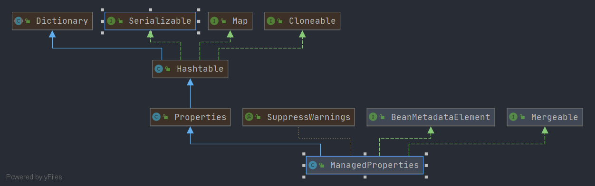

# Spring ManagedProperties
- 类全路径: `org.springframework.beans.factory.support.ManagedProperties`
- 类图: 
    


- 对应标签 `<props>`

  ```xml
  <props>
         <prop key="administrator">administrator@example.org</prop>
         <prop key="support">support@example.org</prop>
         <prop key="development">development@example.org</prop>
  </props>
  ```

  - 解析xml的处理方法: `org.springframework.beans.factory.xml.BeanDefinitionParserDelegate#parsePropsElement` 这里不做具体展开


回到`ManagedProperties`类上, 一些`get&set`方法忽略, 这里对 `merge` 方法进行分析


##  方法列表


### merge

- `ManagedProperties` 作为`Mergeable`的实现类, 其操作的对象为`Properties` , 想到合并可以联想到 `Properties#putAll` =>`java.util.Hashtable#putAll` Spring 中也正是如此进行操作的. 详细代码如下

```java
@Override
public Object merge(@Nullable Object parent) {
   // 是否允许合并
   if (!this.mergeEnabled) {
      throw new IllegalStateException("Not allowed to merge when the 'mergeEnabled' property is set to 'false'");
   }
   // 入参为空, 直接返回自己
   if (parent == null) {
      return this;
   }
   // 判断入参是否时 Properties
   if (!(parent instanceof Properties)) {
      throw new IllegalArgumentException("Cannot merge with object of type [" + parent.getClass() + "]");
   }
   // 创建 Properties , 通过两次 putAll 将数据填充返回
   Properties merged = new ManagedProperties();
   merged.putAll((Properties) parent);
   merged.putAll(this);
   return merged;
}
```