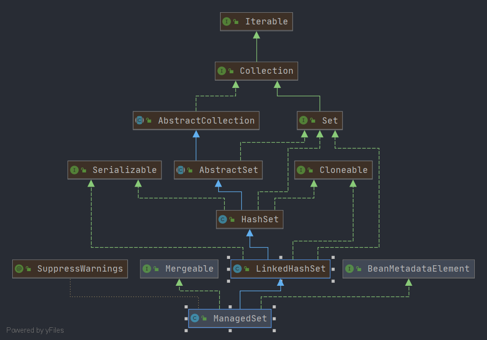

# Spring ManagedSet

- 类全路径: `org.springframework.beans.factory.support.ManagedSet`
- 类图: 
    


- 对应标签 `<set>`

  ```xml
    <property name="someSet">
        <set>
            <value>just some string</value>
            <ref bean="myDataSource" />
        </set>
    </property>
  ```

  - 解析xml的处理方法: `org.springframework.beans.factory.xml.BeanDefinitionParserDelegate.parseSetElement` 这里不做具体展开


##  方法列表


### merge

- `ManagedSet` 作为`Mergeable`的实现类, 其操作的对象为`LinkedHashSet`, 想到合并可以联想到 `LinkedHashSet#addAll` => `java.util.Set.addAll` Spring 中也正是如此进行操作的. 详细代码如下


```java
	@Override
	@SuppressWarnings("unchecked")
	public Set<E> merge(@Nullable Object parent) {
		if (!this.mergeEnabled) {
			throw new IllegalStateException("Not allowed to merge when the 'mergeEnabled' property is set to 'false'");
		}
		if (parent == null) {
			return this;
		}
		if (!(parent instanceof Set)) {
			throw new IllegalArgumentException("Cannot merge with object of type [" + parent.getClass() + "]");
		}
		Set<E> merged = new ManagedSet<>();
		merged.addAll((Set<E>) parent);
		merged.addAll(this);
		return merged;
	}

```