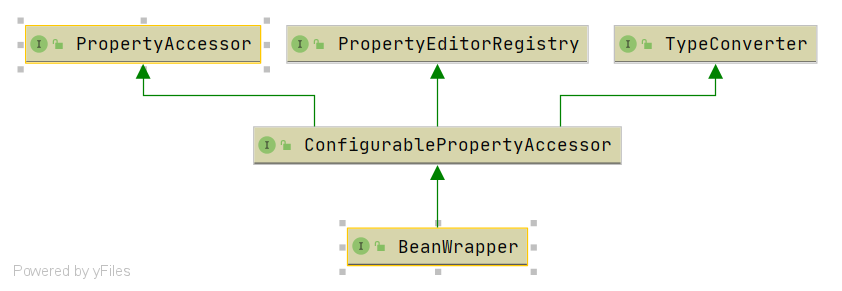

# Spring BeanWrapper 
- 类全路径: `org.springframework.beans.BeanWrapper`
- 类图


`BeanWrapper` 作为一个接口在这里仅对方法列表进行描述. 由于笔者对`BeanWrapper`的方法了解不是很透彻这里直接提出所有代码

## 方法列表

<details>
<summary>方法列表详情</summary>

```java
public interface BeanWrapper extends ConfigurablePropertyAccessor {

	/**
	 * Return the limit for array and collection auto-growing.
	 * @since 4.1
	 */
	int getAutoGrowCollectionLimit();

	/**
	 * Specify a limit for array and collection auto-growing.
	 * <p>Default is unlimited on a plain BeanWrapper.
	 * @since 4.1
	 */
	void setAutoGrowCollectionLimit(int autoGrowCollectionLimit);

	/**
	 * Return the bean instance wrapped by this object.
	 * 获取bean实例(包装过的)
	 */
	Object getWrappedInstance();

	/**
	 * Return the type of the wrapped bean instance.
	 * bean 包装后的类型
	 */
	Class<?> getWrappedClass();

	/**
	 * Obtain the PropertyDescriptors for the wrapped object
	 * (as determined by standard JavaBeans introspection).
	 * 属性描述列表
	 * @return the PropertyDescriptors for the wrapped object
	 */
	PropertyDescriptor[] getPropertyDescriptors();

	/**
	 * Obtain the property descriptor for a specific property
	 * of the wrapped object.
	 * 获取属性名称对应的属性描述对象
	 * @param propertyName the property to obtain the descriptor for
	 * (may be a nested path, but no indexed/mapped property)
	 * @return the property descriptor for the specified property
	 * @throws InvalidPropertyException if there is no such property
	 */
	PropertyDescriptor getPropertyDescriptor(String propertyName) throws InvalidPropertyException;

}
```

</details>


## 实现类分析
- [BeanWrapperImpl](./Spring-BeanWrapperImpl.md)