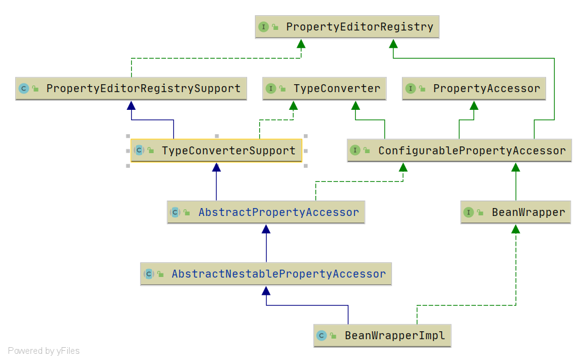

# Spring BeanWrapperImpl
- 类全路径: `org.springframework.beans.BeanWrapperImpl`
- 类图


从类图上看至少需要了解下面这些类或者接口

- [BeanWrapper](/doc/book/bean/BeanWrapper/Spring-BeanWrapper.md)
- [ConfigurablePropertyAccessor](/doc/book/bean/ConfigurablePropertyAccessor/Spring-ConfigurablePropertyAccessor.md)
- [PropertyAccessor](/doc/book/bean/PropertyAccessor/Spring-PropertyAccessor.md)
- [TypeConverter](/doc/book/core/convert/Spring-TypeConverter.md)
- [AbstractNestablePropertyAccessor](/doc/book/bean/AbstractNestablePropertyAccessor/Spring-AbstractNestablePropertyAccessor.md)
- [AbstractPropertyAccessor](/doc/book/bean/PropertyAccessor/Spring-AbstractPropertyAccessor.md)
- [TypeConverterSupport](/doc/book/core/convert/TypeConverter/Spring-TypeConverterSupport.md)
- [PropertyEditorRegistrySupport](/doc/book/bean/propertyEditor/Spring-PropertyEditorRegistrySupport.md)
- [PropertyEditorRegistry](/doc/book/bean/propertyEditor/Spring-PropertyEditorRegistry.md)


ok , 相信各位已经阅读过上面的前置知识了. 接下来就是对`BeanWrapperImpl`的分析了


## 成员变量

- `BeanWrapperImpl` 有两个成员变量这里主要关注**`CachedIntrospectionResults`**, 关于`CachedIntrospectionResults` 的分析请查看: [这篇文章](/doc/book/bean/CachedIntrospectionResults/Spring-CachedIntrospectionResults.md)


<details>
<summary>详细代码如下</summary>

```java
public class BeanWrapperImpl extends AbstractNestablePropertyAccessor implements BeanWrapper {
/**
 * Cached introspections results for this object, to prevent encountering
 * the cost of JavaBeans introspection every time.
 */
@Nullable
private CachedIntrospectionResults cachedIntrospectionResults;

/**
 * The security context used for invoking the property methods.
 */
@Nullable
private AccessControlContext acc;
}
```


</details>


## 方法分析


在`BeanWrapperImpl`中有很多`getset`方法这里就跳过不做分析. 下面对几个复杂方法进行分析


### convertForProperty

- 方法签名: `org.springframework.beans.BeanWrapperImpl#convertForProperty`
- 方法作用: 转换属性


通过 类型描述符(`PropertyDescriptor`) => 获取类型描述符(`TypeDescriptor`) => 转换

最后的转换方法签名: `org.springframework.beans.TypeConverterDelegate#convertIfNecessary(java.lang.String, java.lang.Object, java.lang.Object, java.lang.Class<T>, org.springframework.core.convert.TypeDescriptor)`


<details>
<summary>详细代码如下</summary>


```java
@Nullable
public Object convertForProperty(@Nullable Object value, String propertyName) throws TypeMismatchException {
   CachedIntrospectionResults cachedIntrospectionResults = getCachedIntrospectionResults();
   // 类型描述符
   PropertyDescriptor pd = cachedIntrospectionResults.getPropertyDescriptor(propertyName);
   if (pd == null) {
      throw new InvalidPropertyException(getRootClass(), getNestedPath() + propertyName,
            "No property '" + propertyName + "' found");
   }
   // 类型描述符
   TypeDescriptor td = cachedIntrospectionResults.getTypeDescriptor(pd);
   if (td == null) {
      td = cachedIntrospectionResults.addTypeDescriptor(pd, new TypeDescriptor(property(pd)));
   }
   return convertForProperty(propertyName, null, value, td);
}
```


</details>


### BeanPropertyHandler


- Bean属性处理对象

- 类全路径: `org.springframework.beans.BeanWrapperImpl.BeanPropertyHandler`


在这个类中主要关注两个方法

1. `getValue`
2. `setValue`


这里就是两种方法. `get` 方法 和 `set` 方法

其中 `getValue`方法本质上就是调用 `get`方法获取数据, `setValue` 方法本质上就是调用`set` 方法设置数据

Spring 这里采用反射进行操作


#### getValue

```java
@Override
@Nullable
public Object getValue() throws Exception {
   // 读取函数
   final Method readMethod = this.pd.getReadMethod();
   if (System.getSecurityManager() != null) {
      AccessController.doPrivileged((PrivilegedAction<Object>) () -> {
         ReflectionUtils.makeAccessible(readMethod);
         return null;
      });
      try {
         // 读取函数调用
         return AccessController.doPrivileged((PrivilegedExceptionAction<Object>) () ->
               readMethod.invoke(getWrappedInstance(), (Object[]) null), acc);
      }
      catch (PrivilegedActionException pae) {
         throw pae.getException();
      }
   }
   else {
      ReflectionUtils.makeAccessible(readMethod);
      // 读取函数调用
      return readMethod.invoke(getWrappedInstance(), (Object[]) null);
   }
}
```

#### setValue


```java
/**
 * 设置属性
 * @param value
 * @throws Exception
 */
@Override
public void setValue(final @Nullable Object value) throws Exception {
   final Method writeMethod = (this.pd instanceof GenericTypeAwarePropertyDescriptor ?
         ((GenericTypeAwarePropertyDescriptor) this.pd).getWriteMethodForActualAccess() :
         this.pd.getWriteMethod());
   if (System.getSecurityManager() != null) {
      AccessController.doPrivileged((PrivilegedAction<Object>) () -> {
         ReflectionUtils.makeAccessible(writeMethod);
         return null;
      });
      try {
         AccessController.doPrivileged((PrivilegedExceptionAction<Object>) () ->
               writeMethod.invoke(getWrappedInstance(), value), acc);
      }
      catch (PrivilegedActionException ex) {
         throw ex.getException();
      }
   }
   else {
      ReflectionUtils.makeAccessible(writeMethod);
      writeMethod.invoke(getWrappedInstance(), value);
   }
}
```