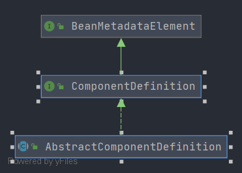

# Spring AbstractComponentDefinition
- 类全路径: `org.springframework.beans.factory.parsing.AbstractComponentDefinition`
- 类图
    
- `AbstractComponentDefinition` 没有内部属性,仅拥有方法, 接下来我们来对方法进行分析


## 方法分析
- `AbstractComponentDefinition` 的方法都比较简单,没有复杂的逻辑, 这里请各位自行阅读下面代码
```java

public abstract class AbstractComponentDefinition implements ComponentDefinition {

	/**
	 * Delegates to {@link #getName}.
	 */
	@Override
	public String getDescription() {
		return getName();
	}

	/**
	 * Returns an empty array.
	 */
	@Override
	public BeanDefinition[] getBeanDefinitions() {
		return new BeanDefinition[0];
	}

	/**
	 * Returns an empty array.
	 */
	@Override
	public BeanDefinition[] getInnerBeanDefinitions() {
		return new BeanDefinition[0];
	}

	/**
	 * Returns an empty array.
	 */
	@Override
	public BeanReference[] getBeanReferences() {
		return new BeanReference[0];
	}

	/**
	 * Delegates to {@link #getDescription}.
	 */
	@Override
	public String toString() {
		return getDescription();
	}

}
```