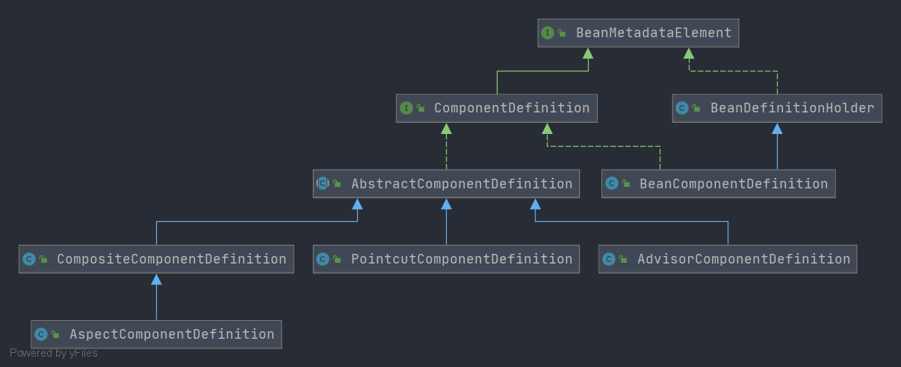

# Spring ComponentDefinition
- 类全路径: `org.springframework.beans.factory.parsing.ComponentDefinition`
- 类图:
    
- `ComponentDefinition` 是一个接口, 先对其方法进行分析在了解实现类. 


## 方法列表

```java
public interface ComponentDefinition extends BeanMetadataElement {

	/**
	 * 获取名称
	 */
	String getName();

	/**
	 * 获取描述
	 */
	String getDescription();

	/**
	 * 获取bean定义列表
	 */
	BeanDefinition[] getBeanDefinitions();

	/**
	 * 获取内部的 bean定义列表
	 */
	BeanDefinition[] getInnerBeanDefinitions();

	/**
	 * 获取关联的bean定义列表
	 */
	BeanReference[] getBeanReferences();

}
```

## 实现类分析
- [AbstractComponentDefinition](./Spring-AbstractComponentDefinition.md)
    - [CompositeComponentDefinition](./Spring-CompositeComponentDefinition.md)
        - [AspectComponentDefinition](./Spring-AspectComponentDefinition.md)
    - [PointcutComponentDefinition](./Spring-PointcutComponentDefinition.md)
    - [AdvisorComponentDefinition](./Spring-AdvisorComponentDefinition.md)
- [BeanComponentDefinition](/doc/book/bean/BeanMetadataElement/Spring-BeanComponentDefinition.md)