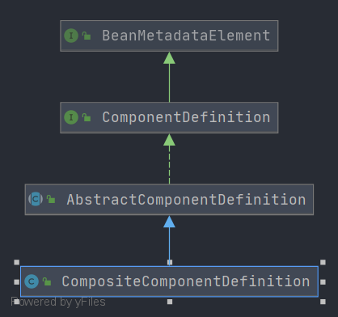

# Spring CompositeComponentDefinition
- 类全路径: `org.springframework.beans.factory.parsing.CompositeComponentDefinition`
- 类图
    
- `CompositeComponentDefinition` 继承 `AbstractComponentDefinition` 关于 `AbstractComponentDefinition`分析可以查看: [这篇文章](./Spring-AbstractComponentDefinition.md)

    `CompositeComponentDefinition` 在 `AbstractComponentDefinition` 基础上增加了下面三个字段, 其含义如下

## 成员变量

```java
	/**
	 * 名称
	 */
	private final String name;

	/**
	 * 源对象
	 */
	@Nullable
	private final Object source;

	/**
	 * 嵌套的 Comment 定义
	 */
	private final List<ComponentDefinition> nestedComponents = new ArrayList<>();

```