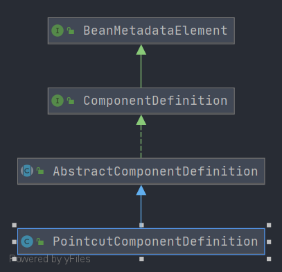

# Spring PointcutComponentDefinition
- 切点组件描述
- 类全路径: `org.springframework.aop.config.PointcutComponentDefinition`
- 类图
    
    
    
- `PointcutComponentDefinition` 继承 `AbstractComponentDefinition` 关于 `AbstractComponentDefinition`分析可以查看: [这篇文章](./Spring-AbstractComponentDefinition.md)

    `PointcutComponentDefinition` 在 `AbstractComponentDefinition` 基础上增加了下面三个字段, 其含义如下

## 成员变量

```java
	/**
	 * 切点bean名称
	 */
	private final String pointcutBeanName;

	/**
	 * 切点的bean定义
	 */
	private final BeanDefinition pointcutDefinition;

	/**
	 * 切点描述
	 */
	private final String description;

```