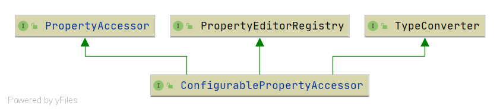

# Spring ConfigurablePropertyAccessor
- 类全路径: `org.springframework.beans.ConfigurablePropertyAccessor`


作为接口本文仅介绍方法列表, 实现类相关请查看后续文章

## 方法列表
- 这里对源码做了所有保留, 笔者不是很确认方法的作用是否描述清晰将整个代码都赋值过来了. 

```java
public interface ConfigurablePropertyAccessor extends PropertyAccessor, PropertyEditorRegistry, TypeConverter {

	/**
	 * Return the associated ConversionService, if any.
	 * 获取类型转换服务
	 */
	@Nullable
	ConversionService getConversionService();

	/**
	 * Specify a Spring 3.0 ConversionService to use for converting
	 * property values, as an alternative to JavaBeans PropertyEditors.
	 * 设置类型转换服务
	 */
	void setConversionService(@Nullable ConversionService conversionService);

	/**
	 * Return whether to extract the old property value when applying a
	 * property editor to a new value for a property.
	 * 是否需要修改老的对象数据
	 */
	boolean isExtractOldValueForEditor();

	/**
	 * Set whether to extract the old property value when applying a
	 * property editor to a new value for a property.
	 *
	 * 是否需要修改老的对象数据
	 */
	void setExtractOldValueForEditor(boolean extractOldValueForEditor);

	/**
	 * Return whether "auto-growing" of nested paths has been activated.
	 * 嵌套注入的时候是否为null的情况下是否需要创建对象
	 */
	boolean isAutoGrowNestedPaths();

	/**
	 * Set whether this instance should attempt to "auto-grow" a
	 * nested path that contains a {@code null} value.
	 * <p>If {@code true}, a {@code null} path location will be populated
	 * with a default object value and traversed instead of resulting in a
	 * {@link NullValueInNestedPathException}.
	 * <p>Default is {@code false} on a plain PropertyAccessor instance.
	 *
	 * 嵌套注入的时候是否为null的情况下是否需要创建对象
	 */
	void setAutoGrowNestedPaths(boolean autoGrowNestedPaths);

}
```