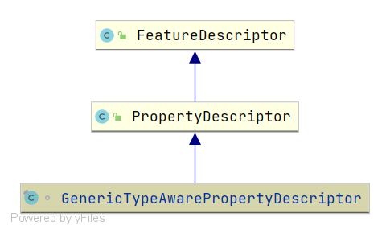

# Spring GenericTypeAwarePropertyDescriptor
- 类全路径: `org.springframework.beans.GenericTypeAwarePropertyDescriptor`


类图:




## 成员变量


先来查看成员变量信息

<details>
<summary>详细代码如下</summary>

```java
final class GenericTypeAwarePropertyDescriptor extends PropertyDescriptor {
   /**
    * 类型
    */
   private final Class<?> beanClass;

   /**
    * 可读方法
    */
   @Nullable
   private final Method readMethod;

   /**
    * 可写方法
    */
   @Nullable
   private final Method writeMethod;

   /**
    * 属性编辑器类型
    */
   private final Class<?> propertyEditorClass;

   /**
    * 可能的可写方法
    */
   @Nullable
   private volatile Set<Method> ambiguousWriteMethods;

   /**
    * 可写方法的参数
    */
   @Nullable
   private MethodParameter writeMethodParameter;

   /**
    * 属性类型
    */
   @Nullable
   private Class<?> propertyType;
}
```


</details>


## 方法列表

### 构造函数

接下来看 `GenericTypeAwarePropertyDescriptor` 的构造函数. 来进一步了解成员变量的含义和数据设置方式


首先来阅读构造函数的参数列表


```java
/**
 * 构造函数
 * @param beanClass 对象蕾西
 * @param propertyName 属性名称
 * @param readMethod 可读函数
 * @param writeMethod 可写函数
 * @param propertyEditorClass 属性编辑器类型
 * @throws IntrospectionException
 */
```


在构造函数阅读后来进行第一部分代码的阅读

<details>
<summary>第一部分代码</summary>

```java
super(propertyName, null, null);
this.beanClass = beanClass;

// 计算可读方法
Method readMethodToUse = (readMethod != null ? BridgeMethodResolver.findBridgedMethod(readMethod) : null);
// 计算可写方法
Method writeMethodToUse = (writeMethod != null ? BridgeMethodResolver.findBridgedMethod(writeMethod) : null);
if (writeMethodToUse == null && readMethodToUse != null) {
   // Fallback: Original JavaBeans introspection might not have found matching setter
   // method due to lack of bridge method resolution, in case of the getter using a
   // covariant return type whereas the setter is defined for the concrete property type.
   // 获取方法
   // 获取set 方法
   Method candidate = ClassUtils.getMethodIfAvailable(
         this.beanClass, "set" + StringUtils.capitalize(getName()), (Class<?>[]) null);
   if (candidate != null && candidate.getParameterCount() == 1) {
      writeMethodToUse = candidate;
   }
}
```

</details>


第一部分代码先调用了父类的构造函数, 在这之后通过 `Method` 的 `isBridge` 方法来球的 `Method` 为后续进行使用. 

后续的第一个使用就是来获取 `set`方法 (变量:`candidate`)


阅读第二部分代码


<details>
<summary>第二部分代码如下</summary>

```java
if (this.writeMethod != null) {
   if (this.readMethod == null) {
      // Write method not matched against read method: potentially ambiguous through
      // several overloaded variants, in which case an arbitrary winner has been chosen
      // by the JDK's JavaBeans Introspector...
      Set<Method> ambiguousCandidates = new HashSet<>();
      // 方法推测 , 满足下面要求的就可能是 可写方法
      for (Method method : beanClass.getMethods()) {
         if (method.getName().equals(writeMethodToUse.getName()) &&
               !method.equals(writeMethodToUse) && !method.isBridge() &&
               method.getParameterCount() == writeMethodToUse.getParameterCount()) {
            ambiguousCandidates.add(method);
         }
      }
      if (!ambiguousCandidates.isEmpty()) {
         // 赋值
         this.ambiguousWriteMethods = ambiguousCandidates;
      }
   }
   // 构造可写函数的参数对象
   this.writeMethodParameter = new MethodParameter(this.writeMethod, 0).withContainingClass(this.beanClass);
}
```

</details>


第二部分代码是进行一个方法的推测. 判断是否是可写方法. 判断逻辑如下

1. `method.getName().equals(writeMethodToUse.getName())`
2. `!method.equals(writeMethodToUse)`
3. `!method.isBridge()`
4. `method.getParameterCount() == writeMethodToUse.getParameterCount()`


在这之后进行了`MethodParameter`对象的创建


接下来就是方法的最后一部分了

<details>
<summary>第三部分代码如下</summary>

```java
if (this.readMethod != null) {
   // 属性类型的计算
   // 计算方式: 通过 class 中寻找 method , 将 找到的 method 的返回值作为结果
   this.propertyType = GenericTypeResolver.resolveReturnType(this.readMethod, this.beanClass);
}
else if (this.writeMethodParameter != null) {
   // 获取参数类型
   this.propertyType = this.writeMethodParameter.getParameterType();
}

// 属性编辑器类型赋值
this.propertyEditorClass = propertyEditorClass;
```


</details>


第三部分做的事情是对最后几个属性的赋值

在这里额外调用了下面👇这个方法

```java
GenericTypeResolver.resolveReturnType
```


这个方法简单描述就是通过 `Class` + `Method` 来确认属性的类型. 

即 `Method` 中的 `return` 类型


构造函数逐段分析完成. 下面是整个构造函数的详细代码


<details>
<summary>详细代码如下</summary>


```java
/**
 * 构造函数
 * @param beanClass 对象蕾西
 * @param propertyName 属性名称
 * @param readMethod 可读函数
 * @param writeMethod 可写函数
 * @param propertyEditorClass 属性编辑器类型
 * @throws IntrospectionException
 */
public GenericTypeAwarePropertyDescriptor(Class<?> beanClass, String propertyName,
      @Nullable Method readMethod, @Nullable Method writeMethod, Class<?> propertyEditorClass)
      throws IntrospectionException {

   super(propertyName, null, null);
   this.beanClass = beanClass;

   // 计算可读方法
   Method readMethodToUse = (readMethod != null ? BridgeMethodResolver.findBridgedMethod(readMethod) : null);
   // 计算可写方法
   Method writeMethodToUse = (writeMethod != null ? BridgeMethodResolver.findBridgedMethod(writeMethod) : null);
   if (writeMethodToUse == null && readMethodToUse != null) {
      // Fallback: Original JavaBeans introspection might not have found matching setter
      // method due to lack of bridge method resolution, in case of the getter using a
      // covariant return type whereas the setter is defined for the concrete property type.
      // 获取方法
      // 获取set 方法
      Method candidate = ClassUtils.getMethodIfAvailable(
            this.beanClass, "set" + StringUtils.capitalize(getName()), (Class<?>[]) null);
      if (candidate != null && candidate.getParameterCount() == 1) {
         writeMethodToUse = candidate;
      }
   }
   this.readMethod = readMethodToUse;
   this.writeMethod = writeMethodToUse;

   if (this.writeMethod != null) {
      if (this.readMethod == null) {
         // Write method not matched against read method: potentially ambiguous through
         // several overloaded variants, in which case an arbitrary winner has been chosen
         // by the JDK's JavaBeans Introspector...
         Set<Method> ambiguousCandidates = new HashSet<>();
         // 方法推测 , 满足下面要求的就可能是 可写方法
         for (Method method : beanClass.getMethods()) {
            if (method.getName().equals(writeMethodToUse.getName()) &&
                  !method.equals(writeMethodToUse) && !method.isBridge() &&
                  method.getParameterCount() == writeMethodToUse.getParameterCount()) {
               ambiguousCandidates.add(method);
            }
         }
         if (!ambiguousCandidates.isEmpty()) {
            // 赋值
            this.ambiguousWriteMethods = ambiguousCandidates;
         }
      }
      // 构造可写函数的参数对象
      this.writeMethodParameter = new MethodParameter(this.writeMethod, 0).withContainingClass(this.beanClass);
   }

   if (this.readMethod != null) {
      // 属性类型的计算
      // 计算方式: 通过 class 中寻找 method , 将 找到的 method 的返回值作为结果
      this.propertyType = GenericTypeResolver.resolveReturnType(this.readMethod, this.beanClass);
   }
   else if (this.writeMethodParameter != null) {
      // 获取参数类型
      this.propertyType = this.writeMethodParameter.getParameterType();
   }

   // 属性编辑器类型赋值
   this.propertyEditorClass = propertyEditorClass;
}
```

</details>


