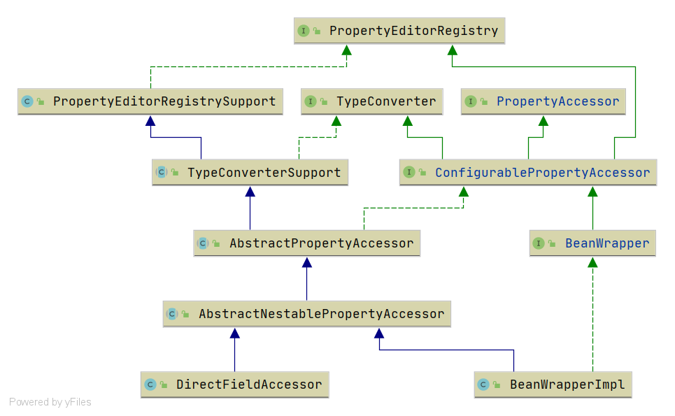

# Spring PropertyAccessor
- 类全路径: `org.springframework.beans.PropertyAccessor`

- 类图: 

  

- `PropertyAccessor` 作用是属性相关的操作. 在接口中定义了下面这些常量. 

## 成员变量
- 下面是成员变量的信息. 详细查看下面代码, 这里没有做出一个很好的译著. 

<details>
<summary>成员变量详情</summary>

```java
public interface PropertyAccessor {
	/**
	 * Path separator for nested properties.
	 * Follows normal Java conventions: getFoo().getBar() would be "foo.bar".
	 * 嵌套属性的分隔符
	 */
	String NESTED_PROPERTY_SEPARATOR = ".";

	/**
	 * Path separator for nested properties.
	 * 嵌套属性的分隔符
	 * Follows normal Java conventions: getFoo().getBar() would be "foo.bar".
	 */
	char NESTED_PROPERTY_SEPARATOR_CHAR = '.';

	/**
	 * Marker that indicates the start of a property key for an
	 * indexed or mapped property like "person.addresses[0]".
	 */
	String PROPERTY_KEY_PREFIX = "[";

	/**
	 * Marker that indicates the start of a property key for an
	 * indexed or mapped property like "person.addresses[0]".
	 */
	char PROPERTY_KEY_PREFIX_CHAR = '[';

	/**
	 * Marker that indicates the end of a property key for an
	 * indexed or mapped property like "person.addresses[0]".
	 */
	String PROPERTY_KEY_SUFFIX = "]";

	/**
	 * Marker that indicates the end of a property key for an
	 * indexed or mapped property like "person.addresses[0]".
	 */
	char PROPERTY_KEY_SUFFIX_CHAR = ']';
}
```

</details>

## 方法列表
- 下面介绍方法列表

<details>
<summary>方法列表</summary>

```java
public interface PropertyAccessor {

	/**
	 * <p>Returns {@code false} if the property doesn't exist.
	 * 该属性是否可读
	 */
	boolean isReadableProperty(String propertyName);

	/**
	 * 该属性是否可写
	 */
	boolean isWritableProperty(String propertyName);

	/**
	 * 获取属性名称的类型
	 */
	@Nullable
	Class<?> getPropertyType(String propertyName) throws BeansException;

	/**
	 * 获取属性的类型描述
	 */
	@Nullable
	TypeDescriptor getPropertyTypeDescriptor(String propertyName) throws BeansException;

	/**
	 * 获取属性值
	 */
	@Nullable
	Object getPropertyValue(String propertyName) throws BeansException;

	/**
	 * 设置属性值
	 */
	void setPropertyValue(String propertyName, @Nullable Object value) throws BeansException;

	/**
	 * 设置PropertyValue对象
	 */
	void setPropertyValue(PropertyValue pv) throws BeansException;

	/**
	 * 设置属性
	 */
	void setPropertyValues(Map<?, ?> map) throws BeansException;

	/**
	 *
	 * 设置多个属性
	 */
	void setPropertyValues(PropertyValues pvs) throws BeansException;

	/**
	 * 设置多个属性
	 */
	void setPropertyValues(PropertyValues pvs, boolean ignoreUnknown)
			throws BeansException;

	/**
	 * 设置多个属性
	 */
	void setPropertyValues(PropertyValues pvs, boolean ignoreUnknown, boolean ignoreInvalid)
			throws BeansException;
}
```

</details>
