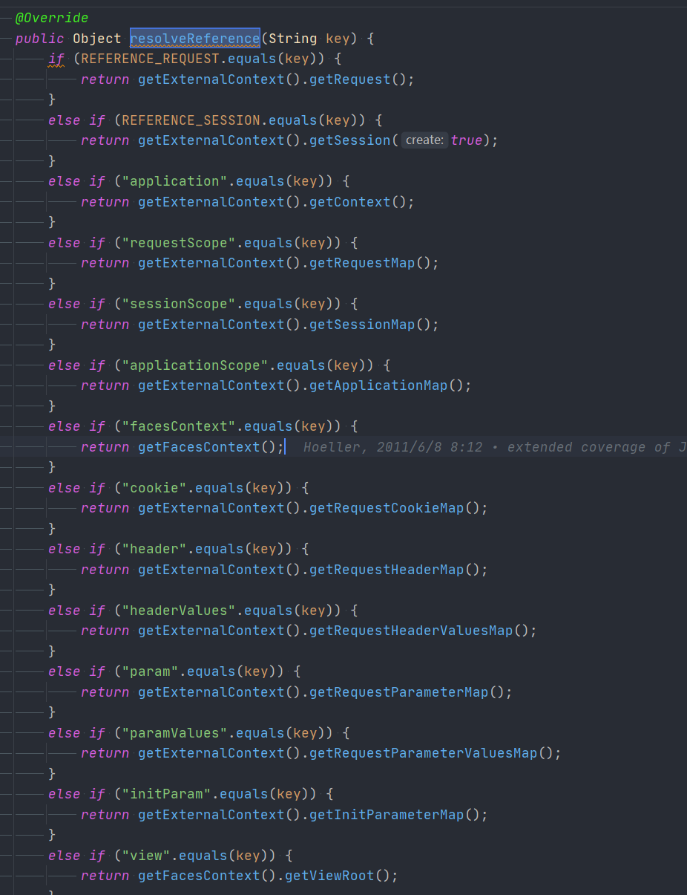

# Spring AbstractRequestAttributesScope
- 类全路径: `org.springframework.web.context.request.AbstractRequestAttributesScope`


## 方法分析


### get

- 逻辑
  - 获取当前 `RequestAttributes` , 从 `RequestAttributes ` 通过 name 获取属性实例
    - 属性实例不存在
      - 通过 object Factory 创建
      - 放入 `RequestAttributes `


```java
@Override
public Object get(String name, ObjectFactory<?> objectFactory) {
   // 获取当前 request 的属性对象
   RequestAttributes attributes = RequestContextHolder.currentRequestAttributes();
   // 属性对象中获取 name 对应的属性实例
   Object scopedObject = attributes.getAttribute(name, getScope());
   if (scopedObject == null) {
      // object factory 创建
      scopedObject = objectFactory.getObject();
      // 设置到 request attributes 中
      attributes.setAttribute(name, scopedObject, getScope());
      // Retrieve object again, registering it for implicit session attribute updates.
      // As a bonus, we also allow for potential decoration at the getAttribute level.

      // 再一次获取
      Object retrievedObject = attributes.getAttribute(name, getScope());
      if (retrievedObject != null) {
         // Only proceed with retrieved object if still present (the expected case).
         // If it disappeared concurrently, we return our locally created instance.
         scopedObject = retrievedObject;
      }
   }
   return scopedObject;
}
```


- 在设置`Attribute`的时候需要调用 `getScope` 接下来了解其作用

### getScope

- 获取作用域标记

- 抽象方法

```java
protected abstract int getScope();
```


返回的会有下列两种

1. request
2. session

```
RequestAttributes#SCOPE_REQUEST
RequestAttributes#SCOPE_SESSION
```


### remove

- 删除属性实例


```java
@Override
@Nullable
public Object remove(String name) {
   // 获取当前 request attributes 对象
   RequestAttributes attributes = RequestContextHolder.currentRequestAttributes();
   // 通过 name + 作用域 获取 属性实例
   Object scopedObject = attributes.getAttribute(name, getScope());
   if (scopedObject != null) {
      // 删除属性实例
      attributes.removeAttribute(name, getScope());
      return scopedObject;
   }
   else {
      return null;
   }
}
```


### registerDestructionCallback

- 注册摧毁回调方法

```java
@Override
public void registerDestructionCallback(String name, Runnable callback) {
   RequestAttributes attributes = RequestContextHolder.currentRequestAttributes();
   attributes.registerDestructionCallback(name, callback, getScope());
}
```


### resolveContextualObject

- 在这个类中返回的是一个Object 其可能性如下

1. 通过`org.springframework.web.context.request.ServletRequestAttributes#resolveReference`返回

   1. `HttpServletRequest`
   2. `HttpSession`

2. 通过`org.springframework.web.context.request.FacesRequestAttributes#resolveReference`返回

   这里内容很多直接贴代码截图了

   


```java
@Override
@Nullable
public Object resolveContextualObject(String key) {
   RequestAttributes attributes = RequestContextHolder.currentRequestAttributes();
   return attributes.resolveReference(key);
}
```


## 子类

- `AbstractRequestAttributesScope` 拥有两个子类
  1. `org.springframework.web.context.request.RequestScope`
  2. `org.springframework.web.context.request.SessionScope`


### RequestScope

- 重写两个方法`getScope` 和 `getConversationId`

```JAVA
public class RequestScope extends AbstractRequestAttributesScope {

   @Override
   protected int getScope() {
      return RequestAttributes.SCOPE_REQUEST;
   }

   /**
    * There is no conversation id concept for a request, so this method
    * returns {@code null}.
    */
   @Override
   @Nullable
   public String getConversationId() {
      return null;
   }

}
```


### SessionScope


```JAVA
public class SessionScope extends AbstractRequestAttributesScope {

   @Override
   protected int getScope() {
      return RequestAttributes.SCOPE_SESSION;
   }

   @Override
   public String getConversationId() {
      return RequestContextHolder.currentRequestAttributes().getSessionId();
   }

   @Override
   public Object get(String name, ObjectFactory<?> objectFactory) {
      Object mutex = RequestContextHolder.currentRequestAttributes().getSessionMutex();
      synchronized (mutex) {
         return super.get(name, objectFactory);
      }
   }

   @Override
   @Nullable
   public Object remove(String name) {
      Object mutex = RequestContextHolder.currentRequestAttributes().getSessionMutex();
      synchronized (mutex) {
         return super.remove(name);
      }
   }

}
```