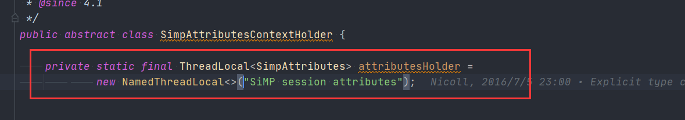
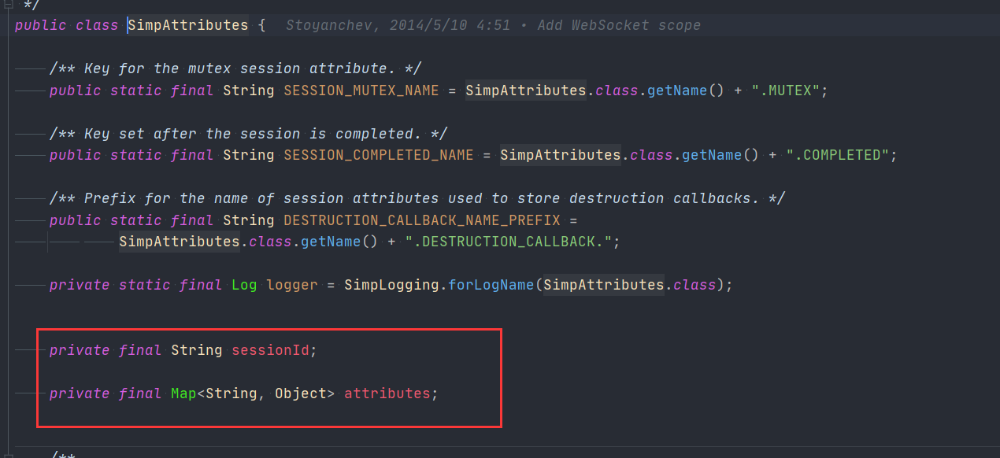

# Spring SimpSessionScope

- 类全路径: `org.springframework.messaging.simp.SimpSessionScope`


`SimpSessionScope` 没有成员变量	

其操作对象是通过 `SimpAttributesContextHolder` 获取的得到的`SimpAttributes`


这里简单描述一下 `SimpAttributesContextHolder` 和 `SimpAttributes`

`SimpAttributesContextHolder` 中存放了一个 `ThreadLocal` 存储`SimpAttributes`




`SimpAttributes`使用到的字段如下




在了解上述内容后进行方法分析


## 方法分析

### get

- 通过`SimpAttributesContextHolder` 虎丘属性表
  - 从属性表中获取 name 对应的实体
    - 不存在 通过object factory 创建
      - 放入属性表


```java
@Override
public Object get(String name, ObjectFactory<?> objectFactory) {
   // 获取当前的属性
   SimpAttributes simpAttributes = SimpAttributesContextHolder.currentAttributes();
   // 从属性表中获取对象
   Object scopedObject = simpAttributes.getAttribute(name);
   if (scopedObject != null) {
      return scopedObject;
   }
   // 处理线程问题
   synchronized (simpAttributes.getSessionMutex()) {
      // 从属性表中获取对象
      scopedObject = simpAttributes.getAttribute(name);
      if (scopedObject == null) {
         // 通过 object factory 创建
         scopedObject = objectFactory.getObject();
         // 设置属性
         simpAttributes.setAttribute(name, scopedObject);
      }
      return scopedObject;
   }
}
```


### remove

- 删除属性

对点给钱的 `SimpAttributes` 删除name对应的实体 和 摧毁时调用的回调方法

```java
@Override
@Nullable
public Object remove(String name) {
   SimpAttributes simpAttributes = SimpAttributesContextHolder.currentAttributes();
   synchronized (simpAttributes.getSessionMutex()) {
      Object value = simpAttributes.getAttribute(name);
      if (value != null) {
         simpAttributes.removeAttribute(name);
         return value;
      }
      else {
         return null;
      }
   }
}
```


### registerDestructionCallback

- 摧毁时的回调方法注册


调用`SimpAttributes` 进行注册

key: `SimpAttributes.class.getName() + ".DESTRUCTION_CALLBACK."` + name

value : Runnable

```java
@Override
public void registerDestructionCallback(String name, Runnable callback) {
   SimpAttributesContextHolder.currentAttributes().registerDestructionCallback(name, callback);
}


// org.springframework.messaging.simp.SimpAttributes#registerDestructionCallback
	public void registerDestructionCallback(String name, Runnable callback) {
		synchronized (getSessionMutex()) {
			if (isSessionCompleted()) {
				throw new IllegalStateException("Session id=" + getSessionId() + " already completed");
			}
			this.attributes.put(DESTRUCTION_CALLBACK_NAME_PREFIX + name, callback);
		}
	}

```


### getConversationId

- `SimpAttributes` 的`SessionId`

```java
@Override
public String getConversationId() {
   return SimpAttributesContextHolder.currentAttributes().getSessionId();
}
```