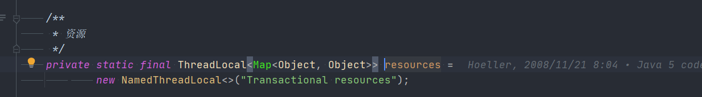

# Spring SimpleTransactionScope
- 类全路径: `org.springframework.transaction.support.SimpleTransactionScope`


在介绍方法之前先了解一些相关类


## ScopedObjectsHolder

- 用于帮助的一个类.
  - 存储
    - name -> obejct instance
    - name -> 回调方法

```java
/**
 * Holder for scoped objects.
 *
 * 作用域对象持有
 */
static class ScopedObjectsHolder {

   /**
    * 作用域实例
    */
   final Map<String, Object> scopedInstances = new HashMap<>();

   /**
    * 摧毁回调map
    */
   final Map<String, Runnable> destructionCallbacks = new LinkedHashMap<>();
}
```


## CleanupSynchronization

- 这里需要了解对象 ： `TransactionSynchronizationManager` 暂时不做了解

  这里暂时了解到

  内部还是一个map

  其中解绑`unbindResource`和绑定`bindResource` 都是对上述内部变量做操作.


了解上述方法后来看看整个类做了什么

```java
/**
 * 事务相关方法
 */
private class CleanupSynchronization extends TransactionSynchronizationAdapter {

   /**
    * 作用域对象持有
    */
   private final ScopedObjectsHolder scopedObjects;

   public CleanupSynchronization(ScopedObjectsHolder scopedObjects) {
      this.scopedObjects = scopedObjects;
   }

   @Override
   public void suspend() {
      // 解绑
      TransactionSynchronizationManager.unbindResource(SimpleTransactionScope.this);
   }

   @Override
   public void resume() {
      // 绑定
      TransactionSynchronizationManager.bindResource(SimpleTransactionScope.this, this.scopedObjects);
   }

   /**
    * 事务完成后需要执行的内容
    * @param status
    */
   @Override
   public void afterCompletion(int status) {
      // 解绑
      TransactionSynchronizationManager.unbindResourceIfPossible(SimpleTransactionScope.this);
      // 执行素有的回调方法
      for (Runnable callback : this.scopedObjects.destructionCallbacks.values()) {
         callback.run();
      }
      // 数据容器清除
      this.scopedObjects.destructionCallbacks.clear();
      this.scopedObjects.scopedInstances.clear();
   }
}
```


## 方法分析

### get


```java
@Override
public Object get(String name, ObjectFactory<?> objectFactory) {
   // 事务管理器中获取 作用域对象容器
   ScopedObjectsHolder scopedObjects = (ScopedObjectsHolder) TransactionSynchronizationManager.getResource(this);
   if (scopedObjects == null) {
      scopedObjects = new ScopedObjectsHolder();

      // 设置空的作用域对象
      TransactionSynchronizationManager.registerSynchronization(new CleanupSynchronization(scopedObjects));
      // 绑定当前对象和 作用域对象容器
      TransactionSynchronizationManager.bindResource(this, scopedObjects);
   }
   // 获取作用域对象的map容器
   Object scopedObject = scopedObjects.scopedInstances.get(name);
   if (scopedObject == null) {
      // 从 object factory 创建
      scopedObject = objectFactory.getObject();
      // 获取作用域对象的map容器, 向里面插入数据
      scopedObjects.scopedInstances.put(name, scopedObject);
   }
   return scopedObject;
}
```


- 在前文我们已经了解到 `TransactionSynchronizationManager`存储的是一个MAP . 

  在这段代码中我们可以具象化存储内容

  key: SimpleTransactionScope

  value: ScopedObjectsHolder


get 方法本质上是两个map的嵌套

第一层是 `TransactionSynchronizationManager` 的 `resource` map

第二层是 `ScopedObjectsHolder` 的 `scopedInstances` map


### remove

- 删除实例和回调方法

```java
@Override
@Nullable
public Object remove(String name) {
   // 事务管理器中获取 作用域对象容器
   ScopedObjectsHolder scopedObjects = (ScopedObjectsHolder) TransactionSynchronizationManager.getResource(this);
   if (scopedObjects != null) {
      // 摧毁回调容器删除 name 
      scopedObjects.destructionCallbacks.remove(name);
      // 实例容器删除 name 
      return scopedObjects.scopedInstances.remove(name);
   }
   else {
      return null;
   }
}
```


第一步和 `get` 方法相同获取`ScopedObjectsHolder`

第二步删除 `ScopedObjectsHolder` 中摧毁时的回调容器中 name 对应的回调方法

删除实例容器中 name 对应的实例


### registerDestructionCallback

- 注册 摧毁回调方法

```java
@Override
public void registerDestructionCallback(String name, Runnable callback) {
   ScopedObjectsHolder scopedObjects = (ScopedObjectsHolder) TransactionSynchronizationManager.getResource(this);
   if (scopedObjects != null) {
      scopedObjects.destructionCallbacks.put(name, callback);
   }
}
```


### getConversationId

- 获取当前事务名称


```
@Override
@Nullable
public String getConversationId() {
   return TransactionSynchronizationManager.getCurrentTransactionName();
}
```