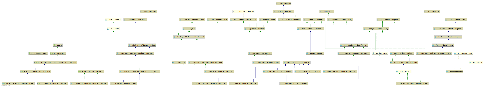

# Spring BeanFactory
- 类全路径: `org.springframework.beans.factory.BeanFactory`
- 类图
    
- Spring 中 BeanFactory 承担着 bean 创建的重要任务 , 下面对方法列表进行说明


## 方法列表

```java
public interface BeanFactory {

	/**
	 * 工厂bean前缀区分作用.
	 */
	String FACTORY_BEAN_PREFIX = "&";


	/**
	 * 获取一个bean
	 */
	Object getBean(String name) throws BeansException;

	/**
	 */
	<T> T getBean(String name, Class<T> requiredType) throws BeansException;

	/**
     * 获取一个bean
     */
	Object getBean(String name, Object... args) throws BeansException;

	/**
     * 获取一个bean
	 */
	<T> T getBean(Class<T> requiredType) throws BeansException;

	/**
     * 获取一个bean
	 */
	<T> T getBean(Class<T> requiredType, Object... args) throws BeansException;

	/**
	 * 延迟加载 bean
	 */
	<T> ObjectProvider<T> getBeanProvider(Class<T> requiredType);

	/**
	 * 延迟加载 bean
	 */
	<T> ObjectProvider<T> getBeanProvider(ResolvableType requiredType);

	/**
	 * 是否存在bean
	 */
	boolean containsBean(String name);

	/**
	 * 是否单例bean
	 */
	boolean isSingleton(String name) throws NoSuchBeanDefinitionException;

	/**
	 * 是否多例bean
	 */
	boolean isPrototype(String name) throws NoSuchBeanDefinitionException;

	/**
	 * 类型是否匹配
	 */
	boolean isTypeMatch(String name, ResolvableType typeToMatch) throws NoSuchBeanDefinitionException;

	/**
	 */
	boolean isTypeMatch(String name, Class<?> typeToMatch) throws NoSuchBeanDefinitionException;

	/**
	 * 通过 bean name 获取bean type
	 */
	@Nullable
	Class<?> getType(String name) throws NoSuchBeanDefinitionException;

	/**
     * 获取类型
	 */
	@Nullable
	Class<?> getType(String name, boolean allowFactoryBeanInit) throws NoSuchBeanDefinitionException;

	/**
	 * 获取别名列表
	 */
	String[] getAliases(String name);

}
```


## 内部变量
- 在 `BeanFactory` 中有一个变量: `FACTORY_BEAN_PREFIX`. 用作区分是否是工厂bean. 通常在 bean name 的最前面会有. 

```java
	String FACTORY_BEAN_PREFIX = "&";

```


## 接口及实现类分析


- 在 Spring 中 BeanFactory 是一个相当大的一个接口, 其子类,子接口相当多. 需要一步一步了解. 相关子类分析可查看下面这些文档


- [HierarchicalBeanFactory](/doc/book/bean/factory/BeanFactory/Spring-HierarchicalBeanFactory.md)
    - [ConfigurableBeanFactory](/doc/book/bean/factory/BeanFactory/Spring-ConfigurableBeanFactory.md)
        - [AbstractBeanFactory](/doc/book/bean/factory/Spring-AbstractBeanFactory.md)
            - [AbstractAutowireCapableBeanFactory](/doc/book/bean/factory/Spring-AbstractAutowireCapableBeanFactory.md)
                - [DefaultListableBeanFactory](/doc/book/bean/factory/Spring-DefaultListableBeanFactory.md)
                    - [XmlBeanFactory](/doc/book/bean/factory/Spring-XmlBeanFactory.md)
        - [ConfigurableListableBeanFactory](./Spring-ConfigurableListableBeanFactory.md)
            - [DefaultListableBeanFactory](/doc/book/bean/factory/Spring-DefaultListableBeanFactory.md)
                - [XmlBeanFactory](/doc/book/bean/factory/Spring-XmlBeanFactory.md)
    - [ApplicationContext](/doc/book/context/ApplicationContext/Spring-ApplicationContext.md)
        - [ConfigurableApplicationContext](/doc/book/context/ApplicationContext/Spring-ConfigurableApplicationContext.md)
            - [AbstractApplicationContext](/doc/book/context/ApplicationContext/Spring-AbstractApplicationContext.md)
                - [AbstractRefreshableApplicationContext](/doc/book/context/support/Spring-AbstractRefreshableApplicationContext.md)
                    - [AbstractRefreshableConfigApplicationContext](/doc/book/context/support/Spring-AbstractRefreshableConfigApplicationContext.md)
                        - [AbstractXmlApplicationContext](/doc/book/context/support/Spring-AbstractXmlApplicationContext.md)
                            - [FileSystemXmlApplicationContext](/doc/book/context/support/Spring-FileSystemXmlApplicationContext.md)
                            - [ClassPathXmlApplicationContext](/doc/book/context/support/Spring-ClassPathXmlApplicationContext.md)
                        - AbstractRefreshableWebApplicationContext
                            - XmlWebApplicationContext
                            - GroovyWebApplicationContext
                            - AnnotationConfigWebApplicationContext
                        
            - ConfigurableWebApplicationContext
                - GenericWebApplicationContext
                - StaticWebApplicationContext
                - AbstractRefreshableWebApplicationContext
                    - XmlWebApplicationContext
                    - GroovyWebApplicationContext
                    - AnnotationConfigWebApplicationContext
        - WebApplicationContext
            - StubWebApplicationContext
            - ConfigurableWebApplicationContext
                - GenericWebApplicationContext
                - StaticWebApplicationContext
                - AbstractRefreshableWebApplicationContext
                    - XmlWebApplicationContext
                    - GroovyWebApplicationContext
                    - AnnotationConfigWebApplicationContext
- SimpleJndiBeanFactory
- AutowireCapableBeanFactory
    - ConfigurableListableBeanFactory
        - [DefaultListableBeanFactory](/doc/book/bean/factory/Spring-DefaultListableBeanFactory.md)
            - [XmlBeanFactory](/doc/book/bean/factory/Spring-XmlBeanFactory.md)
    - [AbstractAutowireCapableBeanFactory](/doc/book/bean/factory/Spring-AbstractAutowireCapableBeanFactory.md)
        - [DefaultListableBeanFactory](/doc/book/bean/factory/Spring-DefaultListableBeanFactory.md)
            - [XmlBeanFactory](/doc/book/bean/factory/Spring-XmlBeanFactory.md)
    - StubBeanFactory     
- ListableBeanFactory
    - ApplicationContext
    - StaticListableBeanFactory
    - ConfigurableListableBeanFactory
        - [AbstractApplicationContext](/doc/book/context/ApplicationContext/Spring-AbstractApplicationContext.md)
            - [AbstractRefreshableApplicationContext](/doc/book/context/support/Spring-AbstractRefreshableApplicationContext.md)
                - [AbstractRefreshableConfigApplicationContext](/doc/book/context/support/Spring-AbstractRefreshableConfigApplicationContext.md)
                    - [AbstractXmlApplicationContext](/doc/book/context/support/Spring-AbstractXmlApplicationContext.md)
                        - [FileSystemXmlApplicationContext](/doc/book/context/support/Spring-FileSystemXmlApplicationContext.md)
                        - [ClassPathXmlApplicationContext](/doc/book/context/support/Spring-ClassPathXmlApplicationContext.md)
                    - AbstractRefreshableWebApplicationContext
                        - XmlWebApplicationContext
                        - GroovyWebApplicationContext
                        - AnnotationConfigWebApplicationContext
                    
        - ConfigurableWebApplicationContext
            - GenericWebApplicationContext
            - StaticWebApplicationContext
            - AbstractRefreshableWebApplicationContext
                - XmlWebApplicationContext
                - GroovyWebApplicationContext
                - AnnotationConfigWebApplicationContext

    - WebApplicationContext
        - StubWebApplicationContext
        - ConfigurableWebApplicationContext
            - GenericWebApplicationContext
            - StaticWebApplicationContext
            - AbstractRefreshableWebApplicationContext
                - XmlWebApplicationContext
                - GroovyWebApplicationContext
                - AnnotationConfigWebApplicationContext
    - StaticListableBeanFactory
        - StubBeanFactory
    - ConfigurableListableBeanFactory