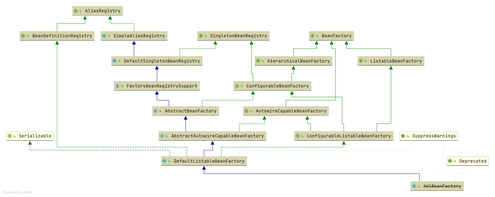

# Spring ConfigurableBeanFactory
- 类全路径: `org.springframework.beans.factory.config.ConfigurableBeanFactory`

- `ConfigurableBeanFactory` 用来**配置bean工厂**

- 类图

  


- `ConfigurableBeanFactory` 是一个接口, 在这里仅了解其方法作用. 不做详细实现的分析. 


## 方法列表

- 方法详细请看下面代码. 


```java
public interface ConfigurableBeanFactory extends HierarchicalBeanFactory, SingletonBeanRegistry {

	/**
	 * 作用域: 单例
	 */
	String SCOPE_SINGLETON = "singleton";

	/**
	 * 作用域: 原型模式
	 */
	String SCOPE_PROTOTYPE = "prototype";


	/**
	 * 设置父bean工厂
	 */
	void setParentBeanFactory(BeanFactory parentBeanFactory) throws IllegalStateException;

	/**
	 * 获取bean类加载器
	 */
	@Nullable
	ClassLoader getBeanClassLoader();

	/**
	 * 设置bean类加载器
	 */
	void setBeanClassLoader(@Nullable ClassLoader beanClassLoader);

	/**
	 * 获取临时类加载器
	 */
	@Nullable
	ClassLoader getTempClassLoader();

	/**
	 * 设置临时类加载器
	 */
	void setTempClassLoader(@Nullable ClassLoader tempClassLoader);

	/**
	 * 是否缓存bean元信息
	 */
	boolean isCacheBeanMetadata();

	/**
	 * 设置是否需要缓存bean元信息
	 */
	void setCacheBeanMetadata(boolean cacheBeanMetadata);

	/**
	 * 获取 EL 表达式解析器
	 */
	@Nullable
	BeanExpressionResolver getBeanExpressionResolver();

	/**
	 * 设置 EL 表达式解析器
	 */
	void setBeanExpressionResolver(@Nullable BeanExpressionResolver resolver);

	/**
	 * 获取转换服务
	 */
	@Nullable
	ConversionService getConversionService();

	/**
	 * 设置转换服务
	 */
	void setConversionService(@Nullable ConversionService conversionService);

	/**
	 * 添加属性编辑器注册工具
	 */
	void addPropertyEditorRegistrar(PropertyEditorRegistrar registrar);

	/**
	 * 注册自定义属性编辑器
	 */
	void registerCustomEditor(Class<?> requiredType, Class<? extends PropertyEditor> propertyEditorClass);

	/**
	 * 属性编辑器复制, 使用已在此BeanFactory中注册的自定义编辑器来初始化给定的PropertyEditorRegistry。
	 */
	void copyRegisteredEditorsTo(PropertyEditorRegistry registry);

	/**
	 * 获取类型转换接口
	 */
	TypeConverter getTypeConverter();

	/**
	 * 设置类型转换接口
	 */
	void setTypeConverter(TypeConverter typeConverter);

	/**
	 * 添加 字符串解析工具
	 */
	void addEmbeddedValueResolver(StringValueResolver valueResolver);

	/**
	 * 是否存在值解析器
	 */
	boolean hasEmbeddedValueResolver();

	/**
	 * 进行值解析
	 */
	@Nullable
	String resolveEmbeddedValue(String value);

	/**
	 * 添加 bean 后置处理器
	 */
	void addBeanPostProcessor(BeanPostProcessor beanPostProcessor);

	/**
	 * 获取 bean 后置处理器的数量
	 */
	int getBeanPostProcessorCount();

	/**
	 * scope 注册
	 */
	void registerScope(String scopeName, Scope scope);

	/**
	 * 获取注册的 scope name
	 */
	String[] getRegisteredScopeNames();

	/**
	 * 获取 scope 接口对象
	 */
	@Nullable
	Scope getRegisteredScope(String scopeName);

	/**
	 * 安全上下文
	 */
	AccessControlContext getAccessControlContext();

	/**
	 * bean 工厂的配置信息复制
	 */
	void copyConfigurationFrom(ConfigurableBeanFactory otherFactory);

	/**
	 * 别名注册
	 */
	void registerAlias(String beanName, String alias) throws BeanDefinitionStoreException;

	/**
	 * 别名解析
	 */
	void resolveAliases(StringValueResolver valueResolver);

	/**
	 * 获取合并的bean定义. 自己+父类
	 */
	BeanDefinition getMergedBeanDefinition(String beanName) throws NoSuchBeanDefinitionException;

	/**
	 * 是否是 工厂bean
	 */
	boolean isFactoryBean(String name) throws NoSuchBeanDefinitionException;

	/**
	 * 设置 bean 是否正在被创建
	 */
	void setCurrentlyInCreation(String beanName, boolean inCreation);

	/**
	 * 判断 bean 是否正在被创建
	 */
	boolean isCurrentlyInCreation(String beanName);

	/**
	 * 注册依赖的bean
	 */
	void registerDependentBean(String beanName, String dependentBeanName);

	/**
	 * 获取依赖的bean
	 */
	String[] getDependentBeans(String beanName);

	/**
	 * 获取依赖的bean
	 */
	String[] getDependenciesForBean(String beanName);

	/**
	 * 摧毁 bean
	 */
	void destroyBean(String beanName, Object beanInstance);

	/**
	 * 摧毁bean,带有作用域的
	 */
	void destroyScopedBean(String beanName);

	/**
	 * 摧毁单例 bean
	 */
	void destroySingletons();

}
```

