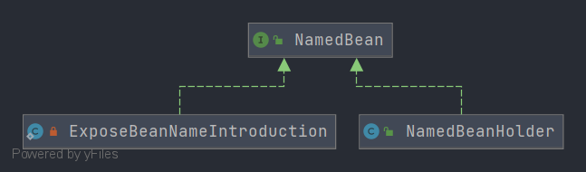

# Spring NamedBean
- 类全路径: `org.springframework.beans.factory.NamedBean`
- 类图
  
- NamedBean 只有一个方法. 该方法返回beanName


```java
public interface NamedBean {

	/**
	 * Return the name of this bean in a Spring bean factory, if known.
	 * 返回beanName 如果在容器(BeanFactory)中存在
	 */
	String getBeanName();

}
```


## 实现类分析

- [NamedBeanHolder](Spring-NamedBeanHolder.md)
- [ExposeBeanNameIntroduction](Spring-ExposeBeanNameIntroduction.md)