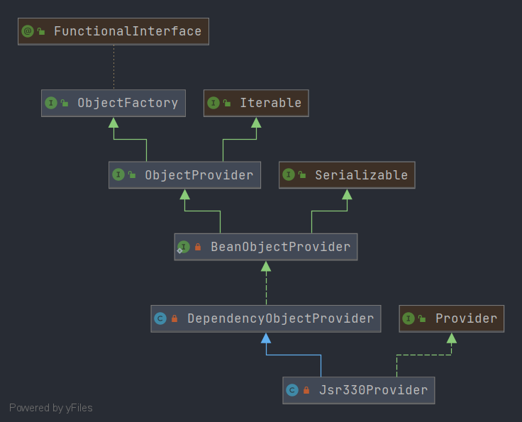

# Spring ObjectProvider
- 类全路径: `org.springframework.beans.factory.ObjectProvider`
- 类图 
    
- `ObjectProvider` 是一个接口, 下面对其方法进行讲解, 首先对接口中没有使用`default`的方法进行分析

- 下面三个方法都用来获取bean实例

```java

	T getObject(Object... args) throws BeansException;

	T getIfAvailable() throws BeansException;

	T getIfUnique() throws BeansException;
```


- 在接口定义中 `getIfAvailable` 和 `getIfUnique` 有另外两个方法在 default 修饰的方法中
  

```java
	default T getIfAvailable(Supplier<T> defaultSupplier) throws BeansException {
		// 获取 bean 实例
		T dependency = getIfAvailable();
		// 从容器中获取 , 从入参调用 get 方法后获取
		return (dependency != null ? dependency : defaultSupplier.get());
	}

	default void ifAvailable(Consumer<T> dependencyConsumer) throws BeansException {
		// 获取bean实例
		T dependency = getIfAvailable();
		if (dependency != null) {
			// 执行 accept 方法
			dependencyConsumer.accept(dependency);
		}
	}

	default T getIfUnique(Supplier<T> defaultSupplier) throws BeansException {
		T dependency = getIfUnique();
		return (dependency != null ? dependency : defaultSupplier.get());
	}

	default void ifUnique(Consumer<T> dependencyConsumer) throws BeansException {
		T dependency = getIfUnique();
		if (dependency != null) {
			dependencyConsumer.accept(dependency);
		}
	}

```


- 现阶段暂时对这些方法的分析只能到这个阶段, 下面我们需要到子类上去了解更多的细节内容
    - DependencyObjectProvider
    - Jsr330Provider


