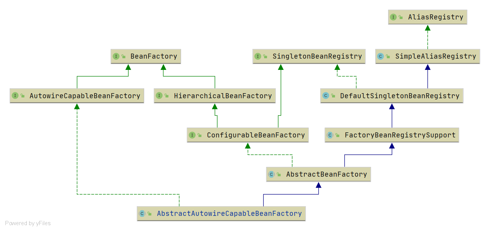
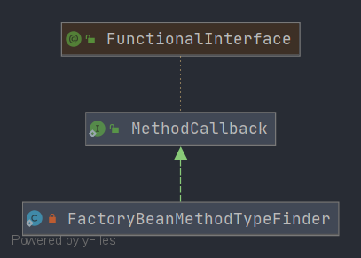

# Spring AbstractAutowireCapableBeanFactory
- 类全路径: `org.springframework.beans.factory.support.AbstractAutowireCapableBeanFactory`

- 类图

  


通过类图需要了解下面这些接口和类


[AliasRegistry](/doc/bean/register/Spring-AliasRegistry.md)
[SimpleAliasRegistry](/doc/context/Spring-SimpleAliasRegistry.md)
[DefaultSingletonBeanRegistry](/doc/context/Spring-DefaultSingletonBeanRegistry.md)
[FactoryBeanRegistrySupport](/doc/book/bean/registry/Spring-FactoryBeanRegistrySupport.md)
[AbstractBeanFactory](/doc/book/bean/factory/Spring-AbstractBeanFactory.md)
[SingletonBeanRegistry](/doc/book/bean/registry/Spring-SingletonBeanRegistry.md)
[ConfigurableBeanFactory](/doc/book/bean/factory/BeanFactory/Spring-ConfigurableBeanFactory.md)
[HierarchicalBeanFactory](/doc/book/bean/factory/BeanFactory/Spring-HierarchicalBeanFactory.md)
[BeanFactory](/doc/book/bean/factory/BeanFactory/Spring-BeanFactory-未完成.md)
[AutowireCapableBeanFactory](/doc/book/bean/factory/BeanFactory/Spring-AutowireCapableBeanFactory.md)


在了解完前置内容后我们来阅读成员变量


## 成员变量


<details>
<summary>详细代码如下</summary>


```java
public abstract class AbstractAutowireCapableBeanFactory extends AbstractBeanFactory
      implements AutowireCapableBeanFactory {

   /**
    * Dependency types to ignore on dependency check and autowire, as Set of Class objects: for
    * example, String. Default is none.
    *
    * 忽略的依赖类型
    */
   private final Set<Class<?>> ignoredDependencyTypes = new HashSet<>();

   /**
    * Dependency interfaces to ignore on dependency check and autowire, as Set of Class objects. By
    * default, only the BeanFactory interface is ignored.
    * 忽略的依赖接口
    */
   private final Set<Class<?>> ignoredDependencyInterfaces = new HashSet<>();

   /**
    * The name of the currently created bean, for implicit dependency registration on getBean etc
    * invocations triggered from a user-specified Supplier callback.
    * 正在创建的 bean Name
    */
   private final NamedThreadLocal<String> currentlyCreatedBean = new NamedThreadLocal<>("Currently created bean");

   /**
    * Cache of unfinished FactoryBean instances: FactoryBean name to BeanWrapper.
    * key: beanName
    * value: bean wrapper
    */
   private final ConcurrentMap<String, BeanWrapper> factoryBeanInstanceCache = new ConcurrentHashMap<>();

   /**
    * Cache of candidate factory methods per factory class.
    * 工厂方法缓存
    * key: 工厂类
    * value: 方法列表
    */
   private final ConcurrentMap<Class<?>, Method[]> factoryMethodCandidateCache = new ConcurrentHashMap<>();

   /**
    * Cache of filtered PropertyDescriptors: bean Class to PropertyDescriptor array.
    * key: 类
    * value: 属性描述
    */
   private final ConcurrentMap<Class<?>, PropertyDescriptor[]> filteredPropertyDescriptorsCache =
         new ConcurrentHashMap<>();

   /**
    * Strategy for creating bean instances.
    * 实例化策略
    */
   private InstantiationStrategy instantiationStrategy = new CglibSubclassingInstantiationStrategy();

   /**
    * Resolver strategy for method parameter names.
    * 参数名称发现接口
    */
   @Nullable
   private ParameterNameDiscoverer parameterNameDiscoverer = new DefaultParameterNameDiscoverer();

   /**
    * Whether to automatically try to resolve circular references between beans.
    * 是否允许循环引用
    */
   private boolean allowCircularReferences = true;

   /**
    * Whether to resort to injecting a raw bean instance in case of circular reference, even if the
    * injected bean eventually got wrapped.
    * 原始注解
    */
   private boolean allowRawInjectionDespiteWrapping = false;
}
```


</details>


在成员变量中有几个类和接口需要关注

1. `BeanWrapper`： [分析文章](/doc/book/bean/BeanWrapper/Spring-BeanWrapper.md)
2. `InstantiationStrategy`: [分析文章](/doc/book/bean/factory/support/InstantiationStrategy/Readme.md)
3. `ParameterNameDiscoverer`: [分析文章](/doc/book/core/ParameterNameDiscoverer/Readme.md)


## 方法分析

- 在前面我们对**类图**、**成员变量** 做了一定的分析. 接下来就是对方法进行分析了

  这里对 `getter`和`setter`忽略讲解. 


### copyConfigurationFrom

- 方法签名: `org.springframework.beans.factory.support.AbstractAutowireCapableBeanFactory#copyConfigurationFrom`
- 方法作用: 配置信息拷贝


配置拷贝在这里简单的就是值赋值


<details>
<summary>详细代码如下</summary>


```java
@Override
public void copyConfigurationFrom(ConfigurableBeanFactory otherFactory) {
   super.copyConfigurationFrom(otherFactory);
   if (otherFactory instanceof AbstractAutowireCapableBeanFactory) {
      AbstractAutowireCapableBeanFactory otherAutowireFactory =
            (AbstractAutowireCapableBeanFactory) otherFactory;
      this.instantiationStrategy = otherAutowireFactory.instantiationStrategy;
      this.allowCircularReferences = otherAutowireFactory.allowCircularReferences;
      this.ignoredDependencyTypes.addAll(otherAutowireFactory.ignoredDependencyTypes);
      this.ignoredDependencyInterfaces.addAll(otherAutowireFactory.ignoredDependencyInterfaces);
   }
}
```


</details>


### createBean

- 方法签名: `org.springframework.beans.factory.support.AbstractAutowireCapableBeanFactory#createBean(java.lang.Class<T>)`
- 方法作用: 创建 bean

- 这将是一个及其重要的方法


本体代码相对来说比较容易. 

<details>
<summary>详细代码如下</summary>

```java
@Override
@SuppressWarnings("unchecked")
public <T> T createBean(Class<T> beanClass) throws BeansException {
   // Use prototype bean definition, to avoid registering bean as dependent bean.
   RootBeanDefinition bd = new RootBeanDefinition(beanClass);
   bd.setScope(SCOPE_PROTOTYPE);
   // 确认是否需要缓存
   bd.allowCaching = ClassUtils.isCacheSafe(beanClass, getBeanClassLoader());
   // 创建 bean
   return (T) createBean(beanClass.getName(), bd, null);
}
```


</details>


- 其中继续调用 `org.springframework.beans.factory.support.AbstractAutowireCapableBeanFactory#createBean(java.lang.String, org.springframework.beans.factory.support.RootBeanDefinition, java.lang.Object[])`方法


首先了解这个方法的参数


```java
protected Object createBean(String beanName, RootBeanDefinition mbd, @Nullable Object[] args)
      throws BeanCreationException {}
```


- beanName： bean 名称
- mbd: bean 定义
- args: 参数列表


接下来一部分一部分开始分析


第一部分代码主要准备对象`RootBeanDefinition` 具体有下面两种处理方式

1. 直接从参数中获取(方法参数)
2. 通过解析 beanClass 后
   1. 需要通过三个条件来判断是否新建对象


<details>
<summary>第一部分详细代码如下</summary>

```java
		// beanDefinition
		RootBeanDefinition mbdToUse = mbd;

		// Make sure bean class is actually resolved at this point, and
		// clone the bean definition in case of a dynamically resolved Class
		// which cannot be stored in the shared merged bean definition.
		// 获取当前需要加载的类
		Class<?> resolvedClass = resolveBeanClass(mbd, beanName);
		// 1. 待处理的类不为空
		// 2. bean定义中含有 beanClass
		// 3. className 不为空
		// 满足、上述三点的情况下会去创建 RootBeanDefinition
		if (resolvedClass != null && !mbd.hasBeanClass() && mbd.getBeanClassName() != null) {
			// 创建 beanDefinition
			mbdToUse = new RootBeanDefinition(mbd);
			// 设置bean class
			mbdToUse.setBeanClass(resolvedClass);
		}
```


</details>


关于 `resolveBeanClass` 的分析请查看[这篇文章](/doc/book/bean/factory/Spring-AbstractBeanFactory.md)


继续看第二部分代码，第二部分代码是关于方法重写的处理，即`org.springframework.beans.factory.support.AbstractBeanDefinition#prepareMethodOverrides`方法调用


<details>
<summary>第二部分详细代码如下</summary>

```java
try {
   // 方法重写
   mbdToUse.prepareMethodOverrides();
}
catch (BeanDefinitionValidationException ex) {
   throw new BeanDefinitionStoreException(mbdToUse.getResourceDescription(),
         beanName, "Validation of method overrides failed", ex
   );
}
```

</details>


关于`prepareMethodOverrides`的分析请查看[这篇文章](/doc/book/bean/BeanDefinition/Spring-AbstractBeanDefinition.md)


继续看第三部分代码，第三部分代码是关于bean实例化之前的操作. 


<details>
<summary>第三部分详细代码如下</summary>


```java
try {
   // Give BeanPostProcessors a chance to return a proxy instead of the target bean instance.
   // 创建bean之前的行为
   Object bean = resolveBeforeInstantiation(beanName, mbdToUse);
   if (bean != null) {
      return bean;
   }
}
catch (Throwable ex) {
   throw new BeanCreationException(mbdToUse.getResourceDescription(), beanName,
         "BeanPostProcessor before instantiation of bean failed", ex
   );
}
```


</details>


第三部分的代码主要都由`resolveBeforeInstantiation`来进行. 下面对这个方法进行分析

### resolveBeforeInstantiation 

- 方法签名: `org.springframework.beans.factory.support.AbstractAutowireCapableBeanFactory#resolveBeforeInstantiation`


<details>
<summary>详细代码如下</summary>

```java
	@Nullable
	protected Object resolveBeforeInstantiation(String beanName, RootBeanDefinition mbd) {
		Object bean = null;
		// 是否需要在 bean 初始化之前做一些关于 beanPostProcessor 相关的行为
		if (!Boolean.FALSE.equals(mbd.beforeInstantiationResolved)) {
			// Make sure bean class is actually resolved at this point.
			// 是否是合成bean
			// 是否拥有 BeanPostProcessor 接口
			if (!mbd.isSynthetic() && hasInstantiationAwareBeanPostProcessors()) {
				// 目标类型确认
				Class<?> targetType = determineTargetType(beanName, mbd);
				// 前置方法 BeanPostProcessor 接口的调用
				if (targetType != null) {
					bean = applyBeanPostProcessorsBeforeInstantiation(targetType, beanName);
					if (bean != null) {
						// 后置方法
						bean = applyBeanPostProcessorsAfterInitialization(bean, beanName);
					}
				}
			}
			mbd.beforeInstantiationResolved = (bean != null);
		}
		return bean;
	}

```


</details>


在代码前半部分有一些条件判断

1. bean 是否需要做 `BeanPostProcessor` 的行为，即调用接口`BeanPostProcessor`

2. 判断是否是合成 bean , 合成bean 在Spring中有 mergedBean 形式的方法如

   `getMergedLocalBeanDefinition`、`getMergedBeanDefinition` 等. 这里不做展开

3. 是否存在`BeanPostProcessor`接口


在条件验证通过后会有 **目标类型的推断** 和 `BeanPostProcessor` 接口的调度


先来看`determineTargetType`方法


### determineTargetType

- 方法签名: `org.springframework.beans.factory.support.AbstractAutowireCapableBeanFactory#determineTargetType`

- 方法作用: 确定目标类型


<details>
<summary>详细代码如下</summary>

```java
@Nullable
protected Class<?> determineTargetType(String beanName, RootBeanDefinition mbd, Class<?>... typesToMatch) {
   // beanDefinition 中的类型
   Class<?> targetType = mbd.getTargetType();
   // 不存在的情况下处理方式
   if (targetType == null) {
      targetType = (mbd.getFactoryMethodName() != null ?
            getTypeForFactoryMethod(beanName, mbd, typesToMatch) :
            resolveBeanClass(mbd, beanName, typesToMatch));
      if (ObjectUtils.isEmpty(typesToMatch) || getTempClassLoader() == null) {
         mbd.resolvedTargetType = targetType;
      }
   }
   return targetType;
}
```


</details>


这里方法主要关注 从 BeanDefinition 中获取不到的情况 两种获取方式 

1. `getTypeForFactoryMethod`

2. `resolveBeanClass`

   两个方法的调用依据是判断 工厂函数名称 是否存在，即 **`FactoryMethod`**是否存在


`resolveBeanClass` 分析查看: [这篇文章](/doc/book/bean/BeanDefinition/Spring-AbstractBeanDefinition.md)


`resolveBeanClass` 在之前分析过了. 下面主要对`getTypeForFactoryMethod`进行分析


### getTypeForFactoryMethod

- 方法签名: `org.springframework.beans.factory.support.AbstractAutowireCapableBeanFactory#getTypeForFactoryMethod`
- 方法作用: 获取工厂方法的类型


<details>
<summary>第一部分详细代码如下</summary>

```java
// 获取 工厂方法的回调类型解析器
ResolvableType cachedReturnType = mbd.factoryMethodReturnType;
if (cachedReturnType != null) {
   // 类型解析器中获取类型
   return cachedReturnType.resolve();
}

// 公共父类
Class<?> commonType = null;
// 工厂方法
Method uniqueCandidate = mbd.factoryMethodToIntrospect;
```


</details>

第一部分代码获取基本操作对象, 在这里有一个可以直接返回的可能

​	`BeanDefinition`中的`factoryMethodReturnType`属性不为空直接解析返回


接下来阅读 `if` 中的内容


<details>
<summary>第二部分详细代码如下</summary>

```java
Class<?> factoryClass;
boolean isStatic = true;

// 工厂bean名称
String factoryBeanName = mbd.getFactoryBeanName();
if (factoryBeanName != null) {
   // 工厂 bean 名称和 参数 bean名称是否相同
   if (factoryBeanName.equals(beanName)) {
      throw new BeanDefinitionStoreException(mbd.getResourceDescription(), beanName,
            "factory-bean reference points back to the same bean definition"
      );
   }
   // Check declared factory method return type on factory class.
   // 获取 工厂bean的类型
   factoryClass = getType(factoryBeanName);
   isStatic = false;
}
else {
   // Check declared factory method return type on bean class.
   // 解析 bean 类型
   factoryClass = resolveBeanClass(mbd, beanName, typesToMatch);
}

if (factoryClass == null) {
   return null;
}
factoryClass = ClassUtils.getUserClass(factoryClass);

// If all factory methods have the same return type, return that type.
// Can't clearly figure out exact method due to type converting / autowiring!
int minNrOfArgs =
      (mbd.hasConstructorArgumentValues() ? mbd.getConstructorArgumentValues().getArgumentCount() : 0);
// 候选函数列表
Method[] candidates = this.factoryMethodCandidateCache.computeIfAbsent(
      factoryClass,
      clazz -> ReflectionUtils.getUniqueDeclaredMethods(clazz, ReflectionUtils.USER_DECLARED_METHODS)
);
```

 </details>


这部分代码依赖 `getType` 来获取工厂类型 和 `resolveBeanClass` 方法解析bean类型 最终得到 `factoryClass` 变量. 但这里并不是直义 ~~工厂类型~~

在这之后会处理`factoryMethodCandidateCache`对象的内容. 

key: class

value: method[]


在这里得到对象 `candidates` 在循环中进行数据处理


<details>
<summary>循环处理相关代码详情</summary>

```java
for (Method candidate : candidates) {
   // 过滤条件
   if (Modifier.isStatic(candidate.getModifiers()) == isStatic && mbd.isFactoryMethod(candidate) &&
         candidate.getParameterCount() >= minNrOfArgs) {
      // Declared type variables to inspect?
      if (candidate.getTypeParameters().length > 0) {
         try {
            // Fully resolve parameter names and argument values.
            // 函数的参数类型
            Class<?>[] paramTypes = candidate.getParameterTypes();
            String[] paramNames = null;
            // 获取 参数名称发现器
            ParameterNameDiscoverer pnd = getParameterNameDiscoverer();
            if (pnd != null) {
               // 解析参数名称
               paramNames = pnd.getParameterNames(candidate);
            }
            // 构造函数参数对象
            ConstructorArgumentValues cav = mbd.getConstructorArgumentValues();
            // 获取 ConstructorArgumentValues 中的 ValueHolder
            Set<ConstructorArgumentValues.ValueHolder> usedValueHolders = new HashSet<>(paramTypes.length);
            // 参数对象
            Object[] args = new Object[paramTypes.length];
            // 循环中处理两个集合
            // 1. usedValueHolders 放入  ValueHolder
            // 2.  args 放入 ValueHolder 中存储的值
            for (int i = 0; i < args.length; i++) {
               ConstructorArgumentValues.ValueHolder valueHolder = cav.getArgumentValue(
                     i, paramTypes[i], (paramNames != null ? paramNames[i] : null), usedValueHolders);
               if (valueHolder == null) {
                  valueHolder = cav.getGenericArgumentValue(null, null, usedValueHolders);
               }
               if (valueHolder != null) {
                  args[i] = valueHolder.getValue();
                  usedValueHolders.add(valueHolder);
               }
            }

            // 获取返回值
            Class<?> returnType = AutowireUtils.resolveReturnTypeForFactoryMethod(
                  candidate, args, getBeanClassLoader());
            uniqueCandidate = (commonType == null && returnType == candidate.getReturnType() ?
                  candidate : null);

            // 公共父类获取
            commonType = ClassUtils.determineCommonAncestor(returnType, commonType);
            if (commonType == null) {
               // Ambiguous return types found: return null to indicate "not determinable".
               return null;
            }
         }
         catch (Throwable ex) {
            if (logger.isDebugEnabled()) {
               logger.debug("Failed to resolve generic return type for factory method: " + ex);
            }
         }
      }
      else {
         uniqueCandidate = (commonType == null ? candidate : null);
         // 公共父类获取
         commonType = ClassUtils.determineCommonAncestor(candidate.getReturnType(), commonType);
         if (commonType == null) {
            // Ambiguous return types found: return null to indicate "not determinable".
            return null;
         }
      }
   }
}
```


</details>


循环处理的代码没有什么特别的地方. 重点是理解几个变量

1. cav
2. usedValueHolders
3. args
4. uniqueCandidate


最后一段


<details>
<summary>详细代码如下</summary>

```java
// Common return type found: all factory methods return same type. For a non-parameterized
// unique candidate, cache the full type declaration context of the target factory method.
// 获取 return 值
cachedReturnType = (uniqueCandidate != null ?
      ResolvableType.forMethodReturnType(uniqueCandidate) : ResolvableType.forClass(commonType));
mbd.factoryMethodReturnType = cachedReturnType;
return cachedReturnType.resolve();
```


</details>


最后一段是处理 `return` 结果的 (**求工厂函数的返回值类型)**

这里有两种方式

1. `ResolvableType.forMethodReturnType`
2. `ResolvableType.forClass`

两种方式最终为了得到`ResolvableType`对象, 依赖`ResolvableType#resolve`方法解析到类型


整体流程讲述完成. 接下来看看下面的代码


<details>
<summary>方法的详细代码如下</summary>


```java
@Nullable
protected Class<?> getTypeForFactoryMethod(String beanName, RootBeanDefinition mbd, Class<?>... typesToMatch) {
   // 获取 工厂方法的回调类型解析器
   ResolvableType cachedReturnType = mbd.factoryMethodReturnType;
   if (cachedReturnType != null) {
      // 类型解析器中获取类型
      return cachedReturnType.resolve();
   }

   // 公共父类
   Class<?> commonType = null;
   // 工厂方法
   Method uniqueCandidate = mbd.factoryMethodToIntrospect;

   if (uniqueCandidate == null) {
      Class<?> factoryClass;
      boolean isStatic = true;

      // 工厂bean名称
      String factoryBeanName = mbd.getFactoryBeanName();
      if (factoryBeanName != null) {
         // 工厂 bean 名称和 参数 bean名称是否相同
         if (factoryBeanName.equals(beanName)) {
            throw new BeanDefinitionStoreException(mbd.getResourceDescription(), beanName,
                  "factory-bean reference points back to the same bean definition"
            );
         }
         // Check declared factory method return type on factory class.
         // 获取 工厂bean的类型
         factoryClass = getType(factoryBeanName);
         isStatic = false;
      }
      else {
         // Check declared factory method return type on bean class.
         // 解析 bean 类型
         factoryClass = resolveBeanClass(mbd, beanName, typesToMatch);
      }

      if (factoryClass == null) {
         return null;
      }
      factoryClass = ClassUtils.getUserClass(factoryClass);

      // If all factory methods have the same return type, return that type.
      // Can't clearly figure out exact method due to type converting / autowiring!
      int minNrOfArgs =
            (mbd.hasConstructorArgumentValues() ? mbd.getConstructorArgumentValues().getArgumentCount() : 0);
      // 候选函数列表
      Method[] candidates = this.factoryMethodCandidateCache.computeIfAbsent(
            factoryClass,
            clazz -> ReflectionUtils.getUniqueDeclaredMethods(clazz, ReflectionUtils.USER_DECLARED_METHODS)
      );

      for (Method candidate : candidates) {
         // 过滤条件
         if (Modifier.isStatic(candidate.getModifiers()) == isStatic && mbd.isFactoryMethod(candidate) &&
               candidate.getParameterCount() >= minNrOfArgs) {
            // Declared type variables to inspect?
            if (candidate.getTypeParameters().length > 0) {
               try {
                  // Fully resolve parameter names and argument values.
                  // 函数的参数类型
                  Class<?>[] paramTypes = candidate.getParameterTypes();
                  String[] paramNames = null;
                  // 获取 参数名称发现器
                  ParameterNameDiscoverer pnd = getParameterNameDiscoverer();
                  if (pnd != null) {
                     // 解析参数名称
                     paramNames = pnd.getParameterNames(candidate);
                  }
                  // 构造函数参数对象
                  ConstructorArgumentValues cav = mbd.getConstructorArgumentValues();
                  // 获取 ConstructorArgumentValues 中的 ValueHolder
                  Set<ConstructorArgumentValues.ValueHolder> usedValueHolders = new HashSet<>(paramTypes.length);
                  // 参数对象
                  Object[] args = new Object[paramTypes.length];
                  // 循环中处理两个集合
                  // 1. usedValueHolders 放入  ValueHolder
                  // 2.  args 放入 ValueHolder 中存储的值
                  for (int i = 0; i < args.length; i++) {
                     ConstructorArgumentValues.ValueHolder valueHolder = cav.getArgumentValue(
                           i, paramTypes[i], (paramNames != null ? paramNames[i] : null), usedValueHolders);
                     if (valueHolder == null) {
                        valueHolder = cav.getGenericArgumentValue(null, null, usedValueHolders);
                     }
                     if (valueHolder != null) {
                        args[i] = valueHolder.getValue();
                        usedValueHolders.add(valueHolder);
                     }
                  }

                  // 获取返回值
                  Class<?> returnType = AutowireUtils.resolveReturnTypeForFactoryMethod(
                        candidate, args, getBeanClassLoader());
                  uniqueCandidate = (commonType == null && returnType == candidate.getReturnType() ?
                        candidate : null);

                  // 公共父类获取
                  commonType = ClassUtils.determineCommonAncestor(returnType, commonType);
                  if (commonType == null) {
                     // Ambiguous return types found: return null to indicate "not determinable".
                     return null;
                  }
               }
               catch (Throwable ex) {
                  if (logger.isDebugEnabled()) {
                     logger.debug("Failed to resolve generic return type for factory method: " + ex);
                  }
               }
            }
            else {
               uniqueCandidate = (commonType == null ? candidate : null);
               // 公共父类获取
               commonType = ClassUtils.determineCommonAncestor(candidate.getReturnType(), commonType);
               if (commonType == null) {
                  // Ambiguous return types found: return null to indicate "not determinable".
                  return null;
               }
            }
         }
      }

      mbd.factoryMethodToIntrospect = uniqueCandidate;
      if (commonType == null) {
         return null;
      }
   }

   // Common return type found: all factory methods return same type. For a non-parameterized
   // unique candidate, cache the full type declaration context of the target factory method.
   // 获取 return 值
   cachedReturnType = (uniqueCandidate != null ?
         ResolvableType.forMethodReturnType(uniqueCandidate) : ResolvableType.forClass(commonType));
   mbd.factoryMethodReturnType = cachedReturnType;
   return cachedReturnType.resolve();
}
```


</details>


到这里我们将`determineTargetType` 分析完成, 回到`org.springframework.beans.factory.support.AbstractAutowireCapableBeanFactory#resolveBeforeInstantiation`中


- 继续下面这段代码


```java
if (!mbd.isSynthetic() && hasInstantiationAwareBeanPostProcessors()) {
   // 目标类型确认
   Class<?> targetType = determineTargetType(beanName, mbd);
   // 前置方法 BeanPostProcessor 接口的调用
   if (targetType != null) {
      // postProcessBeforeInstantiation 执行
      bean = applyBeanPostProcessorsBeforeInstantiation(targetType, beanName);
      if (bean != null) {
         // 后置方法
         // postProcessAfterInitialization 执行
         bean = applyBeanPostProcessorsAfterInitialization(bean, beanName);
      }
   }
}
```


在`resolveBeforeInstantiation`代码中 后续有两个方法调用


### applyBeanPostProcessorsBeforeInstantiation

- 方法签名: `org.springframework.beans.factory.support.AbstractAutowireCapableBeanFactory#applyBeanPostProcessorsBeforeInstantiation`

- 方法作用: 执行容器中`BeanPostProcessor`接口的`postProcessBeforeInstantiation`方法


<details>
<summary>详细代码如下</summary>


```JAVA
@Nullable
protected Object applyBeanPostProcessorsBeforeInstantiation(Class<?> beanClass, String beanName) {
   for (BeanPostProcessor bp : getBeanPostProcessors()) {
      if (bp instanceof InstantiationAwareBeanPostProcessor) {
         InstantiationAwareBeanPostProcessor ibp = (InstantiationAwareBeanPostProcessor) bp;
         // 调用自定义实现
         Object result = ibp.postProcessBeforeInstantiation(beanClass, beanName);
         if (result != null) {
            return result;
         }
      }
   }
   return null;
}
```

</details>


### applyBeanPostProcessorsAfterInitialization

- 方法签名: `org.springframework.beans.factory.support.AbstractAutowireCapableBeanFactory#applyBeanPostProcessorsAfterInitialization`
- 方法作用: 执行容器中`BeanPostProcessor`接口的`postProcessAfterInitialization`方法


<details>
<summary>详细代码如下</summary>


```JAVA
@Override
public Object applyBeanPostProcessorsAfterInitialization(Object existingBean, String beanName)
      throws BeansException {

   Object result = existingBean;
   for (BeanPostProcessor processor : getBeanPostProcessors()) {
      // 执行 spring 容器中 BeanPostProcessor
      Object current = processor.postProcessAfterInitialization(result, beanName);
      if (current == null) {
         return result;
      }
      result = current;
   }
   return result;
}
```


</details>


在这两个方法执行后就结束了`resolveBeforeInstantiation`的调用了.  接下来回到`createBean`


`createBean`第四部分代码


<details>
<summary>第四部分详细代码如下</summary>

```java
try {
   // 创建bean
   Object beanInstance = doCreateBean(beanName, mbdToUse, args);
   if (logger.isTraceEnabled()) {
      logger.trace("Finished creating instance of bean '" + beanName + "'");
   }
   return beanInstance;
}
catch (BeanCreationException | ImplicitlyAppearedSingletonException ex) {
   // A previously detected exception with proper bean creation context already,
   // or illegal singleton state to be communicated up to DefaultSingletonBeanRegistry.
   throw ex;
}
catch (Throwable ex) {
   throw new BeanCreationException(
         mbdToUse.getResourceDescription(), beanName, "Unexpected exception during bean creation", ex);
}
```


</details>


第四部分代码就是 `doCreateBean` 


### doCreateBean

- 方法签名: `org.springframework.beans.factory.support.AbstractAutowireCapableBeanFactory#doCreateBean`


在分析源码之前我们先想一想对象创建的过程

1. 构造函数创建
2. 设置属性


spring 在`doCreateBean`中的操作也基本类似, 在这个基础上还有一些其他操作. 下面就开始分析


- 首先先了解一下参数

```java
final String beanName, final RootBeanDefinition mbd, final @Nullable Object[] args
```

1. `beanName`: bean名称
2. `mbd`: bean 定义
3. `args` 参数列表


<details>
<summary>第一部分详细代码如下</summary>


```java
// Instantiate the bean.
BeanWrapper instanceWrapper = null;
// 是否单例
if (mbd.isSingleton()) {
   // beanFactory 移除当前创建的beanName
   instanceWrapper = this.factoryBeanInstanceCache.remove(beanName);
}
// beanWrapper 是否存在
if (instanceWrapper == null) {
   // 创建 bean 实例
   instanceWrapper = createBeanInstance(beanName, mbd, args);
}

```


</details>


流程

1. 判断 bean 是否是单例的

   1. 是

      从`factoryBeanInstanceCache`中获取`BeanWrapper`, `factoryBeanInstanceCache`信息如下

      ```JAVA
      private final ConcurrentMap<String, BeanWrapper> factoryBeanInstanceCache = new ConcurrentHashMap<>();
      ```

      

1. `instanceWrapper`非空判断 在这里会有一个方法`createBeanInstance`的调用

   ```java
   if (instanceWrapper == null) {
      // 创建 bean 实例
      instanceWrapper = createBeanInstance(beanName, mbd, args);
   }
   ```

下面就是对`createBeanInstance`方法的进一步分析了.


### createBeanInstance

- 方法签名: `org.springframework.beans.factory.support.AbstractAutowireCapableBeanFactory#createBeanInstance`
- 方法作用: 创建 `beanWrapper`


先来看代码第一部分

<details>
<summary>第一部分详细代码如下</summary>

```java
// Make sure bean class is actually resolved at this point.
// 第一部分
// 获取 bean class
Class<?> beanClass = resolveBeanClass(mbd, beanName);
// bean 是否可以被创建的验证
if (beanClass != null && !Modifier.isPublic(beanClass.getModifiers()) && !mbd.isNonPublicAccessAllowed()) {
    throw new BeanCreationException(mbd.getResourceDescription(), beanName,
                                    "Bean class isn't public, and non-public access not allowed: " + beanClass.getName()
                                   );
}
```


</details>


在第一部代码中首先对 bean class 做了一个判断. 判断它是否可以被创建, 如果不能不创建会抛出异常


继续阅读第二部分代码.

<details>
    <summary>第二部分详细代码如下</summary>

```java
// 第二部分
// 返回一个用来创建bean实例的回调接口
// Supplier get 直接获取bean对象
Supplier<?> instanceSupplier = mbd.getInstanceSupplier();
if (instanceSupplier != null) {
   return obtainFromSupplier(instanceSupplier, beanName);
}
```

</details>


第二部分代码所作的行为和`Supplier`有所关联. 其真正的操作方法在`obtainFromSupplier`中, 接下来对其进行分析


### obtainFromSupplier


- 方法签名: `org.springframework.beans.factory.support.AbstractAutowireCapableBeanFactory#obtainFromSupplier`
- 方法作用: 从 `Supplier` 接口中获取对象，创建成 `beanWrapper`


<details>
<summary>详细代码如下</summary>

```java
protected BeanWrapper obtainFromSupplier(Supplier<?> instanceSupplier, String beanName) {
   Object instance;

    // 获取当前的beanName
   String outerBean = this.currentlyCreatedBean.get();
   // 设置当前处理的beanName
   this.currentlyCreatedBean.set(beanName);
   try {
      // 从 Supplier 中获取
      instance = instanceSupplier.get();
   }
   finally {
      if (outerBean != null) {
         // 如果 currentlyCreatedBean 取不到设置
         this.currentlyCreatedBean.set(outerBean);
      }
      else {
         // 移除
         this.currentlyCreatedBean.remove();
      }
   }

   if (instance == null) {
      // supplier 中获取不到, 将实例设置为 NullBean
      instance = new NullBean();
   }
   // beanWrapper 包装
   BeanWrapper bw = new BeanWrapperImpl(instance);
   // beanWrapper 实例化后的操作
   initBeanWrapper(bw);
   return bw;
}
```

</details>


方法中涉及到变量`currentlyCreatedBean`： 正在创建的 beanName


```java
/**
 * The name of the currently created bean, for implicit dependency registration on getBean etc
 * invocations triggered from a user-specified Supplier callback.
 * 正在创建的 bean Name
 */
private final NamedThreadLocal<String> currentlyCreatedBean = new NamedThreadLocal<>("Currently created bean");
```


方法最后返回的时候还有一个类的初始化(**`BeanWrapper`**)和一个方法的调用(**`initBeanWrapper`**)详细分析请查看下面两个文档

1. BeanWrapper:[分析文章](/doc/book/bean/BeanWrapper/Spring-BeanWrapper.md)
2. AbstractBeanFactory: [分析文章](/doc/book/bean/factory/Spring-AbstractBeanFactory.md)


`createBeanInstance`的第二部分代码也分析完成. 继续阅读第三部分的代码. 


<details>
<summary>第三部分详细代码如下</summary>

```java
// 第三部分
if (mbd.getFactoryMethodName() != null) {
   // 通过工厂方法创建
   return instantiateUsingFactoryMethod(beanName, mbd, args);
}
```


</details>


第三部分代码涉及到 FactoryMethod 的创建 ,调用方法为: `instantiateUsingFactoryMethod`


### instantiateUsingFactoryMethod

- 方法签名: `org.springframework.beans.factory.support.AbstractAutowireCapableBeanFactory#instantiateUsingFactoryMethod`


- 方法作用: 依赖`ConstructorResolver`类来创建 `BeanWrapper` 


<details>
<summary>详细代码如下</summary>

```java
protected BeanWrapper instantiateUsingFactoryMethod(
      String beanName, RootBeanDefinition mbd, @Nullable Object[] explicitArgs) {
   // 调用 factory-method 方法
   return new ConstructorResolver(this).instantiateUsingFactoryMethod(beanName, mbd, explicitArgs);
}
```


</details>


这里需要将目光转移到 `ConstructorResolver` 类上面, 对`ConstructorResolver` 的分析请查看[这篇文章](/doc/book/bean/factory/support/ConstructorResolver/Spring-ConstructorResolver-未完成.md)


继续阅读第四部分代码. 


<details>
<summary>第四部分详细代码如下</summary>

```java
// 第四部分
// Shortcut when re-creating the same bean...
// 是否已经处理完成的标记
boolean resolved = false;
// 是否需要啊自动注入的标记
boolean autowireNecessary = false;
if (args == null) {
   synchronized (mbd.constructorArgumentLock) {
      if (mbd.resolvedConstructorOrFactoryMethod != null) {
         resolved = true;
         autowireNecessary = mbd.constructorArgumentsResolved;
      }
   }
}
```


</details>


第四部分的代码操作主要为了两个变量的设置

1. `resolved`: **是否已经处理完成的标记**
2. `autowireNecessary`: **是否需要啊自动注入的标记**


继续阅读第五部分代码

<details>
<summary>第五部分详细代码如下</summary>

```java
// 第五部分
if (resolved) {
   if (autowireNecessary) {
      // 自动构造 bean
      return autowireConstructor(beanName, mbd, null, null);
   }
   else {
      // 实例化bean
      return instantiateBean(beanName, mbd);
   }
}
```

</details>

第五部分代码围绕第四部分的两个变量值进行两种 bean 的构造处理

1. `autowireConstructor`
2. `instantiateBean`


下面就开始这两个方法进行分析


### autowireConstructor

- 方法签名: `org.springframework.beans.factory.support.AbstractAutowireCapableBeanFactory#autowireConstructor`

- 方法作用: 自动装配 Bean 后返回结果


```java
protected BeanWrapper autowireConstructor(
      String beanName, RootBeanDefinition mbd, @Nullable Constructor<?>[] ctors, @Nullable Object[] explicitArgs) {

   return new ConstructorResolver(this).autowireConstructor(beanName, mbd, ctors, explicitArgs);
}
```


在`autowireConstructor`方法中涉及到`ConstructorResolver`类详细分析请查看[这篇文章](/doc/book/bean/factory/support/ConstructorResolver/Spring-ConstructorResolver-未完成.md)


### instantiateBean

- 方法签名: `org.springframework.beans.factory.support.AbstractAutowireCapableBeanFactory#instantiateBean`


<details>
<summary>详细代码如下</summary>

```java
protected BeanWrapper instantiateBean(final String beanName, final RootBeanDefinition mbd) {
   try {
      Object beanInstance;
      final BeanFactory parent = this;
      if (System.getSecurityManager() != null) {
         // 获取实例化策略来进行实例化
         beanInstance = AccessController.doPrivileged(
               (PrivilegedAction<Object>) () ->
                     getInstantiationStrategy().instantiate(mbd, beanName, parent),
               getAccessControlContext()
         );
      }
      else {
         // 获取实例化策略来进行实例化
         beanInstance = getInstantiationStrategy().instantiate(mbd, beanName, parent);
      }

      // beanWrapper 创建
      BeanWrapper bw = new BeanWrapperImpl(beanInstance);
      initBeanWrapper(bw);
      return bw;
   }
   catch (Throwable ex) {
      throw new BeanCreationException(
            mbd.getResourceDescription(), beanName, "Instantiation of bean failed", ex);
   }
}
```

</details>


从代码上可以看出这里依靠`getInstantiationStrategy().instantiate(mbd, beanName, parent)`代码在做主要操作. 这里就是一个`InstantiationStrategy`的调用 ， 详细分析请查看[InstantiationStrategy分析文章](/doc/book/bean/factory/support/InstantiationStrategy/Spring-InstantiationStrategy.md)


- 继续阅读 `createBeanInstance` 的第六部分代码


<details>
<summary>第六部分详细代码如下</summary>


```java
// 第六部分
// Candidate constructors for autowiring?
// 确定构造函数列表
Constructor<?>[] ctors = determineConstructorsFromBeanPostProcessors(beanClass, beanName);
if (ctors != null || mbd.getResolvedAutowireMode() == AUTOWIRE_CONSTRUCTOR ||
      mbd.hasConstructorArgumentValues() || !ObjectUtils.isEmpty(args)) {
   // 自动装配处理
   return autowireConstructor(beanName, mbd, ctors, args);
}

// Preferred constructors for default construction?
ctors = mbd.getPreferredConstructors();
if (ctors != null) {
   // 自动装配处理
   return autowireConstructor(beanName, mbd, ctors, null);
}

// No special handling: simply use no-arg constructor.
// 实例化 bean
return instantiateBean(beanName, mbd);
```


</details>


第六部分处理了下面这些行为

1. 获取构造函数列表`determineConstructorsFromBeanPostProcessors`
2. 自动装配的处理`autowireConstructor`
3. 实例化bean`instantiateBean`

在处理行为中`determineConstructorsFromBeanPostProcessors`是我们还没有看到过的方法, 展开分析一下


### determineConstructorsFromBeanPostProcessors

- 方法签名: `org.springframework.beans.factory.support.AbstractAutowireCapableBeanFactory#determineConstructorsFromBeanPostProcessors`
- 方法作用: 获取`Constructor`列表


<details>
<summary>详细代码如下</summary>

```java
/**
 * Determine candidate constructors to use for the given bean, checking all registered {@link
 * SmartInstantiationAwareBeanPostProcessor SmartInstantiationAwareBeanPostProcessors}.
 *
 * 通过 BeanPostProcessor 的子接口  SmartInstantiationAwareBeanPostProcessor 来获取 Constructor 列表
 * @param beanClass the raw class of the bean
 * @param beanName  the name of the bean
 *
 * @return the candidate constructors, or {@code null} if none specified
 *
 * @throws org.springframework.beans.BeansException in case of errors
 * @see org.springframework.beans.factory.config.SmartInstantiationAwareBeanPostProcessor#determineCandidateConstructors
 */
@Nullable
protected Constructor<?>[] determineConstructorsFromBeanPostProcessors(@Nullable Class<?> beanClass, String beanName)
      throws BeansException {

   if (beanClass != null && hasInstantiationAwareBeanPostProcessors()) {
      for (BeanPostProcessor bp : getBeanPostProcessors()) {
         if (bp instanceof SmartInstantiationAwareBeanPostProcessor) {
            SmartInstantiationAwareBeanPostProcessor ibp = (SmartInstantiationAwareBeanPostProcessor) bp;
            //  SmartInstantiationAwareBeanPostProcessor 的实现类中获取
            Constructor<?>[] ctors = ibp.determineCandidateConstructors(beanClass, beanName);
            if (ctors != null) {
               return ctors;
            }
         }
      }
   }
   return null;
}
```


</details>


在`determineConstructorsFromBeanPostProcessors`方法中主要依赖`BeanPostProcessor`的子接口`SmartInstantiationAwareBeanPostProcessor`的`determineCandidateConstructors`方法来获取. 

关于`SmartInstantiationAwareBeanPostProcessor`的分析查看[这篇文章](/doc/book/bean/factory/config/SmartInstantiationAwareBeanPostProcessor/Spring-SmartInstantiationAwareBeanPostProcessor-未完成.md)


到这里 `createBeanInstance` 方法的分析就完成了. 


在`createBeanInstance`分析后我们对`doCreateBean`的第一部分代码分析也就完成了. 


下面继续阅读第二部分的代码


<details>
<summary>第二部分详细代码如下</summary>

```java
// 第二部分
// 获取 实例
final Object bean = instanceWrapper.getWrappedInstance();
// beanWrapper中存储的实例.class
Class<?> beanType = instanceWrapper.getWrappedClass();
if (beanType != NullBean.class) {
   mbd.resolvedTargetType = beanType;
}

// Allow post-processors to modify the merged bean definition.
synchronized (mbd.postProcessingLock) {
   if (!mbd.postProcessed) {
      try {
         // 后置方法执行 BeanPostProcessor
         applyMergedBeanDefinitionPostProcessors(mbd, beanType, beanName);
      }
      catch (Throwable ex) {
         throw new BeanCreationException(mbd.getResourceDescription(), beanName,
               "Post-processing of merged bean definition failed", ex
         );
      }
      mbd.postProcessed = true;
   }
}
```


</details>


第二部分处理了一些值的设置, 以及一个方法`applyMergedBeanDefinitionPostProcessors`的调用


### applyMergedBeanDefinitionPostProcessors

- 方法签名: `org.springframework.beans.factory.support.AbstractAutowireCapableBeanFactory#applyMergedBeanDefinitionPostProcessors`

- 方法作用: 执行`MergedBeanDefinitionPostProcessor`j接口的`postProcessMergedBeanDefinition`方法


有关`MergedBeanDefinitionPostProcessor`的分析请查看[这篇文章](/doc/book/bean/factory/config/BeanPostProcessor/Spring-MergedBeanDefinitionPostProcessor-未完成.md)


<details>
<summary>详细代码如下</summary>

```java
protected void applyMergedBeanDefinitionPostProcessors(RootBeanDefinition mbd, Class<?> beanType, String beanName) {
   for (BeanPostProcessor bp : getBeanPostProcessors()) {
      if (bp instanceof MergedBeanDefinitionPostProcessor) {
         MergedBeanDefinitionPostProcessor bdp = (MergedBeanDefinitionPostProcessor) bp;
         bdp.postProcessMergedBeanDefinition(mbd, beanType, beanName);
      }
   }
}
```


</details>


继续向下阅读`doCreateBean`方法的 第三部分

<details>
<summary>第三部分详细代码如下</summary>

```java
// 是否需要提前暴露
boolean earlySingletonExposure = (mbd.isSingleton() && this.allowCircularReferences &&
      isSingletonCurrentlyInCreation(beanName));

// 单例对象暴露
if (earlySingletonExposure) {
   if (logger.isTraceEnabled()) {
      logger.trace("Eagerly caching bean '" + beanName +
            "' to allow for resolving potential circular references");
   }
   // 添加单例工厂
   addSingletonFactory(beanName, () -> getEarlyBeanReference(beanName, mbd, bean));
}
```

</details>


第三部分代码涉及到一个**提前暴露**的一个概念, 这里通过下面这段代码来判断**是否是提前暴露的**

```java
(mbd.isSingleton() && this.allowCircularReferences &&
      isSingletonCurrentlyInCreation(beanName))
```


1. **是否单例**:`mbd.isSingleton()`
2. **是否允许循环依赖**： `this.allowCircularReferences`
3. **是否正在创建**: `isSingletonCurrentlyInCreation(beanName)`


再通过上面三个条件后会降入到单例工厂中. 这里就涉及到循环依赖的处理了. (和第四部分代码存在关联)


- 这涉及到一个类`DefaultSingletonBeanRegistry` 关于它的分析请查看[这篇文章](/doc/book/bean/factory/support/InstantiationStrategy/Spring-InstantiationStrategy.md)

- 关于循环依赖的分析请查看
  - [循环依赖](/doc/book/bean/循环依赖.md)
  - [重说循环依赖](/doc/book/bean/重说循环依赖.md)


继续阅读`doCreateBean`的第四部分代码

<details>
<summary>第四部分详细代码如下</summary>

```java
// 第四部分
// 实例化bean
// Initialize the bean instance.
Object exposedObject = bean;
try {
   // 设置属性
   populateBean(beanName, mbd, instanceWrapper);
   exposedObject = initializeBean(beanName, exposedObject, mbd);
}
catch (Throwable ex) {
   if (ex instanceof BeanCreationException && beanName.equals(((BeanCreationException) ex).getBeanName())) {
      throw (BeanCreationException) ex;
   }
   else {
      throw new BeanCreationException(
            mbd.getResourceDescription(), beanName, "Initialization of bean failed", ex);
   }
}
```


</details>


第四部分代码两个方法

1. `populateBean`: **设置属性**
2. `initializeBean`: **实例化bean**


### populateBean

- 方法签名: `org.springframework.beans.factory.support.AbstractAutowireCapableBeanFactory#populateBean`
- 方法作用: 设置属性


首先阅读第一部分代码


<details>
<summary>populateBean第一部分详细代码如下</summary>

```java
// 第一部分
if (bw == null) {
   if (mbd.hasPropertyValues()) {
      throw new BeanCreationException(
            mbd.getResourceDescription(), beanName, "Cannot apply property values to null instance");
   }
   else {
      // Skip property population phase for null instance.
      return;
   }
}
```


</details>


第一部分主要做数据的验证

1. beanWrapper 是否存在
2. beanDefinition 是否包含**属性列表对象**(`org.springframework.beans.MutablePropertyValues`： [分析文章](/doc/bean/Spring-Property.md))


继续阅读第二部分代码


<details>
<summary>populateBean第二部分详细代码如下</summary>


```java
if (!mbd.isSynthetic() && hasInstantiationAwareBeanPostProcessors()) {
   for (BeanPostProcessor bp : getBeanPostProcessors()) {
      if (bp instanceof InstantiationAwareBeanPostProcessor) {
         InstantiationAwareBeanPostProcessor ibp = (InstantiationAwareBeanPostProcessor) bp;
         if (!ibp.postProcessAfterInstantiation(bw.getWrappedInstance(), beanName)) {
            return;
         }
      }
   }
}
```


</details>


第二部分主要做`InstantiationAwareBeanPostProcessor`接口调用. 


继续阅读第三部分代码


<details>
<summary>populateBean第三部分详细代码如下</summary>


```java
// 第三部分
PropertyValues pvs = (mbd.hasPropertyValues() ? mbd.getPropertyValues() : null);
// 获取自动注入的值(自动注入的类型)
int resolvedAutowireMode = mbd.getResolvedAutowireMode();
// 自动注入
if (resolvedAutowireMode == AUTOWIRE_BY_NAME || resolvedAutowireMode == AUTOWIRE_BY_TYPE) {
   MutablePropertyValues newPvs = new MutablePropertyValues(pvs);
   // Add property values based on autowire by name if applicable.
   if (resolvedAutowireMode == AUTOWIRE_BY_NAME) {
      // 按照名称注入
      autowireByName(beanName, mbd, bw, newPvs);
   }
   // Add property values based on autowire by type if applicable.
   if (resolvedAutowireMode == AUTOWIRE_BY_TYPE) {
      // 按照类型注入
      autowireByType(beanName, mbd, bw, newPvs);
   }
   pvs = newPvs;
}
```

</details>


关注一个接口, 2个方法

1. `PropertyValues`: [分析文章](/doc/bean/Spring-Property.md)
2. `autowireByName`： 按照名称注入
3. `autowireByType`:按照类型注入


下面对2、3两个方法进行分析


### autowireByName

- 方法签名: `org.springframework.beans.factory.support.AbstractAutowireCapableBeanFactory#autowireByName`

- 方法作用: 根据名称注入属性


<details>
<summary>autowireByName详细代码如下</summary>

```java
protected void autowireByName(
      String beanName, AbstractBeanDefinition mbd, BeanWrapper bw, MutablePropertyValues pvs) {

   // 获取属性名称列表 (非普通类型)
   String[] propertyNames = unsatisfiedNonSimpleProperties(mbd, bw);
   // 循环赋值
   for (String propertyName : propertyNames) {
      // 属性是否是 bean
      if (containsBean(propertyName)) {
         // 获取 bean
         Object bean = getBean(propertyName);
         pvs.add(propertyName, bean);
         // 注册依赖
         registerDependentBean(propertyName, beanName);
         if (logger.isTraceEnabled()) {
            logger.trace("Added autowiring by name from bean name '" + beanName +
                  "' via property '" + propertyName + "' to bean named '" + propertyName + "'");
         }
      }
      else {
         if (logger.isTraceEnabled()) {
            logger.trace("Not autowiring property '" + propertyName + "' of bean '" + beanName +
                  "' by name: no matching bean found");
         }
      }
   }
}
```

</details>


在方法中涉及下面三个方法


1. unsatisfiedNonSimpleProperties: 获取属性名称列表
2. getBean: 获取bean，[分析文章](/doc/book/bean/factory/Spring-AbstractBeanFactory.md)
3. registerDependentBean: 注册依赖bean,[分析文章](/doc/book/bean/registry/Spring-SingletonBeanRegistry.md)


### unsatisfiedNonSimpleProperties

- 方法签名: `org.springframework.beans.factory.support.AbstractAutowireCapableBeanFactory#unsatisfiedNonSimpleProperties`

- 方法作用: 获取属性名称列表 (非普通类型)


<details>
<summary>unsatisfiedNonSimpleProperties 详细代码如下</summary>

```java
protected String[] unsatisfiedNonSimpleProperties(AbstractBeanDefinition mbd, BeanWrapper bw) {
   Set<String> result = new TreeSet<>();
   // 获取 PropertyValues
   PropertyValues pvs = mbd.getPropertyValues();
   // 获取 属性描述符对象列表
   PropertyDescriptor[] pds = bw.getPropertyDescriptors();
   // 循环属性描述符 , 通过条件判断来确定是否是一个不简单的属性
   for (PropertyDescriptor pd : pds) {
      // 1. 可写函数是否存在
      // 2. 是否是依赖检查中排除的
      // 3. pvc 中是否包含
      // 4. 是否是一个简单类型
      if (pd.getWriteMethod() != null && !isExcludedFromDependencyCheck(pd) && !pvs.contains(pd.getName()) &&
            !BeanUtils.isSimpleProperty(pd.getPropertyType())) {
         result.add(pd.getName());
      }
   }
   return StringUtils.toStringArray(result);
}
```


</details>


`unsatisfiedNonSimpleProperties`方法中关注一个条件语句

```java
pd.getWriteMethod() != null && !isExcludedFromDependencyCheck(pd) && !pvs.contains(pd.getName()) &&
      !BeanUtils.isSimpleProperty(pd.getPropertyType())
```


这几个条件的含义如下


1. 可写函数是否存在：`pd.getWriteMethod()`
2. 是否是依赖检查中排除的 `!isExcludedFromDependencyCheck(pd)`
3. pvc 中是否包含 `!pvs.contains(pd.getName())`
4. 是否是一个简单类型 `!BeanUtils.isSimpleProperty(pd.getPropertyType())`


这里的疑问点: 简单类型是指什么，这个问题可以查看下面的代码得到答案


<details>
<summary>简单类型 详细代码如下</summary>

```java
public static boolean isSimpleValueType(Class<?> type) {
   return (Void.class != type && void.class != type &&
         (ClassUtils.isPrimitiveOrWrapper(type) ||
               Enum.class.isAssignableFrom(type) ||
               CharSequence.class.isAssignableFrom(type) ||
               Number.class.isAssignableFrom(type) ||
               Date.class.isAssignableFrom(type) ||
               Temporal.class.isAssignableFrom(type) ||
               URI.class == type ||
               URL.class == type ||
               Locale.class == type ||
               Class.class == type));
}
```


</details>


在`unsatisfiedNonSimpleProperties`方法执行后获取到的 属性名称会被赋值


### autowireByType

- 方法签名: `org.springframework.beans.factory.support.AbstractAutowireCapableBeanFactory#autowireByType`

- 方法作用: 更具类型注入属性


<details>
<summary>autowireByType 详细代码如下</summary>


```java
protected void autowireByType(
      String beanName, AbstractBeanDefinition mbd, BeanWrapper bw, MutablePropertyValues pvs) {

   // 类型转换器
   TypeConverter converter = getCustomTypeConverter();
   if (converter == null) {
      converter = bw;
   }

   // 需要注入的 beanName
   Set<String> autowiredBeanNames = new LinkedHashSet<>(4);
   // 获取属性名称列表 (非普通类型)
   String[] propertyNames = unsatisfiedNonSimpleProperties(mbd, bw);
   // 循环处理 属性名称的bean
   for (String propertyName : propertyNames) {
      try {
         // 获取属性描述符
         PropertyDescriptor pd = bw.getPropertyDescriptor(propertyName);
         // Don't try autowiring by type for type Object: never makes sense,
         // even if it technically is a unsatisfied, non-simple property.
         // 类型判断 不会给 Object 类型的数据做处理
         if (Object.class != pd.getPropertyType()) {
            // 函数参数
            MethodParameter methodParam = BeanUtils.getWriteMethodParameter(pd);
            // Do not allow eager init for type matching in case of a prioritized post-processor.
            // 类型是否是 PriorityOrdered
            boolean eager = !(bw.getWrappedInstance() instanceof PriorityOrdered);
            // 依赖描述对象
            DependencyDescriptor desc = new AutowireByTypeDependencyDescriptor(methodParam, eager);

            // 获得依赖对象
            // 实现在 org.springframework.beans.factory.support.DefaultListableBeanFactory.resolveDependency
            Object autowiredArgument = resolveDependency(desc, beanName, autowiredBeanNames, converter);
            if (autowiredArgument != null) {
               // 设置值
               pvs.add(propertyName, autowiredArgument);
            }
            // 依赖注册到容器
            for (String autowiredBeanName : autowiredBeanNames) {
               registerDependentBean(autowiredBeanName, beanName);
               if (logger.isTraceEnabled()) {
                  logger.trace("Autowiring by type from bean name '" + beanName + "' via property '" +
                        propertyName + "' to bean named '" + autowiredBeanName + "'");
               }
            }
            // 清理对象
            autowiredBeanNames.clear();
         }
      }
      catch (BeansException ex) {
         throw new UnsatisfiedDependencyException(mbd.getResourceDescription(), beanName, propertyName, ex);
      }
   }
}
```


</details>


主线流程如下

1. 获取属性名称列表 (非普通类型)
2. 处理属性名称列表的对象
   1. 获取依赖描述
   2. 解析依赖描述的对象`resolveDependency`这个的真实实现在`org.springframework.beans.factory.support.DefaultListableBeanFactory.resolveDependency`，[分析文章](/doc/book/bean/factory/BeanFactory/Spring-AutowireCapableBeanFactory.md)
   3. 依赖注入到容器


到这里两种注入方式都讲述完成. 下面进行实例化bean的分析


### initializeBean

- 方法签名: `org.springframework.beans.factory.support.AbstractAutowireCapableBeanFactory#initializeBean(java.lang.String, java.lang.Object, org.springframework.beans.factory.support.RootBeanDefinition)`


- 方法作用: 实例化bean


首先阅读`initializeBean`的第一部分代码

<details>
<summary>第一部分的详细代码如下</summary>

```java
// 第一部分
if (System.getSecurityManager() != null) {
   AccessController.doPrivileged((PrivilegedAction<Object>) () -> {
      invokeAwareMethods(beanName, bean);
      return null;
   }, getAccessControlContext());
}
else {
   // aware 接口执行
   invokeAwareMethods(beanName, bean);
}
```

</details>


在第一部分代码中核心方法是`invokeAwareMethods` 这里方法主要执行`Aware` 接口的相关方法


### invokeAwareMethods

- 方法签名: `org.springframework.beans.factory.support.AbstractAutowireCapableBeanFactory#invokeAwareMethods`
- 方法作用: 执行 aware 相关接口，具体接口如下
  1. **`BeanNameAware`**
  2. **`BeanClassLoaderAware`**
  3. **`BeanFactoryAware`**


<details>
<summary>详细代码如下</summary>


```java
private void invokeAwareMethods(final String beanName, final Object bean) {
   if (bean instanceof Aware) {
      if (bean instanceof BeanNameAware) {
         ((BeanNameAware) bean).setBeanName(beanName);
      }
      if (bean instanceof BeanClassLoaderAware) {
         ClassLoader bcl = getBeanClassLoader();
         if (bcl != null) {
            ((BeanClassLoaderAware) bean).setBeanClassLoader(bcl);
         }
      }
      if (bean instanceof BeanFactoryAware) {
         ((BeanFactoryAware) bean).setBeanFactory(AbstractAutowireCapableBeanFactory.this);
      }
   }
}
```


</details>


看完`invokeAwareMethods`后回到`initializeBean`方法进行第二部分的阅读


<details>
<summary>第二部分详细代码如下</summary>

```JAVA
// 第二部分
Object wrappedBean = bean;
if (mbd == null || !mbd.isSynthetic()) {
   // BeanPostProcessor 前置方法执行
   wrappedBean = applyBeanPostProcessorsBeforeInitialization(wrappedBean, beanName);
}
```


</details>


第二部分代码主要围绕`applyBeanPostProcessorsBeforeInitialization`的调用

关于`applyBeanPostProcessorsBeforeInitialization`的分析向下阅读


### applyBeanPostProcessorsBeforeInitialization

- 方法签名: `org.springframework.beans.factory.support.AbstractAutowireCapableBeanFactory#applyBeanPostProcessorsBeforeInitialization`
- 方法作用: 执行容器中`BeanPostProcessor`的`postProcessBeforeInitialization`方法

```java
@Override
public Object applyBeanPostProcessorsBeforeInitialization(Object existingBean, String beanName)
      throws BeansException {

   Object result = existingBean;
   for (BeanPostProcessor processor : getBeanPostProcessors()) {
      Object current = processor.postProcessBeforeInitialization(result, beanName);
      if (current == null) {
         return result;
      }
      result = current;
   }
   return result;
}
```


继续向下阅读`initializeBean`的第三部分代码


<details>
<summary>第三部分详细代码如下</summary>


```java
// 第三部分
try {
   // 执行实例化函数
   invokeInitMethods(beanName, wrappedBean, mbd);
}
catch (Throwable ex) {
   throw new BeanCreationException(
         (mbd != null ? mbd.getResourceDescription() : null),
         beanName, "Invocation of init method failed", ex
   );
}
```


第三部分代码核心是调用`invokeInitMethods` 方法, 在这里着重讲述其过程


### invokeInitMethods

- 方法签名: `org.springframework.beans.factory.support.AbstractAutowireCapableBeanFactory#invokeInitMethods`
- 方法作用: 调用构造函数


在`invokeInitMethods`分为两种`init`方法

1. 自定义: 
   1. xml 中的 `init-method`属性 
   2. `@Bean`注解的属性initMethod -> `org.springframework.context.annotation.Bean#initMethod`
2. 实现了`InitializingBean`接口的`afterPropertiesSet`方法


在这个基础上我们进行源码分析


<details>
<summary>第一部分详细代码如下</summary>

```java
// 第一部分
// 是否是 InitializingBean
boolean isInitializingBean = (bean instanceof InitializingBean);
// 是否存在方法 "afterPropertiesSet"
if (isInitializingBean && (mbd == null || !mbd.isExternallyManagedInitMethod("afterPropertiesSet"))) {
   if (logger.isTraceEnabled()) {
      logger.trace("Invoking afterPropertiesSet() on bean with name '" + beanName + "'");
   }
   if (System.getSecurityManager() != null) {
      try {
         // 执行 afterPropertiesSet
         AccessController.doPrivileged((PrivilegedExceptionAction<Object>) () -> {
            ((InitializingBean) bean).afterPropertiesSet();
            return null;
         }, getAccessControlContext());
      }
      catch (PrivilegedActionException pae) {
         throw pae.getException();
      }
   }
   else {
      // 执行 afterPropertiesSet
      ((InitializingBean) bean).afterPropertiesSet();
   }
}
```


</details>


spring 在`invokeInitMethods` 方法中第一部分的处理是针对`InitializingBean`接口的处理

处理方式就是**类型转换+方法调用**


下面阅读第二部分代码

<details>
<summary>第二部分详细代码如下</summary>

```java
		// 第二部分
		if (mbd != null && bean.getClass() != NullBean.class) {
			// 获取 initMethod 字符串
			String initMethodName = mbd.getInitMethodName();
			if (StringUtils.hasLength(initMethodName) &&
					!(isInitializingBean && "afterPropertiesSet".equals(initMethodName)) &&
					!mbd.isExternallyManagedInitMethod(initMethodName)) {
				// 自定义的 init method
				invokeCustomInitMethod(beanName, bean, mbd);
			}
		}

```


</details>

第二部分的核心操作逻辑

1. 获取 `initMethod`字符串 
2. 反射获取对应的方法
3. 执行方法

上述步骤1 对应 -> `String initMethodName = mbd.getInitMethodName();`

上述步骤 2、3 对应 -> `invokeCustomInitMethod(beanName, bean, mbd);`


### invokeCustomInitMethod

- 方法签名: `org.springframework.beans.factory.support.AbstractAutowireCapableBeanFactory#invokeCustomInitMethod`
- 方法作用: 执行开发者自定义的 `initMethod`


整个放方法的逻辑就和前文说的一样

1. 获取 `initMethod`字符串 
2. 反射获取对应的方法
3. 执行方法

对应着看下面代码各位就可以看明白了


<details>
    <summary>invokeCustomInitMethod详细代码</summary>


```java
protected void invokeCustomInitMethod(String beanName, final Object bean, RootBeanDefinition mbd)
      throws Throwable {

   // 获取 initMethod 名称
   String initMethodName = mbd.getInitMethodName();
   Assert.state(initMethodName != null, "No init method set");
   // 反射获取方法
   Method initMethod = (mbd.isNonPublicAccessAllowed() ?
         BeanUtils.findMethod(bean.getClass(), initMethodName) :
         ClassUtils.getMethodIfAvailable(bean.getClass(), initMethodName));

   // 方法是否存在判断
   if (initMethod == null) {
      if (mbd.isEnforceInitMethod()) {
         throw new BeanDefinitionValidationException("Could not find an init method named '" +
               initMethodName + "' on bean with name '" + beanName + "'");
      }
      else {
         if (logger.isTraceEnabled()) {
            logger.trace("No default init method named '" + initMethodName +
                  "' found on bean with name '" + beanName + "'");
         }
         // Ignore non-existent default lifecycle methods.
         return;
      }
   }

   if (logger.isTraceEnabled()) {
      logger.trace("Invoking init method  '" + initMethodName + "' on bean with name '" + beanName + "'");
   }
   // 尝试获取接口方法
   Method methodToInvoke = ClassUtils.getInterfaceMethodIfPossible(initMethod);

   if (System.getSecurityManager() != null) {
      AccessController.doPrivileged((PrivilegedAction<Object>) () -> {
         ReflectionUtils.makeAccessible(methodToInvoke);
         return null;
      });
      try {
         // 反射调用
         AccessController.doPrivileged((PrivilegedExceptionAction<Object>) () ->
               methodToInvoke.invoke(bean), getAccessControlContext());
      }
      catch (PrivilegedActionException pae) {
         InvocationTargetException ex = (InvocationTargetException) pae.getException();
         throw ex.getTargetException();
      }
   }
   else {
      try {
         // 反射调用
         // setAccessible true
         ReflectionUtils.makeAccessible(methodToInvoke);
         methodToInvoke.invoke(bean);
      }
      catch (InvocationTargetException ex) {
         throw ex.getTargetException();
      }
   }
}
```


</details>


前面分步骤分析好了下面就请各位阅读一个完整的方法


<details>
<summary>invokeInitMethods详细代码如下</summary>


```java
protected void invokeInitMethods(String beanName, final Object bean, @Nullable RootBeanDefinition mbd)
      throws Throwable {


   // 第一部分
   // 是否是 InitializingBean
   boolean isInitializingBean = (bean instanceof InitializingBean);
   // 是否存在方法 "afterPropertiesSet"
   if (isInitializingBean && (mbd == null || !mbd.isExternallyManagedInitMethod("afterPropertiesSet"))) {
      if (logger.isTraceEnabled()) {
         logger.trace("Invoking afterPropertiesSet() on bean with name '" + beanName + "'");
      }
      if (System.getSecurityManager() != null) {
         try {
            // 执行 afterPropertiesSet
            AccessController.doPrivileged((PrivilegedExceptionAction<Object>) () -> {
               ((InitializingBean) bean).afterPropertiesSet();
               return null;
            }, getAccessControlContext());
         }
         catch (PrivilegedActionException pae) {
            throw pae.getException();
         }
      }
      else {
         // 执行 afterPropertiesSet
         ((InitializingBean) bean).afterPropertiesSet();
      }
   }

   // 第二部分
   if (mbd != null && bean.getClass() != NullBean.class) {
      String initMethodName = mbd.getInitMethodName();
      if (StringUtils.hasLength(initMethodName) &&
            !(isInitializingBean && "afterPropertiesSet".equals(initMethodName)) &&
            !mbd.isExternallyManagedInitMethod(initMethodName)) {
         // 自定义的 init method
         invokeCustomInitMethod(beanName, bean, mbd);
      }
   }
}
```


</details>


到这里`invokeInitMethods`方法的分析就结束了. 回到我们的`initializeBean`方法. 前面我们对第三部分代码进行了一个分析

<details>
<summary>第三部分详细代码如下</summary>

```java
// 第三部分
try {
   // 执行实例化函数
   invokeInitMethods(beanName, wrappedBean, mbd);
}
catch (Throwable ex) {
   throw new BeanCreationException(
         (mbd != null ? mbd.getResourceDescription() : null),
         beanName, "Invocation of init method failed", ex
   );
}
```


</details>


接下来我们对第四部分进行分析

<details>
<summary>第四部分详细代码如下</summary>

```java
// 第四部分
if (mbd == null || !mbd.isSynthetic()) {
   // BeanPostProcessor 后置方法执行
   wrappedBean = applyBeanPostProcessorsAfterInitialization(wrappedBean, beanName);
}

return wrappedBean;
```


</details>


第四部分主要围绕`applyBeanPostProcessorsAfterInitialization`方法

### applyBeanPostProcessorsAfterInitialization

- 方法签名: `org.springframework.beans.factory.support.AbstractAutowireCapableBeanFactory#applyBeanPostProcessorsAfterInitialization`

- 方法作用: 执行 spring 容器中 BeanPostProcessor


<details>
<summary>详细代码如下</summary>

```java
@Override
public Object applyBeanPostProcessorsAfterInitialization(Object existingBean, String beanName)
      throws BeansException {

   Object result = existingBean;
   for (BeanPostProcessor processor : getBeanPostProcessors()) {
      // 执行 spring 容器中 BeanPostProcessor
      Object current = processor.postProcessAfterInitialization(result, beanName);
      if (current == null) {
         return result;
      }
      result = current;
   }
   return result;
}
```


</details>


下面继续阅读`doCreateBean`的第五部分代码


<details>
<summary>第五部分详细代码如下</summary>

```java
// 第五部分
// 依赖相关处理
if (earlySingletonExposure) {
   Object earlySingletonReference = getSingleton(beanName, false);
   if (earlySingletonReference != null) {
      if (exposedObject == bean) {
         exposedObject = earlySingletonReference;
      }
      else if (!this.allowRawInjectionDespiteWrapping && hasDependentBean(beanName)) {
         String[] dependentBeans = getDependentBeans(beanName);
         Set<String> actualDependentBeans = new LinkedHashSet<>(dependentBeans.length);
         for (String dependentBean : dependentBeans) {
            if (!removeSingletonIfCreatedForTypeCheckOnly(dependentBean)) {
               actualDependentBeans.add(dependentBean);
            }
         }
         if (!actualDependentBeans.isEmpty()) {
            throw new BeanCurrentlyInCreationException(
                  beanName,
                  "Bean with name '" + beanName + "' has been injected into other beans [" +
                        StringUtils.collectionToCommaDelimitedString(actualDependentBeans) +
                        "] in its raw version as part of a circular reference, but has eventually been " +
                        "wrapped. This means that said other beans do not use the final version of the " +
                        "bean. This is often the result of over-eager type matching - consider using " +
                        "'getBeanNamesOfType' with the 'allowEagerInit' flag turned off, for example."
            );
         }
      }
   }
}
```


</details>


第五部分是进行一个依赖处理, 主要是检查是否存在依赖问题. 


下面继续阅读`doCreateBean`的第六部分代码


<details>
<summary>第六部分详细代码如下</summary>


```java
// 第六部分
// Register bean as disposable.
try {
   // 注册bean(一次性的bean)
   registerDisposableBeanIfNecessary(beanName, bean, mbd);
}
catch (BeanDefinitionValidationException ex) {
   throw new BeanCreationException(
         mbd.getResourceDescription(), beanName, "Invalid destruction signature", ex);
}

return exposedObject;
```

</details>


第六部分代码主要关注 `registerDisposableBeanIfNecessary`方法详细分析请查看 [分析文章](/doc/book/bean/factory/Spring-AbstractBeanFactory.md)


在第六部分的最后就是一个返回了. 


至此 `doCreateBean` 的完整分析已经结束. 下面贴出完整代码


<details>
<summary>doCreateBean 详细代码如下</summary>


```java
protected Object doCreateBean(final String beanName, final RootBeanDefinition mbd, final @Nullable Object[] args)
      throws BeanCreationException {

   // 第一部分
   // Instantiate the bean.
   BeanWrapper instanceWrapper = null;
   // 是否单例
   if (mbd.isSingleton()) {
      // beanFactory 移除当前创建的beanName
      instanceWrapper = this.factoryBeanInstanceCache.remove(beanName);
   }
   // beanWrapper 是否存在
   if (instanceWrapper == null) {
      // 创建 bean 实例
      instanceWrapper = createBeanInstance(beanName, mbd, args);
   }


   // 第二部分
   // 获取 实例
   final Object bean = instanceWrapper.getWrappedInstance();
   // beanWrapper中存储的实例.class
   Class<?> beanType = instanceWrapper.getWrappedClass();
   if (beanType != NullBean.class) {
      mbd.resolvedTargetType = beanType;
   }

   // Allow post-processors to modify the merged bean definition.
   synchronized (mbd.postProcessingLock) {
      if (!mbd.postProcessed) {
         try {
            // 后置方法执行 BeanPostProcessor -> MergedBeanDefinitionPostProcessor
            applyMergedBeanDefinitionPostProcessors(mbd, beanType, beanName);
         }
         catch (Throwable ex) {
            throw new BeanCreationException(mbd.getResourceDescription(), beanName,
                  "Post-processing of merged bean definition failed", ex
            );
         }
         mbd.postProcessed = true;
      }
   }


   // 第三部分
   // Eagerly cache singletons to be able to resolve circular references
   // even when triggered by lifecycle interfaces like BeanFactoryAware.
   // 是否需要提前暴露
   boolean earlySingletonExposure = (mbd.isSingleton() && this.allowCircularReferences &&
         isSingletonCurrentlyInCreation(beanName));

   // 单例对象暴露
   if (earlySingletonExposure) {
      if (logger.isTraceEnabled()) {
         logger.trace("Eagerly caching bean '" + beanName +
               "' to allow for resolving potential circular references");
      }
      // 添加单例工厂
      addSingletonFactory(beanName, () -> getEarlyBeanReference(beanName, mbd, bean));
   }

   // 第四部分
   // 实例化bean
   // Initialize the bean instance.
   Object exposedObject = bean;
   try {
      // 设置属性
      populateBean(beanName, mbd, instanceWrapper);
      // 实例化bean
      exposedObject = initializeBean(beanName, exposedObject, mbd);
   }
   catch (Throwable ex) {
      if (ex instanceof BeanCreationException && beanName.equals(((BeanCreationException) ex).getBeanName())) {
         throw (BeanCreationException) ex;
      }
      else {
         throw new BeanCreationException(
               mbd.getResourceDescription(), beanName, "Initialization of bean failed", ex);
      }
   }


   // 第五部分
   // 依赖相关处理
   if (earlySingletonExposure) {
      Object earlySingletonReference = getSingleton(beanName, false);
      if (earlySingletonReference != null) {
         if (exposedObject == bean) {
            exposedObject = earlySingletonReference;
         }
         else if (!this.allowRawInjectionDespiteWrapping && hasDependentBean(beanName)) {
            // 当前bean的依赖列表
            String[] dependentBeans = getDependentBeans(beanName);
            // 当前bean的依赖列表
            Set<String> actualDependentBeans = new LinkedHashSet<>(dependentBeans.length);
            for (String dependentBean : dependentBeans) {
               if (!removeSingletonIfCreatedForTypeCheckOnly(dependentBean)) {
                  actualDependentBeans.add(dependentBean);
               }
            }
            if (!actualDependentBeans.isEmpty()) {
               throw new BeanCurrentlyInCreationException(
                     beanName,
                     "Bean with name '" + beanName + "' has been injected into other beans [" +
                           StringUtils.collectionToCommaDelimitedString(actualDependentBeans) +
                           "] in its raw version as part of a circular reference, but has eventually been " +
                           "wrapped. This means that said other beans do not use the final version of the " +
                           "bean. This is often the result of over-eager type matching - consider using " +
                           "'getBeanNamesOfType' with the 'allowEagerInit' flag turned off, for example."
               );
            }
         }
      }
   }

   // 第六部分
   // Register bean as disposable.
   try {
      // 注册bean(一次性的bean)
      registerDisposableBeanIfNecessary(beanName, bean, mbd);
   }
   catch (BeanDefinitionValidationException ex) {
      throw new BeanCreationException(
            mbd.getResourceDescription(), beanName, "Invalid destruction signature", ex);
   }

   return exposedObject;
}
```

</details>


---


### autowireBean

- 方法签名: `org.springframework.beans.factory.support.AbstractAutowireCapableBeanFactory#autowireBean`

- 方法作用: 注入bean


<details>
<summary>autowireBean 详细代码如下</summary>

```java
/**
 * 注入 bean
 */
@Override
public void autowireBean(Object existingBean) {
   // Use non-singleton bean definition, to avoid registering bean as dependent bean.
   // 创建 BeanDefinition
   RootBeanDefinition bd = new RootBeanDefinition(ClassUtils.getUserClass(existingBean));
   // 设置 scope
   bd.setScope(SCOPE_PROTOTYPE);
   // 是否缓存
   bd.allowCaching = ClassUtils.isCacheSafe(bd.getBeanClass(), getBeanClassLoader());
   // 创建 beanWrapper
   BeanWrapper bw = new BeanWrapperImpl(existingBean);
   initBeanWrapper(bw);
   // 属性设置
   populateBean(bd.getBeanClass().getName(), bd, bw);
}
```


</details>


在`autowireBean`方法中处理的几个方法都是前文所讲述过的内容，请各位向上搜索一下进行阅读


### configureBean

- 方法签名: `org.springframework.beans.factory.support.AbstractAutowireCapableBeanFactory#configureBean`

- 方法作用: 配置bean


### autowire

- 方法签名: `org.springframework.beans.factory.support.AbstractAutowireCapableBeanFactory#autowire`


<details>
<summary>configureBean 详细代码如下</summary>

```java
/**
 * 配置bean信息
 *
 */
@Override
public Object configureBean(Object existingBean, String beanName) throws BeansException {
   // 标记 beanName 正在创建
   markBeanAsCreated(beanName);
   // 获取合并的 beanDefinition
   BeanDefinition mbd = getMergedBeanDefinition(beanName);
   RootBeanDefinition bd = null;
   if (mbd instanceof RootBeanDefinition) {
      RootBeanDefinition rbd = (RootBeanDefinition) mbd;
      // 是否原型bean. 如果是原型bean会做深度拷贝
      bd = (rbd.isPrototype() ? rbd : rbd.cloneBeanDefinition());
   }
   if (bd == null) {
      bd = new RootBeanDefinition(mbd);
   }
   if (!bd.isPrototype()) {
      bd.setScope(SCOPE_PROTOTYPE);
      bd.allowCaching = ClassUtils.isCacheSafe(ClassUtils.getUserClass(existingBean), getBeanClassLoader());
   }
   // bean 包装接口
   BeanWrapper bw = new BeanWrapperImpl(existingBean);
   initBeanWrapper(bw);
   // 设置属性
   populateBean(beanName, bd, bw);
   // 实例化 bean
   return initializeBean(beanName, existingBean, bd);
}j'a
```


</details>


`configureBean` 方法处理逻辑

1. 获取 BeanName 对应的 BeanDefinition
2. beanDefinition 转换 BeanWrapper
3. 设置属性
4. 实例化


### autowireBeanProperties

- 方法签名: `org.springframework.beans.factory.support.AbstractAutowireCapableBeanFactory#autowireBeanProperties`


<details>
<summary>autowireBeanProperties 详细代码如下</summary>

```java
@Override
public void autowireBeanProperties(Object existingBean, int autowireMode, boolean dependencyCheck)
      throws BeansException {

   // 注入形式是否是构造函数注入
   if (autowireMode == AUTOWIRE_CONSTRUCTOR) {
      throw new IllegalArgumentException("AUTOWIRE_CONSTRUCTOR not supported for existing bean instance");
   }
   // Use non-singleton bean definition, to avoid registering bean as dependent bean.
   // beanDefinition 创建
   RootBeanDefinition bd =
         new RootBeanDefinition(ClassUtils.getUserClass(existingBean), autowireMode, dependencyCheck);
   bd.setScope(SCOPE_PROTOTYPE);
   BeanWrapper bw = new BeanWrapperImpl(existingBean);
   initBeanWrapper(bw);
   populateBean(bd.getBeanClass().getName(), bd, bw);
}
```


</details>


### applyBeanPropertyValues

- 方法签名: `org.springframework.beans.factory.support.AbstractAutowireCapableBeanFactory#applyBeanPropertyValues`


<details>
<summary>applyBeanPropertyValues 详细代码如下</summary>


```java
@Override
public void applyBeanPropertyValues(Object existingBean, String beanName) throws BeansException {
   // 标记 beanName 正在创建
   markBeanAsCreated(beanName);
   BeanDefinition bd = getMergedBeanDefinition(beanName);
   BeanWrapper bw = new BeanWrapperImpl(existingBean);
   initBeanWrapper(bw);
   // 应用属性
   applyPropertyValues(beanName, bd, bw, bd.getPropertyValues());
}
```


</details>


在`applyBeanPropertyValues`方法中有几个方法需要关注

1. `markBeanAsCreated`: 标记beanName 正在被创建,[分析文章](/doc/book/bean/factory/Spring-AbstractBeanFactory.md)
2. `applyPropertyValues`： 属性应用


这里着重对`applyPropertyValues`进行分析


### applyPropertyValues

- 方法签名: `org.springframework.beans.factory.support.AbstractAutowireCapableBeanFactory#applyPropertyValues`

- 方法作用: 属性应用


先看第一部分代码

<details>
<summary>第一部分 详细代码如下</summary>

```java
// 第一部分
if (pvs.isEmpty()) {
   return;
}

if (System.getSecurityManager() != null && bw instanceof BeanWrapperImpl) {
   ((BeanWrapperImpl) bw).setSecurityContext(getAccessControlContext());
}
```


</details>


<details>
<summary>第二部分 详细代码如下</summary>

```java
// 第二部分
MutablePropertyValues mpvs = null;
// 原始属性列表
List<PropertyValue> original;
// 类型判断
if (pvs instanceof MutablePropertyValues) {
    // 强制类型转换
    mpvs = (MutablePropertyValues) pvs;
    if (mpvs.isConverted()) {
        // Shortcut: use the pre-converted values as-is.
        try {
            // 包装对象的属性设置
            bw.setPropertyValues(mpvs);
            return;
        }
        catch (BeansException ex) {
            throw new BeanCreationException(
                mbd.getResourceDescription(), beanName, "Error setting property values", ex);
        }
    }
    original = mpvs.getPropertyValueList();
}
else {
    original = Arrays.asList(pvs.getPropertyValues());
}
```


</details>


第二部分主要处理 beanWrapper 的PropertyValues变量


`applyPropertyValues`中的第一部分和第二部分的代码难度和细节不是很多. 下面开始第三部分的分析，第三部分的代码内容也是简单行为. 获取数据对象等待后续使用


<details>
<summary>第三部分 详细代码如下</summary>

```java
// 第三部分
// 自定义转换器
TypeConverter converter = getCustomTypeConverter();
if (converter == null) {
   converter = bw;
}
//  创建BeanDefinitionValueResolver
BeanDefinitionValueResolver valueResolver = new BeanDefinitionValueResolver(this, beanName, mbd, converter);
```


</details>


继续阅读 `applyPropertyValues` 的第四部分代码

<details>
<summary>第四部分 详细代码如下</summary>

```java
// 第四部分
// Create a deep copy, resolving any references for values.
// 解析后的对象集合
List<PropertyValue> deepCopy = new ArrayList<>(original.size());
boolean resolveNecessary = false;
for (PropertyValue pv : original) {
   // 解析过的属性
   if (pv.isConverted()) {
      deepCopy.add(pv);
   }
   // 没有解析过的属性
   else {
      // 属性名称
      String propertyName = pv.getName();
      // 属性值,直接读取到的
      Object originalValue = pv.getValue();
      if (originalValue == AutowiredPropertyMarker.INSTANCE) {
         // 获取写方法. (set) 方法
         Method writeMethod = bw.getPropertyDescriptor(propertyName).getWriteMethod();
         if (writeMethod == null) {
            throw new IllegalArgumentException("Autowire marker for property without write method: " + pv);
         }
         originalValue = new DependencyDescriptor(new MethodParameter(writeMethod, 0), true);
      }
      // 解析值
      Object resolvedValue = valueResolver.resolveValueIfNecessary(pv, originalValue);
      Object convertedValue = resolvedValue;

      /**
       * 1. isWritableProperty: 属性可写
       * 2. isNestedOrIndexedProperty: 是否循环嵌套
       */
      boolean convertible = bw.isWritableProperty(propertyName) &&
            !PropertyAccessorUtils.isNestedOrIndexedProperty(propertyName);
      if (convertible) {
         // 转换器解析
         convertedValue = convertForProperty(resolvedValue, propertyName, bw, converter);
      }
      // Possibly store converted value in merged bean definition,
      // in order to avoid re-conversion for every created bean instance.
      if (resolvedValue == originalValue) {
         if (convertible) {
            pv.setConvertedValue(convertedValue);
         }
         deepCopy.add(pv);
      }
      // 类型解析
      else if (convertible && originalValue instanceof TypedStringValue &&
            !((TypedStringValue) originalValue).isDynamic() &&
            !(convertedValue instanceof Collection || ObjectUtils.isArray(convertedValue))) {
         pv.setConvertedValue(convertedValue);
         deepCopy.add(pv);
      }
      else {
         resolveNecessary = true;
         deepCopy.add(new PropertyValue(pv, convertedValue));
      }
   }
}
```


</details>


第四部分逻辑

1. 获取 属性值

2. 找到属性值的`set`方法

   ```java
   Method writeMethod = bw.getPropertyDescriptor(propertyName).getWriteMethod();
   ```

3. 装配描述对象`DependencyDescriptor`

   ```java
   originalValue = new DependencyDescriptor(new MethodParameter(writeMethod, 0), true)
   ```

4. 解析对象

   ```java
   Object resolvedValue = valueResolver.resolveValueIfNecessary(pv, originalValue);
   ```

   类型转换

   ```java
   convertForProperty(resolvedValue, propertyName, bw, converter)
   ```

5. 设置数据

   ```java
   pv.setConvertedValue(convertedValue)
   ```


看方法`applyPropertyValues`的第五部分 


<details>
<summary>第五部分 详细代码如下</summary>

```java
// 第五部分
if (mpvs != null && !resolveNecessary) {
   // 设置转换成功的标记
   mpvs.setConverted();
}

// Set our (possibly massaged) deep copy.
try {
   // 属性值设置
   bw.setPropertyValues(new MutablePropertyValues(deepCopy));
}
catch (BeansException ex) {
   throw new BeanCreationException(
         mbd.getResourceDescription(), beanName, "Error setting property values", ex);
}
```


</details>


第五部分的代码是处理最后的一些标记位和值

1. 设置转换成功标记
2. 设置 `propertyValues` 字段


### predictBeanType

- 方法签名: `org.springframework.beans.factory.support.AbstractAutowireCapableBeanFactory#predictBeanType`


- 方法作用: 类型推断


在`predictBeanType`有两种类型推断的方式

1. 依靠`determineTargetType`进行推断. (关于`determineTargetType`的分析可以往上翻一下<KBD>CTRL + F</KBD>)
2. 依靠`SmartInstantiationAwareBeanPostProcessor`接口的`predictBeanType`方法返回值来获取


<details>
<summary>predictBeanType 详细代码如下</summary>


```java
@Override
@Nullable
protected Class<?> predictBeanType(String beanName, RootBeanDefinition mbd, Class<?>... typesToMatch) {
   // determineTargetType 进行推断
   Class<?> targetType = determineTargetType(beanName, mbd, typesToMatch);
   // Apply SmartInstantiationAwareBeanPostProcessors to predict the
   // eventual type after a before-instantiation shortcut.
   // 通过 SmartInstantiationAwareBeanPostProcessor 的  predictBeanType 得到类型
   if (targetType != null && !mbd.isSynthetic() && hasInstantiationAwareBeanPostProcessors()) {
      boolean matchingOnlyFactoryBean = typesToMatch.length == 1 && typesToMatch[0] == FactoryBean.class;
      for (BeanPostProcessor bp : getBeanPostProcessors()) {
         if (bp instanceof SmartInstantiationAwareBeanPostProcessor) {
            SmartInstantiationAwareBeanPostProcessor ibp = (SmartInstantiationAwareBeanPostProcessor) bp;
            Class<?> predicted = ibp.predictBeanType(targetType, beanName);
            if (predicted != null &&
                  (!matchingOnlyFactoryBean || FactoryBean.class.isAssignableFrom(predicted))) {
               return predicted;
            }
         }
      }
   }
   return targetType;
}
```


</details>


### getTypeForFactoryBean

- 方法签名: `org.springframework.beans.factory.support.AbstractAutowireCapableBeanFactory#getTypeForFactoryBean(java.lang.String, org.springframework.beans.factory.support.RootBeanDefinition, boolean)`
- 方法作用: 获取 factoryBean 的类型(`ResolvableType`)


`getTypeForFactoryBean`方法内容也是一个比较大的方法.其中涉及到的内容还是比较多的. 


<details>
<summary>getTypeForFactoryBean 第一部分 详细代码如下</summary>

```java
// 第一部分
// Check if the bean definition itself has defined the type with an attribute
// 从 属性中获取
ResolvableType result = getTypeForFactoryBeanFromAttributes(mbd);
if (result != ResolvableType.NONE) {
   return result;
}
```


</details>


在`getTypeForFactoryBean`方法的第一部分中依靠`AttributeAccessor`存储了`factoryBeanObjectType`的一个属性. 从中直接获取就是`ResolvableType`作为返回. 这也就是`getTypeForFactoryBeanFromAttributes`的逻辑


<details>
<summary>getTypeForFactoryBean 第二部分 详细代码如下</summary>


```java
// 第二部分
// bean class 转换成 ResolvableType
ResolvableType beanType =
      (mbd.hasBeanClass() ? ResolvableType.forClass(mbd.getBeanClass()) : ResolvableType.NONE);

// bean 类型处理
// For instance supplied beans try the target type and bean class
if (mbd.getInstanceSupplier() != null) {
   // bean 目标类型处理
   result = getFactoryBeanGeneric(mbd.targetType);
   if (result.resolve() != null) {
      return result;
   }
   // bean 原始类型处理
   result = getFactoryBeanGeneric(beanType);
   if (result.resolve() != null) {
      return result;
   }
}
```

</details>

在`getTypeForFactoryBean`方法的第二部分中处理了两种类型

1. BeanDefinition的目标类型

   ```JAVA
   result = getFactoryBeanGeneric(mbd.targetType)
   ```

2. Bean原始类型=>BeanType(BeanClass)

   ```JAVA
   result = getFactoryBeanGeneric(beanType)
   ```


通过阅读代码可以发现这里都依赖`getFactoryBeanGeneric` 方法. 下面对其进行分析


### getFactoryBeanGeneric

- 方法签名:`org.springframework.beans.factory.support.AbstractAutowireCapableBeanFactory#getFactoryBeanGeneric`

<details>
<summary>getFactoryBeanGeneric详细代码如下</summary>

```java
private ResolvableType getFactoryBeanGeneric(@Nullable ResolvableType type) {
   if (type == null) {
      return ResolvableType.NONE;
   }
   return type.as(FactoryBean.class).getGeneric();
}
```


</details>

这里请阅读: `ResolvableType`的分析[文章](/doc/book/core/ResolvableType/Spring-ResolvableType-未完成.md)


<details>
<summary>getTypeForFactoryBean 第三部分 详细代码如下</summary>

```java
// 第三部分

// Consider factory methods
// 提取 factory Bean Name
String factoryBeanName = mbd.getFactoryBeanName();
// 提取 factory method
String factoryMethodName = mbd.getFactoryMethodName();

// Scan the factory bean methods
if (factoryBeanName != null) {
   if (factoryMethodName != null) {
      // Try to obtain the FactoryBean's object type from its factory method
      // declaration without instantiating the containing bean at all.
      // 获取 bean Definition
      BeanDefinition factoryBeanDefinition = getBeanDefinition(factoryBeanName);
      Class<?> factoryBeanClass;
      if (factoryBeanDefinition instanceof AbstractBeanDefinition &&
            ((AbstractBeanDefinition) factoryBeanDefinition).hasBeanClass()) {
         // 从 bean definition 中获取bean类型
         factoryBeanClass = ((AbstractBeanDefinition) factoryBeanDefinition).getBeanClass();
      }
      else {
         // 获取合并的beanDefinition
         RootBeanDefinition fbmbd = getMergedBeanDefinition(factoryBeanName, factoryBeanDefinition);
         // bean 类型推测
         factoryBeanClass = determineTargetType(factoryBeanName, fbmbd);
      }
      if (factoryBeanClass != null) {
         // 从 工厂方法中获取类型描述 ResolvableType
         result = getTypeForFactoryBeanFromMethod(factoryBeanClass, factoryMethodName);
         if (result.resolve() != null) {
            return result;
         }
      }
   }
   // If not resolvable above and the referenced factory bean doesn't exist yet,
   // exit here - we don't want to force the creation of another bean just to
   // obtain a FactoryBean's object type...
   // 是否需要做元数据缓存
   if (!isBeanEligibleForMetadataCaching(factoryBeanName)) {
      return ResolvableType.NONE;
   }
}
```


</details>


`getTypeForFactoryBean`的第三部分代码主要是对 ~~工厂函数的处理(**FactoryMethod**)~~和 **FactoryBeanName** 的处理


处理方式:

1. 获取`factoryBeanName`的`BeanDefinition`

   ```java
   BeanDefinition factoryBeanDefinition = getBeanDefinition(factoryBeanName);
   ```

   1. `BeanDefinition`的类型可能是`AbstractBeanDefinition`

      1. 可以直接调用`getBeanClass`得到 `FactoryBeanClass`

      ```java
      Class<?> factoryBeanClass;
      if (factoryBeanDefinition instanceof AbstractBeanDefinition &&
            ((AbstractBeanDefinition) factoryBeanDefinition).hasBeanClass()) {
         // 从 bean definition 中获取bean类型
         factoryBeanClass = ((AbstractBeanDefinition) factoryBeanDefinition).getBeanClass();
      }
      ```

2. 获取`factoryBeanName`和`factoryBeanDefinition`的合并定义

   1. 合并的定义中进行类型推断

   ```java
   // 获取合并的beanDefinition
   RootBeanDefinition fbmbd = getMergedBeanDefinition(factoryBeanName, factoryBeanDefinition);
   // bean 类型推测
   factoryBeanClass = determineTargetType(factoryBeanName, fbmbd);
   ```

3. 从工厂方法中获取类型

   ```java
   result = getTypeForFactoryBeanFromMethod(factoryBeanClass, factoryMethodName);
   if (result.resolve() != null) {
      return result;
   }
   ```


- 下面我们对 `getTypeForFactoryBeanFromMethod`进行分析


### getTypeForFactoryBeanFromMethod

- 方法签名: `org.springframework.beans.factory.support.AbstractAutowireCapableBeanFactory#getTypeForFactoryBeanFromMethod`
- 方法作用: 从 工厂方法中获取类型描述 ResolvableType


<details>
<summary>getTypeForFactoryBeanFromMethod 详细代码如下</summary>

```java
private ResolvableType getTypeForFactoryBeanFromMethod(Class<?> beanClass, String factoryMethodName) {
   // CGLIB subclass methods hide generic parameters; look at the original user class.
   // 获取bean类型
   Class<?> factoryBeanClass = ClassUtils.getUserClass(beanClass);
   // 创建查询类
   FactoryBeanMethodTypeFinder finder = new FactoryBeanMethodTypeFinder(factoryMethodName);
   // 执行方法 `doWith`
   ReflectionUtils.doWithMethods(factoryBeanClass, finder, ReflectionUtils.USER_DECLARED_METHODS);
   // 获取结果
   return finder.getResult();
}
```

</details>


在这段(`getTypeForFactoryBeanFromMethod`)方法中有两个关注点

1. `FactoryBeanMethodTypeFinder`是什么？
2. `ReflectionUtils.doWithMethods`执行了什么？


那么下面对两个问题进行回答

回答完了这个方法也就清晰了

### FactoryBeanMethodTypeFinder

首先解决第一个问题 `FactoryBeanMethodTypeFinder`是什么？

- `FactoryBeanMethodTypeFinder`是一个类

- 类全路径:`org.springframework.beans.factory.support.AbstractAutowireCapableBeanFactory.FactoryBeanMethodTypeFinder`


- 类图

  


这里的类图很重要. 这个接口`MethodCallback`会被重写先看看`MethodCallback`的代码


<details>
<summary>MethodCallback 详细代码如下</summary>

```java
@FunctionalInterface
public interface MethodCallback {

   /**
    * Perform an operation using the given method.
    * @param method the method to operate on
    */
   void doWith(Method method) throws IllegalArgumentException, IllegalAccessException;
}
```

</details>


看到这里结合`ReflectionUtils.doWithMethods`这个信息, 大概能推断出第二个问题的答案了. 

- 第二个问题: **`ReflectionUtils.doWithMethods`执行了什么？**


`ReflectionUtils.doWithMethods`就是执行了 `MethodCallback`的`doWith`方法


<details>
<summary>doWithMethods 详细代码如下</summary>

```java
public static void doWithMethods(Class<?> clazz, MethodCallback mc, @Nullable MethodFilter mf) {
   // Keep backing up the inheritance hierarchy.
   Method[] methods = getDeclaredMethods(clazz, false);
   for (Method method : methods) {
      if (mf != null && !mf.matches(method)) {
         continue;
      }
      try {
         mc.doWith(method);
      }
      catch (IllegalAccessException ex) {
         throw new IllegalStateException("Not allowed to access method '" + method.getName() + "': " + ex);
      }
   }
   if (clazz.getSuperclass() != null && (mf != USER_DECLARED_METHODS || clazz.getSuperclass() != Object.class)) {
      doWithMethods(clazz.getSuperclass(), mc, mf);
   }
   else if (clazz.isInterface()) {
      for (Class<?> superIfc : clazz.getInterfaces()) {
         doWithMethods(superIfc, mc, mf);
      }
   }
}
```

</details>


下面阅读`FactoryBeanMethodTypeFinder#doWith`方法


#### doWith


- 方法签名: `org.springframework.beans.factory.support.AbstractAutowireCapableBeanFactory.FactoryBeanMethodTypeFinder#doWith`

```java
@Override
public void doWith(Method method) throws IllegalArgumentException, IllegalAccessException {
   // 是否是 FactoryBean
   if (isFactoryBeanMethod(method)) {
      // 获取 返回值 解析类型对象
      ResolvableType returnType = ResolvableType.forMethodReturnType(method);
      ResolvableType candidate = returnType.as(FactoryBean.class).getGeneric();
      if (this.result == ResolvableType.NONE) {
         this.result = candidate;
      }
      else {
         // result 解析得到类型
         Class<?> resolvedResult = this.result.resolve();
         // 获取 父类型
         Class<?> commonAncestor = ClassUtils.determineCommonAncestor(candidate.resolve(), resolvedResult);
         // 是否相同的验证
         if (!ObjectUtils.nullSafeEquals(resolvedResult, commonAncestor)) {
            // 解析结果
            this.result = ResolvableType.forClass(commonAncestor);
         }
      }
   }
}
```


- `getTypeForFactoryBean` 第三部分的分析结束, 下面继续阅读第四部分的代码


<details>
<summary>getTypeForFactoryBean 第四部分 详细代码如下</summary>

```java
// 第四部分
// If we're allowed, we can create the factory bean and call getObjectType() early
if (allowInit) {
   FactoryBean<?> factoryBean = (mbd.isSingleton() ?
         // 单例 工厂bean验证
         getSingletonFactoryBeanForTypeCheck(beanName, mbd) :
         // 非 单例 工厂bean验证
         getNonSingletonFactoryBeanForTypeCheck(beanName, mbd));
   if (factoryBean != null) {
      // Try to obtain the FactoryBean's object type from this early stage of the instance.
      // factoryBean 中获取bean类型
      Class<?> type = getTypeForFactoryBean(factoryBean);
      if (type != null) {
         // 转换成  ResolvableType对象
         return ResolvableType.forClass(type);
      }
      // No type found for shortcut FactoryBean instance:
      // fall back to full creation of the FactoryBean instance.
      // 父类 通过 doGetBean 然后转换成 ResolvableType 对象
      return super.getTypeForFactoryBean(beanName, mbd, true);
   }
}
```


</details>


在`getTypeForFactoryBean`第四部分中开始上来一个判断来获取 **`FactoryBean`**


```java
FactoryBean<?> factoryBean = (mbd.isSingleton() ?
      // 单例 工厂bean验证
      getSingletonFactoryBeanForTypeCheck(beanName, mbd) :
      // 非 单例 工厂bean验证
      getNonSingletonFactoryBeanForTypeCheck(beanName, mbd));
```

在获取 FactoryBean 之后的行为

1. 从 `FactoryBean`调用`getObjectType`方法获取class在转换成`ResolvableType`

   ```JAVA
   Class<?> type = getTypeForFactoryBean(factoryBean);
   if (type != null) {
      // 转换成  ResolvableType对象
      return ResolvableType.forClass(type);
   }
   ```


2. 父类处理`getTypeForFactoryBean`

   处理方式

   1. FactoryBean 中获取类型, 转换

      ```java
      FactoryBean<?> factoryBean = doGetBean(FACTORY_BEAN_PREFIX + beanName, FactoryBean.class, null, true);
      Class<?> objectType = getTypeForFactoryBean(factoryBean);
      return (objectType != null) ? ResolvableType.forClass(objectType) : ResolvableType.NONE;
      ```


第四部分的整体流程如上所述. 下面对两个获取**FactoryBean**进行分析


### getSingletonFactoryBeanForTypeCheck

- 方法签名: `org.springframework.beans.factory.support.AbstractAutowireCapableBeanFactory#getSingletonFactoryBeanForTypeCheck`
- 整个方法处理行为大致描述: 获取 BeanName 对应的实例 通过实例转换成 FactoryBean. 详细代码和注释请查看下面的文档

<details>
<summary>getSingletonFactoryBeanForTypeCheck 详细代码如下</summary>

```java
@Nullable
private FactoryBean<?> getSingletonFactoryBeanForTypeCheck(String beanName, RootBeanDefinition mbd) {
   synchronized (getSingletonMutex()) {
      // 获取 beanName 对应的 BeanWrapper
      BeanWrapper bw = this.factoryBeanInstanceCache.get(beanName);

      if (bw != null) {
         // 直接返回 beanWrapper 的强制转换
         return (FactoryBean<?>) bw.getWrappedInstance();
      }
      // 获取单例对象
      Object beanInstance = getSingleton(beanName, false);
      // 类型比较
      if (beanInstance instanceof FactoryBean) {
         return (FactoryBean<?>) beanInstance;
      }
      if (isSingletonCurrentlyInCreation(beanName) ||
            (mbd.getFactoryBeanName() != null && isSingletonCurrentlyInCreation(mbd.getFactoryBeanName()))) {
         return null;
      }

      Object instance;
      try {
         // Mark this bean as currently in creation, even if just partially.
         // 创建前的验证
         beforeSingletonCreation(beanName);
         // Give BeanPostProcessors a chance to return a proxy instead of the target bean instance.
         // 实例解析
         instance = resolveBeforeInstantiation(beanName, mbd);
         if (instance == null) {
            // 创建 beanWrapper
            bw = createBeanInstance(beanName, mbd, null);
            // 获取实例
            instance = bw.getWrappedInstance();
         }
      }
      catch (UnsatisfiedDependencyException ex) {
         // Don't swallow, probably misconfiguration...
         throw ex;
      }
      catch (BeanCreationException ex) {
         // Instantiation failure, maybe too early...
         if (logger.isDebugEnabled()) {
            logger.debug("Bean creation exception on singleton FactoryBean type check: " + ex);
         }
         onSuppressedException(ex);
         return null;
      }
      finally {
         // Finished partial creation of this bean.
         // 创建后的行为
         afterSingletonCreation(beanName);
      }

      // 获取 factoryBean
      // instance 强转 FactoryBean
      FactoryBean<?> fb = getFactoryBean(beanName, instance);
      if (bw != null) {
         // 置入容器
         this.factoryBeanInstanceCache.put(beanName, bw);
      }
      return fb;
   }
}
```


</details>


- 单例的Bean分析好了(`getSingletonFactoryBeanForTypeCheck`方法的分析)


### getNonSingletonFactoryBeanForTypeCheck

- 方法签名: `org.springframework.beans.factory.support.AbstractAutowireCapableBeanFactory#getNonSingletonFactoryBeanForTypeCheck`


- 在前文分析过`getSingletonFactoryBeanForTypeCheck`后了解了这个的策略后, `getNonSingletonFactoryBeanForTypeCheck`也就豁然了. 两者的差异就是创建对象的差异，其他的都一样，各位请查看下面的代码来做一个巩固。


<details>
<summary>getNonSingletonFactoryBeanForTypeCheck 详细代码如下</summary>

```java
@Nullable
private FactoryBean<?> getNonSingletonFactoryBeanForTypeCheck(String beanName, RootBeanDefinition mbd) {
   // 是否处于原型模式下正在创建
   if (isPrototypeCurrentlyInCreation(beanName)) {
      return null;
   }

   Object instance;
   try {
      // Mark this bean as currently in creation, even if just partially.
      // 原型模式下创建的 前置函数
      beforePrototypeCreation(beanName);
      // Give BeanPostProcessors a chance to return a proxy instead of the target bean instance.
      // 实例解析
      instance = resolveBeforeInstantiation(beanName, mbd);
      if (instance == null) {
         // 创建 bean 实例
         BeanWrapper bw = createBeanInstance(beanName, mbd, null);
         instance = bw.getWrappedInstance();
      }
   }
   catch (UnsatisfiedDependencyException ex) {
      // Don't swallow, probably misconfiguration...
      throw ex;
   }
   catch (BeanCreationException ex) {
      // Instantiation failure, maybe too early...
      if (logger.isDebugEnabled()) {
         logger.debug("Bean creation exception on non-singleton FactoryBean type check: " + ex);
      }
      onSuppressedException(ex);
      return null;
   }
   finally {
      // Finished partial creation of this bean.
      // 原型模式下创建的 后置函数
      afterPrototypeCreation(beanName);
   }

   return getFactoryBean(beanName, instance);
}
```

</details>


- 在分析完`getSingletonFactoryBeanForTypeCheck` 和 `getNonSingletonFactoryBeanForTypeCheck` 后就结束了第四部分的分析(`getTypeForFactoryBean`). 下面进入第五部分的分析


<details>
<summary>getTypeForFactoryBean 第五部分 详细代码如下</summary>

```java
// 第五部分
if (factoryBeanName == null && mbd.hasBeanClass() && factoryMethodName != null) {
   // No early bean instantiation possible: determine FactoryBean's type from
   // static factory method signature or from class inheritance hierarchy...
   // 从 工厂方法中获取类型描述 ResolvableType
   return getTypeForFactoryBeanFromMethod(mbd.getBeanClass(), factoryMethodName);
}

// bean 原始类型处理
result = getFactoryBeanGeneric(beanType);
// 解析结果存在
if (result.resolve() != null) {
   return result;
}
// 返回空
return ResolvableType.NONE;
```


</details>


第五部分的代码都是在`getTypeForFactoryBean`方法中多次调用的. 这里就不展开了, 到这里整个方法分析结束


### getEarlyBeanReference

- 方法签名: `org.springframework.beans.factory.support.AbstractAutowireCapableBeanFactory#getEarlyBeanReference`

- 方法作用: 执行容器中`SmartInstantiationAwareBeanPostProcessor`的`getEarlyBeanReference`方法


<details>
<summary>getEarlyBeanReference 详细代码如下</summary>

```java
protected Object getEarlyBeanReference(String beanName, RootBeanDefinition mbd, Object bean) {
   Object exposedObject = bean;
   if (!mbd.isSynthetic() && hasInstantiationAwareBeanPostProcessors()) {
      for (BeanPostProcessor bp : getBeanPostProcessors()) {
         if (bp instanceof SmartInstantiationAwareBeanPostProcessor) {
            SmartInstantiationAwareBeanPostProcessor ibp = (SmartInstantiationAwareBeanPostProcessor) bp;
            exposedObject = ibp.getEarlyBeanReference(exposedObject, beanName);
         }
      }
   }
   return exposedObject;
}
```


</details>


### resolveBeforeInstantiation

- 方法签名: `org.springframework.beans.factory.support.AbstractAutowireCapableBeanFactory#resolveBeforeInstantiation`
- 方法作用: Bean实例解析(执行`BeanPostProcessor`接口获得对象)


<details>
<summary>resolveBeforeInstantiation 详细代码如下</summary>

```java
@Nullable
protected Object resolveBeforeInstantiation(String beanName, RootBeanDefinition mbd) {
   Object bean = null;
   // 是否需要在 bean 初始化之前做一些关于 beanPostProcessor 相关的行为
   if (!Boolean.FALSE.equals(mbd.beforeInstantiationResolved)) {
      // Make sure bean class is actually resolved at this point.
      // 是否是合成bean
      // 是否拥有 BeanPostProcessor 接口
      if (!mbd.isSynthetic() && hasInstantiationAwareBeanPostProcessors()) {
         // 目标类型确认
         Class<?> targetType = determineTargetType(beanName, mbd);
         // 前置方法 BeanPostProcessor 接口的调用
         if (targetType != null) {
            // postProcessBeforeInstantiation 执行
            bean = applyBeanPostProcessorsBeforeInstantiation(targetType, beanName);
            if (bean != null) {
               // 后置方法
               // postProcessAfterInitialization 执行
               bean = applyBeanPostProcessorsAfterInitialization(bean, beanName);
            }
         }
      }
      mbd.beforeInstantiationResolved = (bean != null);
   }
   return bean;
}
```


</details>