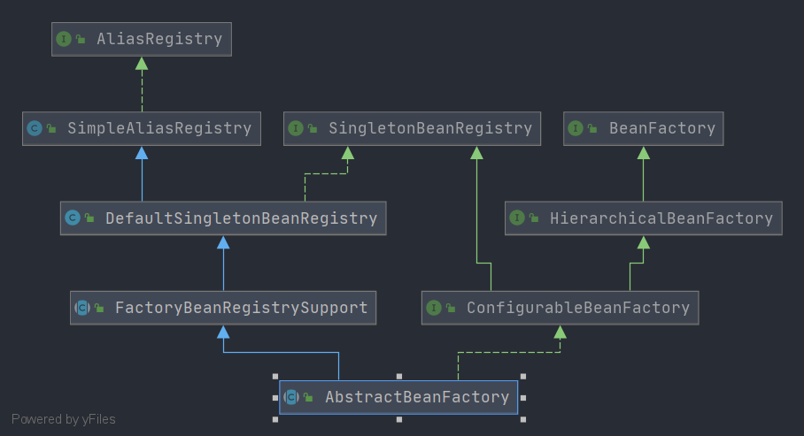

# Spring AbstractBeanFactory

- 类全路径: `org.springframework.beans.factory.support.AbstractBeanFactory	`

- 类图

  


## 成员变量分析

```java
/**
 *
 * Custom PropertyEditorRegistrars to apply to the beans of this factory.
 * 自定义 属性编辑器注册者
 *  */
private final Set<PropertyEditorRegistrar> propertyEditorRegistrars = new LinkedHashSet<>(4);

/**
 * Custom PropertyEditors to apply to the beans of this factory.
 * 自定义的属性编辑器
 * key: class
 * value: 属性编辑器
 * */
private final Map<Class<?>, Class<? extends PropertyEditor>> customEditors = new HashMap<>(4);

/**
 * String resolvers to apply e.g. to annotation attribute values.
 *
 * 字符串解析列表
 * */
private final List<StringValueResolver> embeddedValueResolvers = new CopyOnWriteArrayList<>();

/**
 * BeanPostProcessors to apply in createBean.
 *
 * bean 后置处理器列表
 * */
private final List<BeanPostProcessor> beanPostProcessors = new CopyOnWriteArrayList<>();

/**
 *  Map from scope identifier String to corresponding Scope.
 *
 *  key: scopeName
 *  value: {@link Scope}
 *
 *  */
private final Map<String, Scope> scopes = new LinkedHashMap<>(8);

/**
 * Map from bean name to merged RootBeanDefinition.
 * key: beanName
 * value: RootBeanDefinition
 *  */
private final Map<String, RootBeanDefinition> mergedBeanDefinitions = new ConcurrentHashMap<>(256);

/**
 *
 * Names of beans that have already been created at least once.
 *
 * 已创建的beanName
 * */
private final Set<String> alreadyCreated = Collections.newSetFromMap(new ConcurrentHashMap<>(256));

/**
 *
 * Names of beans that are currently in creation.
 *
 * 正在创建的beanName
 * */
private final ThreadLocal<Object> prototypesCurrentlyInCreation =
      new NamedThreadLocal<>("Prototype beans currently in creation");

/**
 *  Parent bean factory, for bean inheritance support.
 *  父容器
 *  */
@Nullable
private BeanFactory parentBeanFactory;

/**
 * ClassLoader to resolve bean class names with, if necessary.
 *
 * Class loader
 * */
@Nullable
private ClassLoader beanClassLoader = ClassUtils.getDefaultClassLoader();

/**
 *  ClassLoader to temporarily resolve bean class names with, if necessary.
 *
 * 临时的类加载器
 * */
@Nullable
private ClassLoader tempClassLoader;

/**
 * Whether to cache bean metadata or rather reobtain it for every access.
 * 是否缓存 bean 元信息.
 *  true 缓存,
 *  false 不缓存
 * */
private boolean cacheBeanMetadata = true;

/**
 * Resolution strategy for expressions in bean definition values.
 *
 * el 表达式解析
 * */
@Nullable
private BeanExpressionResolver beanExpressionResolver;

/**
 * Spring ConversionService to use instead of PropertyEditors.
 * 转换服务
 * */
@Nullable
private ConversionService conversionService;

/**
 * A custom TypeConverter to use, overriding the default PropertyEditor mechanism.
 * 类型转换, 覆盖 PropertyEditor 类
 * */
@Nullable
private TypeConverter typeConverter;

/**
 * Indicates whether any InstantiationAwareBeanPostProcessors have been registered.
 * 是否有 {@link InstantiationAwareBeanPostProcessor}
 *
 * */
private volatile boolean hasInstantiationAwareBeanPostProcessors;

/**
 * Indicates whether any DestructionAwareBeanPostProcessors have been registered.
 * 是否有 {@link DestructionAwareBeanPostProcessor}
 * */
private volatile boolean hasDestructionAwareBeanPostProcessors;

/**
 *  Security context used when running with a SecurityManager.
 * 安全上下文
 * */
@Nullable
private SecurityContextProvider securityContextProvider;
```


