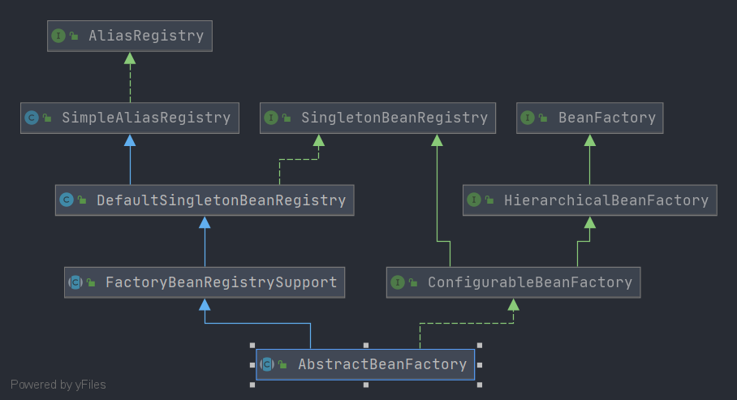

# Spring AbstractBeanFactory

- 类全路径: `org.springframework.beans.factory.support.AbstractBeanFactory`

- 类图

  


## 阅读指南

先了解父类的作用, 在了解成员变量的作用，最后查看方法. 

- 根据类图不难发现父类有
  - `FactoryBeanRegistrySupport`: [分析文章](/doc/book/bean/registry/Spring-FactoryBeanRegistrySupport.md)
    - `DefaultSingletonBeanRegistry`: [分析文章](/doc/context/Spring-DefaultSingletonBeanRegistry.md)
      - `SimpleAliasRegistry`: [分析文章](/doc/context/Spring-SimpleAliasRegistry.md)


## 成员变量

- 首先来了解一下成员变量都有那些, 分别代表了什么. 

```java
/**
 *
 * Custom PropertyEditorRegistrars to apply to the beans of this factory.
 * 自定义 属性编辑器注册者
 *  */
private final Set<PropertyEditorRegistrar> propertyEditorRegistrars = new LinkedHashSet<>(4);

/**
 * Custom PropertyEditors to apply to the beans of this factory.
 * 自定义的属性编辑器
 * key: class
 * value: 属性编辑器
 * */
private final Map<Class<?>, Class<? extends PropertyEditor>> customEditors = new HashMap<>(4);

/**
 * String resolvers to apply e.g. to annotation attribute values.
 *
 * 字符串解析列表
 * */
private final List<StringValueResolver> embeddedValueResolvers = new CopyOnWriteArrayList<>();

/**
 * BeanPostProcessors to apply in createBean.
 *
 * bean 后置处理器列表
 * */
private final List<BeanPostProcessor> beanPostProcessors = new CopyOnWriteArrayList<>();

/**
 *  Map from scope identifier String to corresponding Scope.
 *
 *  key: scopeName
 *  value: {@link Scope}
 *
 *  */
private final Map<String, Scope> scopes = new LinkedHashMap<>(8);

/**
 * Map from bean name to merged RootBeanDefinition.
 * key: beanName
 * value: RootBeanDefinition
 *  */
private final Map<String, RootBeanDefinition> mergedBeanDefinitions = new ConcurrentHashMap<>(256);

/**
 *
 * Names of beans that have already been created at least once.
 *
 * 已创建的beanName
 * */
private final Set<String> alreadyCreated = Collections.newSetFromMap(new ConcurrentHashMap<>(256));

/**
 *
 * Names of beans that are currently in creation.
 *
 * 正在创建的beanName
 * */
private final ThreadLocal<Object> prototypesCurrentlyInCreation =
      new NamedThreadLocal<>("Prototype beans currently in creation");

/**
 *  Parent bean factory, for bean inheritance support.
 *  父容器
 *  */
@Nullable
private BeanFactory parentBeanFactory;

/**
 * ClassLoader to resolve bean class names with, if necessary.
 *
 * Class loader
 * */
@Nullable
private ClassLoader beanClassLoader = ClassUtils.getDefaultClassLoader();

/**
 *  ClassLoader to temporarily resolve bean class names with, if necessary.
 *
 * 临时的类加载器
 * */
@Nullable
private ClassLoader tempClassLoader;

/**
 * Whether to cache bean metadata or rather reobtain it for every access.
 * 是否缓存 bean 元信息.
 *  true 缓存,
 *  false 不缓存
 * */
private boolean cacheBeanMetadata = true;

/**
 * Resolution strategy for expressions in bean definition values.
 *
 * el 表达式解析
 * */
@Nullable
private BeanExpressionResolver beanExpressionResolver;

/**
 * Spring ConversionService to use instead of PropertyEditors.
 * 转换服务
 * */
@Nullable
private ConversionService conversionService;

/**
 * A custom TypeConverter to use, overriding the default PropertyEditor mechanism.
 * 类型转换, 覆盖 PropertyEditor 类
 * */
@Nullable
private TypeConverter typeConverter;

/**
 * Indicates whether any InstantiationAwareBeanPostProcessors have been registered.
 * 是否有 {@link InstantiationAwareBeanPostProcessor}
 *
 * */
private volatile boolean hasInstantiationAwareBeanPostProcessors;

/**
 * Indicates whether any DestructionAwareBeanPostProcessors have been registered.
 * 是否有 {@link DestructionAwareBeanPostProcessor}
 * */
private volatile boolean hasDestructionAwareBeanPostProcessors;

/**
 *  Security context used when running with a SecurityManager.
 * 安全上下文
 * */
@Nullable
private SecurityContextProvider securityContextProvider;
```


在`AbstractBeanFactory` 成员变量的类或者接口有如下几种. 在开始方法分析之前需要先了解成员变量的作用,即接口(类)的作用


- `org.springframework.beans.PropertyEditorRegistrar`： 属性编辑器注册接口, [分析文章](/doc/book/bean/propertyEditor/Spring-PropertyEditorRegistrar.md)

- `java.beans.PropertyEditor`: 属性编辑器

- `org.springframework.util.StringValueResolver`: 字符串解析接口, [分析文章](/doc/book/utils/Spring-StringValueResolver.md)

- `org.springframework.beans.factory.config.BeanPostProcessor`: bean 后置处理器

  > 作用是在Bean对象在实例化和依赖注入完毕后，在显示调用初始化方法的前后添加我们自己的逻辑。注意是Bean实例化完毕后及依赖注入完成后触发的

- `org.springframework.beans.factory.config.Scope`: 作用于接口, [分析文章](/doc/book/bean/Scope/Spring-Scope.md)

- `org.springframework.beans.factory.support.RootBeanDefinition`: bean 定义对象, [分析文章](/doc/book/bean/BeanDefinition/Spring-RootBeanDefinition.md)

- `org.springframework.beans.factory.BeanFactory`: bean 工厂

- `org.springframework.beans.factory.config.BeanExpressionResolver`： el 表达式解析

- `org.springframework.core.convert.ConversionService`： 转换服务接口, [分析文章](/doc/book/core/convert/Spring-ConversionService.md)

- `org.springframework.beans.TypeConverter`: 类型转换接口, [分析文章](/doc/book/core/convert/Spring-TypeConverter.md)

- `org.springframework.beans.factory.support.SecurityContextProvider`: 安全上下文


## 方法分析

### getBean & doGetBean

- `AbstractBeanFactory` 提供的 `getBean` 最终通过 `doGetBean` 来进行获取. 本段围绕`doGetBean` 进行展开


在 `doGetBean` 中有三种bean获取和创建的形式

1. 单例bean的创建和获取
2. 原型bean的创建和获取
3. 类型转换器创建和获取
4. 从父bean工厂中创建和获取
5. 从scope 中创建和获取


开始分析方法前先了解几个方法`transformedBeanName` 和 `originalBeanName`


### transformedBeanName

- 转换beanName

	1. 通过·BeanFactoryUtils.transformedBeanName· 求beanName
	2. 如果是有别名的(方法参数是别名) . 会从别名列表中获取对应的 beanName


```java
protected String transformedBeanName(String name) {
   // 转换 beanName .
   // 1. 通过·BeanFactoryUtils.transformedBeanName· 求beanName
   // 2. 如果是有别名的(方法参数是别名) . 会从别名列表中获取对应的 beanName
   return canonicalName(BeanFactoryUtils.transformedBeanName(name));
}
```

- `BeanFactoryUtils.transformedBeanName` 方法的细节. 

  `transformedBeanName`方法的作用就是将beanName还原. 

  1. 如果不存在 `&` 前缀直接返回beanName
  2. 如果存在 `&` 一层一层去掉`&` 返回一个真实的beanName 

```java
	public static String transformedBeanName(String name) {
		Assert.notNull(name, "'name' must not be null");
		// 名字不是 & 开头直接返回
		if (!name.startsWith(BeanFactory.FACTORY_BEAN_PREFIX)) {
			return name;
		}
		// 截取字符串 在返回
		return transformedBeanNameCache.computeIfAbsent(name, beanName -> {
			do {
				beanName = beanName.substring(BeanFactory.FACTORY_BEAN_PREFIX.length());
			}
			while (beanName.startsWith(BeanFactory.FACTORY_BEAN_PREFIX));
			return beanName;
		});
	}

```


关于别名的处理 `canonicalName` 是主要方法, 详细代码如下

### canonicalName

- 获取别名, 如果没有则返回本身

- 从别名容器中获取

```java
public String canonicalName(String name) {
   String canonicalName = name;
   // Handle aliasing...
   String resolvedName;
   do {
      // 别名的获取
      resolvedName = this.aliasMap.get(canonicalName);
      if (resolvedName != null) {
         canonicalName = resolvedName;
      }
   }
   while (resolvedName != null);
   return canonicalName;
}
```


### originalBeanName

- 方法作用: 确定 beanName

  在这里引用了`transformedBeanName` 详细查看上文

```java
protected String originalBeanName(String name) {
   // 转换 beanName
   String beanName = transformedBeanName(name);
   // 是否是 & 开头, & 开头代表工厂bean
   if (name.startsWith(FACTORY_BEAN_PREFIX)) {
      // 计算新的名字
      beanName = FACTORY_BEAN_PREFIX + beanName;
   }
   return beanName;
}
```


在了解上述方法后开始我们的源码分析. 在分析的时候再补充细节方法(本类). 


#### 单例bean的创建和获取

首先来看单例bean的创建和获取

1. 获取 bean 名称

2. 从单例容器中获取 bean 实例

   关于`getSingleton`方法的细节查看: [DefaultSingletonBeanRegistry##获取方法解析](/doc/context/Spring-DefaultSingletonBeanRegistry.md)

```java
// 转换beanName
final String beanName = transformedBeanName(name);
Object bean;

// Eagerly check singleton cache for manually registered singletons.
// 获取单例对象
Object sharedInstance = getSingleton(beanName);
// 单例对象是否存在 参数是否为空
if (sharedInstance != null && args == null) {
   if (logger.isTraceEnabled()) {
      if (isSingletonCurrentlyInCreation(beanName)) {
         logger.trace("Returning eagerly cached instance of singleton bean '" + beanName +
               "' that is not fully initialized yet - a consequence of a circular reference");
      }
      else {
         logger.trace("Returning cached instance of singleton bean '" + beanName + "'");
      }
   }
   // 获取bean实例
   bean = getObjectForBeanInstance(sharedInstance, name, beanName, null);
}
```


在 `AbstractBeanFactory` 中还有一处创建单例bean的地方, 也在`doGetBean` 方法中, 详细代码如下

```java
// Create bean instance.
// 单例创建
// 判断是否是单例
if (mbd.isSingleton()) {
   // 获取bean单例bean
   sharedInstance = getSingleton(beanName, () -> {
      try {
         // 创建bean
         return createBean(beanName, mbd, args);
      }
      catch (BeansException ex) {
         // Explicitly remove instance from singleton cache: It might have been put there
         // eagerly by the creation process, to allow for circular reference resolution.
         // Also remove any beans that received a temporary reference to the bean.
         // 摧毁单例的bean
         destroySingleton(beanName);
         throw ex;
      }
   });
   // 获取 bean 实例
   bean = getObjectForBeanInstance(sharedInstance, name, beanName, mbd);
}
```


上述代码中`getSingleton` 的解析还是看: [DefaultSingletonBeanRegistry](/doc/context/Spring-DefaultSingletonBeanRegistry.md)

在两端单例对象创建和和获取的方法中都出现了`getObjectForBeanInstance` 这个方法在其他两种获取创建bean的时候也会使用, 这个方法留到下面说


- `createBean` 是一个抽象方法

  ```java
  protected abstract Object createBean(String beanName, RootBeanDefinition mbd, @Nullable Object[] args)
        throws BeanCreationException;
  ```


这里暂时不具体展开, 详细可以查看: [AbstractAutowireCapableBeanFactory 分析文章](/doc/book/bean/factory/Spring-AbstractAutowireCapableBeanFactory.md)


#### 原型 bean 的创建和获取

- 下面这段代码是原型bean的创建过程

```java
else if (mbd.isPrototype()) {
    // It's a prototype -> create a new instance.
    Object prototypeInstance = null;
    try {
        // 创建之前的行为
        beforePrototypeCreation(beanName);
        // 创建
        prototypeInstance = createBean(beanName, mbd, args);
    }
    finally {
        // 创建后的行为
        afterPrototypeCreation(beanName);
    }
    // 创建
    bean = getObjectForBeanInstance(prototypeInstance, name, beanName, mbd);
}
```


#### 类型转换器创建和获取

- 从类型转换器中转换后获取

  这里主要对象为: **`TypeConverter`** ，分析查看[这篇文章]()

```java
if (requiredType != null && !requiredType.isInstance(bean)) {
   try {
      // 获取类型转换器 , 通过类型转换器机械能转换
      T convertedBean = getTypeConverter().convertIfNecessary(bean, requiredType);
      if (convertedBean == null) {
         throw new BeanNotOfRequiredTypeException(name, requiredType, bean.getClass());
      }
      return convertedBean;
   }
   catch (TypeMismatchException ex) {
      if (logger.isTraceEnabled()) {
         logger.trace("Failed to convert bean '" + name + "' to required type '" +
               ClassUtils.getQualifiedName(requiredType) + "'", ex);
      }
      throw new BeanNotOfRequiredTypeException(name, requiredType, bean.getClass());
   }
}
```


#### 从父bean工厂中创建和获取

- 从父bean工厂中创建的形式和整个`doGetBean` 行为是一致的. 这里不做细节展开. 

```java
// Check if bean definition exists in this factory.
// 获取父bean工厂
// 从 父bean工厂中创建
BeanFactory parentBeanFactory = getParentBeanFactory();
// 从 父bean 工厂中查询
if (parentBeanFactory != null && !containsBeanDefinition(beanName)) {
   // Not found -> check parent.
   // 确定beanName
   String nameToLookup = originalBeanName(name);
      // 父bean工厂 类型判断
   if (parentBeanFactory instanceof AbstractBeanFactory) {
      // 再次获取
      return ((AbstractBeanFactory) parentBeanFactory).doGetBean(
            nameToLookup, requiredType, args, typeCheckOnly);
   }
   else if (args != null) {
      // Delegation to parent with explicit args.
      return (T) parentBeanFactory.getBean(nameToLookup, args);
   }
   else if (requiredType != null) {
      // No args -> delegate to standard getBean method.
      return parentBeanFactory.getBean(nameToLookup, requiredType);
   }
   else {
      return (T) parentBeanFactory.getBean(nameToLookup);
   }
}
```


#### 从scope 中创建和获取

- 从 scope 接口中获取对象

  获取通过 scope 详细查看[这篇文章]()

  获取 scope 名称 -> 获取 scope 接口对象 -> 从 scope 中获取. 

  `scope#get` 第二个参数逻辑

  获取前执行 `beforePrototypeCreation`

  创建bean

  获取候执行 `afterPrototypeCreation`

```java
else {
   // 获取作用域名称
   String scopeName = mbd.getScope();
   // 从作用域容器中获取当前作用域名称对应的作用域接口 scope
   final Scope scope = this.scopes.get(scopeName);
   if (scope == null) {
      throw new IllegalStateException("No Scope registered for scope name '" + scopeName + "'");
   }
   try {
      // 从 scope 接口卓获取
      Object scopedInstance = scope.get(beanName, () -> {
         // 创建之前做的行为
         beforePrototypeCreation(beanName);
         try {
            // 创建 bean
            return createBean(beanName, mbd, args);
         }
         finally {
            // 创建之后做的行为
            afterPrototypeCreation(beanName);
         }
      });
      // 获取 bean 实例
      bean = getObjectForBeanInstance(scopedInstance, name, beanName, mbd);
   }
   catch (IllegalStateException ex) {
      throw new BeanCreationException(beanName,
            "Scope '" + scopeName + "' is not active for the current thread; consider " +
                  "defining a scoped proxy for this bean if you intend to refer to it from a singleton",
            ex);
   }
}
```


#### 依赖处理

在 **`doGetBean`**中还有一段关于依赖的处理代码，详细如下

```java
final RootBeanDefinition mbd = getMergedLocalBeanDefinition(beanName);
checkMergedBeanDefinition(mbd, beanName, args);

// Guarantee initialization of beans that the current bean depends on.
// 需要依赖的bean
String[] dependsOn = mbd.getDependsOn();
if (dependsOn != null) {
   for (String dep : dependsOn) {
      // 是否依赖
      if (isDependent(beanName, dep)) {
         throw new BeanCreationException(mbd.getResourceDescription(), beanName,
               "Circular depends-on relationship between '" + beanName + "' and '" + dep + "'");
      }
      // 注册依赖bean
      registerDependentBean(dep, beanName);
      try {
         // 获取bean
         getBean(dep);
      }
      catch (NoSuchBeanDefinitionException ex) {
         throw new BeanCreationException(mbd.getResourceDescription(), beanName,
               "'" + beanName + "' depends on missing bean '" + dep + "'", ex);
      }
   }
}
```


这里的依赖处理主要是将bean的依赖注册, 注册到map中, 下面两个map是存储容器

```java
	private final Map<String, Set<String>> dependentBeanMap = new ConcurrentHashMap<>(64);


	private final Map<String, Set<String>> dependenciesForBeanMap = new ConcurrentHashMap<>(64);
```


### registerDependentBean

- 方法路径: `org.springframework.beans.factory.support.DefaultSingletonBeanRegistry#registerDependentBean`

- 注册bean所需的依赖

下面这段代码主要是一个map对象的操作过程不做过多描述, 各位请查看下面代码. 

```java
public void registerDependentBean(String beanName, String dependentBeanName) {
   // 别名
   String canonicalName = canonicalName(beanName);

   synchronized (this.dependentBeanMap) {
      // 向依赖关系中放入数据
      Set<String> dependentBeans =
            this.dependentBeanMap.computeIfAbsent(canonicalName, k -> new LinkedHashSet<>(8));
      if (!dependentBeans.add(dependentBeanName)) {
         return;
      }
   }

   synchronized (this.dependenciesForBeanMap) {
      Set<String> dependenciesForBean =
            this.dependenciesForBeanMap.computeIfAbsent(dependentBeanName, k -> new LinkedHashSet<>(8));
      dependenciesForBean.add(canonicalName);
   }
}
```


与之相关的更多请查看: [DefaultSingletonBeanRegistry]()


### getObjectForBeanInstance

- 获取bean实例

- 主要逻辑

  判断是否是工厂bean 类型

  是否是 nullBean

  是否是 FactoryBean

  ```java
  if (BeanFactoryUtils.isFactoryDereference(name)) {
     // 类型判断
     if (beanInstance instanceof NullBean) {
        return beanInstance;
     }
     if (!(beanInstance instanceof FactoryBean)) {
        throw new BeanIsNotAFactoryException(beanName, beanInstance.getClass());
     }
     if (mbd != null) {
        mbd.isFactoryBean = true;
     }
     // 返回实例
     return beanInstance;
  }
  ```

  

  

  

  从 `factoryBeanObjectCache` 容器中获取

  `org.springframework.beans.factory.support.FactoryBeanRegistrySupport#factoryBeanObjectCache`： `getCachedObjectForFactoryBean`

  容器存储 key: beanName , value: bean 实例. 详细查看[这篇文章]() 

  获取 mergeBeanDefination ： `getMergedLocalBeanDefinition`

  从 FactoryBean 中获取实例: `getObjectFromFactoryBean`


```java
Object object = null;
if (mbd != null) {
   mbd.isFactoryBean = true;
}
else {
   // 缓存中获取
   object = getCachedObjectForFactoryBean(beanName);
}
if (object == null) {
   // Return bean instance from factory.
   // 如果还是 null 从 factory bean 中创建
   FactoryBean<?> factory = (FactoryBean<?>) beanInstance;
   // Caches object obtained from FactoryBean if it is a singleton.
   if (mbd == null && containsBeanDefinition(beanName)) {
      mbd = getMergedLocalBeanDefinition(beanName);
   }
   boolean synthetic = (mbd != null && mbd.isSynthetic());
   // 从 FactoryBean 中获取bean实例
   object = getObjectFromFactoryBean(factory, beanName, !synthetic);
}
```


详细各个方法的分析查看下面文章. 


- 完整代码如下

```java
protected Object getObjectForBeanInstance(
      Object beanInstance, String name, String beanName, @Nullable RootBeanDefinition mbd) {

   // Don't let calling code try to dereference the factory if the bean isn't a factory.
   // 判断 beanName 是不是 bean 工厂
   if (BeanFactoryUtils.isFactoryDereference(name)) {
      // 类型判断
      if (beanInstance instanceof NullBean) {
         return beanInstance;
      }
      if (!(beanInstance instanceof FactoryBean)) {
         throw new BeanIsNotAFactoryException(beanName, beanInstance.getClass());
      }
      if (mbd != null) {
         mbd.isFactoryBean = true;
      }
      // 返回实例
      return beanInstance;
   }

   // Now we have the bean instance, which may be a normal bean or a FactoryBean.
   // If it's a FactoryBean, we use it to create a bean instance, unless the
   // caller actually wants a reference to the factory.
   // 判断是否是 factoryBean
   if (!(beanInstance instanceof FactoryBean)) {
      return beanInstance;
   }

   Object object = null;
   if (mbd != null) {
      mbd.isFactoryBean = true;
   }
   else {
      // 缓存中获取
      object = getCachedObjectForFactoryBean(beanName);
   }
   if (object == null) {
      // Return bean instance from factory.
      // 如果还是 null 从 factory bean 中创建
      FactoryBean<?> factory = (FactoryBean<?>) beanInstance;
      // Caches object obtained from FactoryBean if it is a singleton.
      if (mbd == null && containsBeanDefinition(beanName)) {
         mbd = getMergedLocalBeanDefinition(beanName);
      }
      boolean synthetic = (mbd != null && mbd.isSynthetic());
      // 从 FactoryBean 中获取bean实例
      object = getObjectFromFactoryBean(factory, beanName, !synthetic);
   }
   return object;
}
```


### beforePrototypeCreation

- 创建bean之前需要做的事项. 在原型模式下创建和作用域创建的情况下需要进行

执行列表

1. 通过bean名称获取看是否正在创建
   1. 没有正在创建, 放入正在创建的容器中
2. beanName 获取到的结果是否是 string 类型
   1. 将查询到的和当前参数 beanName 都放入正在创建的容器
3. 其他情况

```java
@SuppressWarnings("unchecked")
protected void beforePrototypeCreation(String beanName) {
   // 从正在创建的bean名称列表中获取
   Object curVal = this.prototypesCurrentlyInCreation.get();
   if (curVal == null) {
      // 设置正在创建的bean
      this.prototypesCurrentlyInCreation.set(beanName);
   }
   else if (curVal instanceof String) {
      // 设置正在创建的bean Name
      Set<String> beanNameSet = new HashSet<>(2);
      beanNameSet.add((String) curVal);
      beanNameSet.add(beanName);
      this.prototypesCurrentlyInCreation.set(beanNameSet);
   }
   else {
      // 其他情况
      Set<String> beanNameSet = (Set<String>) curVal;
      beanNameSet.add(beanName);
   }
}
```


### afterPrototypeCreation

- 创建bean之后需要做的事项. 在原型模式下创建和作用域创建的情况下需要进行

`afterPrototypeCreation` 方法要和`beforePrototypeCreation` 对应着看.  

通过对应查看可以方便理解 每个`if else`


```java
@SuppressWarnings("unchecked")
protected void afterPrototypeCreation(String beanName) {
   // 获取当前正在创建的beanName
   Object curVal = this.prototypesCurrentlyInCreation.get();
   // 是否字符串类型
   if (curVal instanceof String) {
      // 直接移除
      this.prototypesCurrentlyInCreation.remove();
   }
   // 是否是 set 类型
   else if (curVal instanceof Set) {
      Set<String> beanNameSet = (Set<String>) curVal;
      // set 类型中移除 beanName
      beanNameSet.remove(beanName);
      if (beanNameSet.isEmpty()) {
         // 清空set
         this.prototypesCurrentlyInCreation.remove();
      }
   }
}
```


### containsBean

- 方法作用: 判断是否存在bean

```java
if (containsSingleton(beanName) || containsBeanDefinition(beanName))
```

`containsSingleton` : 判断是否存在beanName

对应的map -> `org.springframework.beans.factory.support.DefaultSingletonBeanRegistry#singletonObjects`


`containsBeanDefinition`： 抽象方法

```java
protected abstract boolean containsBeanDefinition(String beanName);
```

实现方法: `org.springframework.beans.factory.support.DefaultListableBeanFactory#containsBeanDefinition` 方法判断map中是否存在key

对应map  -> `org.springframework.beans.factory.support.DefaultListableBeanFactory#beanDefinitionMap`


```java
return (!BeanFactoryUtils.isFactoryDereference(name) || isFactoryBean(name));
```

判断是否是 **`&`** 开头, 判断是否是 **`FactoryBean`**


```java
 BeanFactory parentBeanFactory = getParentBeanFactory();

   return (parentBeanFactory != null && parentBeanFactory.containsBean(originalBeanName(name)));
```

获取父beanFactory 在执行一次本流程来判断是否存在bean


- 方法完整代码如下

```java
@Override
public boolean containsBean(String name) {
   // 转换 beanName
   String beanName = transformedBeanName(name);
   // 是否单例 ， 是否有 bean 的定义
   if (containsSingleton(beanName) || containsBeanDefinition(beanName)) {
      // 判断是否是 & 开头
      // 是否是 factoryBean
      return (!BeanFactoryUtils.isFactoryDereference(name) || isFactoryBean(name));
   }
   // Not found -> check parent.
   // 当前beanFactory没有找到, 查询父beanFactory
   BeanFactory parentBeanFactory = getParentBeanFactory();

   return (parentBeanFactory != null && parentBeanFactory.containsBean(originalBeanName(name)));
}
```


### isSingleton

- 方法判断是否是单例的

```java
// 获取 beanName
String beanName = transformedBeanName(name);

// 获取单例对象实例
Object beanInstance = getSingleton(beanName, false);
if (beanInstance != null) {
   if (beanInstance instanceof FactoryBean) {
      // beanName 是否是 & 开头
      // FactoryBean 是否是单例的
      return (BeanFactoryUtils.isFactoryDereference(name) || ((FactoryBean<?>) beanInstance).isSingleton());
   }
   else {
      // 是否是 & 开头
      return !BeanFactoryUtils.isFactoryDereference(name);
   }
}
```

转换beanName

获取单例对象

判断是否是 FactoryBean

判断是否包含 **`&`** 或 通过 FactoryBean 判断是否单例


```java
// 获取 父beanFactory
BeanFactory parentBeanFactory = getParentBeanFactory();
// 父beanFactory 是否为空
// 是否包含 beanName
if (parentBeanFactory != null && !containsBeanDefinition(beanName)) {
   // No bean definition found in this factory -> delegate to parent.
   // 通过父BeanFactory 判断是否是单例的
   return parentBeanFactory.isSingleton(originalBeanName(name));
}
```

获取父bean工厂

判断父工厂是否存在, 父工厂是否存在 beanName

通过 父工厂判断是否是单例的


```java
RootBeanDefinition mbd = getMergedLocalBeanDefinition(beanName);
// 通过 beanDefinition 判断是否是单例
if (mbd.isSingleton()) {
   // 是否是 factoryBean
   if (isFactoryBean(beanName, mbd)) {
      // 是否是 & 开头
      if (BeanFactoryUtils.isFactoryDereference(name)) {
         return true;
      }
      // 获取 factoryBean
      FactoryBean<?> factoryBean = (FactoryBean<?>) getBean(FACTORY_BEAN_PREFIX + beanName);
      // 通过 factoryBean 判断
      return factoryBean.isSingleton();
   }
   else {
      return !BeanFactoryUtils.isFactoryDereference(name);
   }
}
else {
   return false;
}
```

获取 合并后的 BeanDefinition 对象. 

通过 beanDefinition 判断是否单例

判断是否是 factoryBean

是否是 **`&`** 开头

获取 FactoryBean 通过factoryBean判断是否是单例. 

判断是否是 `&` 开头


- 完整方法代码如下

```java
@Override
public boolean isSingleton(String name) throws NoSuchBeanDefinitionException {
   // 获取 beanName
   String beanName = transformedBeanName(name);

   // 获取单例对象实例
   Object beanInstance = getSingleton(beanName, false);
   if (beanInstance != null) {
      if (beanInstance instanceof FactoryBean) {
         // beanName 是否是 & 开头
         // FactoryBean 是否是单例的
         return (BeanFactoryUtils.isFactoryDereference(name) || ((FactoryBean<?>) beanInstance).isSingleton());
      }
      else {
         // 是否是 & 开头
         return !BeanFactoryUtils.isFactoryDereference(name);
      }
   }

   // No singleton instance found -> check bean definition.
   // 获取 父beanFactory
   BeanFactory parentBeanFactory = getParentBeanFactory();
   // 父beanFactory 是否为空
   // 是否包含 beanName
   if (parentBeanFactory != null && !containsBeanDefinition(beanName)) {
      // No bean definition found in this factory -> delegate to parent.
      // 通过父BeanFactory 判断是否是单例的
      return parentBeanFactory.isSingleton(originalBeanName(name));
   }

   // 获取合并后的 beanDefinition
   RootBeanDefinition mbd = getMergedLocalBeanDefinition(beanName);

   // In case of FactoryBean, return singleton status of created object if not a dereference.
   // 通过 beanDefinition 判断是否是单例
   if (mbd.isSingleton()) {
      // 是否是 factoryBean
      if (isFactoryBean(beanName, mbd)) {
         // 是否是 & 开头
         if (BeanFactoryUtils.isFactoryDereference(name)) {
            return true;
         }
         // 获取 factoryBean
         FactoryBean<?> factoryBean = (FactoryBean<?>) getBean(FACTORY_BEAN_PREFIX + beanName);
         // 通过 factoryBean 判断
         return factoryBean.isSingleton();
      }
      else {
         return !BeanFactoryUtils.isFactoryDereference(name);
      }
   }
   else {
      return false;
   }
}
```


### isPrototype

- 方法作用: 判断是否是原型模式

`isPrototype` 和 `isSingleton` 的判断方式类似, 这里不对`isPrototype` 做详细分析, 下面直接贴出代码及注释请各位自行阅读. 

```java
@Override
public boolean isPrototype(String name) throws NoSuchBeanDefinitionException {
   // 获取 beanName
   String beanName = transformedBeanName(name);

   // 获取 父 bean 工厂
   BeanFactory parentBeanFactory = getParentBeanFactory();
   // 是否包含 beanName
   if (parentBeanFactory != null && !containsBeanDefinition(beanName)) {
      // No bean definition found in this factory -> delegate to parent.
      // 父工厂判断是否是原型模式
      return parentBeanFactory.isPrototype(originalBeanName(name));
   }

   // 获取合并后的 beanDefinition
   RootBeanDefinition mbd = getMergedLocalBeanDefinition(beanName);
   // 通过 beanDefinition 判断是否是原型
   if (mbd.isPrototype()) {
      // In case of FactoryBean, return singleton status of created object if not a dereference.
      // 是否是 & 开头 , 是否是 FactoryBean
      return (!BeanFactoryUtils.isFactoryDereference(name) || isFactoryBean(beanName, mbd));
   }

   // Singleton or scoped - not a prototype.
   // However, FactoryBean may still produce a prototype object...
   // 判断是否是 & 开头
   if (BeanFactoryUtils.isFactoryDereference(name)) {
      return false;
   }
   // 是否是 工厂bean
   if (isFactoryBean(beanName, mbd)) {
      // 获取 factoryBean
      final FactoryBean<?> fb = (FactoryBean<?>) getBean(FACTORY_BEAN_PREFIX + beanName);
      if (System.getSecurityManager() != null) {
         // 通过 factoryBean 判断是否是原型
         return AccessController.doPrivileged((PrivilegedAction<Boolean>) () ->
                     ((fb instanceof SmartFactoryBean && ((SmartFactoryBean<?>) fb).isPrototype()) || !fb.isSingleton()),
               getAccessControlContext());
      }
      else {
         // 通过 factoryBean 判断是否是原型
         return ((fb instanceof SmartFactoryBean && ((SmartFactoryBean<?>) fb).isPrototype()) ||
               !fb.isSingleton());
      }
   }
   else {
      return false;
   }
}
```


### isTypeMatch
- 方法签名: `org.springframework.beans.factory.support.AbstractBeanFactory.isTypeMatch(java.lang.String, org.springframework.core.ResolvableType, boolean)`

- 方法作用： 判断类型是否匹配

这个方法是一个很大的方法, 行数多, 涉及到的其他方法也多. 请各位保持耐心.  

在开始分析之前先了解一个方法`isAssignableFrom`

> `isAssignableFrom`方法作用: 用来判断两个类的之间的关联关系，也可以说是一个类是否可以被强制转换为另外一个实例对象
>
> **在这里笔者将其解释为来自**


```java
/**
 * Determines if the class or interface represented by this
 * {@code Class} object is either the same as, or is a superclass or
 * superinterface of, the class or interface represented by the specified
 * {@code Class} parameter. It returns {@code true} if so;
 * otherwise it returns {@code false}. If this {@code Class}
 * object represents a primitive type, this method returns
 * {@code true} if the specified {@code Class} parameter is
 * exactly this {@code Class} object; otherwise it returns
 * {@code false}.
 *
 * <p> Specifically, this method tests whether the type represented by the
 * specified {@code Class} parameter can be converted to the type
 * represented by this {@code Class} object via an identity conversion
 * or via a widening reference conversion. See <em>The Java Language
 * Specification</em>, sections 5.1.1 and 5.1.4 , for details.
 *
 * @param cls the {@code Class} object to be checked
 * @return the {@code boolean} value indicating whether objects of the
 * type {@code cls} can be assigned to objects of this class
 * @exception NullPointerException if the specified Class parameter is
 *            null.
 * @since JDK1.1
 */
public native boolean isAssignableFrom(Class<?> cls);
```


```java
interface D {

}

public class JvmDemoApplication {

   public static void main(String[] args) {
      System.out.println(A.class.isAssignableFrom(B.class)); // false
      System.out.println(C.class.isAssignableFrom(A.class)); // false
      System.out.println(A.class.isAssignableFrom(C.class)); // true
      System.out.println(D.class.isAssignableFrom(A.class)); // false

      C c = new C();
      A a = new A();
      A a1 = c;
      C c1 = (C) a; // 转换异常 java.lang.ClassCastException
      System.out.println();
   }

}

class A {
}

class B {
}

class C extends A
      implements D {

}
```


真是开始分析`isTypeMatch`


```java
// 获取 beanName
String beanName = transformedBeanName(name);
// 判断是否是 & 开头
boolean isFactoryDereference = BeanFactoryUtils.isFactoryDereference(name);

// Check manually registered singletons.
// 获取 bean实例
Object beanInstance = getSingleton(beanName, false);
```

这是方法开始的前几行，将基本信息准备好，等待后续使用。


```java
if (beanInstance != null && beanInstance.getClass() != NullBean.class) {
   // 是否是 FactoryBean 类型
   if (beanInstance instanceof FactoryBean) {
      if (!isFactoryDereference) {
         // 从 factoryBean中获取类型.
         Class<?> type = getTypeForFactoryBean((FactoryBean<?>) beanInstance);
         // 类型不为空
         // typeToMatch类型是否来自 type
         return (type != null && typeToMatch.isAssignableFrom(type));
      }
      else {
         // 是否是接口实现
         return typeToMatch.isInstance(beanInstance);
      }
   }
```


这段方法中主要是将 类型获取到，从 FactoryBean中获取, 获取方式如下.  


### getTypeForFactoryBean

- `getTypeForFactoryBean` 从 FactoryBean中获取类型. 直接调用`org.springframework.beans.factory.FactoryBean#getObjectType`方法

```java
@Nullable
protected Class<?> getTypeForFactoryBean(final FactoryBean<?> factoryBean) {
   try {
      if (System.getSecurityManager() != null) {
         // 从 factoryBean 获取类型后通过 AccessController 绕一圈获取
         return AccessController.doPrivileged((PrivilegedAction<Class<?>>)
               factoryBean::getObjectType, getAccessControlContext());
      }
      else {
         // 调用 factoryBean 的 getObjectType 方法获取类型
         return factoryBean.getObjectType();
      }
   }
   catch (Throwable ex) {
      // Thrown from the FactoryBean's getObjectType implementation.
      logger.info("FactoryBean threw exception from getObjectType, despite the contract saying " +
            "that it should return null if the type of its object cannot be determined yet", ex);
      return null;
   }
}
```


在得到类型后调用`isAssignableFrom`来进行判断即下面代码

```java
return (type != null && typeToMatch.isAssignableFrom(type));
```


另一种判断方式

```java
return typeToMatch.isInstance(beanInstance);
```

`isInstance`方法可以简单理解成是否是实现类，是否是继承类详细方法可以看这个方法签名对应的方法

`org.springframework.core.ResolvableType#isAssignableFrom(org.springframework.core.ResolvableType, java.util.Map<java.lang.reflect.Type,java.lang.reflect.Type>)`


回到方法主线上看下面这段代码


```java
else if (!isFactoryDereference) {
   // 是否是接口实现
   if (typeToMatch.isInstance(beanInstance)) {
      // Direct match for exposed instance?
      return true;
   }
   // 是否包含泛型
   // 是否包含beanName
   else if (typeToMatch.hasGenerics() && containsBeanDefinition(beanName)) {
      // Generics potentially only match on the target class, not on the proxy...
      // 获取 合并后的 BeanDefinition
      RootBeanDefinition mbd = getMergedLocalBeanDefinition(beanName);
      // 获取 beanDefinition 的类型
      Class<?> targetType = mbd.getTargetType();
      // beanDefinition 的目标类型是否和 bean实例类型相同
      if (targetType != null && targetType != ClassUtils.getUserClass(beanInstance)) {
         // Check raw class match as well, making sure it's exposed on the proxy.
         // 类型解析得到真实类型
         Class<?> classToMatch = typeToMatch.resolve();
         // 真实类型是否为空
         // 真是类型是否是bean实例的实现
         if (classToMatch != null && !classToMatch.isInstance(beanInstance)) {
            return false;
         }
         // typeToMatch 是否来自 targetType
         if (typeToMatch.isAssignableFrom(targetType)) {
            return true;
         }
      }
      // 获取目标类型
      ResolvableType resolvableType = mbd.targetType;
      if (resolvableType == null) {
         // 类型设置成 工厂方法的返回值类型
         resolvableType = mbd.factoryMethodReturnType;
      }
      // typeToMatch 是否来自 resolvableType
      return (resolvableType != null && typeToMatch.isAssignableFrom(resolvableType));
   }
}
```

开头的几行代码就不做展开了直接从下面这个`else if` 开始

```java
else if (typeToMatch.hasGenerics() && containsBeanDefinition(beanName)) {}	
```

首先`hasGenerics` 是用来判断是否存在泛型的. 

`hasGenerics`的方法实现`org.springframework.core.ResolvableType#getGenerics`

`containsBeanDefinition` 抽象方法, 前文已有描述. 


`getMergedLocalBeanDefinition` 获取合并的bean定义对象(beanDefinition)，从bean定义中获取目标类型，相关代码如下

```java
// 获取 合并后的 BeanDefinition
RootBeanDefinition mbd = getMergedLocalBeanDefinition(beanName);
// 获取 beanDefinition 的类型
Class<?> targetType = mbd.getTargetType();
```


在获取类型后紧接着做空判断的和使用情况的判断(类型是否相等)

```java
if (targetType != null && targetType != ClassUtils.getUserClass(beanInstance)) {}
```

主要方法: `org.springframework.util.ClassUtils#getUserClass(java.lang.Object)`


- `getUserClass` 方法如下. 

  逻辑:

  1. 判断是否包含 cglib 标记字符
     1. 包含获取父类
     2. 不包含直接返回

```java
public static Class<?> getUserClass(Class<?> clazz) {
   if (clazz.getName().contains(CGLIB_CLASS_SEPARATOR)) {
      Class<?> superclass = clazz.getSuperclass();
      if (superclass != null && superclass != Object.class) {
         return superclass;
      }
   }
   return clazz;
}
```


在`if ` 内的方法就和前文的类似

```java
// 类型解析得到真实类型
Class<?> classToMatch = typeToMatch.resolve();
// 真实类型是否为空
// 真是类型是否是bean实例的实现
if (classToMatch != null && !classToMatch.isInstance(beanInstance)) {
   return false;
}
// typeToMatch 是否来自 targetType
if (typeToMatch.isAssignableFrom(targetType)) {
   return true;
}
```


通过类型解析对象`ResolvableType` 解析出类(class) 通过 `isInstance` 和`isAssignableFrom`进行判断后返回结果


在`if ` 外的一段代码

```java
// 获取目标类型
ResolvableType resolvableType = mbd.targetType;
if (resolvableType == null) {
   // 类型设置成 工厂方法的返回值类型
   resolvableType = mbd.factoryMethodReturnType;
}
// typeToMatch 是否来自 resolvableType
return (resolvableType != null && typeToMatch.isAssignableFrom(resolvableType));
```


主要方法还是`isAssignableFrom` 对比的对象是

1. 函数参数`typeToMatch`,类型: `org.springframework.core.ResolvableType`

2. 通过 `beanDefinition` 获取的 `resolvableType`

   1. `beanDefinition`的`targetType`成员变量
   2. 工厂函数返回值 

   上述两种都是`org.springframework.core.ResolvableType` 类型


回到方法主线看下面代码


```java
// 不是单例 && 不存在beanName
else if (containsSingleton(beanName) && !containsBeanDefinition(beanName)) {
   // null instance registered
   return false;
}
```


这段代码只有两个判断

1. 判断 beanName 是否是单例的
2. 判断是否拥有 beanName 的描述对象 BeanDefinition


继续往下看方法


```java
// 获取父bean工厂
BeanFactory parentBeanFactory = getParentBeanFactory();
if (parentBeanFactory != null && !containsBeanDefinition(beanName)) {
   // No bean definition found in this factory -> delegate to parent.
   // 父 bean 工厂判断类型是否匹配
   return parentBeanFactory.isTypeMatch(originalBeanName(name), typeToMatch);
}
```


这段代码获取父beanFactory 然后再来做 `isTypeMatch` 这部分流程和本方法流程公用. 


继续往下看代码


```java
// Retrieve corresponding bean definition.
// 获取当前 beanName 合并后的BeanDefinition
RootBeanDefinition mbd = getMergedLocalBeanDefinition(beanName);
// 获取 beanName 对应的 beanDefinition 持有类
BeanDefinitionHolder dbd = mbd.getDecoratedDefinition();

// Setup the types that we want to match against
// 解析类型
Class<?> classToMatch = typeToMatch.resolve();
if (classToMatch == null) {
   // 强制等于 FactoryBean
   classToMatch = FactoryBean.class;
}
// 创建待匹配的类型数组
Class<?>[] typesToMatch = (FactoryBean.class == classToMatch ?
      new Class<?>[] {classToMatch} : new Class<?>[] {FactoryBean.class, classToMatch});


// Attempt to predict the bean type
// 预测bean类型
Class<?> predictedType = null;
```

这段代码是将后续代码中需要的变量都先准备好, 以供后续使用. 


```java
if (!isFactoryDereference && dbd != null && isFactoryBean(beanName, mbd)) {
   // We should only attempt if the user explicitly set lazy-init to true
   // and we know the merged bean definition is for a factory bean.
   // 是否懒加载
   // 是否允许 factoryBean 初始化
   if (!mbd.isLazyInit() || allowFactoryBeanInit) {
      // 获取合并的beanDefinition
      RootBeanDefinition tbd = getMergedBeanDefinition(dbd.getBeanName(), dbd.getBeanDefinition(), mbd);
      // 类型猜测
      Class<?> targetType = predictBeanType(dbd.getBeanName(), tbd, typesToMatch);
      // 类型是否为空
      // targetType 是否来自 FactoryBean
      if (targetType != null && !FactoryBean.class.isAssignableFrom(targetType)) {
         predictedType = targetType;
      }
   }
}
```

在了解前文信息后看这段代码就很容易理解. 

1. `isFactoryDereference` 标记是否是 `&`开头
2. `isFactoryBean` 判断是不是 factoryBean

在往里看有

1. `isLazyInit` : 是否懒加载
2. `allowFactoryBeanInit`： 是否允许工厂bean初始化

继续

获取 合并的 BeanDefinition ， 

做**类型推测** , 推测出bean类型

### predictBeanType

- 方法签名: `org.springframework.beans.factory.support.AbstractBeanFactory#predictBeanType`

  具体方法如下

```java
@Nullable
protected Class<?> predictBeanType(String beanName, RootBeanDefinition mbd, Class<?>... typesToMatch) {
   // 获取目标类型
   Class<?> targetType = mbd.getTargetType();
   // 是否为空
   if (targetType != null) {
      return targetType;
   }
   // 获取 工厂方法的返回值 判断是否为空
   if (mbd.getFactoryMethodName() != null) {
      return null;
   }
   // 解析 beanClass
   return resolveBeanClass(mbd, beanName, typesToMatch);
}
```

直接将BeanDefinition的targetType返回

判断是否存在 工厂方法的返回值, 不为空返回null

通过`resolveBeanClass`解析后返回


在方法中会继续向下调用`resolveBeanClass` , 也就是上面代码的最后一行


### resolveBeanClass

- 方法签名: `org.springframework.beans.factory.support.AbstractBeanFactory#resolveBeanClass`

具体方法如下


```java
@Nullable
protected Class<?> resolveBeanClass(final RootBeanDefinition mbd, String beanName, final Class<?>... typesToMatch)
      throws CannotLoadBeanClassException {

   try {
      // 是否包含 bean 类型
      if (mbd.hasBeanClass()) {
         // 直接返回
         return mbd.getBeanClass();
      }
      if (System.getSecurityManager() != null) {
         return AccessController.doPrivileged((PrivilegedExceptionAction<Class<?>>) () ->
               doResolveBeanClass(mbd, typesToMatch), getAccessControlContext());
      }
      else {
         // 从 bean definition 中获取
         return doResolveBeanClass(mbd, typesToMatch);
      }
   }
   catch (PrivilegedActionException pae) {
      ClassNotFoundException ex = (ClassNotFoundException) pae.getException();
      throw new CannotLoadBeanClassException(mbd.getResourceDescription(), beanName, mbd.getBeanClassName(), ex);
   }
   catch (ClassNotFoundException ex) {
      throw new CannotLoadBeanClassException(mbd.getResourceDescription(), beanName, mbd.getBeanClassName(), ex);
   }
   catch (LinkageError err) {
      throw new CannotLoadBeanClassException(mbd.getResourceDescription(), beanName, mbd.getBeanClassName(), err);
   }
}
```


解析bean类型的情况

1. `hasBeanClass`
   1. 返回 BeanDefinition#beanClass
2. 通过 `doResolveBeanClass` 具体解析返回


### doResolveBeanClass

- 方法签名: `org.springframework.beans.factory.support.AbstractBeanFactory#doResolveBeanClass`

直接开始看方法


```java
// 类加载器
ClassLoader beanClassLoader = getBeanClassLoader();
// 类加载器
ClassLoader dynamicLoader = beanClassLoader;
// 是否需要刷新
boolean freshResolve = false;

// 判断 typesToMatch 是否为空
if (!ObjectUtils.isEmpty(typesToMatch)) {
   // When just doing type checks (i.e. not creating an actual instance yet),
   // use the specified temporary class loader (e.g. in a weaving scenario).
   // 获取临时类加载器
   ClassLoader tempClassLoader = getTempClassLoader();
   if (tempClassLoader != null) {
      dynamicLoader = tempClassLoader;
      freshResolve = true;
      // 类型比较
      if (tempClassLoader instanceof DecoratingClassLoader) {
         DecoratingClassLoader dcl = (DecoratingClassLoader) tempClassLoader;
         for (Class<?> typeToMatch : typesToMatch) {
            // 添加排除的类
            dcl.excludeClass(typeToMatch.getName());
         }
      }
   }
}
```


设置了几个变量

1. 类加载器, bean类加载器
2. 类加载器，动态类加载器
3. 是否需要刷新

主要内容在最里面

```java
DecoratingClassLoader dcl = (DecoratingClassLoader) tempClassLoader;
for (Class<?> typeToMatch : typesToMatch) {
   // 添加排除的类
   dcl.excludeClass(typeToMatch.getName());
}
```

将该方法的参数`typesToMatch` 添加到排除的class集合中


继续看方法的下半段

```java
// 获取className
String className = mbd.getBeanClassName();
if (className != null) {
   // bean 属性值
   Object evaluated = evaluateBeanDefinitionString(className, mbd);

   if (!className.equals(evaluated)) {
      // A dynamically resolved expression, supported as of 4.2...
      if (evaluated instanceof Class) {
         return (Class<?>) evaluated;
      }
      else if (evaluated instanceof String) {
         className = (String) evaluated;
         freshResolve = true;
      }
      else {
         throw new IllegalStateException("Invalid class name expression result: " + evaluated);
      }
   }

      // 工具方法创建
      return ClassUtils.forName(className, dynamicLoader);
   }
}
```


从代码中看可以知道通过方法得到了一个对象`evaluated`

通过比较`BeanClassName`和`evaluated` 来返回结果

1. 相同且类型是class返回
2. 相同且类型是string等待后续操作


后续操作相关代码

```java
if (freshResolve) {
   // When resolving against a temporary class loader, exit early in order
   // to avoid storing the resolved Class in the bean definition.
   if (dynamicLoader != null) {
      try {
         // 动态加载器
         return dynamicLoader.loadClass(className);
      }
      catch (ClassNotFoundException ex) {
         if (logger.isTraceEnabled()) {
            logger.trace("Could not load class [" + className + "] from " + dynamicLoader + ": " + ex);
         }
      }
   }
   // 工具方法创建
   return ClassUtils.forName(className, dynamicLoader);
}
```


操作分为动态加载和工具类加载

1. 动态加载即通过`ClassLoader#loadClass`得到class对象
2. 通过工具类进行加载`org.springframework.util.ClassUtils#forName`

工具类加载方法签名:`org.springframework.util.ClassUtils#forName`

完整代码如下. 

```java
public static Class<?> forName(String name, @Nullable ClassLoader classLoader)
      throws ClassNotFoundException, LinkageError {

   Assert.notNull(name, "Name must not be null");

   // 基类的映射关系, int -> int.class 等
   Class<?> clazz = resolvePrimitiveClassName(name);
   if (clazz == null) {
      // 缓存中获取
      clazz = commonClassCache.get(name);
   }
   if (clazz != null) {
      // 返回
      return clazz;
   }

   // "java.lang.String[]" style arrays
   if (name.endsWith(ARRAY_SUFFIX)) {
      String elementClassName = name.substring(0, name.length() - ARRAY_SUFFIX.length());
      Class<?> elementClass = forName(elementClassName, classLoader);
      return Array.newInstance(elementClass, 0).getClass();
   }

   // "[Ljava.lang.String;" style arrays
   if (name.startsWith(NON_PRIMITIVE_ARRAY_PREFIX) && name.endsWith(";")) {
      String elementName = name.substring(NON_PRIMITIVE_ARRAY_PREFIX.length(), name.length() - 1);
      Class<?> elementClass = forName(elementName, classLoader);
      return Array.newInstance(elementClass, 0).getClass();
   }

   // "[[I" or "[[Ljava.lang.String;" style arrays
   if (name.startsWith(INTERNAL_ARRAY_PREFIX)) {
      String elementName = name.substring(INTERNAL_ARRAY_PREFIX.length());
      Class<?> elementClass = forName(elementName, classLoader);
      return Array.newInstance(elementClass, 0).getClass();
   }

   ClassLoader clToUse = classLoader;
   if (clToUse == null) {
      // 获取默认的 class loader
      clToUse = getDefaultClassLoader();
   }
   try {
      // 调用  class 方法生成 class 对象
      return Class.forName(name, false, clToUse);
   }
   catch (ClassNotFoundException ex) {
      int lastDotIndex = name.lastIndexOf(PACKAGE_SEPARATOR);
      if (lastDotIndex != -1) {
         String innerClassName =
               name.substring(0, lastDotIndex) + INNER_CLASS_SEPARATOR + name.substring(lastDotIndex + 1);
         try {
            return Class.forName(innerClassName, false, clToUse);
         }
         catch (ClassNotFoundException ex2) {
            // Swallow - let original exception get through
         }
      }
      throw ex;
   }
}
```


通过这两部还不能够放回则调用 `BeanDefinition#resolveBeanClass`方法

```java
@Nullable
public Class<?> resolveBeanClass(@Nullable ClassLoader classLoader) throws ClassNotFoundException {
   // 获取beanClassName
   String className = getBeanClassName();
   if (className == null) {
      return null;
   }
   // 加载类
   Class<?> resolvedClass = ClassUtils.forName(className, classLoader);
   this.beanClass = resolvedClass;
   // 返回
   return resolvedClass;
}
```

- 这里还是会涉及到`org.springframework.util.ClassUtils#forName`方法的调用. 


到这里我们对类型推断的方法(**`predictBeanType`**)解释完毕


回到 `isTypeMatch` 方法


```java
if (!mbd.isLazyInit() || allowFactoryBeanInit) {
   // 获取合并的beanDefinition
   RootBeanDefinition tbd = getMergedBeanDefinition(dbd.getBeanName(), dbd.getBeanDefinition(), mbd);
   // 类型猜测
   Class<?> targetType = predictBeanType(dbd.getBeanName(), tbd, typesToMatch);
   // 类型是否为空
   // targetType 是否来自 FactoryBean
   if (targetType != null && !FactoryBean.class.isAssignableFrom(targetType)) {
      predictedType = targetType;
   }
}
```

通过类型推断得到了bean的类型，接下来要做的事情就是拿着这个类型去做验证

在上面代码中他与`FactoryBean`进行了判断，通过条件判断后将猜测到的bean类型赋值给最外部的变量`predictedType`


继续往下阅读方法


```java
// If we couldn't use the target type, try regular prediction.
if (predictedType == null) {
   // 类型猜测
   predictedType = predictBeanType(beanName, mbd, typesToMatch);
   if (predictedType == null) {
      return false;
   }
}
```

紧接着上面的代码, 如果前文的条件不通过 `predictedType` 还是处于`null` spring 在这里会做一次类型推断, 得到beanType(类型 Class)


继续阅读

```java
// Attempt to get the actual ResolvableType for the bean.
ResolvableType beanType = null;

// If it's a FactoryBean, we want to look at what it creates, not the factory class.
if (FactoryBean.class.isAssignableFrom(predictedType)) {
   if (beanInstance == null && !isFactoryDereference) {
      // 从 factoryBean 中获取类型
      beanType = getTypeForFactoryBean(beanName, mbd, allowFactoryBeanInit);
      // 解析类型. 设置bean类型
      predictedType = beanType.resolve();
      if (predictedType == null) {
         return false;
      }
   }
}
```


上面代码的几个`if`判断就不再说一次了. 直接看`getTypeForFactoryBean`


### getTypeForFactoryBean

- 方法签名: `org.springframework.beans.factory.support.AbstractBeanFactory#getTypeForFactoryBean(java.lang.String, org.springframework.beans.factory.support.RootBeanDefinition, boolean)`


该方法有子类实现, 方法签名: `org.springframework.beans.factory.support.AbstractAutowireCapableBeanFactory#getTypeForFactoryBean(java.lang.String, org.springframework.beans.factory.support.RootBeanDefinition, boolean)`


这里仅对`AbstractBeanFactory`中的方法做分析


```JAVA
protected ResolvableType getTypeForFactoryBean(String beanName, RootBeanDefinition mbd, boolean allowInit) {
   ResolvableType result = getTypeForFactoryBeanFromAttributes(mbd);
   if (result != ResolvableType.NONE) {
      return result;
   }

   if (allowInit && mbd.isSingleton()) {
      try {
         FactoryBean<?> factoryBean = doGetBean(FACTORY_BEAN_PREFIX + beanName, FactoryBean.class, null, true);
         Class<?> objectType = getTypeForFactoryBean(factoryBean);
         return (objectType != null) ? ResolvableType.forClass(objectType) : ResolvableType.NONE;
      }
      catch (BeanCreationException ex) {
         if (ex.contains(BeanCurrentlyInCreationException.class)) {
            logger.trace(LogMessage.format("Bean currently in creation on FactoryBean type check: %s", ex));
         }
         else if (mbd.isLazyInit()) {
            logger.trace(LogMessage.format("Bean creation exception on lazy FactoryBean type check: %s", ex));
         }
         else {
            logger.debug(LogMessage.format("Bean creation exception on non-lazy FactoryBean type check: %s", ex));
         }
         onSuppressedException(ex);
      }
   }
   return ResolvableType.NONE;
}
```


诊断代码主要做的事情就是通获取 FactoryBean ， 通过 FactoryBean 获得 beanClass 在通过`ResolvableType.forClass` 转换成对象 `ResolvableType` 


`isTypeMatch`方法得最后一段

```java
else if (isFactoryDereference) {
   // Special case: A SmartInstantiationAwareBeanPostProcessor returned a non-FactoryBean
   // type but we nevertheless are being asked to dereference a FactoryBean...
   // Let's check the original bean class and proceed with it if it is a FactoryBean.
   // 类型猜测
   predictedType = predictBeanType(beanName, mbd, FactoryBean.class);
   if (predictedType == null || !FactoryBean.class.isAssignableFrom(predictedType)) {
      return false;
   }
}

// We don't have an exact type but if bean definition target type or the factory
// method return type matches the predicted type then we can use that.
if (beanType == null) {
   ResolvableType definedType = mbd.targetType;
   if (definedType == null) {
      definedType = mbd.factoryMethodReturnType;
   }
   if (definedType != null && definedType.resolve() == predictedType) {
      beanType = definedType;
   }
}

// If we have a bean type use it so that generics are considered
if (beanType != null) {
   return typeToMatch.isAssignableFrom(beanType);
}

// If we don't have a bean type, fallback to the predicted type
return typeToMatch.isAssignableFrom(predictedType);
```

1. 是否是 `&` 开始
   1. 推测类型 , 
      1. 判断是否null 
      2. 判断是否是 FactoryBean 接口的实现

最后一段代码主要通过`isAssignableFrom` 在进行判断. 通过这样一段代码结束了 `isTypeMatch` 的方法.  


### getMergedBeanDefinition


### isFactoryBean

- 方法签名: `org.springframework.beans.factory.support.AbstractBeanFactory#isFactoryBean(java.lang.String, org.springframework.beans.factory.support.RootBeanDefinition)`

```java
protected boolean isFactoryBean(String beanName, RootBeanDefinition mbd) {
   // RootBeanDefinition 进行判断
   Boolean result = mbd.isFactoryBean;
   if (result == null) {
      // 类型推测
      Class<?> beanType = predictBeanType(beanName, mbd, FactoryBean.class);
      // 判断是否空, 判断是否来自 FactoryBean
      result = (beanType != null && FactoryBean.class.isAssignableFrom(beanType));
      mbd.isFactoryBean = result;
   }
   return result;
}
```


1. 从 BeanDefinition 得到是否是 FactoryBean
2. 类型推测后判断是否和FactoryBean同源


### markBeanAsCreated

- 方法签名: `org.springframework.beans.factory.support.AbstractBeanFactory#markBeanAsCreated`
- 方法作用, 标记beanName 正在创建


```java
protected void markBeanAsCreated(String beanName) {
   // 已创建的beanName 是否包含当前beanName
   if (!this.alreadyCreated.contains(beanName)) {
      synchronized (this.mergedBeanDefinitions) {
         if (!this.alreadyCreated.contains(beanName)) {
            // Let the bean definition get re-merged now that we're actually creating
            // the bean... just in case some of its metadata changed in the meantime.
            // 将属性stale设置true
            clearMergedBeanDefinition(beanName);
            // 放入已创建集合中
            this.alreadyCreated.add(beanName);
         }
      }
   }
}
```


在前文一直提到一个**合并BeanDefinition**的方法, 接下来就对这个方法进行详细分析. 

### getMergedLocalBeanDefinition

- 方法签名: `org.springframework.beans.factory.support.AbstractBeanFactory#getMergedLocalBeanDefinition`

方法作用: 是将beanDefinition进行合并

完整代码如下

```java
protected RootBeanDefinition getMergedLocalBeanDefinition(String beanName) throws BeansException {
   // Quick check on the concurrent map first, with minimal locking.
   // 缓存中获取
   RootBeanDefinition mbd = this.mergedBeanDefinitions.get(beanName);
   if (mbd != null && !mbd.stale) {
      return mbd;
   }
   // 合并的 bean 定义
   return getMergedBeanDefinition(beanName, getBeanDefinition(beanName));
}
```


这里第一句是Spring中常用形式, 从容器中获取, 获取不到做一些xxx操作. 

逻辑判断跳过. 跟多关注下面的`getMergedBeanDefinition` 方法


### getMergedBeanDefinition

- 方法签名: `org.springframework.beans.factory.support.AbstractBeanFactory#getMergedBeanDefinition(java.lang.String, org.springframework.beans.factory.config.BeanDefinition, org.springframework.beans.factory.config.BeanDefinition)`


```java
// 合并的bean定义
RootBeanDefinition mbd = null;
// 历史 bean定义
RootBeanDefinition previous = null;
```

载方法开始定义了两个变量用来后续操作做准备

继续阅读看到下面代码 

```java
if (containingBd == null) {
   // 从缓存中获取
   mbd = this.mergedBeanDefinitions.get(beanName);
}
```

`containingBd` 的含义: 如果是内部的Bean定义则存在值, 如果是顶层的Bean定义该值为null

> the containing bean definition in case of inner bean, or {@code null} in case of a top-level bean


这段代码通过条件后会从容器中获取

容器信息: key beanName value: BeanDefinition

```java
private final Map<String, RootBeanDefinition> mergedBeanDefinitions = new ConcurrentHashMap<>(256);
```


继续往下看代码

```java
if (mbd == null || mbd.stale) {
    previous = mbd;
    // 是否存在父名称
    if (bd.getParentName() == null) {
       // Use copy of given root bean definition.
       // 类型是否等于RootBeanDefinition
       if (bd instanceof RootBeanDefinition) {
          // 做一次对象拷贝
          mbd = ((RootBeanDefinition) bd).cloneBeanDefinition();
       }
       else {
          // 将 beanDefinition 创建成 RootBeanDefinition
          // merge BeanDefinition
          mbd = new RootBeanDefinition(bd);
       }
    }
```

`stale`的含义: **是否需要重新合并定义**

>  Determines if the definition needs to be re-merged.


在这段代码中主要执行的逻辑 

1. 检查是否存在父名称(父BeanDefinition的名称是否存在)
   1. 不存在进行类型验证
      1. 是`RootBeanDefinition` 做对象拷贝赋值给 mdb(笔者认为全称应该是: **MergedBeanDefinition**)
      2. 不是`RootBeanDefinition` 手动 `new` 创建对象


在父名称存在的情况下执行的代码如下


```java
else {
   // Child bean definition: needs to be merged with parent.
   // 父BeanDefinition
   BeanDefinition pbd;
   try {
      // 父类beanName
      String parentBeanName = transformedBeanName(bd.getParentName());
      // 当前beanName是否等于父的beanName
      if (!beanName.equals(parentBeanName)) {
         // 存在父 beanName
         // 父 beanDefinition
         // 递归调用
         pbd = getMergedBeanDefinition(parentBeanName);
      }
      else {
         // 获取父 beanFactory
         BeanFactory parent = getParentBeanFactory();
         // beanFactory 类型判断
         if (parent instanceof ConfigurableBeanFactory) {
            // ConfigurableBeanFactory 的获取方式
            pbd = ((ConfigurableBeanFactory) parent).getMergedBeanDefinition(parentBeanName);
         }
         else {
            throw new NoSuchBeanDefinitionException(parentBeanName,
                  "Parent name '" + parentBeanName + "' is equal to bean name '" + beanName +
                        "': cannot be resolved without an AbstractBeanFactory parent");
         }
      }
   }
   catch (NoSuchBeanDefinitionException ex) {
      throw new BeanDefinitionStoreException(bd.getResourceDescription(), beanName,
            "Could not resolve parent bean definition '" + bd.getParentName() + "'", ex);
   }
   // Deep copy with overridden values.
   // 将 父 BeanDefinition 对象拷贝
   mbd = new RootBeanDefinition(pbd);
   // 覆盖 beanDefinition
   mbd.overrideFrom(bd);
}
```


- 在这段代码的开始定义了 pbd (**ParentBeaanDefinition**), 这个方法大部分是在获取 **ParentBeaanDefinition**


情况分支

1. beanName 和父beanName不相同

   递归调用`getMergedBeanDefinition`  获取 **ParentBeaanDefinition**

2. beanName 和父beanName相同

   直接通过成员变量获取**ParentBeaanDefinition**

   类型判断 通过`ConfigurableBeanFactory` 接口获得 **ParentBeaanDefinition**

   

   

在获取**ParentBeaanDefinition** 成功后做下面这段代码

```JAVA
// Deep copy with overridden values.
// 将 父 BeanDefinition 对象拷贝
mbd = new RootBeanDefinition(pbd);
// 覆盖 beanDefinition
mbd.overrideFrom(bd);
```

​	这里的本质还是对象创建, 并且mdb会重写信息, 这部分信息来源是当前的BeanDefinition


继续往下看下面代码

```java
// Set default singleton scope, if not configured before.
// 作用域设置
if (!StringUtils.hasLength(mbd.getScope())) {
   // 没有设置作用域直接给单例类型
   mbd.setScope(SCOPE_SINGLETON);
}

// A bean contained in a non-singleton bean cannot be a singleton itself.
// Let's correct this on the fly here, since this might be the result of
// parent-child merging for the outer bean, in which case the original inner bean
// definition will not have inherited the merged outer bean's singleton status.
// 修正 作用域
if (containingBd != null && !containingBd.isSingleton() && mbd.isSingleton()) {
   mbd.setScope(containingBd.getScope());
}

// Cache the merged bean definition for the time being
// (it might still get re-merged later on in order to pick up metadata changes)
if (containingBd == null && isCacheBeanMetadata()) {
   // 放入缓存
   this.mergedBeanDefinitions.put(beanName, mbd);
}
```


这段代码主要设置作用域信息和将刚才创建出来的对象放入缓存容器便于后续使用


看完上面代码后终于到了最后的代码了


```java
if (previous != null) {
   // 设置部分bean定义信息
   copyRelevantMergedBeanDefinitionCaches(previous, mbd);
}
return mbd;
```

这段代码设置部分bean定义信息, 最后做return

设置bean定义信息的方法具体代码如下. 主要数据如下
    1. targetType
    1. isFactoryBean
    1. resolvedTargetType
    1. factoryMethodReturnType
    1. factoryMethodToIntrospect
    
```java
private void copyRelevantMergedBeanDefinitionCaches(RootBeanDefinition previous, RootBeanDefinition mbd) {
		if (ObjectUtils.nullSafeEquals(mbd.getBeanClassName(), previous.getBeanClassName()) &&
				ObjectUtils.nullSafeEquals(mbd.getFactoryBeanName(), previous.getFactoryBeanName()) &&
				ObjectUtils.nullSafeEquals(mbd.getFactoryMethodName(), previous.getFactoryMethodName())) {
			ResolvableType targetType = mbd.targetType;
			ResolvableType previousTargetType = previous.targetType;
			if (targetType == null || targetType.equals(previousTargetType)) {
				mbd.targetType = previousTargetType;
				mbd.isFactoryBean = previous.isFactoryBean;
				mbd.resolvedTargetType = previous.resolvedTargetType;
				mbd.factoryMethodReturnType = previous.factoryMethodReturnType;
				mbd.factoryMethodToIntrospect = previous.factoryMethodToIntrospect;
			}
		}
	}
```

至此`getMergedBeanDefinition` 分析结束. 


### getType

- 方法签名: `org.springframework.beans.factory.support.AbstractBeanFactory#getType(java.lang.String, boolean)`

- 方法作用: 获取bean的类型

```java
String beanName = transformedBeanName(name);

// Check manually registered singletons.
// 获取 bean 实例
Object beanInstance = getSingleton(beanName, false);
// bean 实例是否为空, bean 实例的类型是否是 NullBean
if (beanInstance != null && beanInstance.getClass() != NullBean.class) {
    if (beanInstance instanceof FactoryBean && !BeanFactoryUtils.isFactoryDereference(name)) {
        // 从 FactoryBean 中获取类型 factoryBean.getObjectType()
        return getTypeForFactoryBean((FactoryBean<?>) beanInstance);
    }
    else {
        // 获取实例的类型
        return beanInstance.getClass();
    }
}
```

上方的代码片段是`getType`的最开始部分, 主要行为:
    1. 获取bean实例
    2. bean实例的验证
        1. 非空判断
        2. 类型验证(NullBean)
        3. FactoryBean 验证
        4. 是否是 & 开头
    3. 返回类型
        1. 通过FactoryBean的`getObjectType`方法返回
        2. 通过bean实例的`getClass`返回


继续阅读方法

```
// No singleton instance found -> check bean definition.
// 获取父bean工厂
BeanFactory parentBeanFactory = getParentBeanFactory();
if (parentBeanFactory != null && !containsBeanDefinition(beanName)) {
    // No bean definition found in this factory -> delegate to parent.
    // 从父工厂中获取
    return parentBeanFactory.getType(originalBeanName(name));
}
```

上述代码通过获取父bean工厂来进行类型获取. 这段代码就不展开了. 


继续阅读

```java
// 获取合并的 beanDefinition
RootBeanDefinition mbd = getMergedLocalBeanDefinition(beanName);

// Check decorated bean definition, if any: We assume it'll be easier
// to determine the decorated bean's type than the proxy's type.
// beanDefinition 持有类
BeanDefinitionHolder dbd = mbd.getDecoratedDefinition();
if (dbd != null && !BeanFactoryUtils.isFactoryDereference(name)) {
    // 获取合并的 beanDefinition
    RootBeanDefinition tbd = getMergedBeanDefinition(dbd.getBeanName(), dbd.getBeanDefinition(), mbd);
    // 类型推测
    Class<?> targetClass = predictBeanType(dbd.getBeanName(), tbd);
    if (targetClass != null && !FactoryBean.class.isAssignableFrom(targetClass)) {
        return targetClass;
    }
}
```

- 获取合并的beanDefinition 
    从 mergedBeanDefinition 中获持有帮助类, 进行判断后再从中进行一个类型推断. 获取类型后返回
    


接下来阅读最后的一段代码

```java
// 推测bean类型
Class<?> beanClass = predictBeanType(beanName, mbd);

// Check bean class whether we're dealing with a FactoryBean.
// 推测的bean类型不为空 且非 FactoryBean 来源
if (beanClass != null && FactoryBean.class.isAssignableFrom(beanClass)) {
    if (!BeanFactoryUtils.isFactoryDereference(name)) {
        // If it's a FactoryBean, we want to look at what it creates, not at the factory class.
        return getTypeForFactoryBean(beanName, mbd, allowFactoryBeanInit).resolve();
    }
    else {
        return beanClass;
    }
}
else {
    // 是否是 & 开头, 返回 null 或者 推测的beanClass
    return (!BeanFactoryUtils.isFactoryDereference(name) ? beanClass : null);
}
```

- 最后这段代码围绕两个方法进行
    1. `predictBeanType` 类型推测方法, 推测类型后经过验证返回
    2. `getTypeForFactoryBean` 从`FactoryBean`中获取bean类型返回
    


### registerCustomEditors
- 方法签名: `org.springframework.beans.factory.support.AbstractBeanFactory.registerCustomEditors`
- 方法作用: 注册自定义编辑器

```java
protected void registerCustomEditors(PropertyEditorRegistry registry) {
		// 类型强转
		PropertyEditorRegistrySupport registrySupport =
				(registry instanceof PropertyEditorRegistrySupport ? (PropertyEditorRegistrySupport) registry : null);
		if (registrySupport != null) {
			// 将属性值设置成true , configValueEditorsActive
			registrySupport.useConfigValueEditors();
		}
		if (!this.propertyEditorRegistrars.isEmpty()) {
			for (PropertyEditorRegistrar registrar : this.propertyEditorRegistrars) {
				try {
					// 属性编辑器,注册自定义属性编辑器
					registrar.registerCustomEditors(registry);
				}
				catch (BeanCreationException ex) {
					Throwable rootCause = ex.getMostSpecificCause();
					if (rootCause instanceof BeanCurrentlyInCreationException) {
						BeanCreationException bce = (BeanCreationException) rootCause;
						String bceBeanName = bce.getBeanName();
						if (bceBeanName != null && isCurrentlyInCreation(bceBeanName)) {
							if (logger.isDebugEnabled()) {
								logger.debug("PropertyEditorRegistrar [" + registrar.getClass().getName() +
										"] failed because it tried to obtain currently created bean '" +
										ex.getBeanName() + "': " + ex.getMessage());
							}
							onSuppressedException(ex);
							continue;
						}
					}
					throw ex;
				}
			}
		}
		if (!this.customEditors.isEmpty()) {
			this.customEditors.forEach((requiredType, editorClass) ->
					registry.registerCustomEditor(requiredType, BeanUtils.instantiateClass(editorClass)));
		}
	}
```


这里的主要逻辑 
1. 设置成员变量 `configValueEditorsActive` 为 true
2. 循环 `propertyEditorRegistrars` 将元素`PropertyEditorRegistrar`都调用`registerCustomEditors` 将信息注册


### destroyScopedBean
- 方法签名: `org.springframework.beans.factory.support.AbstractBeanFactory.destroyScopedBean`
- 方法作用: 摧毁作用域bean

```java
	@Override
	public void destroyScopedBean(String beanName) {
		// 获取合并的bean定义
		RootBeanDefinition mbd = getMergedLocalBeanDefinition(beanName);
		if (mbd.isSingleton() || mbd.isPrototype()) {
			throw new IllegalArgumentException(
					"Bean name '" + beanName + "' does not correspond to an object in a mutable scope");
		}
		// 获取作用域
		String scopeName = mbd.getScope();
		Scope scope = this.scopes.get(scopeName);
		if (scope == null) {
			throw new IllegalStateException("No Scope SPI registered for scope name '" + scopeName + "'");
		}
		// 从作用域中删除
		Object bean = scope.remove(beanName);
		if (bean != null) {
			destroyBean(beanName, bean, mbd);
		}
	}

```

这里的逻辑如下
1. 获取bean定义, 获取作用域. 从作用域容器中获取对应的作用域接口对象, 从作用域接口中删除当前的BeanName
2. 摧毁bean

摧毁 bean 方法如下
```java
	protected void destroyBean(String beanName, Object bean, RootBeanDefinition mbd) {
		new DisposableBeanAdapter(bean, beanName, mbd, getBeanPostProcessors(), getAccessControlContext()).destroy();
	}

```
摧毁bean是一个适配器, 通过适配器进行摧毁, 最终方法: `org.springframework.beans.factory.support.DisposableBeanAdapter.destroy`


### getAliases
- 方法签名: `org.springframework.beans.factory.support.AbstractBeanFactory.getAliases`
- 方法作用: 获取别名列表


```java
	@Override
	public String[] getAliases(String name) {
		// 获取beanName
		String beanName = transformedBeanName(name);
		// 别名列表.
		List<String> aliases = new ArrayList<>();
		// 是不是 & 开头
		boolean factoryPrefix = name.startsWith(FACTORY_BEAN_PREFIX);
		String fullBeanName = beanName;
		if (factoryPrefix) {
			fullBeanName = FACTORY_BEAN_PREFIX + beanName;
		}
		// 全名和入参是否相同
		if (!fullBeanName.equals(name)) {
			aliases.add(fullBeanName);
		}
		// 父类方法获取别名列表
		String[] retrievedAliases = super.getAliases(beanName);
		for (String retrievedAlias : retrievedAliases) {
			// 判断是否需要添加前缀 &
			String alias = (factoryPrefix ? FACTORY_BEAN_PREFIX : "") + retrievedAlias;
			if (!alias.equals(name)) {
				// 设置到容器
				aliases.add(alias);
			}
		}
		if (!containsSingleton(beanName) && !containsBeanDefinition(beanName)) {
			// 父 BeanFactory
			BeanFactory parentBeanFactory = getParentBeanFactory();
			if (parentBeanFactory != null) {
				// 从 父 BeanFactory 中获取别名, 放入容器
				aliases.addAll(Arrays.asList(parentBeanFactory.getAliases(fullBeanName)));
			}
		}
		return StringUtils.toStringArray(aliases);
	}

```

代码概述
1. 获取 beanName
2. 判断是否是 & 开头
3. beanName(全名称)是否和参数name相同
4. 通过父类方法`getAliases`获取别名列表
5. 循环判断是否相同, 不相同的加入别名容器
6. 获取父beanFactory, 再获取别名列表
7. 返回别名列表


### addBeanPostProcessor
- 方法签名: `org.springframework.beans.factory.support.AbstractBeanFactory.addBeanPostProcessor`
- 方法作用: 将 `BeanPostProcessor` 放入内存容器中. 

详细代码如下
```java
	@Override
	public void addBeanPostProcessor(BeanPostProcessor beanPostProcessor) {
		Assert.notNull(beanPostProcessor, "BeanPostProcessor must not be null");
		// Remove from old position, if any
		// 删除历史的 BeanPostProcessor
		this.beanPostProcessors.remove(beanPostProcessor);
		// Track whether it is instantiation/destruction aware
		// 类型判断, 根据类型设置具体的数据
		if (beanPostProcessor instanceof InstantiationAwareBeanPostProcessor) {
			this.hasInstantiationAwareBeanPostProcessors = true;
		}
		if (beanPostProcessor instanceof DestructionAwareBeanPostProcessor) {
			this.hasDestructionAwareBeanPostProcessors = true;
		}
		// Add to end of list
		this.beanPostProcessors.add(beanPostProcessor);
	}

```

### registerScope
- 方法签名: `org.springframework.beans.factory.support.AbstractBeanFactory.registerScope`
- 方法作用:  作用域信息注册, 存储容器是一个map结构
详细代码
```java
	@Override
	public void registerScope(String scopeName, Scope scope) {

		Assert.notNull(scopeName, "Scope identifier must not be null");
		Assert.notNull(scope, "Scope must not be null");
		if (SCOPE_SINGLETON.equals(scopeName) || SCOPE_PROTOTYPE.equals(scopeName)) {
			throw new IllegalArgumentException("Cannot replace existing scopes 'singleton' and 'prototype'");
		}
		Scope previous = this.scopes.put(scopeName, scope);
		if (previous != null && previous != scope) {
			if (logger.isDebugEnabled()) {
				logger.debug("Replacing scope '" + scopeName + "' from [" + previous + "] to [" + scope + "]");
			}
		}
		else {
			if (logger.isTraceEnabled()) {
				logger.trace("Registering scope '" + scopeName + "' with implementation [" + scope + "]");
			}
		}
	}

```

### requiresDestruction
- 方法签名: `org.springframework.beans.factory.support.AbstractBeanFactory.requiresDestruction`
- 方法作用: 确定 bean 是否需要摧毁


```java
	protected boolean requiresDestruction(Object bean, RootBeanDefinition mbd) {
		return (bean.getClass() != NullBean.class &&
				// 是否拥有摧毁方法
				(DisposableBeanAdapter.hasDestroyMethod(bean, mbd) ||
						// 是否拥有摧毁方法的后置处理器
						(hasDestructionAwareBeanPostProcessors() &&
								// 摧毁bean的适配器是否存在
								DisposableBeanAdapter.hasApplicableProcessors(bean, getBeanPostProcessors()))));
	}

```


### isBeanNameInUse
- 方法签名: `org.springframework.beans.factory.support.AbstractBeanFactory.isBeanNameInUse`
- 方法作用:  bean 名称是否被使用

```java
	public boolean isBeanNameInUse(String beanName) {
		return isAlias(beanName) || containsLocalBean(beanName) || hasDependentBean(beanName);
	}

```

### registerDisposableBeanIfNecessary
- 方法签名: `org.springframework.beans.factory.support.AbstractBeanFactory.registerDisposableBeanIfNecessary`
- 方法作用: 注册一次性的bean.
相关注册方法不在此进行描述. 有兴趣的可以查看下面两个方法
    1. `org.springframework.beans.factory.support.DefaultSingletonBeanRegistry.registerDisposableBean`
    2. `org.springframework.beans.factory.config.Scope.registerDestructionCallback`

```java
	protected void registerDisposableBeanIfNecessary(String beanName, Object bean, RootBeanDefinition mbd) {
		AccessControlContext acc = (System.getSecurityManager() != null ? getAccessControlContext() : null);
		if (!mbd.isPrototype() && requiresDestruction(bean, mbd)) {
			if (mbd.isSingleton()) {
				// Register a DisposableBean implementation that performs all destruction
				// work for the given bean: DestructionAwareBeanPostProcessors,
				// DisposableBean interface, custom destroy method.
				registerDisposableBean(beanName,
						new DisposableBeanAdapter(bean, beanName, mbd, getBeanPostProcessors(), acc));
			}
			else {
				// A bean with a custom scope...
				Scope scope = this.scopes.get(mbd.getScope());
				if (scope == null) {
					throw new IllegalStateException("No Scope registered for scope name '" + mbd.getScope() + "'");
				}
				scope.registerDestructionCallback(beanName,
						new DisposableBeanAdapter(bean, beanName, mbd, getBeanPostProcessors(), acc));
			}
		}
	}

```


### initBeanWrapper
- 方法签名: `org.springframework.beans.factory.support.AbstractBeanFactory.initBeanWrapper`

- 方法作用: 给 `BeanWrapper`设置数据
  - 设置转换服务
  - 注册属性编辑器


```java
protected void initBeanWrapper(BeanWrapper bw) {
   // 设置转换服务
   bw.setConversionService(getConversionService());
   // 注册自定义属性编辑器
   registerCustomEditors(bw);
}j'a
```


### getTypeForFactoryBeanFromAttributes
- 方法签名: `org.springframework.beans.factory.support.AbstractBeanFactory.getTypeForFactoryBeanFromAttributes`
- 方法作用: 获取属性对象


```java
	ResolvableType getTypeForFactoryBeanFromAttributes(AttributeAccessor attributes) {
		// 获取 factoryBeanObjectType 属性
		Object attribute = attributes.getAttribute(FactoryBean.OBJECT_TYPE_ATTRIBUTE);
		if (attribute instanceof ResolvableType) {
			return (ResolvableType) attribute;
		}
		if (attribute instanceof Class) {
			return ResolvableType.forClass((Class<?>) attribute);
		}
		return ResolvableType.NONE;
	}

```

- 这里采取的是通过`AttributeAccessor`来获取属性, 再获取属性后类型判断再继续你二次解析


### isFactoryBean
- 方法签名: `org.springframework.beans.factory.support.AbstractBeanFactory.isFactoryBean(java.lang.String)`

```java
	@Override
	public boolean isFactoryBean(String name) throws NoSuchBeanDefinitionException {
		// 转换 beanName
		String beanName = transformedBeanName(name);
		// 获取 bean 实例
		Object beanInstance = getSingleton(beanName, false);
		if (beanInstance != null) {
			// bean 实例和 FactoryBean 类型判断
			return (beanInstance instanceof FactoryBean);
		}
		// No singleton instance found -> check bean definition.
		if (!containsBeanDefinition(beanName) && getParentBeanFactory() instanceof ConfigurableBeanFactory) {
			// No bean definition found in this factory -> delegate to parent.
			// 父 beanFactory 中判断
			return ((ConfigurableBeanFactory) getParentBeanFactory()).isFactoryBean(name);
		}
		return isFactoryBean(beanName, getMergedLocalBeanDefinition(beanName));
	}

```