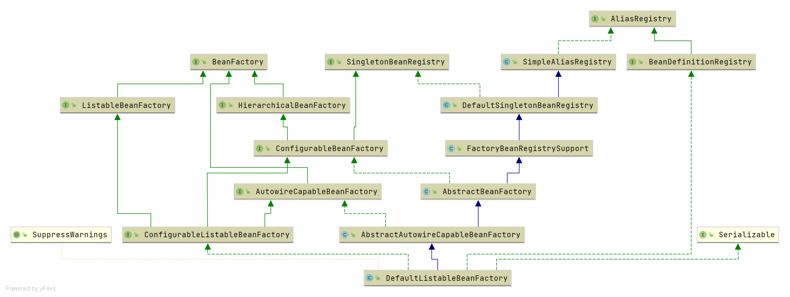
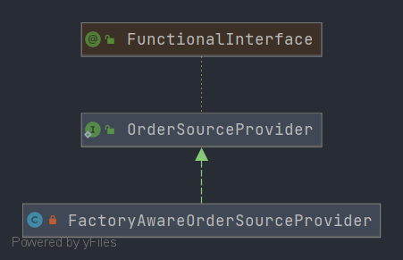

# Spring DefaultListableBeanFactory

- 类全路径: `org.springframework.beans.factory.support.DefaultListableBeanFactory`
- 类图
  
  
- 在类图中我们可以在阅读 `DefaultListableBeanFactory` 之前需要先去了解类图上的一些类和接口

<details>
<summary>继承关系分析</summary>

- [AbstractAutowireCapableBeanFactory](/doc/book/bean/factory/Spring-AbstractAutowireCapableBeanFactory.md)
- [AbstractBeanFactory](/doc/book/bean/factory/Spring-AbstractBeanFactory.md)
- [FactoryBeanRegistrySupport](/doc/book/bean/registry/Spring-FactoryBeanRegistrySupport.md)
- [DefaultSingletonBeanRegistry](/doc/book/bean/registry/Spring-DefaultSingletonBeanRegistry.md)
- [SimpleAliasRegistry](/doc/context/Spring-SimpleAliasRegistry.md)

- ConfigurableListableBeanFactory
- AutowireCapableBeanFactory
- ConfigurableBeanFactory
- HierarchicalBeanFactory
- ListableBeanFactory
- BeanFactory
- SingletonBeanRegistry

</details>


**在阅读本文之前请各位一定阅读继承关系分析中的类分析, 本文不会对父类或者引用方法进行分析请善用<KBD>CTRL + F</KBD>**


## 成员变量


<details>
<summary>DefaultListableBeanFactory 成员变量如下</summary>

```java
public class DefaultListableBeanFactory extends AbstractAutowireCapableBeanFactory
      implements ConfigurableListableBeanFactory, BeanDefinitionRegistry, Serializable {

   /**
    * Map from serialized id to factory instance.
    *
    * key: 序列化id
    *
    * value: DefaultListableBeanFactory
    *
    * */
   private static final Map<String, Reference<DefaultListableBeanFactory>> serializableFactories =
         new ConcurrentHashMap<>(8);

   @Nullable
   private static Class<?> javaxInjectProviderClass;

   /**
    * Map from dependency type to corresponding autowired value.
    *
    * key: 依赖类型
    * value: 依赖类型对应的值
    *
    * */
   private final Map<Class<?>, Object> resolvableDependencies = new ConcurrentHashMap<>(16);

   /**
    * Map of bean definition objects, keyed by bean name.
    *
    * bean定义容器
    * key: beanName
    * value: BeanDefinition
    *
    *  */
   private final Map<String, BeanDefinition> beanDefinitionMap = new ConcurrentHashMap<>(256);

   /**
    *  Map of singleton and non-singleton bean names, keyed by dependency type.
    * 类型和别名的映射关系
    * key: 类型
    * value: 别名
    * */
   private final Map<Class<?>, String[]> allBeanNamesByType = new ConcurrentHashMap<>(64);

   /**
    *  Map of singleton-only bean names, keyed by dependency type.
    *  单例bean的别名映射
    *
    *  key: 类型
    *  value: 别名
    *
    * */
   private final Map<Class<?>, String[]> singletonBeanNamesByType = new ConcurrentHashMap<>(64);

   /**
    *  Optional id for this factory, for serialization purposes.
    * 序列化 id (BeanFactory 的id)
    * */
   @Nullable
   private String serializationId;

   /**
    *  Whether to allow re-registration of a different definition with the same name.
    * 是否允许名字不同但是bean定义相同
    * */
   private boolean allowBeanDefinitionOverriding = true;

   /**
    *  Whether to allow eager class loading even for lazy-init beans.
    * 延迟加载的Bean是否立即加载
    * */
   private boolean allowEagerClassLoading = true;

   /** Optional OrderComparator for dependency Lists and arrays. */
   @Nullable
   private Comparator<Object> dependencyComparator;

   /**
    *  Resolver to use for checking if a bean definition is an autowire candidate.
    *  用来进行 自动注入(自动装配)的解析类
    * */
   private AutowireCandidateResolver autowireCandidateResolver = new SimpleAutowireCandidateResolver();

   /**
    * List of bean definition names, in registration order.
    * bean definition 名称列表
    * */
   private volatile List<String> beanDefinitionNames = new ArrayList<>(256);

   /**
    * List of names of manually registered singletons, in registration order.
    * 按照注册顺序放入 单例的beanName , 手动注册的单例对象
    *
    * */
   private volatile Set<String> manualSingletonNames = new LinkedHashSet<>(16);

   /**
    *
    * Cached array of bean definition names in case of frozen configuration.
    * bean definition 的名称列表
    * */
   @Nullable
   private volatile String[] frozenBeanDefinitionNames;

   /**
    *  Whether bean definition metadata may be cached for all beans.
    * 是否需要给bean元数据进行缓存
    * */
   private volatile boolean configurationFrozen = false;
}
```


</details>


在类图之外我们还需要了解成员变量中的一些接口, 下面列出重点接口

1. `BeanDefinition`: [分析文章](/doc/book/bean/BeanDefinition/Spring-BeanDefinition.md)
2. `AutowireCandidateResolver`: [分析文章](/doc/book/bean/factory/support/AutowireCandidateResolver/Spring-AutowireCandidateResolver.md)


## 方法分析

### copyConfigurationFrom

- 方法签名: `org.springframework.beans.factory.support.DefaultListableBeanFactory#copyConfigurationFrom`

- 方法作用: 配置信息拷贝


拷贝行为即对象赋值, 在这里直接贴出代码, 不做分析. 

<details>
<summary>copyConfigurationFrom 详细代码</summary>

```java
@Override
public void copyConfigurationFrom(ConfigurableBeanFactory otherFactory) {
   super.copyConfigurationFrom(otherFactory);
   if (otherFactory instanceof DefaultListableBeanFactory) {
      DefaultListableBeanFactory otherListableFactory = (DefaultListableBeanFactory) otherFactory;
      this.allowBeanDefinitionOverriding = otherListableFactory.allowBeanDefinitionOverriding;
      this.allowEagerClassLoading = otherListableFactory.allowEagerClassLoading;
      this.dependencyComparator = otherListableFactory.dependencyComparator;
      // A clone of the AutowireCandidateResolver since it is potentially BeanFactoryAware...
      setAutowireCandidateResolver(
            BeanUtils.instantiateClass(otherListableFactory.getAutowireCandidateResolver().getClass()));
      // Make resolvable dependencies (e.g. ResourceLoader) available here as well...
      this.resolvableDependencies.putAll(otherListableFactory.resolvableDependencies);
   }
}
```


</details>


下面将介绍一个十分重要的方法`getBean`


### getBean

- 方法签名: `org.springframework.beans.factory.support.DefaultListableBeanFactory#getBean(java.lang.Class<T>, java.lang.Object...)`

- 方法作用: 获取bean实例


首先了解方法参数

1. `Class<T> requiredType`: bean 类型
2. `@Nullable Object... args` : bean 初始化时需要的参数


<details>
<summary>getBean 详细代码</summary>

```java
@SuppressWarnings("unchecked")
@Override
public <T> T getBean(Class<T> requiredType, @Nullable Object... args) throws BeansException {
   Assert.notNull(requiredType, "Required type must not be null");
   // 解析bean
   Object resolved = resolveBean(ResolvableType.forRawClass(requiredType), args, false);
   if (resolved == null) {
      throw new NoSuchBeanDefinitionException(requiredType);
   }
   return (T) resolved;
}
```

</details>


重点关注

`Object resolved = resolveBean(ResolvableType.forRawClass(requiredType), args, false);` 这段代码，将这段代码一分为二

1. `resolveBean`函数
2. `ResolvableType.forRawClass(requiredType)`参数


### forRawClass

- 方法签名: `org.springframework.core.ResolvableType#forRawClass`


`forRawClass`的方法很简单, 就是一个构造函数的编写. 以及重写了部分方法


<details>
<summary>forRawClass 代码</summary>

```java
public static ResolvableType forRawClass(@Nullable Class<?> clazz) {
   return new ResolvableType(clazz) {
      @Override
      public ResolvableType[] getGenerics() {
         return EMPTY_TYPES_ARRAY;
      }
      @Override
      public boolean isAssignableFrom(Class<?> other) {
         return (clazz == null || ClassUtils.isAssignable(clazz, other));
      }
      @Override
      public boolean isAssignableFrom(ResolvableType other) {
         Class<?> otherClass = other.resolve();
         return (otherClass != null && (clazz == null || ClassUtils.isAssignable(clazz, otherClass)));
      }
   };
}
```


</details>


### resolveBean

- 方法签名: `org.springframework.beans.factory.support.DefaultListableBeanFactory#resolveBean`

- 方法作用: 解析bean


ok 我们开始阅读 `resolveBean` 方法. 从第一部分开始阅读


<details>
<summary>resolveBean 第一部分</summary>

```java
// 解析 beanName
NamedBeanHolder<T> namedBean = resolveNamedBean(requiredType, args, nonUniqueAsNull);
if (namedBean != null) {
   // 获取实例
   return namedBean.getBeanInstance();
}
```

</details>


在第一部分第一行中出现了这个`resolveNamedBean`方法, 暂时先不去看它是干什么的, 这里先看返回对象`NamedBeanHolder`


<details>
<summary>NamedBeanHolder 定义</summary>

```java
public class NamedBeanHolder<T> implements NamedBean {
   /**
    * bean name
    */
   private final String beanName;

   /**
    * bean 实例
    */
   private final T beanInstance;
}
```

</details>


从定义中我们可以看出其中存有了 `BeanName` 和 **`BeanInstance`** 在不为空判断后返回的就是这个**`BeanInstance`**


下面我们来对 `resolveNamedBean` 方法进行详细分析


### resolveNamedBean

- 方法签名: `org.springframework.beans.factory.support.DefaultListableBeanFactory#resolveNamedBean(org.springframework.core.ResolvableType, java.lang.Object[], boolean)`
- 方法作用: 解析获得 `NamedBeanHolder` 对象


在分析`resolveNamedBean`方法时笔者将其分为四个部分进行分析. 下面我们先来看第一部分代码, 第一部分代码仅有一行

```JAVA
// 第一部分
// 按照类型找到beanName
String[] candidateNames = getBeanNamesForType(requiredType);
```


第一部分中需要了解`getBeanNamesForType`的实现. 


### getBeanNamesForType

- 方法签名: `org.springframework.beans.factory.support.DefaultListableBeanFactory#getBeanNamesForType(org.springframework.core.ResolvableType)`


```javascript
@Override
public String[] getBeanNamesForType(ResolvableType type) {
   return getBeanNamesForType(type, true, true);
}
```


继续搜索代码找到`getBeanNamesForType`方法


### getBeanNamesForType

- 方法签名: `org.springframework.beans.factory.support.DefaultListableBeanFactory#getBeanNamesForType(org.springframework.core.ResolvableType, boolean, boolean)`


```java
/**
 * 根据类型找到beanNames
 * @return
 */
@Override
public String[] getBeanNamesForType(ResolvableType type, boolean includeNonSingletons, boolean allowEagerInit) {
   // 获取具体的类型
   Class<?> resolved = type.resolve();
   // 类型不为空 且存在泛型
   if (resolved != null && !type.hasGenerics()) {
      return getBeanNamesForType(resolved, includeNonSingletons, allowEagerInit);
   }
   else {
      return doGetBeanNamesForType(type, includeNonSingletons, allowEagerInit);
   }
}
```


在`getBeanNamesForType`方法中就产生了两个分支, 两种获取 beanName 的方式

1. `getBeanNamesForType`

2. `doGetBeanNamesForType`

   但是通过阅读代码会发现`getBeanNamesForType`方法内部会调用`doGetBeanNamesForType`方法. 下面我们先将`getBeanNamesForType`方法做一个分析


### getBeanNamesForType

- 方法签名: `org.springframework.beans.factory.support.DefaultListableBeanFactory#getBeanNamesForType(java.lang.Class<?>, boolean, boolean)`


<details>
<summary>getBeanNamesForType 代码</summary>

```java
@Override
public String[] getBeanNamesForType(@Nullable Class<?> type, boolean includeNonSingletons, boolean allowEagerInit) {
   // 参数验证 通过后做 doGetBeanNamesForType
   if (!isConfigurationFrozen() || type == null || !allowEagerInit) {
      return doGetBeanNamesForType(ResolvableType.forRawClass(type), includeNonSingletons, allowEagerInit);
   }
   // 缓存容器的获取 , 根据是否包含非单例的条件来确定使用那个 beanClass -> name 容器
   Map<Class<?>, String[]> cache =
         (includeNonSingletons ? this.allBeanNamesByType : this.singletonBeanNamesByType);
   // 从容器中获取 类型对应的 beanName 列表
   String[] resolvedBeanNames = cache.get(type);
   // 不为空返回
   if (resolvedBeanNames != null) {
      return resolvedBeanNames;
   }
   // 继续尝试获取
   resolvedBeanNames = doGetBeanNamesForType(ResolvableType.forRawClass(type), includeNonSingletons, true);
   if (ClassUtils.isCacheSafe(type, getBeanClassLoader())) {
      cache.put(type, resolvedBeanNames);
   }
   return resolvedBeanNames;
}
```


</details>


在`getBeanNamesForType` 中除了`doGetBeanNamesForType`方法外有两个变量需要关注

1. allBeanNamesByType

   存储所有beanName和beanType的关系

2. singletonBeanNamesByType

   存储只有单例bean的 beanName 和 beanType 的关系

   

   

   

那剩下的就是`doGetBeanNamesForType`方法了. 


### doGetBeanNamesForType

- 方法签名: `org.springframework.beans.factory.support.DefaultListableBeanFactory#doGetBeanNamesForType`


方法内容很多先看第一部分


<details>
<summary>doGetBeanNamesForType 第一部分代码</summary>

```java
// 第一部分
// Check all bean definitions.
// 循环所有的 beanName
for (String beanName : this.beanDefinitionNames) {
   // Only consider bean as eligible if the bean name
   // is not defined as alias for some other bean.
   // 确定是否存在别名
   if (!isAlias(beanName)) {
      try {
         // 获取合并的 beanDefinition
         RootBeanDefinition mbd = getMergedLocalBeanDefinition(beanName);
         // Only check bean definition if it is complete.
         // bean 定义检查
         // 1. 是否 abstract 修饰
         // 2. beanClass 是否等于 Class
         // 3. 是否懒加载
         // 4. allowEagerClassLoading 是否true
         // 5. allowEagerInit 是否急切加载
         // 6. requiresEagerInitForType
         if (!mbd.isAbstract() && (allowEagerInit ||
               (mbd.hasBeanClass() || !mbd.isLazyInit() || isAllowEagerClassLoading()) &&
                     !requiresEagerInitForType(mbd.getFactoryBeanName()))) {
            // 是否时 工厂bean
            boolean isFactoryBean = isFactoryBean(beanName, mbd);
            // bean 定义持有对象
            BeanDefinitionHolder dbd = mbd.getDecoratedDefinition();
            // 是否匹配
            boolean matchFound = false;
            // 是否允许 工厂bean 初始化
            boolean allowFactoryBeanInit = allowEagerInit || containsSingleton(beanName);
            // 是否懒加载
            boolean isNonLazyDecorated = dbd != null && !mbd.isLazyInit();
            if (!isFactoryBean) {
               if (includeNonSingletons || isSingleton(beanName, mbd, dbd)) {
                  matchFound = isTypeMatch(beanName, type, allowFactoryBeanInit);
               }
            }
            else {
               if (includeNonSingletons || isNonLazyDecorated ||
                     (allowFactoryBeanInit && isSingleton(beanName, mbd, dbd))) {
                  matchFound = isTypeMatch(beanName, type, allowFactoryBeanInit);
               }
               if (!matchFound) {
                  // In case of FactoryBean, try to match FactoryBean instance itself next.
                  beanName = FACTORY_BEAN_PREFIX + beanName;
                  matchFound = isTypeMatch(beanName, type, allowFactoryBeanInit);
               }
            }
            if (matchFound) {
               result.add(beanName);
            }
         }
      }
      catch (CannotLoadBeanClassException | BeanDefinitionStoreException ex) {
         if (allowEagerInit) {
            throw ex;
         }
         // Probably a placeholder: let's ignore it for type matching purposes.
         LogMessage message = (ex instanceof CannotLoadBeanClassException) ?
               LogMessage.format("Ignoring bean class loading failure for bean '%s'", beanName) :
               LogMessage.format("Ignoring unresolvable metadata in bean definition '%s'", beanName);
         logger.trace(message, ex);
         onSuppressedException(ex);
      }
   }
}
```

</details>


第一部分中比较关键的几个代码

1. bean定义检查

   ```java
   !mbd.isAbstract() && (allowEagerInit ||
         (mbd.hasBeanClass() || !mbd.isLazyInit() || isAllowEagerClassLoading()) &&
               !requiresEagerInitForType(mbd.getFactoryBeanName()))
   ```


2. `isSingleton` 方法分析请查看[这篇文章](/doc/book/bean/factory/Spring-AbstractBeanFactory.md) (tips:<KBD>CTRL + F</KBD>)


### requiresEagerInitForType

- 方法签名: `org.springframework.beans.factory.support.DefaultListableBeanFactory#requiresEagerInitForType`


```java
private boolean requiresEagerInitForType(@Nullable String factoryBeanName) {
   return (factoryBeanName != null && isFactoryBean(factoryBeanName) && !containsSingleton(factoryBeanName));
}
```


三个判断

1. 工厂beanName 不为空

   ```
   factoryBeanName != null
   ```

2. 是工厂bean

   ```
   isFactoryBean(factoryBeanName)
   ```

3. 单例中是否包含

   ```
   !containsSingleton(factoryBeanName)
   ```


在第一部分代码中还有几个变量

- isFactoryBean： 是否是 工厂bean
- dbd： bean 定义持有对象
- matchFound： 是否匹配
- allowFactoryBeanInit： 是否允许 工厂bean 初始化
- isNonLazyDecorated： 是否懒加载

上述几个变量在`isTypeMatch` 方法调用前后有体现其使用价值，有关`isTypeMatch`的分析请查看[这篇文章](/doc/book/bean/factory/Spring-AbstractBeanFactory.md) (tips:<KBD>CTRL + F</KBD>)


下面回到`doGetBeanNamesForType`方法对第二部分代码进行分析


<details>
<summary>doGetBeanNamesForType 第二部分代码</summary>

```java
// 第二部分
// Check manually registered singletons too.
for (String beanName : this.manualSingletonNames) {
   try {
      // In case of FactoryBean, match object created by FactoryBean.
      // 是否是 工厂 bean
      if (isFactoryBean(beanName)) {
         if ((includeNonSingletons || isSingleton(beanName)) && isTypeMatch(beanName, type)) {
            result.add(beanName);
            // Match found for this bean: do not match FactoryBean itself anymore.
            continue;
         }
         // In case of FactoryBean, try to match FactoryBean itself next.
         // 如果是 工厂bean的情况下修正beanName
         beanName = FACTORY_BEAN_PREFIX + beanName;
      }
      // Match raw bean instance (might be raw FactoryBean).
      if (isTypeMatch(beanName, type)) {
         result.add(beanName);
      }
   }
   catch (NoSuchBeanDefinitionException ex) {
      // Shouldn't happen - probably a result of circular reference resolution...
      logger.trace(LogMessage.format("Failed to check manually registered singleton with name '%s'", beanName), ex);
   }
}

return StringUtils.toStringArray(result);
```

</details>


第二部分处理的是`manualSingletonNames`属性的内容, **`manualSingletonNames` 含义是手动注入的单例对象的名称**


在第二部分中有一段关于 BeanName 还原的代码(**FactoryBean**)

```java
beanName = FACTORY_BEAN_PREFIX + beanName;
```


第二部分中其他代码都是前文介绍过的方法不在此展开了. 


到这里笔者将 `getBeanNamesForType` 方法分析完毕, 下面回到 `resolveNamedBean` 方法中继续向下阅读第二段代码


<details>
<summary>resolveNamedBean 第二部分代码</summary>

```java
if (candidateNames.length > 1) {
   List<String> autowireCandidates = new ArrayList<>(candidateNames.length);
   for (String beanName : candidateNames) {
      if (!containsBeanDefinition(beanName) || getBeanDefinition(beanName).isAutowireCandidate()) {
         autowireCandidates.add(beanName);
      }
   }
   if (!autowireCandidates.isEmpty()) {
      candidateNames = StringUtils.toStringArray(autowireCandidates);
   }
}
```

</details>


第二部分处理根据 BeanName 查询到的 BeanName (`candidateNames` ) 再去做一次插入操作得到`autowireCandidates`，插入时会有一个验证, 简单说这里就是一个数据过滤得到新的`autowireCandidates` 赋值给`candidateNames`，过滤条件

1. 判断是否存在 beanName 对应的 bean 定义 

   ```
   !containsBeanDefinition(beanName)
   ```

2. 获取 bean 定义的 定义的 `autowireCandidate` 属性是否为 `true`


最后还有第三第四部分 这两部分代码是对返回值的分装


<details>
<summary>resolveNamedBean 第三部分代码</summary>

```java
// 第三部分
if (candidateNames.length == 1) {
   String beanName = candidateNames[0];
   return new NamedBeanHolder<>(beanName, (T) getBean(beanName, requiredType.toClass(), args));
}
```

</details>


<details>
<summary>resolveNamedBean 第四部分代码</summary>

```java
// 第四部分
else if (candidateNames.length > 1) {
   // key: beanName value: beanInstance或者 class
   Map<String, Object> candidates = new LinkedHashMap<>(candidateNames.length);
   // 循环 beanName 获取bean实例
   for (String beanName : candidateNames) {
      // 判断是否单例 和构造函数参是是否为空
      if (containsSingleton(beanName) && args == null) {
         // 获取bean实例
         Object beanInstance = getBean(beanName);
         candidates.put(beanName, (beanInstance instanceof NullBean ? null : beanInstance));
      }
      else {
         candidates.put(beanName, getType(beanName));
      }
   }
   // 确定候选对象名称
   String candidateName = determinePrimaryCandidate(candidates, requiredType.toClass());
   if (candidateName == null) {
      // 确定优先级最高的候选对象名称
      candidateName = determineHighestPriorityCandidate(candidates, requiredType.toClass());
   }
   if (candidateName != null) {
      // 容器中获取 候选对象名称的值
      Object beanInstance = candidates.get(candidateName);
      if (beanInstance == null || beanInstance instanceof Class) {
         // 根据类型获取bean实例
         beanInstance = getBean(candidateName, requiredType.toClass(), args);
      }
      return new NamedBeanHolder<>(candidateName, (T) beanInstance);
   }
   if (!nonUniqueAsNull) {
      throw new NoUniqueBeanDefinitionException(requiredType, candidates.keySet());
   }
}

return null;
```


</details>


第三部分的代码很简单, 直接通过 BeanName 获取 bean 实例然后分装成 `NamedBeanHolder` 作为返回. 

其实第四部分的核心和第三部分相同，第四部分增加了一个关于 BeanName 候选的一个概念. 其原因也是因为`candidateNames.length > 1 ` , spring 需要推断一个最合适的 BeanName 然后获取实例


第四部分中需要关注一个变量

```JAVA
Map<String, Object> candidates = new LinkedHashMap<>(candidateNames.length);
```

**注意: candidates 变量的value有两种情况**

1. 直接存储 Bean实例
2. 存储 BeanType 


第三部分和第四部分中都使用了下面几个方法
1. getBean
1. getType
1. determinePrimaryCandidate
1. determineHighestPriorityCandidate


`getType` 方法是由父类(`AbstractBeanFactory`)提供，相关分析请查看[这篇文章](/doc/book/bean/factory/Spring-AbstractBeanFactory.md)


下面我们对其他三个方法进行分析


### determinePrimaryCandidate

- 方法签名: `org.springframework.beans.factory.support.DefaultListableBeanFactory#determinePrimaryCandidate`

- 方法作用: 确定候选beanName


<details>
<summary>determinePrimaryCandidate 代码</summary>

```java
@Nullable
protected String determinePrimaryCandidate(Map<String, Object> candidates, Class<?> requiredType) {
   // 返回值
   String primaryBeanName = null;

   for (Map.Entry<String, Object> entry : candidates.entrySet()) {
      // 容器中的BeanName
      String candidateBeanName = entry.getKey();
      // 容器中的 BeanInstance / BeanClass
      Object beanInstance = entry.getValue();
      // 是否是主要的 primary 修饰
      if (isPrimary(candidateBeanName, beanInstance)) {
         if (primaryBeanName != null) {
            // 是否存在 bean 定义, 检查对象是 容器中的 key
            boolean candidateLocal = containsBeanDefinition(candidateBeanName);
            //  是否存在 bean 定义, 检查对象是 primaryBeanName
            boolean primaryLocal = containsBeanDefinition(primaryBeanName);
            if (candidateLocal && primaryLocal) {
               throw new NoUniqueBeanDefinitionException(requiredType, candidates.size(),
                     "more than one 'primary' bean found among candidates: " + candidates.keySet());
            }
            else if (candidateLocal) {
               primaryBeanName = candidateBeanName;
            }
         }
         else {
            primaryBeanName = candidateBeanName;
         }
      }
   }
   return primaryBeanName;
}
```

</details>


在方法中新衍生出`isPrimary`方法，先看方法做了什么


### isPrimary

- 方法签名: `org.springframework.beans.factory.support.DefaultListableBeanFactory#isPrimary`

<details>
<summary>isPrimary 代码</summary>


```java
protected boolean isPrimary(String beanName, Object beanInstance) {
   // 转换 beanName
   String transformedBeanName = transformedBeanName(beanName);
   // 是否包含 bean 定义
   if (containsBeanDefinition(transformedBeanName)) {
      // 获取 合并后的 BeanDefinition 然后调用 isPrimary 获取返回值
      return getMergedLocalBeanDefinition(transformedBeanName).isPrimary();
   }
   // 获取父bean工厂
   BeanFactory parent = getParentBeanFactory();
   // 从父类葛洪常州判断是否 primary
   return (parent instanceof DefaultListableBeanFactory &&
         ((DefaultListableBeanFactory) parent).isPrimary(transformedBeanName, beanInstance));
}
```

</details>

`isPrimary` 是去通过 BeanDefinition 的 primary 属性来做核心判断条件. 出发点是当前的BeanFactory, 代码会一层层往上找父BeanFactory 在来调用 BeanDefinition 的 `isPrimary` 方法


- 跳出`isPrimary` 方法回到`determinePrimaryCandidate` 方法中. 我们来看看细节

在`determinePrimaryCandidate` 中 除了 `isPrimary` 是一个条件外 还有一个条件可以用来确定beanName

`candidateLocal` 确定是否存在bean定义

```java
boolean candidateLocal = containsBeanDefinition(candidateBeanName);
```

存在就确认这个beanName是我们需要的`beanName`


**注意: Primary 不允许重复 Spring 会主动抛出异常**


### determineHighestPriorityCandidate

- 方法签名: `org.springframework.beans.factory.support.DefaultListableBeanFactory#determineHighestPriorityCandidate`
- 方法作用: 确定优先级最高的候选对象名称


根据方法作用可以设想一下这个问题交给你你会怎么做. 最高优先级 的寻找就是比较当前对象和历史最大优先级对象的优先级数字大小, 一直保留最大优先级数字的内容即可. 在了解这个信息后先看看下面代码. 


<details>
<summary>determineHighestPriorityCandidate 代码</summary>

```java
@Nullable
protected String determineHighestPriorityCandidate(Map<String, Object> candidates, Class<?> requiredType) {
   // 优先级最高的 beanName
   String highestPriorityBeanName = null;
   // 最大优先级
   Integer highestPriority = null;
   for (Map.Entry<String, Object> entry : candidates.entrySet()) {
      // 容器中的BeanName
      String candidateBeanName = entry.getKey();
      // 容器中的 BeanInstance / BeanClass
      Object beanInstance = entry.getValue();
      if (beanInstance != null) {
         // 优先级序号 当前对象的优先级
         Integer candidatePriority = getPriority(beanInstance);
         if (candidatePriority != null) {
            if (highestPriorityBeanName != null) {
               if (candidatePriority.equals(highestPriority)) {
                  throw new NoUniqueBeanDefinitionException(requiredType, candidates.size(),
                        "Multiple beans found with the same priority ('" + highestPriority +
                              "') among candidates: " + candidates.keySet());
               }
               // 当前对象优先级 < 最高优先级 重新赋值
               else if (candidatePriority < highestPriority) {
                  highestPriorityBeanName = candidateBeanName;
                  highestPriority = candidatePriority;
               }
            }
            else {
               highestPriorityBeanName = candidateBeanName;
               highestPriority = candidatePriority;
            }
         }
      }
   }
   return highestPriorityBeanName;
}
```

</details>


- 通过阅读代码可以发现有一个方法`getPriority` 这个方法就是获取 bean 实例对应的优先级


### getPriority

- 方法签名: `org.springframework.beans.factory.support.DefaultListableBeanFactory#getPriority`

- 方法作用: 获取优先级. 

<details>
<summary>getPriority 代码</summary>

```java
@Nullable
protected Integer getPriority(Object beanInstance) {
   Comparator<Object> comparator = getDependencyComparator();
   if (comparator instanceof OrderComparator) {
      return ((OrderComparator) comparator).getPriority(beanInstance);
   }
   return null;
}
```

</details>

- 在这里涉及到一个新的对象 `OrderComparator` 对于它的分析请查看[这篇文章](/doc/book/core/OrderComparator/Spring-OrderComparator-未完成.md)


### getBean

- 方法签名: `org.springframework.beans.factory.support.AbstractBeanFactory#getBean(java.lang.String)`

- 方法作用: 获取bean实例


```java
@Override
public Object getBean(String name) throws BeansException {
   return doGetBean(name, null, null, false);
}
```


- 方法指向`doGetBean`  有关分析请查看[这篇文章](/doc/book/bean/factory/Spring-AbstractBeanFactory.md)


- 至此 `resolveNamedBean` 方法的分析完成了. 下面回到`resolveBean` 方法中


```java
// 解析 beanName
NamedBeanHolder<T> namedBean = resolveNamedBean(requiredType, args, nonUniqueAsNull);
if (namedBean != null) {
   // 获取实例
   return namedBean.getBeanInstance();
}
```


- 通过上面的分析我们以及知道 namedBean 中存有了 bean 实例, 所以仅需要对其判空后返回bean实例即可


继续阅读 `resolveBean` 的第二部分代码


```java
// 第二部分
// 获取父工厂
BeanFactory parent = getParentBeanFactory();
if (parent instanceof DefaultListableBeanFactory) {
   // 父工厂的解析
   return ((DefaultListableBeanFactory) parent).resolveBean(requiredType, args, nonUniqueAsNull);
}
else if (parent != null) {
   // 延迟加载的情况下获取对象
   ObjectProvider<T> parentProvider = parent.getBeanProvider(requiredType);
   if (args != null) {
      return parentProvider.getObject(args);
   }
   else {
      return (nonUniqueAsNull ? parentProvider.getIfUnique() : parentProvider.getIfAvailable());
   }
}
return null;
```


- 在第二部分中主要是和 父 beanFactory 打交道
  1. 父BeanFactory 是 DefaultListableBeanFactory 的情况下直接调用
  2. 通过`parent.getBeanProvider(requiredType)` 获取`ObjectProvider`对象来进行获取


在这出现了`getBeanProvider`方法，该方法是`BeanFactory` 接口中的一个方法在这里仅作 `DefaultListableBeanFactory` 类中的分析


### getBeanProvider

- 方法签名: `org.springframework.beans.factory.support.DefaultListableBeanFactory#getBeanProvider(org.springframework.core.ResolvableType)`

- 方法作用: 新建 `BeanObjectProvider`对象


在新建方法中下面几个方法都是用到了 resolveBean 也就是我们前文提到的内容(tips:<KBD>CTRL + F</KBD>)


<details>
<summary>四个方法</summary>

​    

```java
@Override
public T getObject() throws BeansException {
   T resolved = resolveBean(requiredType, null, false);
   if (resolved == null) {
      throw new NoSuchBeanDefinitionException(requiredType);
   }
   return resolved;
}

@Override
public T getObject(Object... args) throws BeansException {
   T resolved = resolveBean(requiredType, args, false);
   if (resolved == null) {
      throw new NoSuchBeanDefinitionException(requiredType);
   }
   return resolved;
}

@Override
@Nullable
public T getIfAvailable() throws BeansException {
   return resolveBean(requiredType, null, false);
}

@Override
@Nullable
public T getIfUnique() throws BeansException {
   return resolveBean(requiredType, null, true);
}
```

</details>

#### stream

- 方法签名: `org.springframework.beans.factory.support.DefaultListableBeanFactory.BeanObjectProvider#stream`
- 方法作用: 获取 bean 实例流


```java
@Override
public Stream<T> stream() {
   // 1. 根据 ResolvableType 提取所有的 beanName
   // 2. 获取bean
   // 3. 过滤 nullBean
   return Arrays.stream(getBeanNamesForTypedStream(requiredType))
         .map(name -> (T) getBean(name))
         .filter(bean -> !(bean instanceof NullBean));
}
```

- 在方法中主要行为如下
    1. 根据 ResolvableType 提取所有的 beanName
    2. 获取bean
    3. 过滤 nullBean


#### orderedStream

- 方法签名: `org.springframework.beans.factory.support.DefaultListableBeanFactory.BeanObjectProvider#orderedStream`
- 方法作用: 排序 Bean 实例


```java
@Override
public Stream<T> orderedStream() {
   // 获取 beanName 列表
   String[] beanNames = getBeanNamesForTypedStream(requiredType);
   // key: beanName value: beanInstance
   Map<String, T> matchingBeans = new LinkedHashMap<>(beanNames.length);
   for (String beanName : beanNames) {
      Object beanInstance = getBean(beanName);
      if (!(beanInstance instanceof NullBean)) {
         matchingBeans.put(beanName, (T) beanInstance);
      }
   }
   Stream<T> stream = matchingBeans.values().stream();
   // 排序
   return stream.sorted(adaptOrderComparator(matchingBeans));
}
```


### adaptOrderComparator

- 方法签名: `org.springframework.beans.factory.support.DefaultListableBeanFactory#adaptOrderComparator`


<details>
<summary>adaptOrderComparator 方法</summary>

```java
private Comparator<Object> adaptOrderComparator(Map<String, ?> matchingBeans) {
   // 获取依赖比较对象
   Comparator<Object> dependencyComparator = getDependencyComparator();
   // 转换 OrderComparator
   OrderComparator comparator = (dependencyComparator instanceof OrderComparator ?
         (OrderComparator) dependencyComparator : OrderComparator.INSTANCE);
   return comparator.withSourceProvider(createFactoryAwareOrderSourceProvider(matchingBeans));
}
```


</details>


**`adaptOrderComparator`**有两个关注点

1. `comparator.withSourceProvider`

   执行排序

2. `createFactoryAwareOrderSourceProvider`

   创建对象访问者


方法最底层其实是`compare`的一个调用增强. 具体增强方法是下面代码

<details>
    <summary>compare 增强</summary>


```java
private int doCompare(@Nullable Object o1, @Nullable Object o2, @Nullable OrderSourceProvider sourceProvider) {
   boolean p1 = (o1 instanceof PriorityOrdered);
   boolean p2 = (o2 instanceof PriorityOrdered);
   if (p1 && !p2) {
      return -1;
   }
   else if (p2 && !p1) {
      return 1;
   }

   int i1 = getOrder(o1, sourceProvider);
   int i2 = getOrder(o2, sourceProvider);
   return Integer.compare(i1, i2);
}
```

</details>


下面我们来看`createFactoryAwareOrderSourceProvider`方法


### createFactoryAwareOrderSourceProvider

- 方法签名: `org.springframework.beans.factory.support.DefaultListableBeanFactory#createFactoryAwareOrderSourceProvider`

- 方法作用: 创建`OrderComparator.OrderSourceProvider`对象 (`FactoryAwareOrderSourceProvider`)


<details>
    <summary>createFactoryAwareOrderSourceProvider 详细代码</summary>


```java
private OrderComparator.OrderSourceProvider createFactoryAwareOrderSourceProvider(Map<String, ?> beans) {
   IdentityHashMap<Object, String> instancesToBeanNames = new IdentityHashMap<>();
   beans.forEach((beanName, instance) -> instancesToBeanNames.put(instance, beanName));
   return new FactoryAwareOrderSourceProvider(instancesToBeanNames);
}
```


</details>


### FactoryAwareOrderSourceProvider

- 类全路径: `org.springframework.beans.factory.support.DefaultListableBeanFactory.FactoryAwareOrderSourceProvider#FactoryAwareOrderSourceProvider`

- 类图

  

这个(`FactoryAwareOrderSourceProvider`)类是`OrderComparator.OrderSourceProvider`实现类 重点关注 `getOrderSource`方法


#### 成员变量


- `FactoryAwareOrderSourceProvider` 中只有一个成员变量是 Map 类型
  - key: bean 实例
  - value: bean 名称

```java
/**
 * key: beanInstance
 * value: beanName
 */
private final Map<Object, String> instancesToBeanNames;
```


在了解成员变量后来对重要方法 **`getOrderSource`** 方法进行分析

#### getOrderSource

- 方法签名: `org.springframework.beans.factory.support.DefaultListableBeanFactory.FactoryAwareOrderSourceProvider#getOrderSource`


<details>
    <summary>getOrderSource 详细代码</summary>


```java
@Override
@Nullable
public Object getOrderSource(Object obj) {
   String beanName = this.instancesToBeanNames.get(obj);
   // beanName 不为空
   // 存在 beanName 对应的 bean 定义
   if (beanName == null || !containsBeanDefinition(beanName)) {
      return null;
   }
   // 获取 beanName 的合并定义
   RootBeanDefinition beanDefinition = getMergedLocalBeanDefinition(beanName);
   List<Object> sources = new ArrayList<>(2);
   // 获取工厂函数
   Method factoryMethod = beanDefinition.getResolvedFactoryMethod();
   if (factoryMethod != null) {
      sources.add(factoryMethod);
   }
   // 获取 bean class 加入 sources 
   Class<?> targetType = beanDefinition.getTargetType();
   if (targetType != null && targetType != obj.getClass()) {
      sources.add(targetType);
   }
   return sources.toArray();
}
```


</details>


在`getOrderSource`方法中有`sources`变量作为返回值, 我们需要了解其中存有的对象是什么

1. 工厂函数(**`factoryMethod`**)
2. bean类型(**targetType**)


至此`getBeanProvider`的分析完成. 下面进入下一个方法进行分析. 下一个方法是`getBeansOfType`


### getBeansOfType

- 方法签名: `org.springframework.beans.factory.support.DefaultListableBeanFactory#getBeansOfType(java.lang.Class<T>, boolean, boolean)`

- 方法作用: 返回 bean type 对应的 map 容器.

- 首先我们需要知道这个方法(`getBeansOfType`)的返回值是什么结构

  返回结构: Map key: beanName , value: beanInstance


- 在使用 Spring 中 BeanName 和 BeanInstance 是存在绑定关系的, 因此在这个方法中主要就是将 类型相同的都找出来返回


<details>
<summary>getBeansOfType 方法</summary>

​    

```java
@Override
@SuppressWarnings("unchecked")
public <T> Map<String, T> getBeansOfType(@Nullable Class<T> type, boolean includeNonSingletons, boolean allowEagerInit)
      throws BeansException {

   // 根据类型获取所有的beanName
   String[] beanNames = getBeanNamesForType(type, includeNonSingletons, allowEagerInit);
   // 返回结果
   Map<String, T> result = new LinkedHashMap<>(beanNames.length);
   // 循环beanName
   // 获取 bean 实例 放入返回结果. 
   for (String beanName : beanNames) {
      try {
         Object beanInstance = getBean(beanName);
         if (!(beanInstance instanceof NullBean)) {
            result.put(beanName, (T) beanInstance);
         }
      }
      catch (BeanCreationException ex) {
         Throwable rootCause = ex.getMostSpecificCause();
         if (rootCause instanceof BeanCurrentlyInCreationException) {
            BeanCreationException bce = (BeanCreationException) rootCause;
            String exBeanName = bce.getBeanName();
            if (exBeanName != null && isCurrentlyInCreation(exBeanName)) {
               if (logger.isTraceEnabled()) {
                  logger.trace("Ignoring match to currently created bean '" + exBeanName + "': " +
                        ex.getMessage());
               }
               onSuppressedException(ex);
               // Ignore: indicates a circular reference when autowiring constructors.
               // We want to find matches other than the currently created bean itself.
               continue;
            }
         }
         throw ex;
      }
   }
   return result;
}
```


</details>


在这个方法中逻辑如下

1. 根据类型获取 beanName (tips: **在本文搜索 getBeanNamesForType**)
2. 循环 beanName 获取实例(tips: **在本文搜索 getBean**)
3. 返回


- `getBeansOfType` 的分析结束 下面进行`getBeanNamesForAnnotation`的分析


###	getBeanNamesForAnnotation

- 方法签名: `org.springframework.beans.factory.support.DefaultListableBeanFactory#getBeanNamesForAnnotation`

- 方法作用: 根据注解类型获取beanName


**根据注解获取 beanName 首先想到的就是获取所有的bean定义, 在bean定义中判断是否存在这个注解, 存在就放入.** 这是简单的概述. 在spring中实现如下


<details>
<summary>getBeanNamesForAnnotation 方法</summary>


```java
@Override
public String[] getBeanNamesForAnnotation(Class<? extends Annotation> annotationType) {
   // 返回结果
   List<String> result = new ArrayList<>();
   // bean 定义名称的列表
   for (String beanName : this.beanDefinitionNames) {
      // 获取 bean 定义
      BeanDefinition beanDefinition = getBeanDefinition(beanName);
      // 1. bean 定义的 abstract 判断
      // 2. 寻找注解是否存在
      if (!beanDefinition.isAbstract() && findAnnotationOnBean(beanName, annotationType) != null) {
         result.add(beanName);
      }
   }
   // 手动注入的 单例对象 beanName 的处理
   for (String beanName : this.manualSingletonNames) {
      // 1. result 中是否已包含 当前正在处理的 beanName
      // 2. 寻找注解是否存在
      if (!result.contains(beanName) && findAnnotationOnBean(beanName, annotationType) != null) {
         result.add(beanName);
      }
   }
   return StringUtils.toStringArray(result);
}
```


</details>


看完代码后我们可以发现 Spring 引入了两个集合

1. `beanDefinitionNames`: beanDefinition 的名称列表
2. `manualSingletonNames`: 手动注入的单例对象名称列表

- spring 通过循环这两个列表来得到最后的 beanName

在这里 `findAnnotationOnBean` 方法才是最重要的方法, 它承担了找到注解的工作，下面我们对这个方法进行分析


### findAnnotationOnBean

- 方法签名: `org.springframework.beans.factory.support.DefaultListableBeanFactory#findAnnotationOnBean`


<details>
<summary>findAnnotationOnBean 方法</summary>

```java
@Override
@Nullable
public <A extends Annotation> A findAnnotationOnBean(String beanName, Class<A> annotationType)
      throws NoSuchBeanDefinitionException {

   return findMergedAnnotationOnBean(beanName, annotationType)
         .synthesize(MergedAnnotation::isPresent).orElse(null);
}
```


</details>


- `findAnnotationOnBean` 最核心的方法是`findMergedAnnotationOnBean`

### findMergedAnnotationOnBean

- 方法签名: `org.springframework.beans.factory.support.DefaultListableBeanFactory#findMergedAnnotationOnBean`

- 在`findMergedAnnotationOnBean`中最重要的是下面这样一段代码

  ```java
  MergedAnnotation<A> annotation =
        MergedAnnotations.from(beanType, SearchStrategy.TYPE_HIERARCHY).get(annotationType);
  ```

  - 详细分析请查看[这篇文章](/doc/book/core/annotation/Spring-MergedAnnotations-未完成.md)

  - 这里简单概述执行结果是什么

    通过 beanClass + 搜索方式 得到多个注解, 再从注解中寻找类型陪陪的注解


抛开`MergedAnnotations.from....`方法的分析外我们先对方法整体有一个基础认知
1. 搜索方式有哪些？
    1. 根据 BeanName 找到 BeanType(BeanClass) 在搜索
    2. 根据 BeanName 找到 Bean 定义(BeanDefinition) 在搜索
        1. 搜索 bean class
        2. 搜索 bean 的工厂函数(FactoryMethod)


<details>
<summary>findMergedAnnotationOnBean 方法</summary>

```java
private <A extends Annotation> MergedAnnotation<A> findMergedAnnotationOnBean(
      String beanName, Class<A> annotationType) {

   // 获取 beanName 的类型
   Class<?> beanType = getType(beanName);
   if (beanType != null) {
      // 从 beanType 上获取注解的集合
      MergedAnnotation<A> annotation =
            MergedAnnotations.from(beanType, SearchStrategy.TYPE_HIERARCHY).get(annotationType);
      if (annotation.isPresent()) {
         return annotation;
      }
   }
   // 是否存在 bean 定义
   if (containsBeanDefinition(beanName)) {
      // 获取 合并的bean定义
      RootBeanDefinition bd = getMergedLocalBeanDefinition(beanName);
      // Check raw bean class, e.g. in case of a proxy.
      if (bd.hasBeanClass()) {
         Class<?> beanClass = bd.getBeanClass();
         if (beanClass != beanType) {
            MergedAnnotation<A> annotation =
                  MergedAnnotations.from(beanClass, SearchStrategy.TYPE_HIERARCHY).get(annotationType);
            if (annotation.isPresent()) {
               return annotation;
            }
         }
      }
      // Check annotations declared on factory method, if any.
      Method factoryMethod = bd.getResolvedFactoryMethod();
      if (factoryMethod != null) {
         MergedAnnotation<A> annotation =
               MergedAnnotations.from(factoryMethod, SearchStrategy.TYPE_HIERARCHY).get(annotationType);
         if (annotation.isPresent()) {
            return annotation;
         }
      }
   }
   return MergedAnnotation.missing();
}
```

</details>


- 下面我们继续阅读方法`getBeansWithAnnotation` 

### getBeansWithAnnotation

- 方法签名: `org.springframework.beans.factory.support.DefaultListableBeanFactory#getBeansWithAnnotation`


- 方法作用: 根据注解找到拥有注解的bean实例. 返回值是map key: beanName value: beanInstance


- 在前文讲到过根据beanType查询bean实例的方法(`getBeansOfType`   <KBD>CTRL + F</KBD>)

  前文我们讲到了先找到beanType对应的beanName 然后在获取bean实例放入容器返回. 

  在这里(`getBeansWithAnnotation`) 也是一样的套路. 

  先找到 注解对应的beanName 再获取 bean实例, 放入容器返回.

下面先看一下代码


<details>
    <summary>getBeansWithAnnotation 方法详情</summary>


```java
@Override
public Map<String, Object> getBeansWithAnnotation(Class<? extends Annotation> annotationType) {
   // 通过注解类型寻找 beanName
   String[] beanNames = getBeanNamesForAnnotation(annotationType);
   // 结果对象
   Map<String, Object> result = new LinkedHashMap<>(beanNames.length);
   for (String beanName : beanNames) {
      // 获取 bean 实例
      Object beanInstance = getBean(beanName);
      if (!(beanInstance instanceof NullBean)) {
         result.put(beanName, beanInstance);
      }
   }
   return result;
}
```


</details>


`getBeanNamesForAnnotation` 方法再前文已经描述, 请使用(tips: <KBD>CTRL + F </KBD>进行搜索)


- 有关注解的在这里也分析完毕, 可能还有遗漏请各位读者发现后告诉我.下面我们开始对`isAutowireCandidate`方法进行分析


### isAutowireCandidate

- 方法签名: `org.springframework.beans.factory.support.DefaultListableBeanFactory#isAutowireCandidate(java.lang.String, org.springframework.beans.factory.config.DependencyDescriptor, org.springframework.beans.factory.support.AutowireCandidateResolver)`
- 方法作用: 确定 beanName 是否符合候选条件


<details>
<summary>isAutowireCandidate 方法</summary>

```java
	protected boolean isAutowireCandidate(String beanName, DependencyDescriptor descriptor, AutowireCandidateResolver resolver)
			throws NoSuchBeanDefinitionException {

		// 转换 beanName
		String beanDefinitionName = BeanFactoryUtils.transformedBeanName(beanName);
		// 是否存在 bean 定义
		if (containsBeanDefinition(beanDefinitionName)) {
			// 是否候选
			return isAutowireCandidate(beanName, getMergedLocalBeanDefinition(beanDefinitionName), descriptor, resolver);
		}
		// 是否是单例的
		else if (containsSingleton(beanName)) {
			// 是否候选
			return isAutowireCandidate(beanName, new RootBeanDefinition(getType(beanName)), descriptor, resolver);
		}

		// 父bean工厂执行 isAutowireCandidate
		BeanFactory parent = getParentBeanFactory();
		if (parent instanceof DefaultListableBeanFactory) {
			// No bean definition found in this factory -> delegate to parent.
			return ((DefaultListableBeanFactory) parent).isAutowireCandidate(beanName, descriptor, resolver);
		}
		else if (parent instanceof ConfigurableListableBeanFactory) {
			// If no DefaultListableBeanFactory, can't pass the resolver along.
			return ((ConfigurableListableBeanFactory) parent).isAutowireCandidate(beanName, descriptor);
		}
		else {
			return true;
		}
	}

```

</details>


这一整段代码最终调用`isAutowireCandidate` 方法, 这个方法很重要


### isAutowireCandidate

- 方法签名: `org.springframework.beans.factory.support.DefaultListableBeanFactory#isAutowireCandidate(java.lang.String, org.springframework.beans.factory.support.RootBeanDefinition, org.springframework.beans.factory.config.DependencyDescriptor, org.springframework.beans.factory.support.AutowireCandidateResolver)`
- 方法作用: 判断是否是候选对象


<details>
<summary>isAutowireCandidate 方法</summary>


```java
protected boolean isAutowireCandidate(String beanName, RootBeanDefinition mbd,
      DependencyDescriptor descriptor, AutowireCandidateResolver resolver) {

   // 转换 beanName
   String beanDefinitionName = BeanFactoryUtils.transformedBeanName(beanName);
   // 解析 bean class
   resolveBeanClass(mbd, beanDefinitionName);
   // 条件过滤
   // 1. 工厂方法是否唯一
   // 2. 工厂方法是否存在
   if (mbd.isFactoryMethodUnique && mbd.factoryMethodToIntrospect == null) {
      // ConstructorResolver 解析
      new ConstructorResolver(this).resolveFactoryMethodIfPossible(mbd);
   }
   // resolver 判断是否是候选注入对象
   return resolver.isAutowireCandidate(
         new BeanDefinitionHolder(mbd, beanName, getAliases(beanDefinitionName)), descriptor);
}
```

</details>


三个大方法请分别查阅下面内容

1. `resolveBeanClass`: [分析文章](/doc/book/bean/factory/Spring-AbstractBeanFactory.md)
2. `new ConstructorResolver(this).resolveFactoryMethodIfPossible`: [分析文章](/doc/book/bean/factory/support/ConstructorResolver/Spring-ConstructorResolver-未完成.md)
3. `resolver.isAutowireCandidate(new BeanDefinitionHolder(mbd, beanName, getAliases(beanDefinitionName)), descriptor)`: [分析文章](/doc/book/bean/factory/support/AutowireCandidateResolver/Spring-AutowireCandidateResolver.md)


继续向下阅读`preInstantiateSingletons`方法


### preInstantiateSingletons

- 方法签名: `org.springframework.beans.factory.support.DefaultListableBeanFactory#preInstantiateSingletons`
- 方法作用: 实例化单例对象


<details>
<summary>preInstantiateSingletons 方法</summary>


```java
@Override
public void preInstantiateSingletons() throws BeansException {
   if (logger.isTraceEnabled()) {
      logger.trace("Pre-instantiating singletons in " + this);
   }

   // Iterate over a copy to allow for init methods which in turn register new bean definitions.
   // While this may not be part of the regular factory bootstrap, it does otherwise work fine.
   // beanNames 内容是 beanDefinition 的名称
   List<String> beanNames = new ArrayList<>(this.beanDefinitionNames);

   // Trigger initialization of all non-lazy singleton beans...
   // 处理非懒加载的bean进行实例化
   for (String beanName : beanNames) {
      // 获取 bean定义
      RootBeanDefinition bd = getMergedLocalBeanDefinition(beanName);
      // 条件过滤
      // 1. abstract 修饰
      // 2. 是否单例
      // 3. 是否懒加载
      if (!bd.isAbstract() && bd.isSingleton() && !bd.isLazyInit()) {
         // 是否是工厂bean
         if (isFactoryBean(beanName)) {
            // 获取 bean
            Object bean = getBean(FACTORY_BEAN_PREFIX + beanName);
            // 类型判断是否是 FactoryBean
            if (bean instanceof FactoryBean) {
               final FactoryBean<?> factory = (FactoryBean<?>) bean;
               // 是否立即加载
               boolean isEagerInit;
               // 计算 isEagerInit
               // 1. 是否是 SmartFactoryBean
               // 2. 执行SmartFactoryBean 的 isEagerInit 方法
               if (System.getSecurityManager() != null && factory instanceof SmartFactoryBean) {
                  isEagerInit = AccessController.doPrivileged((PrivilegedAction<Boolean>)
                              ((SmartFactoryBean<?>) factory)::isEagerInit,
                        getAccessControlContext());
               }
               else {
                  isEagerInit = (factory instanceof SmartFactoryBean &&
                        ((SmartFactoryBean<?>) factory).isEagerInit());
               }
               if (isEagerInit) {
                  getBean(beanName);
               }
            }
         }
         else {
            getBean(beanName);
         }
      }
   }

   // Trigger post-initialization callback for all applicable beans...
   // 触发回调方法
   for (String beanName : beanNames) {
      // 获取单例对象的实例
      Object singletonInstance = getSingleton(beanName);
      // 类型判断
      if (singletonInstance instanceof SmartInitializingSingleton) {
         // 执行 SmartInitializingSingleton 方法 afterSingletonsInstantiated
         final SmartInitializingSingleton smartSingleton = (SmartInitializingSingleton) singletonInstance;
         if (System.getSecurityManager() != null) {
            AccessController.doPrivileged((PrivilegedAction<Object>) () -> {
               smartSingleton.afterSingletonsInstantiated();
               return null;
            }, getAccessControlContext());
         }
         else {
            smartSingleton.afterSingletonsInstantiated();
         }
      }
   }
}
```


</details>


整个方法分成两部分来看

1. 非懒加载的bean进行实例化
2. 触发回调方法(**单列且类型是`SmartInitializingSingleton`的才执行**)


在了解两部分内容后我们细化每一部分进行阅读


#### 非懒加载的bean实例化

整体流程

1. 将 bean 定义的名字获取
2. 循环获取的beanName(BeanDefinitionNames)
   1. 通过 beanName 获取beanDefinition(合并的beanDefinition)
   2. 条件过滤
      1. abstract 修饰
      2. 单例判断
      3. 是否懒加载判断
   3. 获取bean 


#### 触发回调方法

整体流程

1. 循环 beanName 列表
2. 获取bean实例
3. 判断类型是否是 `SmartInitializingSingleton`
4. 执行`afterSingletonsInstantiated`方法


- `preInstantiateSingletons` 方法分析完成下面开始进行`registerBeanDefinition`的方法分析


### registerBeanDefinition

- 方法签名: `org.springframework.beans.factory.support.DefaultListableBeanFactory#registerBeanDefinition`
- 方法作用: 注册 bean 定义


在方法分析之前先来了解参数

```JAVA
String beanName, BeanDefinition beanDefinition
```


在这段代码中我们可以联想到成员变量`beanDefinitionMap` 他的类型是

```java
/**
 * Map of bean definition objects, keyed by bean name.
 *
 * bean定义容器
 * key: beanName
 * value: BeanDefinition
 *
 *  */
private final Map<String, BeanDefinition> beanDefinitionMap = new ConcurrentHashMap<>(256);
```


根据这两个信息可以大概知道方法的主体是将参数放入到`beanDefinitionMap`中. 


下面开始详细分析


<details>
<summary>registerBeanDefinition 第一部分代码</summary>


```java
// 第一部分
// 类型验证
if (beanDefinition instanceof AbstractBeanDefinition) {
    try {
        // bean定义验证
        ((AbstractBeanDefinition) beanDefinition).validate();
    }
    catch (BeanDefinitionValidationException ex) {
        throw new BeanDefinitionStoreException(beanDefinition.getResourceDescription(), beanName,
                                               "Validation of bean definition failed", ex);
    }
}
```


</details>


第一部分代码是进行数据验证. 验证内容如下

1. 类型验证

2. 调用 validate 进行验证

   详细请查看[这篇文章](/doc/book/bean/BeanDefinition/Spring-AbstractBeanDefinition.md)


<details>
<summary>registerBeanDefinition 第二部分代码</summary>


```java
// 第二部分 beanName 存在 BeanDefinition 的情况
// 从 map 中根据 beanName 获取 beanDefinition
BeanDefinition existingDefinition = this.beanDefinitionMap.get(beanName);
if (existingDefinition != null) {
   // bean name 是否允许重复注册
   if (!isAllowBeanDefinitionOverriding()) {
      throw new BeanDefinitionOverrideException(beanName, beanDefinition, existingDefinition);
   }
   // role 值比较
   else if (existingDefinition.getRole() < beanDefinition.getRole()) {
      // e.g. was ROLE_APPLICATION, now overriding with ROLE_SUPPORT or ROLE_INFRASTRUCTURE
      if (logger.isInfoEnabled()) {
         logger.info("Overriding user-defined bean definition for bean '" + beanName +
               "' with a framework-generated bean definition: replacing [" +
               existingDefinition + "] with [" + beanDefinition + "]");
      }
   }
   // map 中存储的 beanDefinition 是否和参数相同
   else if (!beanDefinition.equals(existingDefinition)) {
      if (logger.isDebugEnabled()) {
         logger.debug("Overriding bean definition for bean '" + beanName +
               "' with a different definition: replacing [" + existingDefinition +
               "] with [" + beanDefinition + "]");
      }
   }
   else {
      if (logger.isTraceEnabled()) {
         logger.trace("Overriding bean definition for bean '" + beanName +
               "' with an equivalent definition: replacing [" + existingDefinition +
               "] with [" + beanDefinition + "]");
      }
   }
   // 设置 beanName 和 beanDefinition 关系
   this.beanDefinitionMap.put(beanName, beanDefinition);
}
```

</details>


第二部分代码处理这样一种情况: **当beanName存在beanDefinition对象**

重点属性:**`allowBeanDefinitionOverriding`**

```java
/**
 * Return whether it should be allowed to override bean definitions by registering
 * a different definition with the same name, automatically replacing the former.
 * 是否允许beanName相同的bean定义注册,后注册的会覆盖前面注册的
 * @since 4.1.2
 */
public boolean isAllowBeanDefinitionOverriding() {
   return this.allowBeanDefinitionOverriding;
}
```


在第二部分在仅有这一部分会有异常信息, 其他都是普通日志. 可以忽略. 


第二部分分析完毕下面进行第三部分代码分析, 先看第三部分代码


<details>
<summary>registerBeanDefinition 第三部分代码</summary>

```java
else {
   // 检查 bean 是否已经开始创建
   if (hasBeanCreationStarted()) {
      // Cannot modify startup-time collection elements anymore (for stable iteration)
      synchronized (this.beanDefinitionMap) {
         // 设置 beanName 和 beanDefinition 关系
         this.beanDefinitionMap.put(beanName, beanDefinition);
         // bean definition 的名称列表
         List<String> updatedDefinitions = new ArrayList<>(this.beanDefinitionNames.size() + 1);
         // 加入内存数据
         updatedDefinitions.addAll(this.beanDefinitionNames);
         // 加入当前的 beanName
         updatedDefinitions.add(beanName);
         // 对象替换
         this.beanDefinitionNames = updatedDefinitions;
         // 移除当前的beanName
         removeManualSingletonName(beanName);
      }
   }
   else {
      // Still in startup registration phase
      // 设置容器数据
      this.beanDefinitionMap.put(beanName, beanDefinition);
      this.beanDefinitionNames.add(beanName);
      // 移除当前的beanName
      removeManualSingletonName(beanName);
   }
   this.frozenBeanDefinitionNames = null;
}
```


</details>


第二部分处理 BeanName 存在对应的 BeanDefinition的情况, 第三部分处理的是不存在的情况

第三部分的逻辑仅有一点设置数据	详细内容在上面的代码中请各位自行阅读. 


下面看最后一部分(第四部分)


```java
// 第四部分
if (existingDefinition != null || containsSingleton(beanName)) {
   // 刷新bean definition
   resetBeanDefinition(beanName);
}
```


- 第四部分代码是刷新 beanName 的 beanDefinition


到目前还有两个方法处于未知状态. 

1. `removeManualSingletonName`

   从`manualSingletonNames`移除当前的beanName

2. `resetBeanDefinition`

   刷新beanName对应的beanDefinition


### removeManualSingletonName

- 方法签名: `org.springframework.beans.factory.support.DefaultListableBeanFactory#removeManualSingletonName`


- 方法作用: 删除 manualSingletonNames 中的BeanName


<details>
<summary>removeManualSingletonName 代码</summary>

~~~java
private void removeManualSingletonName(String beanName) {
   updateManualSingletonNames(set -> set.remove(beanName), set -> set.contains(beanName));
}

/**
 * Update the factory's internal set of manual singleton names.
 * @param action the modification action
 * @param condition a precondition for the modification action
 * (if this condition does not apply, the action can be skipped)
 */

~~~

</details>

### updateManualSingletonNames
- 方法签名: `org.springframework.beans.factory.support.DefaultListableBeanFactory#updateManualSingletonNames`

~~~java
private void updateManualSingletonNames(Consumer<Set<String>> action, Predicate<Set<String>> condition) {
   if (hasBeanCreationStarted()) {
      // Cannot modify startup-time collection elements anymore (for stable iteration)
      synchronized (this.beanDefinitionMap) {
         // 输入的 beanName 是否在 manualSingletonNames 存在
         if (condition.test(this.manualSingletonNames)) {
            // 数据重写
            Set<String> updatedSingletons = new LinkedHashSet<>(this.manualSingletonNames);
            // 删除 beanName
            action.accept(updatedSingletons);
            // 数据重写
            this.manualSingletonNames = updatedSingletons;
         }
      }
   }
   else {
      // Still in startup registration phase
      // 输入的 beanName 是否在 manualSingletonNames 存在
      if (condition.test(this.manualSingletonNames)) {
         // 删除 beanName
         action.accept(this.manualSingletonNames);
      }
   }
}
~~~

</details>

在这里我们需要关注`updateManualSingletonNames`方法的参数

1. 操作行为接口
2. 条件接口


当满足 `set.contains(beanName)` 条件时 执行 `action` 操作

这里有操作对象集合时`manualSingletonNames`


### resetBeanDefinition

- 方法签名: `org.springframework.beans.factory.support.DefaultListableBeanFactory#resetBeanDefinition`


- 方法作用: 刷新bean定义


<details>
<summary>resetBeanDefinition 代码</summary>

```java
protected void resetBeanDefinition(String beanName) {
   // Remove the merged bean definition for the given bean, if already created.
   // 清空合并的BeanDefinition
   clearMergedBeanDefinition(beanName);

   // Remove corresponding bean from singleton cache, if any. Shouldn't usually
   // be necessary, rather just meant for overriding a context's default beans
   // (e.g. the default StaticMessageSource in a StaticApplicationContext).
   // 摧毁单例bean
   destroySingleton(beanName);

   // Notify all post-processors that the specified bean definition has been reset.
   for (BeanPostProcessor processor : getBeanPostProcessors()) {
      if (processor instanceof MergedBeanDefinitionPostProcessor) {
         // 执行后置方法的 resetBeanDefinition
         ((MergedBeanDefinitionPostProcessor) processor).resetBeanDefinition(beanName);
      }
   }

   // Reset all bean definitions that have the given bean as parent (recursively).
   for (String bdName : this.beanDefinitionNames) {
      if (!beanName.equals(bdName)) {
         BeanDefinition bd = this.beanDefinitionMap.get(bdName);
         // Ensure bd is non-null due to potential concurrent modification
         // of the beanDefinitionMap.
         if (bd != null && beanName.equals(bd.getParentName())) {
            // 递归刷新 beanName 对应的 beanDefinition
            resetBeanDefinition(bdName);
         }
      }
   }
}
```

</details>


流程如下

1. 将 beanDefinition 中 `stale` 属性设置为 true (**clearMergedBeanDefinition**)

2. 摧毁单例bean

   这部分代码请各位自行阅读

   ```java
   @Override
   public void destroySingleton(String beanName) {
      // 摧毁方法的调用
      super.destroySingleton(beanName);
      // 删除 manualSingletonNames 中的BeanName
      removeManualSingletonName(beanName);
      //allBeanNamesByType clean
      //singletonBeanNamesByType clean
      clearByTypeCache();
   }
   ```

3. 后置处理器执行`resetBeanDefinition`方法，条件: **后置处理器(BeanPostProcessor 类型时 MergedBeanDefinitionPostProcessor**

4. 处理其他的beanName,条件 beanName和 父beanName 相同


- 下面继续阅读源码的`removeBeanDefinition`方法来看看它做了什么


### removeBeanDefinition

- 方法签名: `org.springframework.beans.factory.support.DefaultListableBeanFactory#removeBeanDefinition`
- 方法作用: 移除 beanName key 

- 移除过程就请各位查看下面的代码, 这里没有特别多可以分析的内容. 


<details>
<summary>removeBeanDefinition 代码</summary>

```java
@Override
public void removeBeanDefinition(String beanName) throws NoSuchBeanDefinitionException {
   Assert.hasText(beanName, "'beanName' must not be empty");

   // 删除 beanName key
   BeanDefinition bd = this.beanDefinitionMap.remove(beanName);
   if (bd == null) {
      if (logger.isTraceEnabled()) {
         logger.trace("No bean named '" + beanName + "' found in " + this);
      }
      throw new NoSuchBeanDefinitionException(beanName);
   }

   if (hasBeanCreationStarted()) {
      // Cannot modify startup-time collection elements anymore (for stable iteration)
      synchronized (this.beanDefinitionMap) {
         List<String> updatedDefinitions = new ArrayList<>(this.beanDefinitionNames);
         // 删除需要移除的BeanName
         updatedDefinitions.remove(beanName);
         // 重新赋值
         this.beanDefinitionNames = updatedDefinitions;
      }
   }
   else {
      // Still in startup registration phase
      // 移除 beanName
      this.beanDefinitionNames.remove(beanName);
   }
   this.frozenBeanDefinitionNames = null;

   // 刷新bean definition
   resetBeanDefinition(beanName);
}
```

</details>


### 


最后还有一个"重磅方法" : `resolveDependency`


### resolveDependency

- 方法签名: `org.springframework.beans.factory.support.DefaultListableBeanFactory#resolveDependency`


```java
@Override
@Nullable
public Object resolveDependency(DependencyDescriptor descriptor, @Nullable String requestingBeanName,
      @Nullable Set<String> autowiredBeanNames, @Nullable TypeConverter typeConverter) throws BeansException {

   descriptor.initParameterNameDiscovery(getParameterNameDiscoverer());
   if (Optional.class == descriptor.getDependencyType()) {
      // 创建 Optional 类型的对象
      return createOptionalDependency(descriptor, requestingBeanName);
   }
   else if (ObjectFactory.class == descriptor.getDependencyType() ||
         ObjectProvider.class == descriptor.getDependencyType()) {
      // 类型全部符合的情况下直接创建 DependencyObjectProvider
      return new DependencyObjectProvider(descriptor, requestingBeanName);
   }
   else if (javaxInjectProviderClass == descriptor.getDependencyType()) {
      // jsr 330 创建对象
      return new Jsr330Factory().createDependencyProvider(descriptor, requestingBeanName);
   }
   else {
      // 获取延迟加载对象
      Object result = getAutowireCandidateResolver().getLazyResolutionProxyIfNecessary(
            descriptor, requestingBeanName);
      if (result == null) {
         // 解析依赖
         result = doResolveDependency(descriptor, requestingBeanName, autowiredBeanNames, typeConverter);
      }
      return result;
   }
}
```


方法中`createOptionalDependency`和 `doResolveDependency` 方法最终都会调用`doResolveDependency` 下面我们对这个方法进行分析. 


### doResolveDependency

- 方法签名: `org.springframework.beans.factory.support.DefaultListableBeanFactory#doResolveDependency`


先来看第一行代码


```java
// 设置线程变量 DependencyDescriptor
InjectionPoint previousInjectionPoint = ConstructorResolver.setCurrentInjectionPoint(descriptor);
```


这段代码在方法`doResolveDependency` 的第一行和最后一行都有 核心代码如下

```java
static InjectionPoint setCurrentInjectionPoint(@Nullable InjectionPoint injectionPoint) {
   InjectionPoint old = currentInjectionPoint.get();
   if (injectionPoint != null) {
      currentInjectionPoint.set(injectionPoint);
   }
   else {
      currentInjectionPoint.remove();
   }
   return old;
}
```


这就是一个线程变量设置和移除. 对应的变量是下面这段

```java
private static final NamedThreadLocal<InjectionPoint> currentInjectionPoint =
      new NamedThreadLocal<>("Current injection point");
```


其中`NamedThreadLocal`代码如下

```java
public class NamedThreadLocal<T> extends ThreadLocal<T> {}
```


可以发现这是一个线程变量. 


ok 下面开始查看主体方法内容(在`try`块中)


<details>
<summary>doResolveDependency 第一部分代码</summary>

```java
// 第一部分
// 解析 实际方式 beanFactory.getBean
Object shortcut = descriptor.resolveShortcut(this);
if (shortcut != null) {
   return shortcut;
}
```


</details>


这里涉及到`resolveShortcut`方法. 

1. `org.springframework.beans.factory.config.DependencyDescriptor#resolveShortcut`

   返回null. 

2. `org.springframework.beans.factory.annotation.AutowiredAnnotationBeanPostProcessor.ShortcutDependencyDescriptor#resolveShortcut`

   从 beanFactory 中获取实例


<details>
<summary>doResolveDependency 第二部分代码</summary>

```java
// 第二部分
// 获取依赖类型
Class<?> type = descriptor.getDependencyType();
// AutowireCandidateResolver 方法获取数据
Object value = getAutowireCandidateResolver().getSuggestedValue(descriptor);
if (value != null) {
   // el 表达式相关处理
   // 类型是否是 string
   if (value instanceof String) {
      // 解析字符串.
      String strVal = resolveEmbeddedValue((String) value);
      BeanDefinition bd = (beanName != null && containsBean(beanName) ?
            getMergedBeanDefinition(beanName) : null);
      // beanName , beanDefinition
      // el 表达式解析
      value = evaluateBeanDefinitionString(strVal, bd);
   }
   // 类型转换器
   TypeConverter converter = (typeConverter != null ? typeConverter : getTypeConverter());
   try {
      // 转换返回
      return converter.convertIfNecessary(value, type, descriptor.getTypeDescriptor());
   }
   catch (UnsupportedOperationException ex) {
      // A custom TypeConverter which does not support TypeDescriptor resolution...
      // 类型转换
      // 1. field 转换
      // 2. method parameter 转换
      return (descriptor.getField() != null ?
            converter.convertIfNecessary(value, type, descriptor.getField()) :
            converter.convertIfNecessary(value, type, descriptor.getMethodParameter()));
   }
}
```

</details>


第二部分开始两行代码的分析请查看

1. `DependencyDescriptor`[分析文章](/doc/book/bean/factory/config/DependencyDescriptor/Spring-DependencyDescriptor-未完成.md)
2. `AutowireCandidateResolver`[分析文章](/doc/book/bean/factory/support/AutowireCandidateResolver/Spring-AutowireCandidateResolver.md)


第二部分有对于 value 关于 String 类型的额外处理

1. 解析el表达式得到字符串文本

   涉及到的方法:`resolveEmbeddedValue`

   涉及到的接口: `StringValueResolver` [分析文章](/doc/book/utils/Spring-StringValueResolver.md)

2. el表达式获取正真的数据对象

   涉及到的方法: `evaluateBeanDefinitionString`	

   涉及到的接口：`BeanExpressionResolver`


当我们处理完成 value 结果后下面就是类型转换接口的使用(`TypeConverter`), [分析文章](/doc/book/core/convert/Spring-TypeConverter.md)


下面我们来看第三部分代码


<details>
<summary>doResolveDependency 第三部分代码</summary>

```java
// 第三部分
// 多个依赖的处理
Object multipleBeans = resolveMultipleBeans(descriptor, beanName, autowiredBeanNames, typeConverter);
if (multipleBeans != null) {
   return multipleBeans;
}
```

</details>


- 第三部分核心方法`resolveMultipleBeans`


### resolveMultipleBeans

- 方法签名: `org.springframework.beans.factory.support.DefaultListableBeanFactory#resolveMultipleBeans`


在`resolveMultipleBeans`中分别处理下面几种类型

1. `StreamDependencyDescriptor`
2. `Array`
3. `Collection`
4. `Map`


下面对这四个类型进行分别描述


#### StreamDependencyDescriptor


```java
// 多个类型的不同操作
// 是否是  StreamDependencyDescriptor
if (descriptor instanceof StreamDependencyDescriptor) {
   // beanName + type + 依赖描述 找到可能的beanMap
   // key: beanName
   // value: beanInstance
   Map<String, Object> matchingBeans = findAutowireCandidates(beanName, type, descriptor);
   if (autowiredBeanNames != null) {
      autowiredBeanNames.addAll(matchingBeans.keySet());
   }
   // 获取候选的beanName 求对象实例, 过滤 NullBean
   Stream<Object> stream = matchingBeans.keySet().stream()
         .map(name -> descriptor.resolveCandidate(name, type, this))
         .filter(bean -> !(bean instanceof NullBean));
   if (((StreamDependencyDescriptor) descriptor).isOrdered()) {
      stream = stream.sorted(adaptOrderComparator(matchingBeans));
   }
   return stream;
}
```


在这里笔者有一个疑惑的地方在`findAutowireCandidates`方法中也存在`descriptor.resolveCandidate`方法的调用 ( 获取 beanInstance ) , 这里如果可以通过`findAutowireCandidates` 的返回结果的 value 值直接做 filter 中的方法(`bean -> !(bean instanceof NullBean)` 效率可能会更高


这里还是需要对`findAutowireCandidates`方法做一个详细分析


### findAutowireCandidates

- 方法签名: `org.springframework.beans.factory.support.DefaultListableBeanFactory#findAutowireCandidates`
- 方法作用: beanName + type + 依赖描述 找到可能的beanMap


方法第一步做的事情是将可能的beanName获取到, 具体方法是

```JAVA
// 找到候选的 beanName 列表
String[] candidateNames = BeanFactoryUtils.beanNamesForTypeIncludingAncestors(
      this, requiredType, true, descriptor.isEager());
```


最终获取方式依靠 `ListableBeanFactory` 所提供的方法`getBeanNamesForType`

<details>
    <summary>beanNamesForTypeIncludingAncestors 方法 </summary>


```java
// 寻找 beanName 列表, 根据类型搜索. 这里会找出父容器中的 类型对应的名称 最后统一返回
public static String[] beanNamesForTypeIncludingAncestors(
      ListableBeanFactory lbf, Class<?> type, boolean includeNonSingletons, boolean allowEagerInit) {

   Assert.notNull(lbf, "ListableBeanFactory must not be null");

   // 通过 ListableBeanFactory 的 getBeanNamesForType 配合 类型搜索存在的 beanName
   String[] result = lbf.getBeanNamesForType(type, includeNonSingletons, allowEagerInit);
   // 类型验证
   if (lbf instanceof HierarchicalBeanFactory) {
      HierarchicalBeanFactory hbf = (HierarchicalBeanFactory) lbf;
      // 查询是否存在父工厂 , 存在的情况下且类型是ListableBeanFactory
      if (hbf.getParentBeanFactory() instanceof ListableBeanFactory) {
         String[] parentResult = beanNamesForTypeIncludingAncestors(
               (ListableBeanFactory) hbf.getParentBeanFactory(), type, includeNonSingletons, allowEagerInit);
         // 数据合并
         result = mergeNamesWithParent(result, parentResult, hbf);
      }
   }
   return result;
}j
```


</details>


有关 `getBeanNamesForType` 方法的介绍请在本文进行搜索(<KBD>CTRL + F</KBD>)


- 在得到可能的候选beanName后接下来需要去找到beanInstance(Bean实例对象)


准备一个存储容器

```java
Map<String, Object> result = new LinkedHashMap<>(candidateNames.length);
```


下面需要对`resolvableDependencies`进行数据操作. 回顾一下`resolvableDependencies`是做什么的. 


```java
/**
 * Map from dependency type to corresponding autowired value.
 *
 * key: 依赖类型
 * value: 依赖类型对应的值
 *
 * */
private final Map<Class<?>, Object> resolvableDependencies = new ConcurrentHashMap<>(16);
```


`resolvableDependencies`  存储的是依赖类型-> 实例对象 那么`findAutowireCandidates`方法接下来要做的就是找到类型相同的对象

下面看代码


```java
// 针对 resolvableDependencies 的处理
for (Map.Entry<Class<?>, Object> classObjectEntry : this.resolvableDependencies.entrySet()) {
    // 依赖对象集合中的 key
    Class<?> autowiringType = classObjectEntry.getKey();
    // 容器中的类型 是否来自 参数 requiredType
    if (autowiringType.isAssignableFrom(requiredType)) {
        // 容器中获取
        Object autowiringValue = classObjectEntry.getValue();
        // 工具类获取
        // 1. ObjectFactory 获取
        // 2. 代理创建
        autowiringValue = AutowireUtils.resolveAutowiringValue(autowiringValue, requiredType);
        // 判断是否是实现类
        if (requiredType.isInstance(autowiringValue)) {
            // 放入结果对象
            result.put(ObjectUtils.identityToString(autowiringValue), autowiringValue);
            break;
        }
    }
}
```


从这段代码中可以看到两个判断是否类型相同

1. `autowiringType.isAssignableFrom(requiredType)`
2. `requiredType.isInstance(autowiringValue)`


在这我们需要对`autowiringValue`变量的来源做一个认识

1. 从容器中直接获取(容器: `resolvableDependencies`)
2. 通过`AutowireUtils.resolveAutowiringValue`方法获取


这里我们将 `resolveAutowiringValue` 方法贴出给各位做一个阅读. 


<details>
<summary>resolveAutowiringValue 代码</summary>

```java
public static Object resolveAutowiringValue(Object autowiringValue, Class<?> requiredType) {
   // 1. 类型是否是ObjectFactory
   // 2. 是否是实现类
   if (autowiringValue instanceof ObjectFactory && !requiredType.isInstance(autowiringValue)) {
      ObjectFactory<?> factory = (ObjectFactory<?>) autowiringValue;
      // 是否是 Serializable
      // 2. 是否是是接口
      if (autowiringValue instanceof Serializable && requiredType.isInterface()) {
         // JDK 动态代理创建类
         autowiringValue = Proxy.newProxyInstance(requiredType.getClassLoader(),
               new Class<?>[] {requiredType}, new ObjectFactoryDelegatingInvocationHandler(factory));
      }
      else {
         // 从 ObjectFactory 中获取对象
         return factory.getObject();
      }
   }
   return autowiringValue;
}
```

</details>


在放入result时还有一个方法需要关注`ObjectUtils.identityToString(autowiringValue)`, 这个方法会处理名称. 处理方式如下


```java
public static String identityToString(@Nullable Object obj) {
   if (obj == null) {
      return EMPTY_STRING;
   }
   String className = obj.getClass().getName();
   String identityHexString = getIdentityHexString(obj);
   return className + '@' + identityHexString;
}j
```


继续向下阅读代码


```java
// 候选beanName 循环
for (String candidate : candidateNames) {
   // 1. 是否自引用
   // 2. 是否是候选值
   if (!isSelfReference(beanName, candidate) && isAutowireCandidate(candidate, descriptor)) {
      // 加入result
      addCandidateEntry(result, candidate, descriptor, requiredType);
   }
}
```


这段代码处理的时候选 beanName 中满足下面条件的beanName

1. 是否自引用`isSelfReference`

2. 是否时候选值`isAutowireCandidate`

   请通过<KBD>CTRL + F</KBD>进行搜索


下面我们来对是否自引用进行一个分析. 了解**什么是自引用**


### isSelfReference

- 方法签名: `org.springframework.beans.factory.support.DefaultListableBeanFactory#isSelfReference`


```java
private boolean isSelfReference(@Nullable String beanName, @Nullable String candidateName) {
   return (beanName != null && candidateName != null &&
         (beanName.equals(candidateName) || (containsBeanDefinition(candidateName) &&
               beanName.equals(getMergedLocalBeanDefinition(candidateName).getFactoryBeanName()))));
}
```


下面笔者对这些方法进行一个说明

1. beanName 不为空
 2. 候选值不为空
3. beanName eq  候选值
4. beanName 存在于 bean定义容器(beanDefinitionMap)中
5. candidateName 对应的 beanDefinition 的  factoryBeanName 是否和 beanName 相同


在了解`isSelfReference`方法和 `isAutowireCandidate`方法后我们继续对`addCandidateEntry` 进行下一步了解


### addCandidateEntry

- 方法签名: `org.springframework.beans.factory.support.DefaultListableBeanFactory#addCandidateEntry`


<details>
    <summary>addCandidateEntry 方法详情</summary>


```java
private void addCandidateEntry(Map<String, Object> candidates, String candidateName,
      DependencyDescriptor descriptor, Class<?> requiredType) {

   // 类型是否是 MultiElementDescriptor
   if (descriptor instanceof MultiElementDescriptor) {
      // beanFactory.getBean
      Object beanInstance = descriptor.resolveCandidate(candidateName, requiredType, this);
      // 是否是 NullBean
      if (!(beanInstance instanceof NullBean)) {
         candidates.put(candidateName, beanInstance);
      }
   }
   // 1. 是否单例
   // 2. 类型是否是 StreamDependencyDescriptor
   // 3. 是 StreamDependencyDescriptor 的情况下 ordered 是否为 true
   else if (containsSingleton(candidateName) || (descriptor instanceof StreamDependencyDescriptor &&
         ((StreamDependencyDescriptor) descriptor).isOrdered())) {
      // beanFactory.getBean
      Object beanInstance = descriptor.resolveCandidate(candidateName, requiredType, this);
      candidates.put(candidateName, (beanInstance instanceof NullBean ? null : beanInstance));
   }
   else {
      candidates.put(candidateName, getType(candidateName));
   }
}
```

</details>


在这个方法中`addCandidateEntry`获取 bean实例的方式还是 `descriptor.resolveCandidate` 在本文前面有讲述请搜索. 

其他部分都是一些逻辑条件的验证. 


当我们`findAutowireCandidates`方法经过 上面方法执行后 result 还是空的情况下应该怎么做? 下面这段代码告诉你如何处理. 


```java
// result 为空的情况下
if (result.isEmpty()) {
   // 判断 参数 requiredType 到底是不是 多个bean的
   boolean multiple = indicatesMultipleBeans(requiredType);
   // Consider fallback matches if the first pass failed to find anything...
   // 创建 DependencyDescriptor . fallbackMatchAllowed 恒等 true
   DependencyDescriptor fallbackDescriptor = descriptor.forFallbackMatch();
   // 循环候选bean名称列表
   for (String candidate : candidateNames) {
      // 1. 是否子引用
      // 2. 是否是候选值
      // 3. multiple
      // 4. qualifier 判断是否拥有这个依赖
      if (!isSelfReference(beanName, candidate) && isAutowireCandidate(candidate, fallbackDescriptor) &&
            (!multiple || getAutowireCandidateResolver().hasQualifier(descriptor))) {
         // 加入result
         addCandidateEntry(result, candidate, descriptor, requiredType);
      }
   }
   if (result.isEmpty() && !multiple) {
      // Consider self references as a final pass...
      // but in the case of a dependency collection, not the very same bean itself.
      for (String candidate : candidateNames) {
         if (isSelfReference(beanName, candidate) &&
               (!(descriptor instanceof MultiElementDescriptor) || !beanName.equals(candidate)) &&
               isAutowireCandidate(candidate, fallbackDescriptor)) {
            // 加入result
            addCandidateEntry(result, candidate, descriptor, requiredType);
         }
      }
   }
}
```


这里仅需要关注`descriptor.forFallbackMatch()`方法即可详细代码如下


```java
public DependencyDescriptor forFallbackMatch() {
   return new DependencyDescriptor(this) {
      @Override
      public boolean fallbackMatchAllowed() {
         return true;
      }
   };
}j
```


在处理 result 为空的情况下其他代码和前面讲的都差不多, 请各位自行阅读本文. 在这里需要注意一个新的方法`getAutowireCandidateResolver().hasQualifier`

方法位于 `org.springframework.beans.factory.annotation.QualifierAnnotationAutowireCandidateResolver#hasQualifier`


- 详细代码如下

```JAVA
@Override
public boolean hasQualifier(DependencyDescriptor descriptor) {
   // 获取依赖描述的注解列表
   for (Annotation ann : descriptor.getAnnotations()) {
      // 判断是否存在注解
      if (isQualifier(ann.annotationType())) {
         return true;
      }
   }
   return false;
}
```


最终调用方法如下


```java
protected boolean isQualifier(Class<? extends Annotation> annotationType) {
   for (Class<? extends Annotation> qualifierType : this.qualifierTypes) {
      if (annotationType.equals(qualifierType) || annotationType.isAnnotationPresent(qualifierType)) {
         return true;
      }
   }
   return false;
}
```


也就是对 入参 的类型判断是否在`qualifierTypes` 中	


在处理完这些后`findAutowireCandidates`方法结束

得到对象后进行排序返回


```java
// 获取候选的beanName 求对象实例, 过滤 NullBean
Stream<Object> stream = matchingBeans.keySet().stream()
      .map(name -> descriptor.resolveCandidate(name, type, this))
      .filter(bean -> !(bean instanceof NullBean));
if (((StreamDependencyDescriptor) descriptor).isOrdered()) {
   stream = stream.sorted(adaptOrderComparator(matchingBeans));
}
return stream;
```


到这里 `resolveMultipleBeans`中关于`StreamDependencyDescriptor`的分析完成, 下面进入 Array 的分析


#### Array

```java
else if (type.isArray()) {
   // 类的通用类型
   // class.getComponentType()
   Class<?> componentType = type.getComponentType();
   // 依赖描述的类型解析类
   ResolvableType resolvableType = descriptor.getResolvableType();
   // array 中的类型获取
   Class<?> resolvedArrayType = resolvableType.resolve(type);
   if (resolvedArrayType != type) {
      // componentType 重新赋值
      componentType = resolvableType.getComponentType().resolve();
   }
   if (componentType == null) {
      return null;
   }
   // beanName + type + 依赖描述 找到可能的beanMap
   Map<String, Object> matchingBeans = findAutowireCandidates(beanName, componentType,
         new MultiElementDescriptor(descriptor));
   if (matchingBeans.isEmpty()) {
      return null;
   }
   if (autowiredBeanNames != null) {
      autowiredBeanNames.addAll(matchingBeans.keySet());
   }
   // 类型转换器
   TypeConverter converter = (typeConverter != null ? typeConverter : getTypeConverter());
   // 类型转换
   Object result = converter.convertIfNecessary(matchingBeans.values(), resolvedArrayType);
   if (result instanceof Object[]) {
      // 比较器
      Comparator<Object> comparator = adaptDependencyComparator(matchingBeans);
      if (comparator != null) {
         // 排序
         Arrays.sort((Object[]) result, comparator);
      }
   }
   return result;
}
```


这部分关于Array的处理可以分为下面几步

1. 获取 array 的类型(元素类型)
2. beanName + type + 依赖描述 找到可能的beanMap
3. 类型转换器转换
4. 设置排序规则排序


#### Collection


```java
// collection 的操作 + 是否是 接口
else if (Collection.class.isAssignableFrom(type) && type.isInterface()) {
   Class<?> elementType = descriptor.getResolvableType().asCollection().resolveGeneric();
   if (elementType == null) {
      return null;
   }
   Map<String, Object> matchingBeans = findAutowireCandidates(beanName, elementType,
         new MultiElementDescriptor(descriptor));
   if (matchingBeans.isEmpty()) {
      return null;
   }
   if (autowiredBeanNames != null) {
      autowiredBeanNames.addAll(matchingBeans.keySet());
   }
   TypeConverter converter = (typeConverter != null ? typeConverter : getTypeConverter());
   Object result = converter.convertIfNecessary(matchingBeans.values(), type);
   if (result instanceof List) {
      // 比较器
      Comparator<Object> comparator = adaptDependencyComparator(matchingBeans);
      if (comparator != null) {
         // 排序
         ((List<?>) result).sort(comparator);
      }
   }
   return result;
}
```


collection 的操作和 array 的操作流程上基本相同.差异点

1. 获取元素类型的方式
2. 排序方式


#### Map

- 最后我们来看 map 类型的处理方式


```java
// map 的操作
else if (Map.class == type) {
   ResolvableType mapType = descriptor.getResolvableType().asMap();
   Class<?> keyType = mapType.resolveGeneric(0);
   if (String.class != keyType) {
      return null;
   }
   Class<?> valueType = mapType.resolveGeneric(1);
   if (valueType == null) {
      return null;
   }
   Map<String, Object> matchingBeans = findAutowireCandidates(beanName, valueType,
         new MultiElementDescriptor(descriptor));
   if (matchingBeans.isEmpty()) {
      return null;
   }
   if (autowiredBeanNames != null) {
      autowiredBeanNames.addAll(matchingBeans.keySet());
   }
   return matchingBeans;
}
```


那 map 这里就是直接通过`findAutowireCandidates`方法将返回结果返回


- 至此我们对`doResolveDependency` 方法的第三部分分析完成，下面进入第四部分分析


<details>
<summary>doResolveDependency 第四部分代码</summary>

```java
// 第四部分
// 可能匹配的bean
// key: beanName
// value: beanInstance
Map<String, Object> matchingBeans = findAutowireCandidates(beanName, type, descriptor);
if (matchingBeans.isEmpty()) {
   if (isRequired(descriptor)) {
      // 尝试触发两个异常
      // NoSuchBeanDefinitionException
      // BeanNotOfRequiredTypeException
      raiseNoMatchingBeanFound(type, descriptor.getResolvableType(), descriptor);
   }
   return null;
}
```


</details>


第四部分尝试抛出2个异常

1. `NoSuchBeanDefinitionException`: bean定义找不到
2. `BeanNotOfRequiredTypeException`


展开 `raiseNoMatchingBeanFound` 的详细代码


### raiseNoMatchingBeanFound

- 方法签名: `org.springframework.beans.factory.support.DefaultListableBeanFactory#raiseNoMatchingBeanFound`

```java
private void raiseNoMatchingBeanFound(
      Class<?> type, ResolvableType resolvableType, DependencyDescriptor descriptor) throws BeansException {

   // 验证bean是否是不必要的类型.
   checkBeanNotOfRequiredType(type, descriptor);

   throw new NoSuchBeanDefinitionException(resolvableType,
         "expected at least 1 bean which qualifies as autowire candidate. " +
               "Dependency annotations: " + ObjectUtils.nullSafeToString(descriptor.getAnnotations()));
}
```


**新概念: 不必要类型**

在这段方法中有`checkBeanNotOfRequiredType`一段操作, 检查不必要类型, 什么是不必要类型. 下面进入方法一探究竟


### checkBeanNotOfRequiredType

- 方法签名:`org.springframework.beans.factory.support.DefaultListableBeanFactory#checkBeanNotOfRequiredType`


<details>
<summary>checkBeanNotOfRequiredType 代码</summary>


```java
private void checkBeanNotOfRequiredType(Class<?> type, DependencyDescriptor descriptor) {
   // beanDefinition名称列表循环
   for (String beanName : this.beanDefinitionNames) {
      // 获取 合并的 bean定义
      RootBeanDefinition mbd = getMergedLocalBeanDefinition(beanName);
      // beanDefinition 的目标类型
      Class<?> targetType = mbd.getTargetType();
      // 1. 参数type来自targetType
      // 2. 候选值验证通过
      if (targetType != null && type.isAssignableFrom(targetType) &&
            isAutowireCandidate(beanName, mbd, descriptor, getAutowireCandidateResolver())) {
         // Probably a proxy interfering with target type match -> throw meaningful exception.
         // 获取单例对象
         Object beanInstance = getSingleton(beanName, false);
         // 获取类型
         // 1. getClass
         // 2. 类型推断方法获取
         Class<?> beanType = (beanInstance != null && beanInstance.getClass() != NullBean.class ?
               beanInstance.getClass() : predictBeanType(beanName, mbd));
         // 不必要类型的验证条件
         if (beanType != null && !type.isAssignableFrom(beanType)) {
            throw new BeanNotOfRequiredTypeException(beanName, type, beanType);
         }
      }
   }

   // 获取父工厂 进行验证
   BeanFactory parent = getParentBeanFactory();
   if (parent instanceof DefaultListableBeanFactory) {
      ((DefaultListableBeanFactory) parent).checkBeanNotOfRequiredType(type, descriptor);
   }
}
```

</details>


从方法中可以看到下面这段代码, 这就是不必要类型的判断条件

```JAVA
if (beanType != null && !type.isAssignableFrom(beanType)) {
   throw new BeanNotOfRequiredTypeException(beanName, type, beanType);
}
```


方法围绕 `beanDefinitionNames` 展开, 通过beanName 获取 bean 实例 , 通过实例获取类型, 最后进行验证是否符合**不必要类型的判断条件**抛出异常


下面阅读第五部分代码


<details>
<summary>doResolveDependency  第五部分代码</summary>


```java
// 第五部分
// 自动注入的 beanName
String autowiredBeanName;
// 自动注入的候选对象
Object instanceCandidate;

// 5.1)
// beanInstance 数量大于1的情况下
if (matchingBeans.size() > 1) {
    // 确定 自动注入的beanName
    autowiredBeanName = determineAutowireCandidate(matchingBeans, descriptor);
    if (autowiredBeanName == null) {
        // 1. 是否必须
        // 2. 是否多个bean(接口 array collection map 类型标识多个)
        if (isRequired(descriptor) || !indicatesMultipleBeans(type)) {
            // 依赖描述符解析
            // 两种可能
            // 1. 出现异常 NoUniqueBeanDefinitionException beanDefinition 不唯一
            // 2. 出现 null
            return descriptor.resolveNotUnique(descriptor.getResolvableType(), matchingBeans);
        }
        else {
            // In case of an optional Collection/Map, silently ignore a non-unique case:
            // possibly it was meant to be an empty collection of multiple regular beans
            // (before 4.3 in particular when we didn't even look for collection beans).
            return null;
        }
    }
    // 匹配容器中获取一个作为 候选实例
    instanceCandidate = matchingBeans.get(autowiredBeanName);
}
// 5.2)
// 只有一个 beanInstance 的情况下处理
else {
    // We have exactly one match.
    Map.Entry<String, Object> entry = matchingBeans.entrySet().iterator().next();
    // 设置自动注入的beanName
    autowiredBeanName = entry.getKey();
    // 设置 自动注入的候选对象
    instanceCandidate = entry.getValue();
}
```

</details>


第五部分的目标是得到下面两个变量的值

1. `autowiredBeanName`: 自动注入的 beanName
2. `instanceCandidate`: 自动注入的候选对象


先看 5.2 部分代码. 5.2 是 `matchingBeans.size() > 1` 的 else 条件 ,说明这里只有一个对象直接将 key value 获取就可以赋值给`autowiredBeanName`和 `instanceCandidate`


下面将目光移动到 5.1 部分代码 , 重点方法

1. `determineAutowireCandidate` : 确定依赖的beanName
2. `descriptor.resolveNotUnique`


我们先看`descriptor.resolveNotUnique`方法. 

在spring中有两中情况. 

1. `org.springframework.beans.factory.config.DependencyDescriptor#resolveNotUnique`中返回的null

2. `org.springframework.beans.factory.config.DependencyDescriptor#resolveNotUnique(org.springframework.core.ResolvableType, java.util.Map<java.lang.String,java.lang.Object>)`中抛出的异常

   ```java
   throw new NoUniqueBeanDefinitionException(type, matchingBeans.keySet());
   ```


看完第二个方法后我们来看第一个方法 `determineAutowireCandidate`


### determineAutowireCandidate

- 方法签名: `org.springframework.beans.factory.support.DefaultListableBeanFactory#determineAutowireCandidate`


- 方法作用: 确定候选名称


<details>
<summary>determineAutowireCandidate 方法详情</summary>

```java
@Nullable
protected String determineAutowireCandidate(Map<String, Object> candidates, DependencyDescriptor descriptor) {
   // 依赖类型
   Class<?> requiredType = descriptor.getDependencyType();
   // 确定候选beanName
   String primaryCandidate = determinePrimaryCandidate(candidates, requiredType);
   // 不为空返回
   if (primaryCandidate != null) {
      return primaryCandidate;
   }
   // 确定优先级最高的候选对象名称
   String priorityCandidate = determineHighestPriorityCandidate(candidates, requiredType);
   // 不为空返回
   if (priorityCandidate != null) {
      return priorityCandidate;
   }
   // Fallback
   for (Map.Entry<String, Object> entry : candidates.entrySet()) {
      String candidateName = entry.getKey();
      Object beanInstance = entry.getValue();
      // bean 实例不为空
      // 解析的依赖容器中是否包含 bean 实例
      // bean name 判断是否相同
      if ((beanInstance != null && this.resolvableDependencies.containsValue(beanInstance)) ||
            matchesBeanName(candidateName, descriptor.getDependencyName())) {
         return candidateName;
      }
   }
   return null;
}
```


</details>


方法三部分

1. 直接确认到名字

2. 需要确认最高优先级的名称

3. `candidates` key 的处理

   当满足一定条件返回

   1. bean 实例不为空
   2. 解析的依赖容器中是否包含 bean 实例
   3. bean name 判断是否相同`matchesBeanName`


新方法: `matchesBeanName`


### matchesBeanName

- 方法签名: `org.springframework.beans.factory.support.DefaultListableBeanFactory#matchesBeanName`


```java
protected boolean matchesBeanName(String beanName, @Nullable String candidateName) {
   return (candidateName != null &&
         (candidateName.equals(beanName) || ObjectUtils.containsElement(getAliases(beanName), candidateName)));
}
```


1. beanName 和 候选name 比较是否相同
2. 搜索 beanName 的别名 判断是否和 候选 name 相同


- 最后到了`doResolveDependency`方法的第六部分, **返回结果的处理**


```java
// 第六部分
// 返回值相关处理
Object result = instanceCandidate;
// 类型是否 NullBean
if (result instanceof NullBean) {
   // 是否唯一
   if (isRequired(descriptor)) {
      // 尝试触发两个异常
      // NoSuchBeanDefinitionException
      // BeanNotOfRequiredTypeException
      raiseNoMatchingBeanFound(type, descriptor.getResolvableType(), descriptor);
   }
   result = null;
}
// 如果 result 不属于 type 的子类 抛出异常 BeanNotOfRequiredTypeException
if (!ClassUtils.isAssignableValue(type, result)) {
   throw new BeanNotOfRequiredTypeException(autowiredBeanName, type, instanceCandidate.getClass());
}
return result;
```


第六部分的代码在前文都有讲述 请各位自行搜索(tips:<KBD>CTRL + F</KBD> )


### destroySingletons
- 方法签名: `org.springframework.beans.factory.support.DefaultListableBeanFactory.destroySingletons`

- 方法作用: 摧毁单例bean


```java
@Override
public void destroySingletons() {
   // 父类的摧毁方法
   super.destroySingletons();
   // 更新单例bean容器
   updateManualSingletonNames(Set::clear, set -> !set.isEmpty());
   // 清理类型缓存
   clearByTypeCache();
}
```


### clearByTypeCache

- 方法签名: `org.springframework.beans.factory.support.DefaultListableBeanFactory#clearByTypeCache`
- 方法作用: 清除两个根类型相关的缓存容器


```java
private void clearByTypeCache() {
   this.allBeanNamesByType.clear();
   this.singletonBeanNamesByType.clear();
}j
```