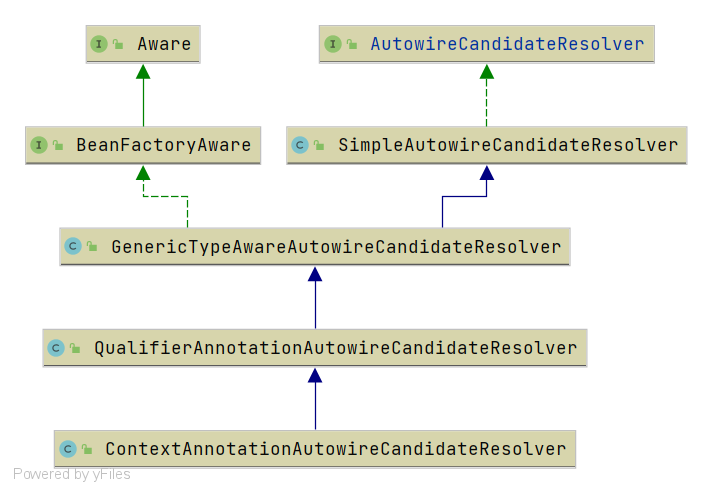

# Spring ContextAnnotationAutowireCandidateResolver

- 类全路径: `org.springframework.context.annotation.ContextAnnotationAutowireCandidateResolver`


- 类图

  


## 方法分析


从接口实现上仅有一个`getLazyResolutionProxyIfNecessary`方法, 其他的都在父类上. 详细请查看下面文章。


下面对 `getLazyResolutionProxyIfNecessary` 进行分析


### getLazyResolutionProxyIfNecessary

- 方法签名: `org.springframework.context.annotation.ContextAnnotationAutowireCandidateResolver#getLazyResolutionProxyIfNecessary`
- 方法作用: 获取懒加载的对象(**代理对象**)


<details>
<summary>getLazyResolutionProxyIfNecessary 详细代码如下</summary>

```java
@Override
@Nullable
public Object getLazyResolutionProxyIfNecessary(DependencyDescriptor descriptor, @Nullable String beanName) {
   // 判断是否懒加载
   return (isLazy(descriptor) ? buildLazyResolutionProxy(descriptor, beanName) : null);
}
```


</details>


在阅读代码后我们有两个方法. 不是很了解. 再根据方法的作用我们大概推断出

1. isLazy 判断是否懒加载
2. buildLazyResolutionProxy 构建代理对象


下面对两个方法进行分析


### isLazy

- 方法签名: `org.springframework.context.annotation.ContextAnnotationAutowireCandidateResolver#isLazy`


整段代码分为上下两段 我们先看第一段


<details>
<summary>isLazy 第一段 详细代码如下</summary>

```java
// 第一部分
// 获取注解循环
for (Annotation ann : descriptor.getAnnotations()) {
   // 得到 lazy 注解
   Lazy lazy = AnnotationUtils.getAnnotation(ann, Lazy.class);
   // 判断 lazy 的注解值是否 true
   if (lazy != null && lazy.value()) {
      return true;
   }
}
```

</details>


第一段的行为是从依赖描述中找到所有的注解，在这些注解中找到**Lazy**注解, 通过**Lazy**注解的数据来确定是否是懒加载的


下面阅读第二段代码

<details>
<summary>isLazy 第二段 详细代码如下</summary>

```java
// 第二部分
// 获取方法参数对象
MethodParameter methodParam = descriptor.getMethodParameter();
if (methodParam != null) {
   // 获取 method
   Method method = methodParam.getMethod();
   if (method == null || void.class == method.getReturnType()) {
      // method 上寻找 lazy 注解
      Lazy lazy = AnnotationUtils.getAnnotation(methodParam.getAnnotatedElement(), Lazy.class);
      return lazy != null && lazy.value();
   }
}
return false;
```

</details>


第二段主要操作对象是**`MethodParameter`**, 从`MethodParameter` 提取 **Method** 在**Method**上寻找 **Lazy** 注解, 最后和第一段一样通过**Lazy**注解的数据来确定是否懒加载


### buildLazyResolutionProxy

- 方法签名: `org.springframework.context.annotation.ContextAnnotationAutowireCandidateResolver#buildLazyResolutionProxy`

- 方法作用: 创建懒加载对象的代理类


<details>
<summary>buildLazyResolutionProxy 详细代码如下</summary>


```java
/**
 * 创建延迟代理类
 */
protected Object buildLazyResolutionProxy(final DependencyDescriptor descriptor, final @Nullable String beanName) {
   Assert.state(getBeanFactory() instanceof DefaultListableBeanFactory,
         "BeanFactory needs to be a DefaultListableBeanFactory");
   final DefaultListableBeanFactory beanFactory = (DefaultListableBeanFactory) getBeanFactory();
   // target source 接口 目标对象
   TargetSource ts = new TargetSource() {
      @Override
      public Class<?> getTargetClass() {
         return descriptor.getDependencyType();
      }

      @Override
      public boolean isStatic() {
         return false;
      }

      @Override
      public Object getTarget() {
         // DefaultListableBeanFactory 中 doResolveDependency 调用
         Object target = beanFactory.doResolveDependency(descriptor, beanName, null, null);
         // 为空的情况下根据类型返回空对象
         if (target == null) {
            Class<?> type = getTargetClass();
            if (Map.class == type) {
               return Collections.emptyMap();
            }
            else if (List.class == type) {
               return Collections.emptyList();
            }
            else if (Set.class == type || Collection.class == type) {
               return Collections.emptySet();
            }
            throw new NoSuchBeanDefinitionException(descriptor.getResolvableType(),
                  "Optional dependency not present for lazy injection point");
         }
         return target;
      }

      @Override
      public void releaseTarget(Object target) {
      }
   };
   // 代理工厂
   ProxyFactory pf = new ProxyFactory();
   // 设置数据信息
   pf.setTargetSource(ts);
   Class<?> dependencyType = descriptor.getDependencyType();
   if (dependencyType.isInterface()) {
      pf.addInterface(dependencyType);
   }
   // 代理工厂创建对象
   return pf.getProxy(beanFactory.getBeanClassLoader());
}
```

</details>


对于这段代码需要了解AOP相关的内容, 在目前阶段还没有开展AOP相关内容的分析这段代码暂时停留. 


下面标出几个有关类

1. `DefaultListableBeanFactory`: [分析文章](/doc/book/bean/factory/Spring-DefaultListableBeanFactory-未完成.md)
2. `TargetSource`: [分析文章](/doc/book-aop/Spring-ProxyFactory-未完成.md)
3. `ProxyFactory`: [分析文章](/doc/book-aop/Spring-TargetSource-未完成.md)