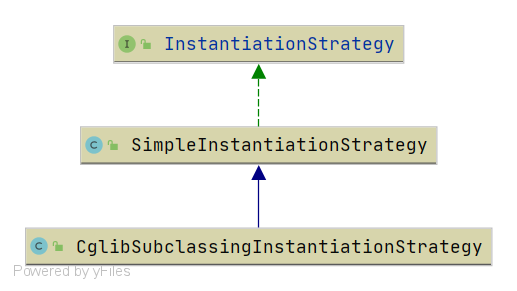

# Spring CglibSubclassingInstantiationStrategy
- 类全路径: `org.springframework.beans.factory.support.CglibSubclassingInstantiationStrategy`

- 类图

  


整个类中重点关注 内部类即可. 方法可以忽略. 主要都在内部类上. 对外公开的方法也是依赖内部类执行


## CglibSubclassCreator


#### 成员变量

```java
private static class CglibSubclassCreator {

   /**
    * 回调类型
    */
   private static final Class<?>[] CALLBACK_TYPES = new Class<?>[]
         { NoOp.class, LookupOverrideMethodInterceptor.class, ReplaceOverrideMethodInterceptor.class };

   /**
    * beanDefinition
    */
   private final RootBeanDefinition beanDefinition;

   /**
    * bean Factory
    */
   private final BeanFactory owner;
}
```

#### 方法分析

##### instantiate

- 方法签名:`org.springframework.beans.factory.support.CglibSubclassingInstantiationStrategy.CglibSubclassCreator#instantiate`
- 方法作用: 创建实例


这段代码涉及到 CGLIB 这一块内容. 在这里不做具体展开. 仅作方法的分析


<details>
<summary>详细代码如下</summary>


```java
public Object instantiate(@Nullable Constructor<?> ctor, Object... args) {
   // 创造 CGLIB 对原有 BeanClass 的增强类
   Class<?> subclass = createEnhancedSubclass(this.beanDefinition);
   Object instance;
   if (ctor == null) {
      // 构造函数为空的情况下创建
      instance = BeanUtils.instantiateClass(subclass);
   }
   else {
      try {
         // 从 subClass 中查询对应的 构造函数
         Constructor<?> enhancedSubclassConstructor = subclass.getConstructor(ctor.getParameterTypes());
         // 创建对象
         instance = enhancedSubclassConstructor.newInstance(args);
      }
      catch (Exception ex) {
         throw new BeanInstantiationException(this.beanDefinition.getBeanClass(),
               "Failed to invoke constructor for CGLIB enhanced subclass [" + subclass.getName() + "]", ex);
      }
   }
   // SPR-10785: set callbacks directly on the instance instead of in the
   // enhanced class (via the Enhancer) in order to avoid memory leaks.
   Factory factory = (Factory) instance;

   // 设置 Factory 的回调
   factory.setCallbacks(new Callback[] { NoOp.INSTANCE,
         new LookupOverrideMethodInterceptor(this.beanDefinition, this.owner),
         new ReplaceOverrideMethodInterceptor(this.beanDefinition, this.owner) });
   return instance;
}
```


</details>

##### createEnhancedSubclass

在这里第一行出现了一个方法`createEnhancedSubclass`

这个方法主要作用是通过 Spring 自己做的 CGLIB 分装将 beanClass 通过 cglib 进行增强


<details>
<summary>详细代码如下</summary>

```JAVA
/**
 * Create an enhanced subclass of the bean class for the provided bean
 * definition, using CGLIB.
 * 创造出 CGLIB 对 BeanClass 的增强子类
 */
private Class<?> createEnhancedSubclass(RootBeanDefinition beanDefinition) {
   Enhancer enhancer = new Enhancer();
   enhancer.setSuperclass(beanDefinition.getBeanClass());
   enhancer.setNamingPolicy(SpringNamingPolicy.INSTANCE);
   if (this.owner instanceof ConfigurableBeanFactory) {
      ClassLoader cl = ((ConfigurableBeanFactory) this.owner).getBeanClassLoader();
      enhancer.setStrategy(new ClassLoaderAwareGeneratorStrategy(cl));
   }
   enhancer.setCallbackFilter(new MethodOverrideCallbackFilter(beanDefinition));
   enhancer.setCallbackTypes(CALLBACK_TYPES);
   return enhancer.createClass();
}
```

</details>


在得到增强类后在做创建行为和，后续资源的补充


创建形式又回到了`BeanUtils.instantiateClass` 方法，这种事传入的 构造函数为空的情况下执行

当构造函数不为空的情况下会进行`getConstructor`方法来找到构造函数


通过构造函数`newInstance`创建


最后的资源补充是指 回调方法的设置


```java
factory.setCallbacks(new Callback[] { NoOp.INSTANCE,
      new LookupOverrideMethodInterceptor(this.beanDefinition, this.owner),
      new ReplaceOverrideMethodInterceptor(this.beanDefinition, this.owner) });
```


## CglibIdentitySupport

- 类全路径:`org.springframework.beans.factory.support.CglibSubclassingInstantiationStrategy.CglibIdentitySupport`


- 作用: 存储 `BeanDefinition`

<details>
<summary>详细代码如下</summary>

```java
private static class CglibIdentitySupport {

   private final RootBeanDefinition beanDefinition;

   public CglibIdentitySupport(RootBeanDefinition beanDefinition) {
      this.beanDefinition = beanDefinition;
   }

   public RootBeanDefinition getBeanDefinition() {
      return this.beanDefinition;
   }

   @Override
   public boolean equals(@Nullable Object other) {
      return (other != null && getClass() == other.getClass() &&
            this.beanDefinition.equals(((CglibIdentitySupport) other).beanDefinition));
   }

   @Override
   public int hashCode() {
      return this.beanDefinition.hashCode();
   }
}
```

</details>


## MethodOverrideCallbackFilter


- 类全路径: `org.springframework.beans.factory.support.CglibSubclassingInstantiationStrategy.MethodOverrideCallbackFilter`


`MethodOverrideCallbackFilter`中有一个方法来判断 方法重载的形式.

<details>
<summary>详细代码如下</summary>


```java
if (methodOverride == null) {
   return PASSTHROUGH;
}
else if (methodOverride instanceof LookupOverride) {
   return LOOKUP_OVERRIDE;
}
else if (methodOverride instanceof ReplaceOverride) {
   return METHOD_REPLACER;
}
```

</details>


整体上这个类没有什么特别的难点.


## LookupOverrideMethodInterceptor

- 类全路径: `org.springframework.beans.factory.support.CglibSubclassingInstantiationStrategy.LookupOverrideMethodInterceptor`


- `LookupOverrideMethodInterceptor` 通过 `LookupOverride` 获取 实例


<details>
<summary>详细代码如下</summary>

```java
@Override
public Object intercept(Object obj, Method method, Object[] args, MethodProxy mp) throws Throwable {
   // Cast is safe, as CallbackFilter filters are used selectively.
   LookupOverride lo = (LookupOverride) getBeanDefinition().getMethodOverrides().getOverride(method);
   Assert.state(lo != null, "LookupOverride not found");
   Object[] argsToUse = (args.length > 0 ? args : null);  // if no-arg, don't insist on args at all
   if (StringUtils.hasText(lo.getBeanName())) {
      return (argsToUse != null ? this.owner.getBean(lo.getBeanName(), argsToUse) :
            this.owner.getBean(lo.getBeanName()));
   }
   else {
      return (argsToUse != null ? this.owner.getBean(method.getReturnType(), argsToUse) :
            this.owner.getBean(method.getReturnType()));
   }
}
```


</details>


## ReplaceOverrideMethodInterceptor

- 类全路径: `org.springframework.beans.factory.support.CglibSubclassingInstantiationStrategy.ReplaceOverrideMethodInterceptor`


- `ReplaceOverrideMethodInterceptor`通过`ReplaceOverride`进行实例化，在这里还需要涉及到一个接口`MethodReplacer`. 

```java
@Override
public Object intercept(Object obj, Method method, Object[] args, MethodProxy mp) throws Throwable {
   ReplaceOverride ro = (ReplaceOverride) getBeanDefinition().getMethodOverrides().getOverride(method);
   Assert.state(ro != null, "ReplaceOverride not found");
   // TODO could cache if a singleton for minor performance optimization
   MethodReplacer mr = this.owner.getBean(ro.getMethodReplacerBeanName(), MethodReplacer.class);
   return mr.reimplement(obj, method, args);
}
```


`MethodReplacer` 其实是我们开发者在编写代码时候使用到的,  使用方式查看面这段代码


```xml
<bean id="apple" class="org.source.hot.spring.overview.ioc.bean.lookup.Apple">
   <replaced-method replacer="methodReplacerApple" name="hello" >
      <arg-type>String</arg-type>
   </replaced-method>

</bean>

<bean id="methodReplacerApple" class="org.source.hot.spring.overview.ioc.bean.lookup.MethodReplacerApple">
</bean>
```