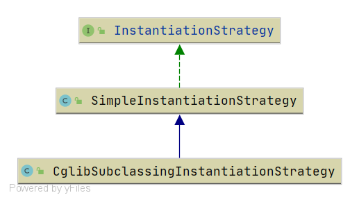

# Spring InstantiationStrategy
- 类全路径: `org.springframework.beans.factory.support.InstantiationStrategy`

- 类图:

  


`InstantiationStrategy` 是一个接口定义了下面三种实例化Bean的方式

1. 通过`BeanFactory`将对应`BeanName`的实例返回
2. 通过构造函数将Bean实例返回
3. 通过工厂函数将Bean实例返回


<details>
<summary>详细代码如下</summary>


```java
public interface InstantiationStrategy {

   /**
    * Return an instance of the bean with the given name in this factory.
    * 从 beanFactory 中返回 对应的 BeanName 实例对象
    * @param bd the bean definition
    * @param beanName the name of the bean when it is created in this context.
    * The name can be {@code null} if we are autowiring a bean which doesn't
    * belong to the factory.
    * @param owner the owning BeanFactory
    * @return a bean instance for this bean definition
    * @throws BeansException if the instantiation attempt failed
    */
   Object instantiate(RootBeanDefinition bd, @Nullable String beanName, BeanFactory owner)
         throws BeansException;

   /**
    * Return an instance of the bean with the given name in this factory,
    * creating it via the given constructor.
    * 从 beanFactory 中返回 对应的 BeanName 实例对象, <b>指定构造函数</b>
    * @param bd the bean definition
    * @param beanName the name of the bean when it is created in this context.
    * The name can be {@code null} if we are autowiring a bean which doesn't
    * belong to the factory.
    * @param owner the owning BeanFactory
    * @param ctor the constructor to use
    * @param args the constructor arguments to apply
    * @return a bean instance for this bean definition
    * @throws BeansException if the instantiation attempt failed
    */
   Object instantiate(RootBeanDefinition bd, @Nullable String beanName, BeanFactory owner,
         Constructor<?> ctor, Object... args) throws BeansException;

   /**
    * Return an instance of the bean with the given name in this factory,
    * creating it via the given factory method.
    * 从 beanFactory 中返回 对应的 BeanName 实例对象, <b>通过指定的FactoryMethod</b>
    * @param bd the bean definition
    * @param beanName the name of the bean when it is created in this context.
    * The name can be {@code null} if we are autowiring a bean which doesn't
    * belong to the factory.
    * @param owner the owning BeanFactory
    * @param factoryBean the factory bean instance to call the factory method on,
    * or {@code null} in case of a static factory method
    * @param factoryMethod the factory method to use
    * @param args the factory method arguments to apply
    * @return a bean instance for this bean definition
    * @throws BeansException if the instantiation attempt failed
    */
   Object instantiate(RootBeanDefinition bd, @Nullable String beanName, BeanFactory owner,
         @Nullable Object factoryBean, Method factoryMethod, Object... args)
         throws BeansException;

}
```


</details>


有关子类实现请查看下面文章

- [Spring-SimpleInstantiationStrategy](/doc/book/bean/factory/support/InstantiationStrategy/Spring-SimpleInstantiationStrategy.md)
- [Spring-CglibSubclassingInstantiationStrategy](/doc/book/bean/factory/support/InstantiationStrategy/Spring-CglibSubclassingInstantiationStrategy.md)