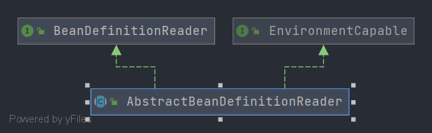

# Spring AbstractBeanDefinitionReader
- 类全路径: `org.springframework.beans.factory.support.AbstractBeanDefinitionReader`

- 类图

  


## 成员变量

- 在阅读`AbstractBeanDefinitionReader`方法之前, 我们先阅读成员变量. 


<details>
    <summary>成员变量</summary>


```java
public abstract class AbstractBeanDefinitionReader implements BeanDefinitionReader, EnvironmentCapable {

   /** Logger available to subclasses. */
   protected final Log logger = LogFactory.getLog(getClass());

   /**
    * bean 定义注册接口
    */
   private final BeanDefinitionRegistry registry;

   /**
    * 资源加载器
    */
   @Nullable
   private ResourceLoader resourceLoader;

   /**
    * 类加载器
    */
   @Nullable
   private ClassLoader beanClassLoader;

   /**
    * 环境配置
    */
   private Environment environment;

   /**
    * bean 名称生成器
    */
   private BeanNameGenerator beanNameGenerator = DefaultBeanNameGenerator.INSTANCE;
}
```


</details>


在成员变量中有如下接口或者类. 在本文不对这些进行分析. 下面列出接口及分析列表

1. `BeanDefinitionRegistry`: bean定义注册接口，[分析文章](/doc/book/bean/factory/support/BeanDefinitionRegistry/readme.md)
2. `ResourceLoader`:资源加载器, [分析文章](/doc/book/core/io/ResourceLoader/readme.md)
3. `Environment`: 环境配置接口, [分析文章](/doc/book/env/environment/readme.md)
4. `BeanNameGenerator`: beanName 生成器, [分析文章](/doc/book/bean/factory/support/Spring-BeanNameGenerator.md)


## 方法分析


- `AbstractBeanDefinitionReader`  中方法没有特别值得分析的内容. 真正的一些方法处理还需要看到子类上. 比如`XmlBeanDefinitionReader` 


- 下面我们还是进行一下方法的注释及说明. 并贴出代码


### loadBeanDefinitions

- 方法签名: `org.springframework.beans.factory.support.AbstractBeanDefinitionReader#loadBeanDefinitions(org.springframework.core.io.Resource...)`


```java
@Override
public int loadBeanDefinitions(Resource... resources) throws BeanDefinitionStoreException {
   Assert.notNull(resources, "Resource array must not be null");
   int count = 0;
   // 循环处理 resource
   for (Resource resource : resources) {
      // 累加 beanDefinition 数量
      count += loadBeanDefinitions(resource);
   }
   return count;
}
```


### loadBeanDefinitions

- 方法签名: `org.springframework.beans.factory.support.AbstractBeanDefinitionReader#loadBeanDefinitions(java.lang.String, java.util.Set<org.springframework.core.io.Resource>)`


```java
public int loadBeanDefinitions(String location, @Nullable Set<Resource> actualResources) throws BeanDefinitionStoreException {
   ResourceLoader resourceLoader = getResourceLoader();
   if (resourceLoader == null) {
      throw new BeanDefinitionStoreException(
            "Cannot load bean definitions from location [" + location + "]: no ResourceLoader available");
   }

   // 资源加载器类型判断
   if (resourceLoader instanceof ResourcePatternResolver) {
      // Resource pattern matching available.
      try {
         // 将 local 解析成 resource 列表
         Resource[] resources = ((ResourcePatternResolver) resourceLoader).getResources(location);

         int count = loadBeanDefinitions(resources);
         if (actualResources != null) {
            Collections.addAll(actualResources, resources);
         }
         if (logger.isTraceEnabled()) {
            logger.trace("Loaded " + count + " bean definitions from location pattern [" + location + "]");
         }
         return count;
      }
      catch (IOException ex) {
         throw new BeanDefinitionStoreException(
               "Could not resolve bean definition resource pattern [" + location + "]", ex);
      }
   }
   else {
      // Can only load single resources by absolute URL.
      // 资源加载器直接加载 location
      Resource resource = resourceLoader.getResource(location);
      // 获取 resource 接口中 beanDefinition 的属灵
      int count = loadBeanDefinitions(resource);
      if (actualResources != null) {
         actualResources.add(resource);
      }
      if (logger.isTraceEnabled()) {
         logger.trace("Loaded " + count + " bean definitions from location [" + location + "]");
      }
      return count;
   }
}
```


- 方法对于`resourceLoader`的一种特殊类型做了额外处理`ResourcePatternResolver`


有关于`AbstractBeanDefinitionReader` 中 `loadBeanDefinitions` 的更多细节方法在子类上有所体现, 请查看[XmlBeanDefinitionReader](/doc/book/bean/factory/xml/Spring-XmlBeanDefinitionReader.md)类的分析来进行了解