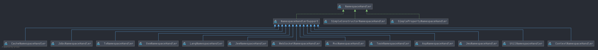

# Spring NamespaceHandler
- 类全路径: `org.springframework.beans.factory.xml.NamespaceHandler`
- 类作用: 命名空间处理器
- 类图
  

- `NamespaceHandler` 提供了下面3种方法.
    1. `init` 方法, 通常在构造函数执行之后执行.  
    2. `parse` 方法, 将 Element 解析成 BeanDefinition 对象
    3. `decorate` 方法, 将 node 解析成 BeanDefinitionHolder 对象


描述含义可能存在误差, 各位有心可以阅读下面的完整代码


```java
public interface NamespaceHandler {

	/**
	 * Invoked by the {@link DefaultBeanDefinitionDocumentReader} after
	 * construction but before any custom elements are parsed.
	 *
	 * 初始化方法, 一般在 构造函数执行之后执行
	 * @see NamespaceHandlerSupport#registerBeanDefinitionParser(String, BeanDefinitionParser)
	 */
	void init();

	/**
	 * Parse the specified {@link Element} and register any resulting
	 * {@link BeanDefinition BeanDefinitions} with the
	 * {@link org.springframework.beans.factory.support.BeanDefinitionRegistry}
	 * that is embedded in the supplied {@link ParserContext}.
	 * <p>Implementations should return the primary {@code BeanDefinition}
	 * that results from the parse phase if they wish to be used nested
	 * inside (for example) a {@code <property>} tag.
	 * <p>Implementations may return {@code null} if they will
	 * <strong>not</strong> be used in a nested scenario.
	 * 
	 * 
	 * 解析 beanDefinition
	 *
	 * @param element the element that is to be parsed into one or more {@code BeanDefinitions}
	 * @param parserContext the object encapsulating the current state of the parsing process
	 * @return the primary {@code BeanDefinition} (can be {@code null} as explained above)
	 */
	@Nullable
	BeanDefinition parse(Element element, ParserContext parserContext);

	/**
	 * Parse the specified {@link Node} and decorate the supplied
	 * {@link BeanDefinitionHolder}, returning the decorated definition.
	 * <p>The {@link Node} may be either an {@link org.w3c.dom.Attr} or an
	 * {@link Element}, depending on whether a custom attribute or element
	 * is being parsed.
	 * <p>Implementations may choose to return a completely new definition,
	 * which will replace the original definition in the resulting
	 * {@link org.springframework.beans.factory.BeanFactory}.
	 * <p>The supplied {@link ParserContext} can be used to register any
	 * additional beans needed to support the main definition.
	 * 
	 * 将 node 解析成 BeanDefinitionHolder
	 * @param source the source element or attribute that is to be parsed
	 * @param definition the current bean definition
	 * @param parserContext the object encapsulating the current state of the parsing process
	 * @return the decorated definition (to be registered in the BeanFactory),
	 * or simply the original bean definition if no decoration is required.
	 * A {@code null} value is strictly speaking invalid, but will be leniently
	 * treated like the case where the original bean definition gets returned.
	 */
	@Nullable
	BeanDefinitionHolder decorate(Node source, BeanDefinitionHolder definition, ParserContext parserContext);

}
```


## 实现类分析


- SimplePropertyNamespaceHandler
- SimpleConstructorNamespaceHandler
- NamespaceHandlerSupport
    - JeeNamespaceHandler
    - AopNamespaceHandler
    - OxmNamespaceHandler
    - LangNamespaceHandler
    - JdbcNamespaceHandler
    - TxNamespaceHandler
    - JmsNamespaceHandler
    - ContextNamespaceHandler
    - UtilNamespaceHandler
    - MvcNamespaceHandler
    - WebSocketNamespaceHandler
    - TaskNamespaceHandler
    - CacheNamespaceHandler 
