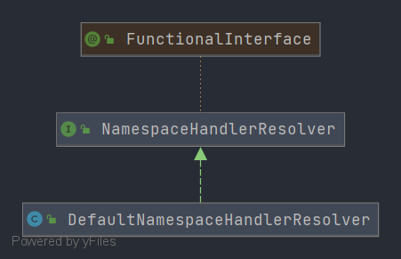

# Spring DefaultNamespaceHandlerResolver

- 类全路径: `org.springframework.beans.factory.xml.DefaultNamespaceHandlerResolver`

- 类图
  
  


## 成员变量

- 首先了解内部变量的含义. 信息请查看下面代码

<details>
<summary>成员变量</summary>

```java
public class DefaultNamespaceHandlerResolver implements NamespaceHandlerResolver {

    /**
     * The location to look for the mapping files. Can be present in multiple JAR files.
     *
     * 默认的 spring handler 映射信息存储的位置
     */
    public static final String DEFAULT_HANDLER_MAPPINGS_LOCATION = "META-INF/spring.handlers";


    /** Logger available to subclasses. */
    protected final Log logger = LogFactory.getLog(getClass());

    /**
     *  ClassLoader to use for NamespaceHandler classes.
     *  类加载器
     *
     * */
    @Nullable
    private final ClassLoader classLoader;

    /**
     * Resource location to search for.
     * spring handler 映射位置.
     * */
    private final String handlerMappingsLocation;

    /**
     *  Stores the mappings from namespace URI to NamespaceHandler class name / instance.
     *
     * key : 命名空间uri
     * value: 字符串或者实例
     *
     * */
    @Nullable
    private volatile Map<String, Object> handlerMappings;

}
```


</details>


在成员变量中有一个静态变量`DEFAULT_HANDLER_MAPPINGS_LOCATION` 在变量中表示了默认的 命名空间处理器的一些信息. 我们打开对应文件进行阅读

```properties
http\://www.springframework.org/schema/c=org.springframework.beans.factory.xml.SimpleConstructorNamespaceHandler
http\://www.springframework.org/schema/p=org.springframework.beans.factory.xml.SimplePropertyNamespaceHandler
http\://www.springframework.org/schema/util=org.springframework.beans.factory.xml.UtilNamespaceHandler
```


通过阅读这段内容在结合成员变量的`handlerMappings` 大致可以了解到这个类有一部分操作时将`META-INF/spring.handlers`文件读取并放到`handlerMappings` 下面我们就开始对方法进行分析


## 方法分析


### resolve

- 方法签名: `org.springframework.beans.factory.xml.DefaultNamespaceHandlerResolver#resolve`


- `resolve`方法是`NamespaceHandlerResolver`接口定义的方法, 在本类(`DefaultNamespaceHandlerResolver`)中实现, 先来看看这个方法做了什么


- 笔者对 `resolve` 进行一个流程说明

  1. 获取命名空间处理器的映射表(key:namespace uri , value: namespaceHandlerClassName , namespaceHandlerInstance)

  2. 从命名空间处理器映射表中根据 参数获取值. 

     此时值有**3种情况**

     1. 不存在

     2. 类型是 `NamespaceHandler`

     3. 类型是字符串

        当属于字符串类型时会有下面操作

        1. 根据字符串获取class
        2. 根据class获取实例. 
        3. 实例执行初始化方法`init`
        4. 覆盖缓存


<details>
<summary>resolve 方法详情</summary>

```java
@Override
@Nullable
public NamespaceHandler resolve(String namespaceUri) {
   // 获取 namespace handler 映射表
   Map<String, Object> handlerMappings = getHandlerMappings();
   // 从映射表中获取 uri 对应的 handler
   // 1. 字符串(名称)
   // 2. 实例
   Object handlerOrClassName = handlerMappings.get(namespaceUri);
   if (handlerOrClassName == null) {
      return null;
   }
   else if (handlerOrClassName instanceof NamespaceHandler) {
      return (NamespaceHandler) handlerOrClassName;
   }
   // 其他情况都做字符串处理
   else {
      String className = (String) handlerOrClassName;
      try {
         Class<?> handlerClass = ClassUtils.forName(className, this.classLoader);
         if (!NamespaceHandler.class.isAssignableFrom(handlerClass)) {
            throw new FatalBeanException("Class [" + className + "] for namespace [" + namespaceUri +
                  "] does not implement the [" + NamespaceHandler.class.getName() + "] interface");
         }
         // 通过反射构造 namespaceHandler 实例
         NamespaceHandler namespaceHandler = (NamespaceHandler) BeanUtils.instantiateClass(handlerClass);
         // 初始化
         namespaceHandler.init();
         // 重写缓存
         handlerMappings.put(namespaceUri, namespaceHandler);
         return namespaceHandler;
      }
      catch (ClassNotFoundException ex) {
         throw new FatalBeanException("Could not find NamespaceHandler class [" + className +
               "] for namespace [" + namespaceUri + "]", ex);
      }
      catch (LinkageError err) {
         throw new FatalBeanException("Unresolvable class definition for NamespaceHandler class [" +
               className + "] for namespace [" + namespaceUri + "]", err);
      }
   }
}
```


</details>


### getHandlerMappings

- 在`resolve` 方法中第一行就是读取handlerMapping资源. 这一段也就映射到我们这篇文章开始提到的`DEFAULT_HANDLER_MAPPINGS_LOCATION` 变量和`handlerMappings` 变量
- 方法签名: `org.springframework.beans.factory.xml.DefaultNamespaceHandlerResolver#getHandlerMappings`


一个文件加载的过程就不给各位展开细说了. 

<details>
    <summary>getHandlerMappings 方法详情</summary>


```java
private Map<String, Object> getHandlerMappings() {
   // 设置容器
   Map<String, Object> handlerMappings = this.handlerMappings;
   if (handlerMappings == null) {
      synchronized (this) {
         handlerMappings = this.handlerMappings;
         if (handlerMappings == null) {
            if (logger.isTraceEnabled()) {
               logger.trace("Loading NamespaceHandler mappings from [" + this.handlerMappingsLocation + "]");
            }
            try {
               // 读取 资源文件地址
               Properties mappings =
                     PropertiesLoaderUtils.loadAllProperties(this.handlerMappingsLocation, this.classLoader);
               if (logger.isTraceEnabled()) {
                  logger.trace("Loaded NamespaceHandler mappings: " + mappings);
               }
               handlerMappings = new ConcurrentHashMap<>(mappings.size());
               // 数据合并, 将 mappings 数据拷贝给 handlerMappings
               CollectionUtils.mergePropertiesIntoMap(mappings, handlerMappings);
               this.handlerMappings = handlerMappings;
            }
            catch (IOException ex) {
               throw new IllegalStateException(
                     "Unable to load NamespaceHandler mappings from location [" + this.handlerMappingsLocation + "]", ex);
            }
         }
      }
   }
   return handlerMappings;
}
```

</details>