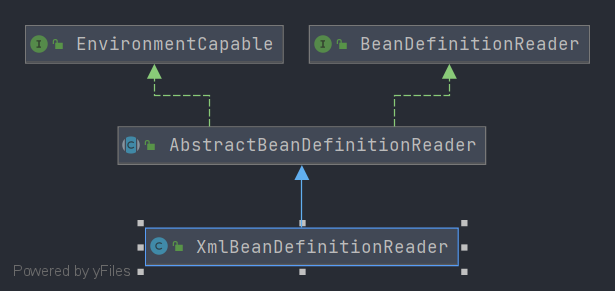

# Spring XmlBeanDefinitionReader 
- 类全路径: `org.springframework.beans.factory.xml.XmlBeanDefinitionReader`

- 类图

  


## 成员变量


在`XmlBeanDefinitionReader` 中定义了下面一些静态变量


<details>
    <summary>XmlBeanDefinitionReader 静态变量</summary>


```java
/**
 * Indicates that the validation should be disabled.
 * 不验证
 */
public static final int VALIDATION_NONE = XmlValidationModeDetector.VALIDATION_NONE;

/**
 * Indicates that the validation mode should be detected automatically.
 * 自动推测进行验证
 */
public static final int VALIDATION_AUTO = XmlValidationModeDetector.VALIDATION_AUTO;

/**
 * Indicates that DTD validation should be used.
 * DTD验证
 */
public static final int VALIDATION_DTD = XmlValidationModeDetector.VALIDATION_DTD;

/**
 * Indicates that XSD validation should be used.
 * XSD验证
 */
public static final int VALIDATION_XSD = XmlValidationModeDetector.VALIDATION_XSD;
```

</details>


这些静态变量描述的是关于 xml 的验证模式


- 其他成员变量

<details>
    <summary>XmlBeanDefinitionReader 其他成员变量</summary>


```java
/**
 *  Constants instance for this class.
 *
 * Constants
 * */
private static final Constants constants = new Constants(XmlBeanDefinitionReader.class);

/**
 * xml 验证器
 */
private final XmlValidationModeDetector validationModeDetector = new XmlValidationModeDetector();

/**
 * 资源编码接口列表
 */
private final ThreadLocal<Set<EncodedResource>> resourcesCurrentlyBeingLoaded =
      new NamedThreadLocal<>("XML bean definition resources currently being loaded");

/**
 * xml 验证模式: 自动模式(自适应 xsd dtd )
 */
private int validationMode = VALIDATION_AUTO;

/**
 *
 */
private boolean namespaceAware = false;

/**
 * bean定义文档读取器
 */
private Class<? extends BeanDefinitionDocumentReader> documentReaderClass =
      DefaultBeanDefinitionDocumentReader.class;

/**
 * 问题记录者
 */
private ProblemReporter problemReporter = new FailFastProblemReporter();

/**
 * Bean定义读取过程中的事件监听器
 */
private ReaderEventListener eventListener = new EmptyReaderEventListener();

/**
 *元数据的提取
 */
private SourceExtractor sourceExtractor = new NullSourceExtractor();

/**
 * 命名空间解析器
 */
@Nullable
private NamespaceHandlerResolver namespaceHandlerResolver;

/**
 * 文档加载器
 */
private DocumentLoader documentLoader = new DefaultDocumentLoader();

/**
 * 实体解析器
 */
@Nullable
private EntityResolver entityResolver;

/**
 * 异常处理器
 * spring 中 SimpleSaxErrorHandler 就是一个日志输出
 */
private ErrorHandler errorHandler = new SimpleSaxErrorHandler(logger);
```


</details>


有关其他成员变量类型的分析

- [Constants](/doc/book/core/Spring-Constants.md)
- [XmlValidationModeDetector]
- [BeanDefinitionDocumentReader](/doc/book/bean/factory/xml/BeanDefinitionDocumentReader/readme.md)
- [ProblemReporter](/doc/book/bean/factory/parsing/ProblemReporter/Spring-ProblemReporter.md)
- [ReaderEventListener](/doc/book/event/Spring_ReaderEventListener-未完成.md)
- [SourceExtractor](/doc/book/bean/factory/parsing/SourceExtractor/Spring-SourceExtractor.md)
- [NamespaceHandlerResolver](/doc/book/bean/factory/xml/NamespaceHandlerResolver/readme.md)
- [DocumentLoader](/doc/book/bean/factory/xml/DocumentLoader/Spring-DocumentLoader.md)
- [ErrorHandler]


`XmlBeanDefinitionReader`主要围绕方法`loadBeanDefinitions`做了封装, 各种封装在本文就不做解释了，直接看最全的方法👇

## 方法分析


### loadBeanDefinitions

- 方法签名: `org.springframework.beans.factory.xml.XmlBeanDefinitionReader#loadBeanDefinitions(org.springframework.core.io.support.EncodedResource)`


<details>
    <summary>loadBeanDefinitions 方法详情</summary>


```java
public int loadBeanDefinitions(EncodedResource encodedResource) throws BeanDefinitionStoreException {
   Assert.notNull(encodedResource, "EncodedResource must not be null");
   if (logger.isTraceEnabled()) {
      logger.trace("Loading XML bean definitions from " + encodedResource);
   }

   Set<EncodedResource> currentResources = this.resourcesCurrentlyBeingLoaded.get();
   if (currentResources == null) {
      currentResources = new HashSet<>(4);
      this.resourcesCurrentlyBeingLoaded.set(currentResources);
   }
   if (!currentResources.add(encodedResource)) {
      throw new BeanDefinitionStoreException(
            "Detected cyclic loading of " + encodedResource + " - check your import definitions!");
   }
   try {
      // 流
      InputStream inputStream = encodedResource.getResource().getInputStream();
      try {
         InputSource inputSource = new InputSource(inputStream);
         if (encodedResource.getEncoding() != null) {
            inputSource.setEncoding(encodedResource.getEncoding());
         }
         return doLoadBeanDefinitions(inputSource, encodedResource.getResource());
      }
      finally {
         inputStream.close();
      }
   }
   catch (IOException ex) {
      throw new BeanDefinitionStoreException(
            "IOException parsing XML document from " + encodedResource.getResource(), ex);
   }
   finally {
      currentResources.remove(encodedResource);
      if (currentResources.isEmpty()) {
         this.resourcesCurrentlyBeingLoaded.remove();
      }
   }
}
```


</details>


其中正真的调度方法是 `doLoadBeanDefinitions`


### doLoadBeanDefinitions

- 方法签名: `org.springframework.beans.factory.xml.XmlBeanDefinitionReader#doLoadBeanDefinitions`


<details>
    <summary>doLoadBeanDefinitions 去掉异常处理后的代码如下</summary>


```java
// 将 输入流转换成 Document
Document doc = doLoadDocument(inputSource, resource);
// 注册bean定义,并获取数量
int count = registerBeanDefinitions(doc, resource);
if (logger.isDebugEnabled()) {
   logger.debug("Loaded " + count + " bean definitions from " + resource);
}
return count;
```


</details>


在`doLoadBeanDefinitions`中我们还是没有办法完整的知道bean定义的数量有多少个的代码, 其实正真获取数量的方法是`registerBeanDefinitions`


### registerBeanDefinitions

- 方法签名: `org.springframework.beans.factory.xml.XmlBeanDefinitionReader#registerBeanDefinitions`


```java
public int registerBeanDefinitions(Document doc, Resource resource) throws BeanDefinitionStoreException {
   BeanDefinitionDocumentReader documentReader = createBeanDefinitionDocumentReader();
   // 历史已有的bean定义数量
   int countBefore = getRegistry().getBeanDefinitionCount();
   // 注册
   documentReader.registerBeanDefinitions(doc, createReaderContext(resource));
   // 注册后的数量-历史数量
   return getRegistry().getBeanDefinitionCount() - countBefore;
}
```


这段方法就是最终求的bean定义数量的详细代码了. 在这段方法中我们需要了解下面这些接口

1. `BeanDefinitionDocumentReader`: [分析文章](/doc/book/bean/factory/xml/BeanDefinitionDocumentReader/Spring-BeanDefinitionDocumentReader.md)
2. `BeanDefinitionRegistry`: [分析文章](/doc/book/bean/factory/support/BeanDefinitionRegistry/readme.md)