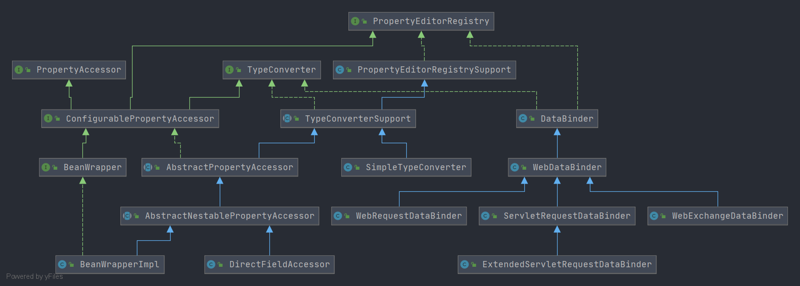

# Spring PropertyEditorRegistry

- 类全路径:`org.springframework.beans.PropertyEditorRegistry`

- 类图: 

  


## 方法列表

- 首先进行接口方法的说明， 简单概述方法作用


- 先看一下方法列表

```java
    void registerCustomEditor(Class<?> requiredType, PropertyEditor propertyEditor);

   void registerCustomEditor(@Nullable Class<?> requiredType, @Nullable String propertyPath, PropertyEditor propertyEditor);

   PropertyEditor findCustomEditor(@Nullable Class<?> requiredType, @Nullable String propertyPath);
```


- 前两个方法都是将 class 和 PropertyEditor 进行一个绑定
- 最后一个方法用来寻找 PropertyEditor


- `propertyPath`: 属性名称或者嵌套位置


接下来围绕类图来了解实现方法

- [Spring-PropertyEditorRegistrySupport.md](./Spring-PropertyEditorRegistrySupport.md)