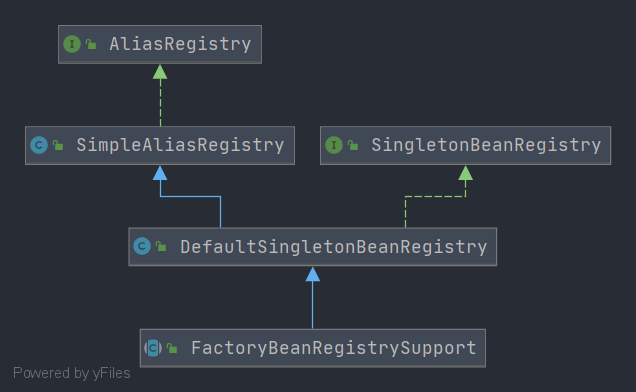

# Spring - FactoryBeanRegistrySupport

- 类全路径: `org.springframework.beans.factory.support.FactoryBeanRegistrySupport`
- 类图




## 内部属性

```JAVA
	private final Map<String, Object> factoryBeanObjectCache = new ConcurrentHashMap<>(16);
ac
```

- `factoryBeanObjectCache` 存储

  key: beanName

  value: bean instance


## getTypeForFactoryBean

- 从 `FactoryBean`中获取bean类型

```java
@Nullable
protected Class<?> getTypeForFactoryBean(final FactoryBean<?> factoryBean) {
   try {
      if (System.getSecurityManager() != null) {
         // 从 factoryBean 获取类型后通过 AccessController 绕一圈获取
         return AccessController.doPrivileged((PrivilegedAction<Class<?>>)
               factoryBean::getObjectType, getAccessControlContext());
      }
      else {
         // 调用 factoryBean 的 getObjectType 方法获取类型
         return factoryBean.getObjectType();
      }
   }
   catch (Throwable ex) {
      // Thrown from the FactoryBean's getObjectType implementation.
      logger.info("FactoryBean threw exception from getObjectType, despite the contract saying " +
            "that it should return null if the type of its object cannot be determined yet", ex);
      return null;
   }
}
```


## getObjectFromFactoryBean

- 从 FactoryBean 中获取 对象


```java
	protected Object getObjectFromFactoryBean(FactoryBean<?> factory, String beanName, boolean shouldPostProcess) {
		// 是否单例 是否已经包含
		if (factory.isSingleton() && containsSingleton(beanName)) {
			synchronized (getSingletonMutex()) {
				// 从工厂bean的缓存中获取
				Object object = this.factoryBeanObjectCache.get(beanName);
				if (object == null) {

					// 从 factoryBean 接口中获取
					object = doGetObjectFromFactoryBean(factory, beanName);
					// Only post-process and store if not put there already during getObject() call above
					// (e.g. because of circular reference processing triggered by custom getBean calls)
					// 从缓存map中获取
					Object alreadyThere = this.factoryBeanObjectCache.get(beanName);
					if (alreadyThere != null) {
						// 如果缓存中获取有值
						// object 覆盖
						object = alreadyThere;
					}
					else {
						// 判断是否需要后置处理
						if (shouldPostProcess) {
							// 是否处于创建中
							if (isSingletonCurrentlyInCreation(beanName)) {
								// Temporarily return non-post-processed object, not storing it yet..
								return object;
							}
							// 单例创建前的验证
							beforeSingletonCreation(beanName);
							try {
								// 从 FactoryBean 接口创建的 后置处理
								object = postProcessObjectFromFactoryBean(object, beanName);
							}
							catch (Throwable ex) {
								throw new BeanCreationException(beanName,
										"Post-processing of FactoryBean's singleton object failed", ex);
							}
							finally {
								// 单例bean创建之后
								afterSingletonCreation(beanName);
							}
						}
						// 是否包含bean name
						if (containsSingleton(beanName)) {
							// 插入缓存
							// 后续使用的时候可以直接获取
							this.factoryBeanObjectCache.put(beanName, object);
						}
					}
				}
				return object;
			}
		}
		else {
			// 从 factoryBean 中创建
			Object object = doGetObjectFromFactoryBean(factory, beanName);
			// 判断是否需要后置处理
			if (shouldPostProcess) {
				try {
					// 后置处理
					object = postProcessObjectFromFactoryBean(object, beanName);
				}
				catch (Throwable ex) {
					throw new BeanCreationException(beanName, "Post-processing of FactoryBean's object failed", ex);
				}
			}
			return object;
		}
	}

```


- 参数解释

  1. FactoryBean<?> factory

     用来获取bean实例的接口

  2. String beanName

     beanName

  3. boolean shouldPostProcess

     是否需要执行后置方法


- 逻辑

1. 判断 factoryBean 是否单例, beanName 是否已存在
   1. 不存在
      1. 从缓存中获取beanName对应的实例
      2. 实例为空
         1. 从 FactoryBean 中创建
         2. 从 factoryBean生成的bean实例容器中获取实例
            1. 实例存在覆盖FactoryBean 创建的结果
            2. 判断是否正在创建
            3. 创建前的判断
            4. 创建+后置处理
            5. 创建后的判断
            6. 插入缓存
2. 从 factoryBean 中创建


- 在这里会调用 doGetObjectFromFactoryBean 进行 创建 bean


## doGetObjectFromFactoryBean

- 从 FactoryBean 中创建 Bean

```java
private Object doGetObjectFromFactoryBean(final FactoryBean<?> factory, final String beanName)
      throws BeanCreationException {

   Object object;
   try {
      if (System.getSecurityManager() != null) {
         AccessControlContext acc = getAccessControlContext();
         try {
            // 从 FactoryBean 中获取bean
            object = AccessController.doPrivileged((PrivilegedExceptionAction<Object>) factory::getObject, acc);
         }
         catch (PrivilegedActionException pae) {
            throw pae.getException();
         }
      }
      else {
         // 获取obj
         object = factory.getObject();
      }
   }
   catch (FactoryBeanNotInitializedException ex) {
      throw new BeanCurrentlyInCreationException(beanName, ex.toString());
   }
   catch (Throwable ex) {
      throw new BeanCreationException(beanName, "FactoryBean threw exception on object creation", ex);
   }

   // Do not accept a null value for a FactoryBean that's not fully
   // initialized yet: Many FactoryBeans just return null then.
   if (object == null) {
      if (isSingletonCurrentlyInCreation(beanName)) {
         throw new BeanCurrentlyInCreationException(
               beanName, "FactoryBean which is currently in creation returned null from getObject");
      }
      // 什么都没有的对象
      object = new NullBean();
   }
   return object;
}
```


## postProcessObjectFromFactoryBean

- 后置处理方法


```java
protected Object postProcessObjectFromFactoryBean(Object object, String beanName) throws BeansException {
   return object;
}
```

- 子类会有自实现