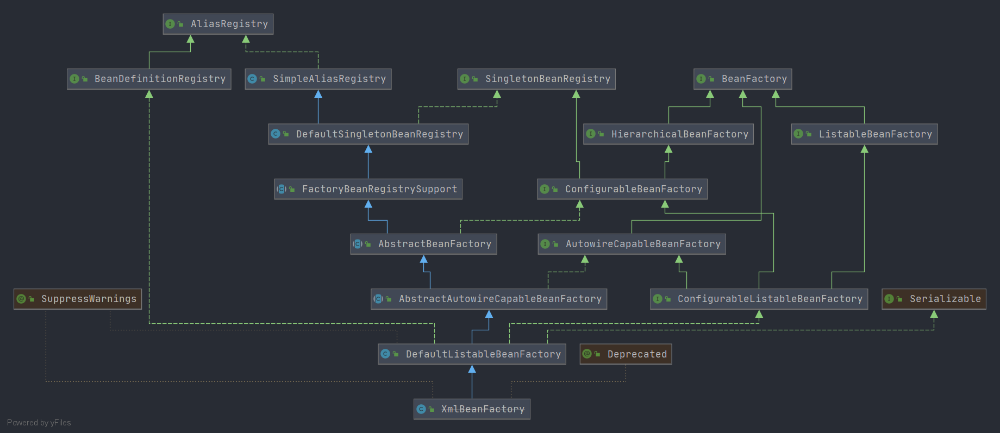

# Spring SingletonBeanRegistry

- 类全路径: `org.springframework.beans.factory.config.SingletonBeanRegistry`

- 类图:



## 方法列表


```
public interface SingletonBeanRegistry {

   /**
    * 注册单例bean
    */
   void registerSingleton(String beanName, Object singletonObject);

   /**
    * 获取单例bean
    */
   @Nullable
   Object getSingleton(String beanName);

   /**
    * 是否存在单例对象
    */
   boolean containsSingleton(String beanName);

   /**
    * 获取所有的单例对象beanName
    */
   String[] getSingletonNames();

   /**
    * 单例bean的数量
    */
   int getSingletonCount();


   Object getSingletonMutex();

}
```


## DefaultSingletonBeanRegistry

- 顶层实现为: `DefaultSingletonBeanRegistry`. 接下来围绕DefaultSingletonBeanRegistry进行分析
- 首先先关注内部属性


```java
	/**
	 *  Cache of singleton objects: bean name to bean instance.
	 *
	 * 单例对象容器, key: beanName , value: bean实例
	 * */
	private final Map<String, Object> singletonObjects = new ConcurrentHashMap<>(256);

	/**
	 *  Cache of singleton factories: bean name to ObjectFactory.
	 * key: beanName
	 * value: 对象工厂
	 * */
	private final Map<String, ObjectFactory<?>> singletonFactories = new HashMap<>(16);

	/**
	 *  Cache of early singleton objects: bean name to bean instance.
	 *
	 * early 概念, 可能是一个没有被实例化的或者说没有被调用的对象
	 * */
	private final Map<String, Object> earlySingletonObjects = new HashMap<>(16);

	/**
	 *
	 * Set of registered singletons, containing the bean names in registration order.
	 *
	 * 注册过的单例单例对象的beanName
	 *  */
	private final Set<String> registeredSingletons = new LinkedHashSet<>(256);

	/**
	 *  Names of beans that are currently in creation.
	 *
	 * 当前正在实例化的beanName
	 *
	 * */
	private final Set<String> singletonsCurrentlyInCreation =
			Collections.newSetFromMap(new ConcurrentHashMap<>(16));

	/**
	 *
	 * Names of beans currently excluded from in creation checks.
	 * 排除的beanName
	 * */
	private final Set<String> inCreationCheckExclusions =
			Collections.newSetFromMap(new ConcurrentHashMap<>(16));

	/**
	 *  Disposable bean instances: bean name to disposable instance.
	 *  一次性的bean
	 *  key: beanName
	 *  value: bean instances
	 *  */
	private final Map<String, Object> disposableBeans = new LinkedHashMap<>();

	/**
	 *  Map between containing bean names: bean name to Set of bean names that the bean contains.
	 *
	 *  */
	private final Map<String, Set<String>> containedBeanMap = new ConcurrentHashMap<>(16);

	/**
	 * Map between dependent bean names: bean name to Set of dependent bean names.
	 *
	 * key: bean
	 * value: 依赖列表
	 * */
	private final Map<String, Set<String>> dependentBeanMap = new ConcurrentHashMap<>(64);

	/**
	 *  Map between depending bean names: bean name to Set of bean names for the bean's dependencies.
	 *
	 * key: beanName
	 * value: bean 依赖的beanName
	 *
	 *  */
	private final Map<String, Set<String>> dependenciesForBeanMap = new ConcurrentHashMap<>(64);

	/**
	 * List of suppressed Exceptions, available for associating related causes.
	 * 异常列表
	 * */
	@Nullable
	private Set<Exception> suppressedExceptions;

	/**
	 * Flag that indicates whether we're currently within destroySingletons.
	 *
	 * */
	private boolean singletonsCurrentlyInDestruction = false;
```


`DefaultSingletonBeanRegistry` 相关的方法操作的都是上述的内部变量. 接下来开始对方法进行逐步分析


### registerSingleton

- 先来看一看 注册单例对象
- 逻辑
  - 判断beanName 和 单例对象是否存在
  - 判断当前BeanName是否注册过
    - 没有注册就注册
    - 注册抛出异常


```java
@Override
public void registerSingleton(String beanName, Object singletonObject) throws IllegalStateException {
   Assert.notNull(beanName, "Bean name must not be null");
   Assert.notNull(singletonObject, "Singleton object must not be null");
   synchronized (this.singletonObjects) {
      Object oldObject = this.singletonObjects.get(beanName);
      if (oldObject != null) {
         throw new IllegalStateException("Could not register object [" + singletonObject +
               "] under bean name '" + beanName + "': there is already object [" + oldObject + "] bound");
      }
      addSingleton(beanName, singletonObject);
   }
}
```


### addSingleton

- 在注册单例对象的时候后续调用 `addSingleton`方法. 该方法的作用是将 beanName 和 beanObject 放入容器, 删除beanName所在的一些容器。具体来看看代码

```java
protected void addSingleton(String beanName, Object singletonObject) {
   synchronized (this.singletonObjects) {
      // 设置 单例对象 map
      this.singletonObjects.put(beanName, singletonObject);
      // 删除 单例的beanFactory
      this.singletonFactories.remove(beanName);
      // 删除 延迟加载的bean
      this.earlySingletonObjects.remove(beanName);
      // 放入已注册的beanName
      this.registeredSingletons.add(beanName);
   }
}
```


### addSingletonFactory

- 添加单例的ObjectFactory


```java
	protected void addSingletonFactory(String beanName, ObjectFactory<?> singletonFactory) {
		Assert.notNull(singletonFactory, "Singleton factory must not be null");
		synchronized (this.singletonObjects) {
			// 单例bean容器中是否存在
			if (!this.singletonObjects.containsKey(beanName)) {
				// 添加单例对象工厂
				this.singletonFactories.put(beanName, singletonFactory);
				// 删除单例BeanName
				this.earlySingletonObjects.remove(beanName);
				// 注册单例beanName
				this.registeredSingletons.add(beanName);
			}
		}
	}

```


### getSingleton

- 获取单例对象


- 循环依赖处理的 getSingleton

```java
@Nullable
protected Object getSingleton(String beanName, boolean allowEarlyReference) {
   // 尝试从单例缓存中获取
   Object singletonObject = this.singletonObjects.get(beanName);
   // 单例对象是否null
   // 这个 beanName 是否正在创建
   if (singletonObject == null && isSingletonCurrentlyInCreation(beanName)) {
      // 锁
      synchronized (this.singletonObjects) {
         // 从早期加载的map中获取
         singletonObject = this.earlySingletonObjects.get(beanName);
         // 对象是否空 ， 是否允许提前应用
         if (singletonObject == null && allowEarlyReference) {
            // 从对象工厂map中获取对象工厂
            ObjectFactory<?> singletonFactory = this.singletonFactories.get(beanName);
            if (singletonFactory != null) {
               // 对象获取后设置
               singletonObject = singletonFactory.getObject();
               this.earlySingletonObjects.put(beanName, singletonObject);
               this.singletonFactories.remove(beanName);
            }
         }
      }
   }
   return singletonObject;
}
```


- 非循环依赖情况下的getSingletoon, 流程如下

1. 从单例容器中获取
   1. 存在返回
   2. 不存在
      1. 创建前验证 **beforeSingletonCreation**
      2. 从 ObjectFactory中获取
      3. 创建后的验证 **afterSingletonCreation**
      4. 是否为新建单例对象
         1. 放入单例容器
      5. 返回单例对象

详细代码如下


```java
public Object getSingleton(String beanName, ObjectFactory<?> singletonFactory) {
   Assert.notNull(beanName, "Bean name must not be null");
   synchronized (this.singletonObjects) {
      // 从单例对象缓存中获取
      Object singletonObject = this.singletonObjects.get(beanName);
      if (singletonObject == null) {
         if (this.singletonsCurrentlyInDestruction) {
            throw new BeanCreationNotAllowedException(beanName,
                  "Singleton bean creation not allowed while singletons of this factory are in destruction " +
                        "(Do not request a bean from a BeanFactory in a destroy method implementation!)");
         }
         if (logger.isDebugEnabled()) {
            logger.debug("Creating shared instance of singleton bean '" + beanName + "'");
         }
         // 单例创建前的验证
         beforeSingletonCreation(beanName);
         boolean newSingleton = false;
         boolean recordSuppressedExceptions = (this.suppressedExceptions == null);
         if (recordSuppressedExceptions) {
            this.suppressedExceptions = new LinkedHashSet<>();
         }
         try {
            // 从 ObjectFactory 中获取
            singletonObject = singletonFactory.getObject();
            newSingleton = true;
         }
         catch (IllegalStateException ex) {
            // Has the singleton object implicitly appeared in the meantime ->
            // if yes, proceed with it since the exception indicates that state.
            singletonObject = this.singletonObjects.get(beanName);
            if (singletonObject == null) {
               throw ex;
            }
         }
         catch (BeanCreationException ex) {
            if (recordSuppressedExceptions) {
               for (Exception suppressedException : this.suppressedExceptions) {
                  ex.addRelatedCause(suppressedException);
               }
            }
            throw ex;
         }
         finally {
            if (recordSuppressedExceptions) {
               this.suppressedExceptions = null;
            }
            // 创建单例对象后的验证
            afterSingletonCreation(beanName);
         }
         if (newSingleton) {
            // 添加到 单例容器中
            addSingleton(beanName, singletonObject);
         }
      }
      return singletonObject;
   }
}
```


### removeSingleton

- 移除单例bean

从各类容器中删除

```java
protected void removeSingleton(String beanName) {
   synchronized (this.singletonObjects) {
      this.singletonObjects.remove(beanName);
      this.singletonFactories.remove(beanName);
      this.earlySingletonObjects.remove(beanName);
      this.registeredSingletons.remove(beanName);
   }
}
```


### registerDependentBean

- 注册依赖的bean

1. 获取beanName 的别名

   1. 获取别名所需要的依赖列表

   2. 向别名的依赖列表中添加此时的依赖bean(dependentBeanName)

2. 获取dependentBeanName的依赖列表

   1. 放入beanName的别名

```java
public void registerDependentBean(String beanName, String dependentBeanName) {
   // 别名
   String canonicalName = canonicalName(beanName);

   synchronized (this.dependentBeanMap) {
      // 向依赖关系中放入数据
      Set<String> dependentBeans =
            this.dependentBeanMap.computeIfAbsent(canonicalName, k -> new LinkedHashSet<>(8));
      if (!dependentBeans.add(dependentBeanName)) {
         return;
      }
   }

   synchronized (this.dependenciesForBeanMap) {
      Set<String> dependenciesForBean =
            this.dependenciesForBeanMap.computeIfAbsent(dependentBeanName, k -> new LinkedHashSet<>(8));
      dependenciesForBean.add(canonicalName);
   }
}
```


### isDependent

- 是否依赖， beanName 是否依赖 dependentBeanName

```java
protected boolean isDependent(String beanName, String dependentBeanName) {
   synchronized (this.dependentBeanMap) {
      return isDependent(beanName, dependentBeanName, null);
   }
}
```


- 检查是否依赖的逻辑
  - 已找到的beanName中是否存在beanName
  - 获取beanName的别名. 获取别名对应的依赖列表
  - 别名依赖列表中是否存在 dependentBeanName 
    - 存在返回
  - 依赖列表循环
    - 递归处理是否存有依赖

- 核心的检查代码如下.


```java
	/**
	 *
	 * @param beanName beanName
	 * @param dependentBeanName 依赖的beanName
	 * @param alreadySeen 已经找到的beanName
	 * @return
	 */
	private boolean isDependent(String beanName, String dependentBeanName, @Nullable Set<String> alreadySeen) {
		if (alreadySeen != null && alreadySeen.contains(beanName)) {
			return false;
		}
		// 别名
		String canonicalName = canonicalName(beanName);
		// 依赖列表中获取
		Set<String> dependentBeans = this.dependentBeanMap.get(canonicalName);
		if (dependentBeans == null) {
			return false;
		}
		if (dependentBeans.contains(dependentBeanName)) {
			return true;
		}
		// 依赖列表循环
		for (String transitiveDependency : dependentBeans) {
			if (alreadySeen == null) {
				alreadySeen = new HashSet<>();
			}
			// 将 beanName 放入 已经找到的列表中, 用作后续处理
			alreadySeen.add(beanName);
			// 判断依赖列表中的bean是否依赖了dependentBeanName
			if (isDependent(transitiveDependency, dependentBeanName, alreadySeen)) {
				return true;
			}
		}
		return false;
	}

```


### destroyBean

- 摧毁 bean


逻辑

1. beanName-> 依赖bean 中删除 beanName,得到bean对应的依赖列表
2. bean依赖列表删除
3. 删除别名map中key=beanName
4. 循环删除别名列表
5. `dependentBeanMap`和 beanName 相关信息删除
6. 删除`dependenciesForBeanMap` beanName


```java
protected void destroyBean(String beanName, @Nullable DisposableBean bean) {
   // Trigger destruction of dependent beans first...
   Set<String> dependencies;
   synchronized (this.dependentBeanMap) {
      // Within full synchronization in order to guarantee a disconnected Set
      // 移除依赖bean
      dependencies = this.dependentBeanMap.remove(beanName);
   }
   if (dependencies != null) {
      if (logger.isTraceEnabled()) {
         logger.trace("Retrieved dependent beans for bean '" + beanName + "': " + dependencies);
      }
      // 依赖列表里面的也删除
      for (String dependentBeanName : dependencies) {
         destroySingleton(dependentBeanName);
      }
   }

   // Actually destroy the bean now...
   if (bean != null) {
      try {
         bean.destroy();
      }
      catch (Throwable ex) {
         if (logger.isWarnEnabled()) {
            logger.warn("Destruction of bean with name '" + beanName + "' threw an exception", ex);
         }
      }
   }

   // Trigger destruction of contained beans...
   Set<String> containedBeans;
   synchronized (this.containedBeanMap) {
      // Within full synchronization in order to guarantee a disconnected Set
      // 别名列表
      containedBeans = this.containedBeanMap.remove(beanName);
   }
   if (containedBeans != null) {
      // 删除 别名列表中的beanName
      for (String containedBeanName : containedBeans) {
         destroySingleton(containedBeanName);
      }
   }

   // Remove destroyed bean from other beans' dependencies.
   synchronized (this.dependentBeanMap) {
      // 依赖beanMap中删除beanName
      for (Iterator<Map.Entry<String, Set<String>>> it = this.dependentBeanMap.entrySet().iterator(); it.hasNext(); ) {
         Map.Entry<String, Set<String>> entry = it.next();
         Set<String> dependenciesToClean = entry.getValue();
         dependenciesToClean.remove(beanName);
         if (dependenciesToClean.isEmpty()) {
            it.remove();
         }
      }
   }

   // Remove destroyed bean's prepared dependency information.
   this.dependenciesForBeanMap.remove(beanName);
}
```