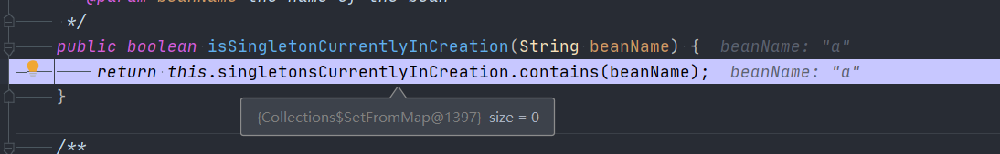

# 循环依赖

- 测试代码

```java
@Component
public class LoopBean {
   public static void main(String[] args) {
      AnnotationConfigApplicationContext ctx = new AnnotationConfigApplicationContext(LoopBean.class);
      B bean = ctx.getBean(B.class);
      System.out.println();
   }


   @Component(value = "a")
   public class A {

      @Autowired
      @Qualifier("b")
      private B b;

      public B getB() {
         return b;
      }

      public void setB(B b) {
         this.b = b;
      }
   }

   @Component(value = "b")
   public class B {
      @Autowired
      @Qualifier("a")
      private A a;

      public A getA() {
         return a;
      }

      public void setA(A a) {
         this.a = a;
      }
   }
}
```


## 容器初始化阶段的循环依赖

- 循环依赖处理的核心代码

```java
@Nullable
protected Object getSingleton(String beanName, boolean allowEarlyReference) {
   // 尝试从单例缓存中获取
   Object singletonObject = this.singletonObjects.get(beanName);
   // 单例对象是否null
   // 这个 beanName 是否正在创建
   if (singletonObject == null && isSingletonCurrentlyInCreation(beanName)) {
      // 锁
      synchronized (this.singletonObjects) {
         // 从早期加载的map中获取
         singletonObject = this.earlySingletonObjects.get(beanName);
         // 对象是否空 ， 是否允许提前应用
         if (singletonObject == null && allowEarlyReference) {
            // 从对象工厂map中获取对象工厂
            ObjectFactory<?> singletonFactory = this.singletonFactories.get(beanName);
            if (singletonFactory != null) {
               // 对象获取后设置
               singletonObject = singletonFactory.getObject();
               this.earlySingletonObjects.put(beanName, singletonObject);
               this.singletonFactories.remove(beanName);
            }
         }
      }
   }
   return singletonObject;
}
```


- 接下来的分析主要围绕上面这段代码来进行阐述。


阅读代码后可以发现这里有三个操作值

1. `singletonObjects`

   单例对象容器, key: beanName ,value: bean instance

   该容器存储已经初始化的bean

2. `earlySingletonObjects`

   笔者认为这是一个没有被实例化,没有被调用的bean.

3. `singletonFactories`

   单例的ObjectFactory容器,key: beanName , value: ObjectFactory


```java
/**
 *  Cache of singleton objects: bean name to bean instance.
 *
 * 单例对象容器, key: beanName , value: bean实例
 * */
private final Map<String, Object> singletonObjects = new ConcurrentHashMap<>(256);

/**
 *  Cache of singleton factories: bean name to ObjectFactory.
 * key: beanName
 * value: 对象工厂
 * */
private final Map<String, ObjectFactory<?>> singletonFactories = new HashMap<>(16);

/**
 *  Cache of early singleton objects: bean name to bean instance.
 *
 * early 概念, 可能是一个没有被实例化的或者说没有被调用的对象
 * */
private final Map<String, Object> earlySingletonObjects = new HashMap<>(16);
```


- 为什么说 `earlySingletonObjects`是没有实例化或没有被调用的Bean容器 ?


- 笔者阅读`addSingleton`和`addSingletonFactory`方法中发现，`earlySingletonObjects` 在做**`remove`**操作，具体代码如下

```java
protected void addSingleton(String beanName, Object singletonObject) {
   synchronized (this.singletonObjects) {
      // 设置 单例对象 map
      this.singletonObjects.put(beanName, singletonObject);
      // 删除 单例的beanFactory
      this.singletonFactories.remove(beanName);
      // 删除 延迟加载的bean
      this.earlySingletonObjects.remove(beanName);
      // 放入已注册的beanName
      this.registeredSingletons.add(beanName);
   }
}


	protected void addSingletonFactory(String beanName, ObjectFactory<?> singletonFactory) {
		Assert.notNull(singletonFactory, "Singleton factory must not be null");
		synchronized (this.singletonObjects) {
			// 单例bean容器中是否存在
			if (!this.singletonObjects.containsKey(beanName)) {
				// 添加单例对象工厂
				this.singletonFactories.put(beanName, singletonFactory);
				// 删除单例BeanName
				this.earlySingletonObjects.remove(beanName);
				// 注册单例beanName
				this.registeredSingletons.add(beanName);
			}
		}
	}

```


- 回到`getSingleton`代码本身


1. 从`singletonObjects`中获取判断是否存在beanName

   

   当前`singletonObjects`不存在 beanName = b 的对象


2. bean 实例不存在 判断是否真正创建

   

   正在创建的bean列表中不存在

   此时第一次查询时不存在且并没有正在创建返回了`null`

   

- 继续往下走

  往下走会到:`org.springframework.beans.factory.support.AbstractBeanFactory#isTypeMatch(java.lang.String, org.springframework.core.ResolvableType, boolean)`

  - 经过一通计算返回false

  再继续往外走会走到方法:`org.springframework.beans.factory.support.DefaultListableBeanFactory#doGetBeanNamesForType`

  

  刚才的返回值如果通过会添加到结果中

  但我们现在是false所以不会添加


这一层循环的对象。接下来回去搜索beanName = a 


到这里 beanName = b 还没有初始化或者放在单例bean容器中.


按照代码现在搜索单例bean a

当代码跑到我们的断点上


观察 `singletonObjects` 发现 a bean 还没有


再看是否正在初始化



- 从上图表述还没有在初始化

那就直接return null 了...

- 看看`matchFound`结果


- 后续经过调用还会再进来.......


beanName = b 第二次进入


此时还是返回null


beanName = a 第二次进入


还是null


这里不管来多少次都是不可能获得到对象的. 


现在这部分还是在 bean 容器准备阶段. 还没有到获取bean阶段. 此时Spring 不会将这部分内容给我们。需要我们调用getBean 才会有真正的循环依赖处理


- **在容器初始化阶段不会有自定义bean的循环依赖处理**


## getBean 阶段的循环依赖

getBean 阶段的`singletonObjects` 

- 头晕了头晕了, getBean 阶段的信息已经存在了, 直接从map容器中获取返回了呀....

  那循环依赖到底什么时候处理的?


## doCreateBean

- `org.springframework.beans.factory.support.AbstractAutowireCapableBeanFactory#doCreateBean`


- 回到方法`getSingleton`


- 数据信息


- 此时B存在但是A还没有


紧接着a会进入getSinglet方法

进来的时候b和a都没有在 单例对象容器中存在.


注意

`singletonFactories` 已经存在信息了!!!!

`objectFactory`可以直接获取bean对象. 因此我们来看最后代码的相关内容

1. 从单例容器中获取
2. 从提前暴露的bean容器中获取
3. 从 ObjectFactory 容器中获取


## 词义解释

- `earlySingletonObjects` 早期加载的bean

  从`getSingleton`这段代码中可以发现: **通过 ObjectFactory.getObject() 出来的bean就是提前曝光的bean**

  