# 重说循环依赖


本文主要介绍**循环依赖相关问题**

> author: [HuiFer](https://github.com/huifer)
>
> github_repo: https://github.com/huifer/spring-analysis
>
> gitee_repo: https://gitee.com/pychfarm_admin/spring-analysis


## Java 循环依赖处理


在开始正式分析之前我们需要思考一个问题. 在java中如何创建出一个循环引用的对象, 下面这段代码就是一个创建循环引用的方式.

```java
public class Demo {

	public static void main(String[] args) {
		A a = new A();
		B b = new B();
		a.innerB = b;
		b.innerA = a;
		System.out.println();
	}
}

class A {
	public B innerB;
}

class B {
	public A innerA;
}

```

上述代码的语义很简单: 创建出对象然后将引用关系绑定.

- 通过上面代码可以得出下面的一个流程
    1. 创建对象
    2. 设置属性
        1. 设置已经初始化过的属性对象
        2. 设置未初始化过的属性对象
    根据这个流程我们需要编写出一个java代码来处理这个问题
    
    

首先第一步需要解决的是一个保存已经初始化的对象. 这里为了方便将 className 作为 key, 实例作为 value

```java
	/**
	 * key: className
	 * value: object instance
	 */
	static Map<String, Object> nameMappingObjectInstance = new HashMap<>();
```

容器准备好了之后就是对单个类的处理. 
    1. 创建对象
    2. 设置属性

首先搭建出一个整体框架, 主要需要处理的是属性设置`setProperty`

```java
	public static <T> T getBean(Class<T> clazz) throws Exception {
		String className = clazz.getName();
		// 容器中存在直接获取
		if (nameMappingObjectInstance.containsKey(className)) {
			return (T) nameMappingObjectInstance.get(className);
		}
		// 容器中不存在. 手动创建对象
		// 通过无参构造创建
		T objectInstance = clazz.getDeclaredConstructor().newInstance();
		// 存入容器
		nameMappingObjectInstance.put(className, objectInstance);
		// 设置创建对象的数据
		setProperty(objectInstance);
		return objectInstance;
	}

```

属性设置的代码如下

```java
private static <T> void setProperty(T objectInstance) throws Exception {
		Field[] fields = objectInstance.getClass().getDeclaredFields();
		for (Field field : fields) {
			field.setAccessible(true);
			// 获取属性类型
			Class<?> fieldType = field.getType();
			String fieldClassName = fieldType.getName();
			// 从容器中获取
			Object cache = nameMappingObjectInstance.get(fieldClassName);
			if (cache != null) {
				field.set(objectInstance, cache);
			}
			else {
				// 手动创建
				Object bean = getBean(fieldType);
				field.set(objectInstance, bean);
			}

		}
	}
```

这段代码主要是将字段进行循环,然后设置数据. 在设置数据的时候尝试从容器中获取, 如果没有则调用 `getBean` 进行获取. 


程序执行流程图

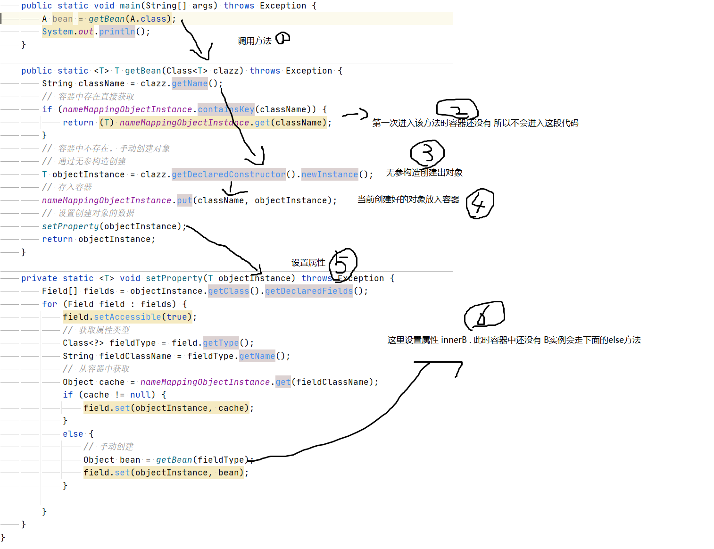


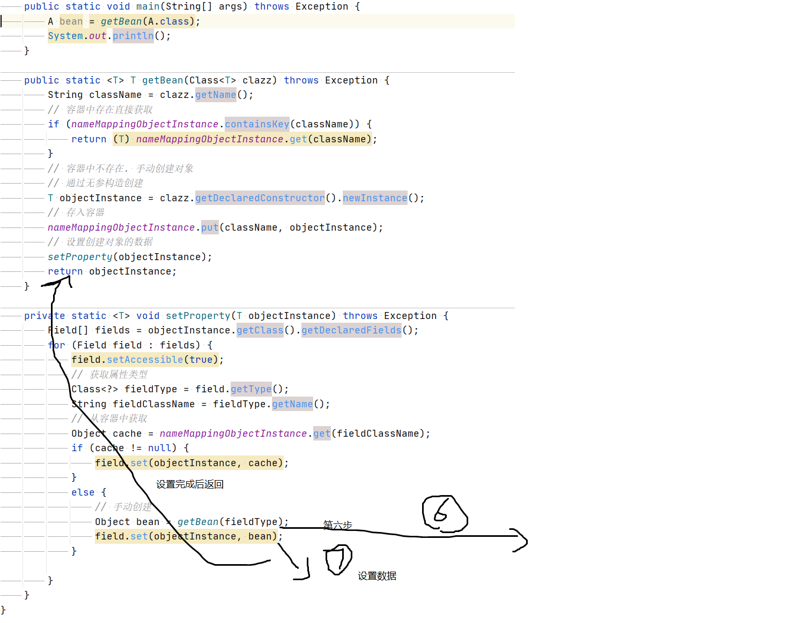


**详细再看流程6**


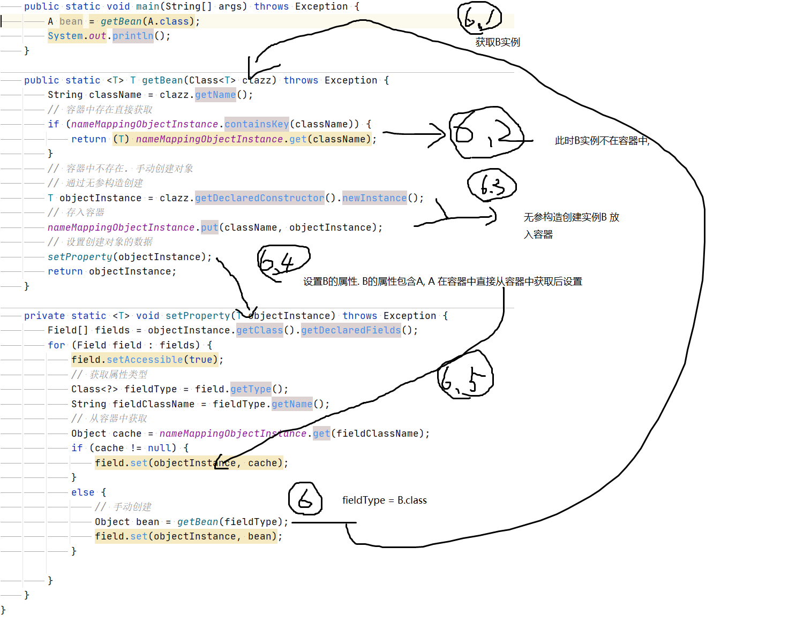


通过上述方法将B信息设置后跳出回到流程6. 将A的属性B设置. 

设置后完成循环依赖处理


依次就完成了循环依赖的处理过程. 完整代码如下


```java
public class Demo {

	/**
	 * key: className
	 * value: object instance
	 */
	static Map<String, Object> nameMappingObjectInstance = new HashMap<>();

	public static void main(String[] args) throws Exception {
		A a = new A();
		B b = new B();
		a.innerB = b;
		b.innerA = a;

		A bean = getBean(A.class);
		System.out.println();
	}

	public static <T> T getBean(Class<T> clazz) throws Exception {
		String className = clazz.getName();
		// 容器中存在直接获取
		if (nameMappingObjectInstance.containsKey(className)) {
			return (T) nameMappingObjectInstance.get(className);
		}
		// 容器中不存在. 手动创建对象
		// 通过无参构造创建
		T objectInstance = clazz.getDeclaredConstructor().newInstance();
		// 存入容器
		nameMappingObjectInstance.put(className, objectInstance);
		// 设置创建对象的数据
		setProperty(objectInstance);
		return objectInstance;
	}

	private static <T> void setProperty(T objectInstance) throws Exception {
		Field[] fields = objectInstance.getClass().getDeclaredFields();
		for (Field field : fields) {
			field.setAccessible(true);
			// 获取属性类型
			Class<?> fieldType = field.getType();
			String fieldClassName = fieldType.getName();
			// 从容器中获取
			Object cache = nameMappingObjectInstance.get(fieldClassName);
			if (cache != null) {
				field.set(objectInstance, cache);
			}
			else {
				// 手动创建
				Object bean = getBean(fieldType);
				field.set(objectInstance, bean);
			}

		}
	}
}
```


在了解Java循环依赖的处理方式后再来看 Spring 中的处理方式


## Spring 循环依赖处理

- Spring 中处理循环依赖的方式和我们上面的思路基本类似

- 在开始分析循环依赖之前我们需要一段代码来模拟一个循环依赖
```java
@Component
public class LoopBean {
	public static void main(String[] args) {
		AnnotationConfigApplicationContext ctx = new AnnotationConfigApplicationContext(LoopBean.class);
		B bean = ctx.getBean(B.class);
		System.out.println();
	}


	@Component(value = "a")
	public class A {

		@Autowired
		@Qualifier("b")
		private B b;

		public B getB() {
			return b;
		}

		public void setB(B b) {
			this.b = b;
		}
	}

	@Component(value = "b")
	public class B {
		@Autowired
		@Qualifier("a")
		private A a;

		public A getA() {
			return a;
		}

		public void setA(A a) {
			this.a = a;
		}
	}
}

```


Spring 中通过`doCreateBean` 创建bean实例. 

`org.springframework.beans.factory.support.AbstractAutowireCapableBeanFactory#doCreateBean`

在方法内这样一些代码. 

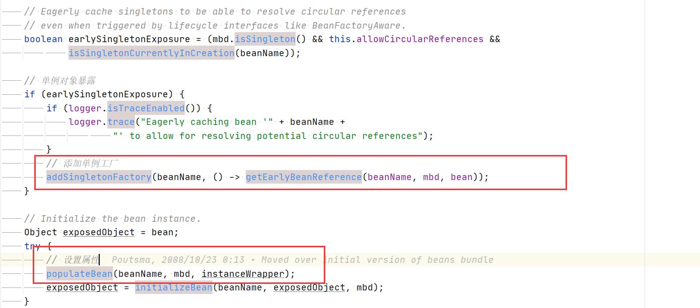


上图中两个红框内

​	第一段作用是将 `ObjectFactory` 放入容器

​	第二段作用时设置属性值


在`doCreateBean` 代码中定义了 `BeanWrapper` 这个可以理解成bean的包装, 对比笔者所写的那段代码可以简单理解成`BeanWrapper`中存储了一个 Object 实例

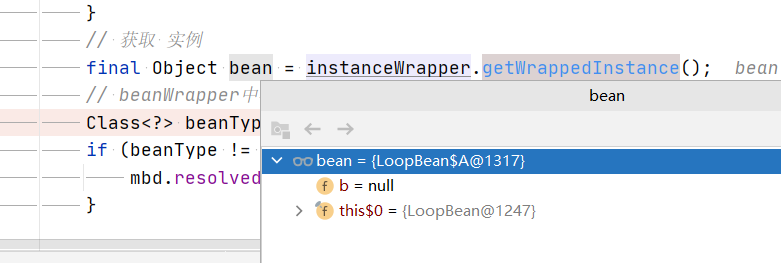


这个状态就是创建bean实例状态. 继续往下走会有设置属性的代码


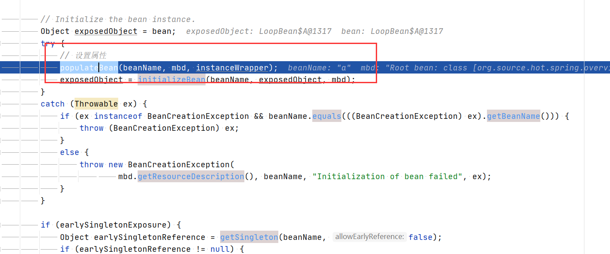


这里进行属性设置, 在属性设置的时候会调用 `getSingleton`  , 在这里处理了循环依赖。在看代码之前先看几个变量 


1. singletonFactories

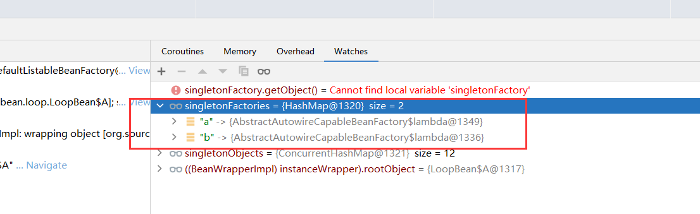

2. singletonObjects

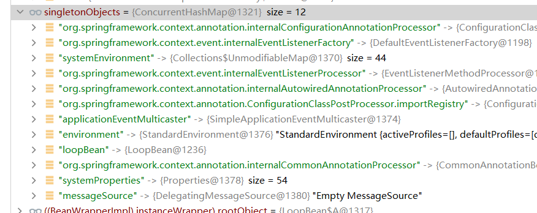


从上面两个截图可以知道单例对象的容器中还没有 a b 两个实例. 他们还在 `ObjectFactory` 容器中等待被使用

加入 `ObjectFactory` 容器的方法: `addSingletonFactory(beanName, () -> getEarlyBeanReference(beanName, mbd, bean));`


到目前为止数据已经准备完成, 接下来就是获取对象的代码了 `getSingleton`

我们现在正在设置 `"a"`的属性`b` 


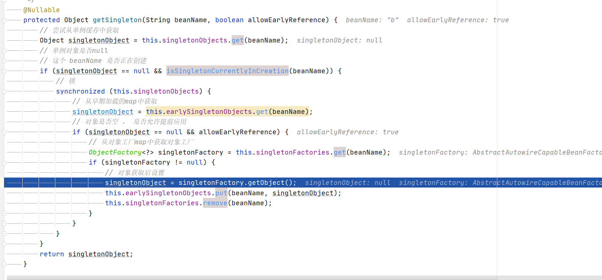

此时现在信息准备的都是b的

会在这里将信息设置到`singletonObject` 和 `earlySingletonObjects` 


这里也正好说一下 `earlySingletonObjects` 是什么意思. 


正如我们现在所处的情况: 设置A的属性B, B还没有被加载过、初始化过, 此时B还没有, 但是通过前面的一些操作Spring将B对象在外头创建好了放在容器中等待我们使用

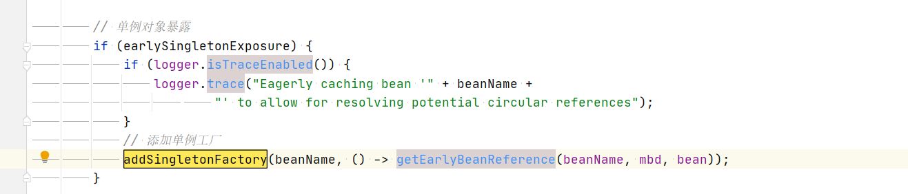

通过这段代码将B这个实例放在一个容器中. 现在我们需要对A的B属性进行赋值, 从中获取. 


`earlySingletonObjects`： 

```java
/**
 *  Cache of early singleton objects: bean name to bean instance.
 *
 * 提前暴露的对象 key: beanName , value: object
 * */
private final Map<String, Object> earlySingletonObjects = new HashMap<>(16);
```


`earlySingletonObjects`： 提前暴露的bean. 在属性设置之前通过`org.springframework.beans.factory.support.AbstractAutowireCapableBeanFactory#getEarlyBeanReference` 创建

继续回到主线代码

现在获取到了B对象,但是属性还没有设置, 此时还会继续调用`getSingleton` 和 `doCreateBean` 


当B信息设置完成后


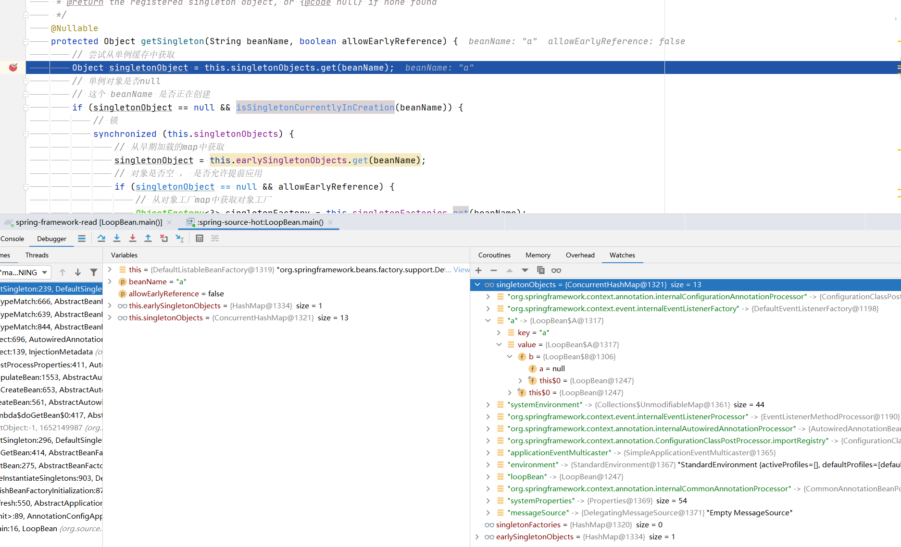


此时就和我们那个代码很像了

现在A在单例对象容器里面了. B 还在 提前暴露的容器中. 


最后当我们通过`getBean` 获取B实例的是时候. 


将信息再通过上文所述方法设置属性....最终得到下面这样的对象

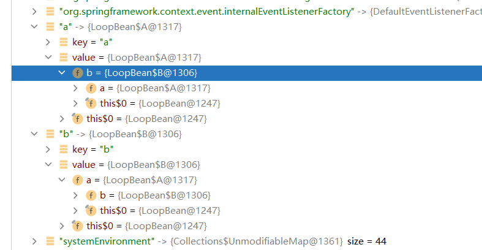


