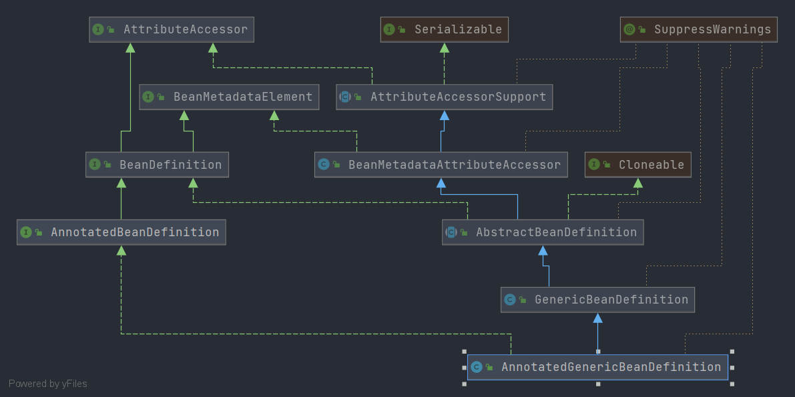

# Spring Annotation 启动流程
> 本文将对 Spring 注解方式的启动流程进行分析
> author: [huifer](https://github.com/huifer)
> 


## 实例
- 在开始分析启动流程之前我们需要先编写一个例子,这个例子是我们分析源码的根. 

下面是基本用例

```java
package org.source.hot.spring.overview.ioc.bean.annotation;

import org.springframework.context.annotation.AnnotationConfigApplicationContext;
import org.springframework.context.annotation.Bean;
import org.springframework.stereotype.Component;

/**
 *
 *
 * @author huifer
 */
public class AnnotationContextDemo {

    public static void main(String[] args) {
        AnnotationConfigApplicationContext context
                = new AnnotationConfigApplicationContext(AnnotationContextDemo.class);
        Us bean = context.getBean(Us.class);


        context.close();

    }

    @Bean
    public Us us() {
        Us us = new Us();
        us.setName("a");
        return us;
    }
}

class Us {
    private String name;

    public String getName() {
        return name;
    }

    public void setName(String name) {
        this.name = name;
    }
}
```


- 对于这个类我们首先需要关注的是 `AnnotationConfigApplicationContext` 构造函数

  ```java
  AnnotationConfigApplicationContext context
          = new AnnotationConfigApplicationContext(AnnotationContextDemo.class);
  ```

- 其次我们需要对 `@Bean` 注解进行分析


## AnnotationConfigApplicationContext 构造函数分析-参数是Class列表

- 首先我们来对`AnnotationConfigApplicationContext`构造函数进行分析


- 下面代码是我们在`AnnotationContextDemo`中编写的构造函数的详细代码. 

```java
public AnnotationConfigApplicationContext(Class<?>... componentClasses) {
   this();
   register(componentClasses);
   refresh();
}
```


三行代码分别做了什么呢？

1. `this()`：

   - `this()` 的完整代码  👇

   ```java
   public AnnotationConfigApplicationContext() {
      this.reader = new AnnotatedBeanDefinitionReader(this);
      this.scanner = new ClassPathBeanDefinitionScanner(this);
   }
   ```

   赋值成员变量`reader`和`scanner` 

   ```java
   /**
    * 注解版本的beanDefinition阅读器
    */
   private final AnnotatedBeanDefinitionReader reader;
   
   
   /**
   * 扫描器
   */
   private final ClassPathBeanDefinitionScanner scanner;
   ```

2. `register(componentClasses)`

   注册组件

   注册逐渐依靠的是成员变量`reader`中的`register`方法

3. `refresh()`

   刷新上下文

   方法提供者: `AbstractApplicationContext`（本文不做分析) 


- 在构造函数中我们可以明确需要分析的方法是`register`，即`org.springframework.context.annotation.AnnotatedBeanDefinitionReader#register` 


## AnnotatedBeanDefinitionReader#register

- 注解模式下bean定义的注册方法

入口方法代码如下


```java
public void register(Class<?>... componentClasses) {
   for (Class<?> componentClass : componentClasses) {
      registerBean(componentClass);
   }
}
```


这里可以看出参数是多个组件类列表, 根据前文实例我们的参数是: `org.source.hot.spring.overview.ioc.bean.annotation.AnnotationContextDemo`

整体代码逻辑就是循环注册组件

真正需要关注的方法在`doRegisterBean` 中


首先我们来看参数

1. `Class<T> beanClass`： bean 类型
2. `String name`: bean 名称
3. `@Nullable Class<? extends Annotation>[] qualifiers`: 限定注解
4. `@Nullable Supplier<T> supplier`: bean 实例提供者
5. `@Nullable BeanDefinitionCustomizer[] customizers`: 自定义处理Bean定义的实现类列表


- 看完参数我们来整理执行流程

  1. 创建`AnnotatedGenericBeanDefinition`(**带有注解的泛型bean定义**)

     在`AnnotatedGenericBeanDefinition` 中存储了关于 Bean的相关信息

     这里举几个例子

     1. `beanClass`
     2. `lazyInit`
     3. `primary`
     4. ....

     

     有兴趣的可以查阅下面类图中的`AnnotatedGenericBeanDefinition`、`GenericBeanDefinition`、`AbstractBeanDefinition`所包含的成员变量

     

  2. 设置实例提供者

     设置实例提供者就是将参数`@Nullable Supplier<T> supplier`设置到 `AnnotatedGenericBeanDefinition` 成员变量中

  3. 解析Scope属性，并设置

     解析Scope属性依靠 **`ScopeMetadataResolver` 接口**, 在注解环境下一般是 **`AnnotationScopeMetadataResolver`** 实现类

  4. beanName 处理

     beanName的处理其实也是根据参数`String name` 进行的

     当参数`name` 存在的情况下就用参数的`name` 作为 beanName

     当参数`name`不存在的情况下会依靠 **`BeanNameGenerator` 接口 ** 生成名称, 在注解环境下一般是 **`AnnotationBeanNameGenerator`** 提供具体的实现方法 
     
     beanName 的可能:
     
     1. 从 `value` 属性中获取. `value` 属性会在 `@Bean` 、`@Service`、`@Component`等中出现
     2. 短类名,首字母小写
     
  5. 通用注解处理

     在这一步会对通用注解进行处理, 即设置`AnnotatedGenericBeanDefinition`中部分成员变量的属性

     通用注解:

     1. `@Lazy`
     2. `@DependsOn`
     3. `@Role`
     4. `@Description`
     - 方法提供者: `AnnotationConfigUtils.processCommonDefinitionAnnotations(abd)` 

  6. 参数`@Nullable BeanDefinitionCustomizer[] customizers`的处理, 即对bean定义的自定义处理
  
     这一段就是一个循环调用 `BeanDefinitionCustomizer#customize`
  
  7. 注册bean定义


- 完整代码如下

```java
private <T> void doRegisterBean(Class<T> beanClass, @Nullable String name,
      @Nullable Class<? extends Annotation>[] qualifiers, @Nullable Supplier<T> supplier,
      @Nullable BeanDefinitionCustomizer[] customizers) {

   // 带有注解的泛型bean定义
   AnnotatedGenericBeanDefinition abd = new AnnotatedGenericBeanDefinition(beanClass);
   // 和条件注解相关的函数
   if (this.conditionEvaluator.shouldSkip(abd.getMetadata())) {
      return;
   }

   // 设置实例提供者
   abd.setInstanceSupplier(supplier);
   // 解析 注解的 beanDefinition 的作用域元数据
   ScopeMetadata scopeMetadata = this.scopeMetadataResolver.resolveScopeMetadata(abd);
   // 设置 作用域元数据
   abd.setScope(scopeMetadata.getScopeName());
   // beanName 处理
   String beanName = (name != null ? name : this.beanNameGenerator.generateBeanName(abd, this.registry));

   // 通用注解的处理
   AnnotationConfigUtils.processCommonDefinitionAnnotations(abd);
   if (qualifiers != null) {
      for (Class<? extends Annotation> qualifier : qualifiers) {
         if (Primary.class == qualifier) {
            abd.setPrimary(true);
         }
         else if (Lazy.class == qualifier) {
            abd.setLazyInit(true);
         }
         else {
            abd.addQualifier(new AutowireCandidateQualifier(qualifier));
         }
      }
   }
   // 自定义的beanDefinition处理
   if (customizers != null) {
      for (BeanDefinitionCustomizer customizer : customizers) {
         customizer.customize(abd);
      }
   }

   // 创建 beanDefinition Holder 后进行注册
   BeanDefinitionHolder definitionHolder = new BeanDefinitionHolder(abd, beanName);
   // 应用作用域代理
   definitionHolder = AnnotationConfigUtils.applyScopedProxyMode(scopeMetadata, definitionHolder, this.registry);
   BeanDefinitionReaderUtils.registerBeanDefinition(definitionHolder, this.registry);
}
```


- 关于 `refresh` 的分析各位可以在这个项目中找到👉[Spring-Analysis](https://gitee.com/pychfarm_admin/spring-analysis)


- 这是我们关于参数是多个class的构造函数分析, 在`AnnotationConfigApplicationContext`还提供了字符串形式的扫描.这也是后续SpringBoot中关于扫描的核心. 下面我们来看看扫描的方法


- 构造函数如下

```java
public AnnotationConfigApplicationContext(String... basePackages) {
   this();
   scan(basePackages);
   refresh();
}
```

- 真正关注的方法应该时 `scan`


```java
@Override
public void scan(String... basePackages) {
   Assert.notEmpty(basePackages, "At least one base package must be specified");
   this.scanner.scan(basePackages);
}
```


- `scan` 方法依靠`ClassPathBeanDefinitionScanner`类所提供的`scan`方法, 找到了目标方法下面开始对其进行分析。

在 scan 方法中的执行流程如下

1. 获取未进行注册前的bean数量
2. 扫描包路径,进行注册
3. 注册 注解的配置处理器
4. 得到注册的bean数量

在这段流程中核心方法是第二步(`doScan`)  ，先回顾一下`scan`方法的实现代码

```java
public int scan(String... basePackages) {
   // 在执行扫描方法前beanDefinition的数量
   int beanCountAtScanStart = this.registry.getBeanDefinitionCount();

   // 真正的扫描方法
   doScan(basePackages);

   // 是否需要注册 注解的配置处理器
   // Register annotation config processors, if necessary.
   if (this.includeAnnotationConfig) {
      // 注册注解后置处理器
      AnnotationConfigUtils.registerAnnotationConfigProcessors(this.registry);
   }

   //  当前 BeanDefinition 数量 - 历史 B
   return (this.registry.getBeanDefinitionCount() - beanCountAtScanStart);
}
```


- 下面将展开`doScan`方法的分析

处理流程

1. 循环每个包路径

2. 在指定包路径中找到可能的组件(处理方法: `findCandidateComponents`)

   1. 什么是可能的组件？

      在Spring中对可能组件的判断代码如下

      ```java
      protected boolean isCandidateComponent(AnnotatedBeanDefinition beanDefinition) {
         // 从 注解的bean定义中获取注解元信息
         AnnotationMetadata metadata = beanDefinition.getMetadata();
         // 1. 是否独立
         // 2. 是否可以创建
         // 3. 是否 abstract 修饰
         // 4. 是否有 Lookup 注解
         return (metadata.isIndependent() && (metadata.isConcrete() ||
               (metadata.isAbstract() && metadata.hasAnnotatedMethods(Lookup.class.getName()))));
      }
      ```

   2. 扫描方法各位请查看

      ```java
      addCandidateComponentsFromIndex
      scanCandidateComponents
      ```

3. 在得到可能的组件列表后，注意这里可能的组件列表就是 BeanDefinition , 后续的操作就是围绕 BeanDefinition 进行

   1. 设置作用域

   2. beanName处理

   3. bean定义的后置处理

      处理内容如下

      1. 设置默认值, 默认值从`BeanDefinitionDefaults`中获取
      2. 设置 `autowireCandidate` 

   4. 通用注解处理

   5. **beanName和候选对象的匹配检测**

      1. beanName 是否存在

      2. 容器中BeanName对应的实例和参数传递的BeanDefinition是否兼容

         Spring 中对于兼容的判断

         ```java
         protected boolean isCompatible(BeanDefinition newDefinition, BeanDefinition existingDefinition) {
            // 1. 是否是 ScannedGenericBeanDefinition 类型
            // 2. source 是否相同
            // 3. 参数是否相同
            return (!(existingDefinition instanceof ScannedGenericBeanDefinition) ||  // explicitly registered overriding bean
                  (newDefinition.getSource() != null && newDefinition.getSource().equals(existingDefinition.getSource())) ||  // scanned same file twice
                  newDefinition.equals(existingDefinition));  // scanned equivalent class twice
         }
         ```

      3. 如果通过了匹配检测则加入到容器


- 在`findCandidateComponents`方法中没有展开`addCandidateComponentsFromIndex`和`scanCandidateComponents` 方法 只是将判断可能组件的方式提了出来, 更多细节各位读者还需要自行查看


- 下面是Spring中关于`doScan`的完整代码

```java
protected Set<BeanDefinitionHolder> doScan(String... basePackages) {
   Assert.notEmpty(basePackages, "At least one base package must be specified");
   // bean 定义持有器列表
   Set<BeanDefinitionHolder> beanDefinitions = new LinkedHashSet<>();
   // 循环包路径进行扫描
   for (String basePackage : basePackages) {
      // 搜索可能的组件. 得到 组件的BeanDefinition
      Set<BeanDefinition> candidates = findCandidateComponents(basePackage);
      // 循环候选bean定义
      for (BeanDefinition candidate : candidates) {
         // 获取 作用域元数据
         ScopeMetadata scopeMetadata = this.scopeMetadataResolver.resolveScopeMetadata(candidate);
         // 设置作用域
         candidate.setScope(scopeMetadata.getScopeName());
         // beanName 生成
         String beanName = this.beanNameGenerator.generateBeanName(candidate, this.registry);
         // 类型判断 AbstractBeanDefinition
         if (candidate instanceof AbstractBeanDefinition) {
            // bean 定义的后置处理
            postProcessBeanDefinition((AbstractBeanDefinition) candidate, beanName);
         }
         // 类型判断 AnnotatedBeanDefinition
         if (candidate instanceof AnnotatedBeanDefinition) {
            // 通用注解的处理
            AnnotationConfigUtils.processCommonDefinitionAnnotations((AnnotatedBeanDefinition) candidate);
         }
         // 候选检测
         if (checkCandidate(beanName, candidate)) {
            BeanDefinitionHolder definitionHolder = new BeanDefinitionHolder(candidate, beanName);
            // 作用于属性应用
            definitionHolder =
                  AnnotationConfigUtils.applyScopedProxyMode(scopeMetadata, definitionHolder, this.registry);
            beanDefinitions.add(definitionHolder);
            // 注册 bean定义
            registerBeanDefinition(definitionHolder, this.registry);
         }
      }
   }
   return beanDefinitions;
}
```


- 到这关于Spring注解模式的启动方式全部分析完成. 感谢各位的阅读