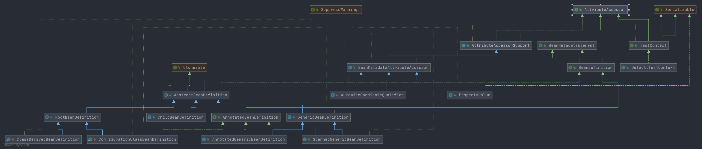

# Spring AttributeAccessor

- 类全路径: `org.springframework.core.AttributeAccessor`

- 类图:

  

- 类作用: 提供属性相关操作

  1. 获取属性
  2. 设置属性
  3. 删除属性
  4. 判断是否存在属性

  具体来看方法列表


## 方法列表


```java
public interface AttributeAccessor {

   /**
    * 设置属性值
    * @param name the unique attribute key.
    *              属性值名称
    * @param value the attribute value to be attached
    *              属性值
    */
   void setAttribute(String name, @Nullable Object value);

   /**
    * 通过属性名称获取属性值
    *
    * @param name the unique attribute key
    *              属性值名称
    * @return the current value of the attribute, if any
    *           属性值
    */
   @Nullable
   Object getAttribute(String name);

   /**
    * 移除指定属性名称的值,返回移除的属性值
    *
    * @param name the unique attribute key
    *              属性值名称
    * @return the last value of the attribute, if any
    *           移除的属性值
    */
   @Nullable
   Object removeAttribute(String name);

   /**
    * 是否包含属性名称
    * @param name the unique attribute key
    *              属性名称
    */
   boolean hasAttribute(String name);

   /**
    * 属性名称列表
    */
   String[] attributeNames();

}
```