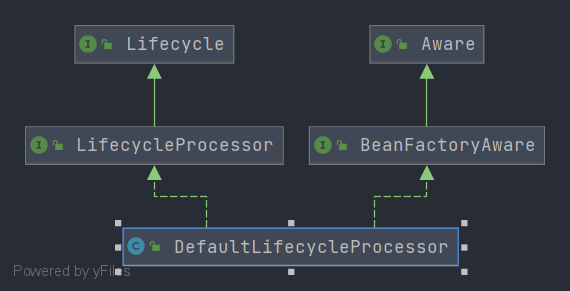

# Spring DefaultLifecycleProcessor
- 类全路径: `org.springframework.context.support.DefaultLifecycleProcessor`
- `DefaultLifecycleProcessor` Spring 中默认的生命周期处理接口实现

- 类图
    


- 首先阅读成员变量

## 成员变量

```java
public class DefaultLifecycleProcessor implements LifecycleProcessor, BeanFactoryAware {

    /**
     * 关键节点上的最大超时时间
     */
    private volatile long timeoutPerShutdownPhase = 30000;

    /**
     * 是否正在执行
     */
    private volatile boolean running;

    /**
     * beaFactory 通过 BeanFactoryAware 设置
     */
    @Nullable
    private volatile ConfigurableListableBeanFactory beanFactory;
}
```

- 从类图上我们看到有`BeanFactoryAware`的实现. 其实现的作用就是将 BeaFactory 设置到内部变量中


## 方法分析

### 五个方法
- 我们先来看对外暴露的五个方法, 这五个方法分为两组 开始 、结束. 

```java

    @Override
	public void start() {
		startBeans(false);
		this.running = true;
	}

	@Override
	public void stop() {
		stopBeans();
		this.running = false;
	}

	@Override
	public void onRefresh() {
		startBeans(true);
		this.running = true;
	}

	@Override
	public void onClose() {
		stopBeans();
		this.running = false;
	}

	@Override
	public boolean isRunning() {
		return this.running;
	}
```


- 通过阅读可以知道最终的方法是 `startBeans` 和 `stopBeans`， 我们先从 `startBeans` 开始分析


### startBeans

- 方法签名: `org.springframework.context.support.DefaultLifecycleProcessor.startBeans`


<details>
    <summary>startBeans 方法</summary>


```java
	private void startBeans(boolean autoStartupOnly) {
		// 获取 生命周期bean 容器
		Map<String, Lifecycle> lifecycleBeans = getLifecycleBeans();
		// 阶段容器
		Map<Integer, LifecycleGroup> phases = new HashMap<>();
		// 循环 生命周期bean 创建阶段对象
		lifecycleBeans.forEach((beanName, bean) -> {

			// 1. autoStartupOnly 自动启动
			// 2. 类型是否是 SmartLifecycle
			// 3. SmartLifecycle 方法isAutoStartup是否 true
			if (!autoStartupOnly || (bean instanceof SmartLifecycle && ((SmartLifecycle) bean).isAutoStartup())) {
				// 获取bean的生命周期阶段
				int phase = getPhase(bean);
				// 通过阶段值获取生命周期组
				LifecycleGroup group = phases.get(phase);
				if (group == null) {
					// 创建 生命周期组
					group = new LifecycleGroup(phase, this.timeoutPerShutdownPhase, lifecycleBeans, autoStartupOnly);
					phases.put(phase, group);
				}
				group.add(beanName, bean);
			}
		});
		if (!phases.isEmpty()) {
			// 获取阶段数据
			List<Integer> keys = new ArrayList<>(phases.keySet());
			// 阶段排序
			Collections.sort(keys);
			// 顺序执行 生命周期组的start方法
			for (Integer key : keys) {
				phases.get(key).start();
			}
		}
	}

```


</details>

- 在看过代码后我们对方法的整体流程进行描述

	1. 获取生命周期接口容器(`getLifecycleBeans`)
	2. 从生命周期接口容器中把生命周期接口获取得到这个生命周期接口的阶段数值(int类型),放入阶段容器.`Map<Integer, LifecycleGroup> phases = new HashMap<>();`
	3. 将阶段容器中的key排序(阶段排序), 顺序执行`start`方法


在上述流程中需要关注两个方法, 一个类

- 方法:
  -  `getLifecycleBeans`: 获取`Lifecycle`bean
  - `getPhase`: 获取bean的生命周期阶段

- 类:
  -  `LifecycleGroup`： 生命周期组


### getLifecycleBeans

- 方法签名: `org.springframework.context.support.DefaultLifecycleProcessor#getLifecycleBeans`

- 方法作用: 获取类型是`Lifecycle`的bean实例

获取方式: 

1. 通过beanFactory 提供的`getBeanNamesForType` 根据beanType搜索所有的beanName

2. 处理查询到的beanName

   这里的处理就是获取bean实例,放入容器. 

   放入的条件

   1. 当前 beanName 存在单例对象
   2. 不是工厂bean
   3. 类型是下面两种的某一种
      1. `Lifecycle`
      2. `SmartLifecycle`


在了解获取方式后下面阅读完整代码


<details>
    <summary>getLifecycleBeans 方法</summary>


```java
protected Map<String, Lifecycle> getLifecycleBeans() {
   // 获取beanFactory
   ConfigurableListableBeanFactory beanFactory = getBeanFactory();
   // 返回值
   Map<String, Lifecycle> beans = new LinkedHashMap<>();
   // 获取 Lifecycle beanName 列表
   String[] beanNames = beanFactory.getBeanNamesForType(Lifecycle.class, false, false);
   for (String beanName : beanNames) {
      // 转换beanName
      String beanNameToRegister = BeanFactoryUtils.transformedBeanName(beanName);
      // 判断是否是工厂bean
      boolean isFactoryBean = beanFactory.isFactoryBean(beanNameToRegister);
      // beanName 修正, 如果是 工厂bean 加上 & 前缀
      String beanNameToCheck = (isFactoryBean ? BeanFactory.FACTORY_BEAN_PREFIX + beanName : beanName);

      // 条件过滤
      // 1. 当前beanName 是否存在单例对象
      // 2. 是否是 工厂bean
      // 3. 类型是否匹配
      if ((beanFactory.containsSingleton(beanNameToRegister) &&
            (!isFactoryBean || matchesBeanType(Lifecycle.class, beanNameToCheck, beanFactory))) ||
            matchesBeanType(SmartLifecycle.class, beanNameToCheck, beanFactory)) {
         Object bean = beanFactory.getBean(beanNameToCheck);
         if (bean != this && bean instanceof Lifecycle) {
            beans.put(beanNameToRegister, (Lifecycle) bean);
         }
      }
   }
   return beans;
}
```

</details>


- 匹配方法 `matchesBeanType` 通过beanName获取类型 , 判断目标类型和beanType是否同源


### matchesBeanType

- 方法签名: `org.springframework.context.support.DefaultLifecycleProcessor#matchesBeanType`


```java
private boolean matchesBeanType(Class<?> targetType, String beanName, BeanFactory beanFactory) {
   // 获取 beanType
   Class<?> beanType = beanFactory.getType(beanName);
   // 判断类型是否是同源
   return (beanType != null && targetType.isAssignableFrom(beanType));
}
```


### getPhase

- 方法签名: `org.springframework.context.support.DefaultLifecycleProcessor#getPhase`

在这需要引出一个接口`Phased`, 阶段接口. 

阶段接口可以直接获取阶段数值. 详细代码如下

```java
public interface Phased {

   /**
    * Return the phase value of this object.
    */
   int getPhase();

}
```


在 Spring 中有默认阶段数值: `Integer.MAX_VALUE` 这个数据位于:`org.springframework.context.SmartLifecycle#DEFAULT_PHASE`


回过来看 `getPhase`方法


```java
protected int getPhase(Lifecycle bean) {
   return (bean instanceof Phased ? ((Phased) bean).getPhase() : 0);
}
```


那这个方法就很好理解了, 类型判断 , 强转获取


## LifecycleGroup

- 类全路径: `org.springframework.context.support.DefaultLifecycleProcessor.LifecycleGroup`


### 成员变量

- 首先看成员变量

```java
private class LifecycleGroup {

   /**
    * 生命周期阶段
    */
   private final int phase;

   /**
    * 超时时间
    */
   private final long timeout;

   /**
    * 生命周期接口实例对象
    */
   private final Map<String, ? extends Lifecycle> lifecycleBeans;

   /**
    * 是否自动启动
    */
   private final boolean autoStartupOnly;

   /**
    * 对比器列表
    */
   private final List<LifecycleGroupMember> members = new ArrayList<>();

   /**
    * SmartLifecycle 实例的数量
    */
   private int smartMemberCount;
}
```


- 从`LifecycleGroup`的成员变量中引出`LifecycleGroupMember`类, 

  变量 `members` 在启动时有使用


## LifecycleGroupMember

- 类全路径: `org.springframework.context.support.DefaultLifecycleProcessor.LifecycleGroupMember`


```java
/**
 * Adapts the Comparable interface onto the lifecycle phase model.
 */
private class LifecycleGroupMember implements Comparable<LifecycleGroupMember> {
   /**
    * beanName
    */
   private final String name;

   /**
    * 实例
    */
   private final Lifecycle bean;

   LifecycleGroupMember(String name, Lifecycle bean) {
      this.name = name;
      this.bean = bean;
   }

   @Override
   public int compareTo(LifecycleGroupMember other) {
      int thisPhase = getPhase(this.bean);
      int otherPhase = getPhase(other.bean);
      return Integer.compare(thisPhase, otherPhase);
   }
}
```


在了解`LifecycleGroupMember`后开始 `start` 方法的分析

### start

- 方法签名: `org.springframework.context.support.DefaultLifecycleProcessor.LifecycleGroup#start`


```java
public void start() {
   if (this.members.isEmpty()) {
      return;
   }
   if (logger.isDebugEnabled()) {
      logger.debug("Starting beans in phase " + this.phase);
   }
   Collections.sort(this.members);
   for (LifecycleGroupMember member : this.members) {
      // 核心start方法
      doStart(this.lifecycleBeans, member.name, this.autoStartupOnly);
   }
}
```


- 到这里我们找到了 `start` 的核心方法: **`doStart`**


### doStart

- 方法签名: `org.springframework.context.support.DefaultLifecycleProcessor#doStart`

- 方法签名: 执行 生命周期接口(`Lifecycle`)的`start`方法


<details>
    <summary>doStart 方法</summary>


```java
private void doStart(Map<String, ? extends Lifecycle> lifecycleBeans, String beanName, boolean autoStartupOnly) {
   // 从容器中删除当前处理的beanName
   // 生命周期接口
   Lifecycle bean = lifecycleBeans.remove(beanName);

   if (bean != null && bean != this) {

      // beanName 依赖的beanName列表
      String[] dependenciesForBean = getBeanFactory().getDependenciesForBean(beanName);

      // 循环处理 依赖的bean生命周期
      for (String dependency : dependenciesForBean) {
         doStart(lifecycleBeans, dependency, autoStartupOnly);
      }
      if (!bean.isRunning() &&
            (!autoStartupOnly || !(bean instanceof SmartLifecycle) || ((SmartLifecycle) bean).isAutoStartup())) {
         if (logger.isTraceEnabled()) {
            logger.trace("Starting bean '" + beanName + "' of type [" + bean.getClass().getName() + "]");
         }
         try {
            // 执行生命周期的start方法
            bean.start();
         }
         catch (Throwable ex) {
            throw new ApplicationContextException("Failed to start bean '" + beanName + "'", ex);
         }
         if (logger.isDebugEnabled()) {
            logger.debug("Successfully started bean '" + beanName + "'");
         }
      }
   }
}
```


</details>


- 首先整理出下面一组流程

	1. 从存储生命周期接口的容器中获取beanName对应的生命周期接口
	2. 执行这个生命周期接口的`start`方法
	
	```JAVA
	Lifecycle bean = lifecycleBeans.remove(beanName);
	bean.start();
	```
	
- 在上述流程中Spring在处理上还增加了异步关于依赖的处理。 

  ```JAVA
  // beanName 依赖的beanName列表
  String[] dependenciesForBean = getBeanFactory().getDependenciesForBean(beanName);
  
  // 循环处理 依赖的bean生命周期
  for (String dependency : dependenciesForBean) {
     doStart(lifecycleBeans, dependency, autoStartupOnly);
  }
  ```

  


- 关于 start 相关处理我们已经了解完成. 下面来看看 stop 相关处理


### stopBeans

- 方法签名: `org.springframework.context.support.DefaultLifecycleProcessor#stopBeans`

<details>
    <summary>stopBeans 方法</summary>


```java
private void stopBeans() {
   Map<String, Lifecycle> lifecycleBeans = getLifecycleBeans();
   Map<Integer, LifecycleGroup> phases = new HashMap<>();
   lifecycleBeans.forEach((beanName, bean) -> {
      int shutdownPhase = getPhase(bean);
      LifecycleGroup group = phases.get(shutdownPhase);
      if (group == null) {
         group = new LifecycleGroup(shutdownPhase, this.timeoutPerShutdownPhase, lifecycleBeans, false);
         phases.put(shutdownPhase, group);
      }
      group.add(beanName, bean);
   });
   if (!phases.isEmpty()) {
      List<Integer> keys = new ArrayList<>(phases.keySet());
      keys.sort(Collections.reverseOrder());
      for (Integer key : keys) {
         phases.get(key).stop();
      }
   }
}
```

</details>


`stopBeans`和`startBeans`方法差异仅有stop和start两个方法的细节调用, 即

`phases.get(key).stop();`或者`phases.get(key).start();`

stop 方法就是调用`Lifecycle#stop`方法. 这里不展开了, 有兴趣的可以看一下下面的代码


### stop

- 方法签名: `org.springframework.context.support.DefaultLifecycleProcessor.LifecycleGroup#stop`


<details>
    <summary>stop 方法</summary>


```java
public void stop() {
   if (this.members.isEmpty()) {
      return;
   }
   if (logger.isDebugEnabled()) {
      logger.debug("Stopping beans in phase " + this.phase);
   }
   this.members.sort(Collections.reverseOrder());
   CountDownLatch latch = new CountDownLatch(this.smartMemberCount);
   Set<String> countDownBeanNames = Collections.synchronizedSet(new LinkedHashSet<>());
   Set<String> lifecycleBeanNames = new HashSet<>(this.lifecycleBeans.keySet());
   for (LifecycleGroupMember member : this.members) {
      if (lifecycleBeanNames.contains(member.name)) {
         doStop(this.lifecycleBeans, member.name, latch, countDownBeanNames);
      }
      else if (member.bean instanceof SmartLifecycle) {
         // Already removed: must have been a dependent bean from another phase
         latch.countDown();
      }
   }
   try {
      latch.await(this.timeout, TimeUnit.MILLISECONDS);
      if (latch.getCount() > 0 && !countDownBeanNames.isEmpty() && logger.isInfoEnabled()) {
         logger.info("Failed to shut down " + countDownBeanNames.size() + " bean" +
               (countDownBeanNames.size() > 1 ? "s" : "") + " with phase value " +
               this.phase + " within timeout of " + this.timeout + ": " + countDownBeanNames);
      }
   }
   catch (InterruptedException ex) {
      Thread.currentThread().interrupt();
   }
}
```

</details>


### doStop

- 方法签名: `org.springframework.context.support.DefaultLifecycleProcessor#doStop`

<details>
    <summary>doStop 方法</summary>


```java
private void doStop(Map<String, ? extends Lifecycle> lifecycleBeans, final String beanName,
      final CountDownLatch latch, final Set<String> countDownBeanNames) {

   Lifecycle bean = lifecycleBeans.remove(beanName);
   if (bean != null) {
      String[] dependentBeans = getBeanFactory().getDependentBeans(beanName);
      for (String dependentBean : dependentBeans) {
         doStop(lifecycleBeans, dependentBean, latch, countDownBeanNames);
      }
      try {
         if (bean.isRunning()) {
            if (bean instanceof SmartLifecycle) {
               if (logger.isTraceEnabled()) {
                  logger.trace("Asking bean '" + beanName + "' of type [" +
                        bean.getClass().getName() + "] to stop");
               }
               countDownBeanNames.add(beanName);
               ((SmartLifecycle) bean).stop(() -> {
                  latch.countDown();
                  countDownBeanNames.remove(beanName);
                  if (logger.isDebugEnabled()) {
                     logger.debug("Bean '" + beanName + "' completed its stop procedure");
                  }
               });
            }
            else {
               if (logger.isTraceEnabled()) {
                  logger.trace("Stopping bean '" + beanName + "' of type [" +
                        bean.getClass().getName() + "]");
               }
               bean.stop();
               if (logger.isDebugEnabled()) {
                  logger.debug("Successfully stopped bean '" + beanName + "'");
               }
            }
         }
         else if (bean instanceof SmartLifecycle) {
            // Don't wait for beans that aren't running...
            latch.countDown();
         }
      }
      catch (Throwable ex) {
         if (logger.isWarnEnabled()) {
            logger.warn("Failed to stop bean '" + beanName + "'", ex);
         }
      }
   }
}
```

</details>